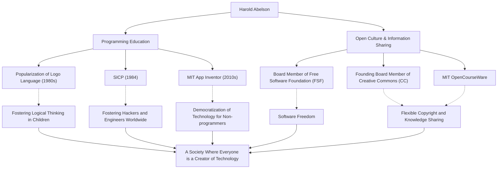

In the history of computer science, there is a figure who has had as much influence on "how it is taught and shared" as on the technology itself. That is Harold Abelson, commonly known as Hal Abelson, a professor at the Massachusetts Institute of Technology (MIT) and a central figure in programming education and the free software movement.

In this article, we delve deeply into his life, his philosophy, and the immeasurable impact he has had on future generations, liberating programming from the hands of a few experts to everyone and laying the foundation for today's open culture.

## Programming as a "Tool for Thought": The Logo Language and Early Activities

Born in the late 1940s, Abelson received a bachelor's degree from Princeton University and a Ph.D. in mathematics from MIT. A notable contribution in his early career was the popularization of the educational programming language "Logo".

Developed by Seymour Papert and others, Logo taught children the joy of programming and logical thinking through "Turtle Geometry". Abelson was deeply involved in the implementation of Logo for the Apple II and spread the educational value of Logo worldwide through his books. For him, programming was not simply a means to give orders to machines, but a "tool for expressing and exploring human thought."

## A Monumental Work in Computer Science: The Birth of SICP

What cemented Abelson's fame was the textbook "Structure and Interpretation of Computer Programs" (commonly known as SICP, or the Wizard Book), co-authored with Gerald Jay Sussman and Julie Sussman. Published in 1984, this book was used for many years in MIT's introductory course (6.001) and adopted by universities around the world.

Instead of teaching the syntax of a specific programming language (it used Scheme, a dialect of Lisp), SICP deeply explored universal concepts of computation such as abstraction, recursion, modularity, and metalinguistic abstraction. This approach has become the flesh and blood of countless hackers and engineers across generations as a "philosophy of design" in software engineering.

## Driving Knowledge Sharing and Open Culture

Abelson's achievements extend beyond the academic realm. He held a strong belief that "knowledge and technology should be the common property of humanity," and took active steps regarding copyright and freedom of information in the digital age.

He served as a founding board member of the Free Software Foundation (FSF) launched by Richard Stallman, supporting the software liberalization movement. Furthermore, along with Lawrence Lessig and others, he worked as a founding board member of "Creative Commons" to create a flexible copyright system suited for the internet age. He also played a crucial role in the "MIT OpenCourseWare" project, in which MIT pioneered the free release of lecture materials to the world.

## Towards a World Where Anyone Can Be a Creator: App Inventor

Entering the late 2000s, Abelson started the "App Inventor" project as a visiting researcher at Google, a platform that allows intuitive development of smartphone apps. This tool, later taken over as MIT App Inventor, enables users to create apps through visual operations like combining blocks.

This project, which significantly lowered the barrier to entry for programming, is the fruition of his unwavering belief that "not only a few people who can write code, but everyone should be able to create software to solve their own problems."

## The Path and Impact of Harold Abelson (Diagram)

His diverse achievements are not independent, but connected by the strong axes of "education" and "open sharing."

## Legacy for Future Generations: Democratization of Technology

Harold Abelson has spent his life proving that computer science is not just a "science of computation," but an "art of expression and sharing."

His crystallized knowledge, SICP, continues to be read as a bible for programmers today. And the seeds he planted through Creative Commons and App Inventor are sprouting vigorously in today's open source culture and the no-code/low-code movement.

"Technology exists to make people free." Hal Abelson's path is perhaps the most powerful and warm answer to the question of how technology should contribute to society.
