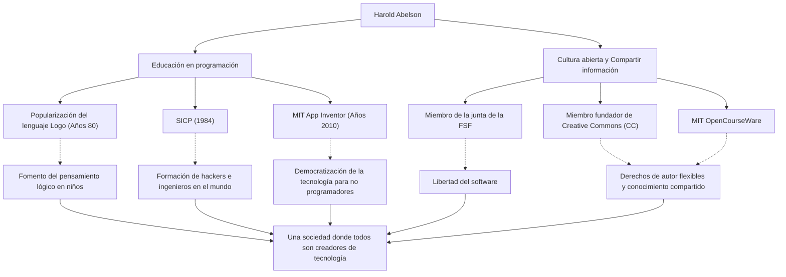

En la historia de la informática, hay figuras que han tenido un impacto tan grande en "cómo enseñar y compartir" la tecnología como en la tecnología misma. Harold Abelson, comúnmente conocido como "Hal Abelson", profesor del Instituto Tecnológico de Massachusetts (MIT) y figura central en la educación en programación y el movimiento del software libre.

Este artículo profundiza en la vida y la filosofía de un hombre que liberó la programación de las manos de unos pocos expertos para llevarla a todos, sentando las bases de la cultura abierta actual y su incalculable influencia en las generaciones futuras.

## La programación como una "herramienta de pensamiento": el lenguaje Logo y sus primeras actividades

Nacido a finales de la década de 1940, Abelson obtuvo su licenciatura en la Universidad de Princeton y su doctorado en matemáticas en el MIT. Un hito destacable al principio de su carrera fue su contribución a la popularización del lenguaje de programación educativo "Logo".

Desarrollado por Seymour Papert y otros, Logo enseñó a los niños el placer de la programación y el pensamiento lógico a través de la "Geometría de la Tortuga". Abelson estuvo profundamente involucrado en la implementación de Logo para la Apple II, y a través de sus libros, difundió el valor educativo de Logo por todo el mundo. Para él, la programación no era simplemente un medio para dar instrucciones a una máquina, sino una "herramienta para que los humanos expresen y exploren sus pensamientos".

## Un monumento de la informática: el nacimiento de "SICP"

Lo que consolidó la reputación de Abelson fue el libro de texto "Structure and Interpretation of Computer Programs" (Estructura e Interpretación de Programas de Computadora, comúnmente conocido como SICP o el libro del mago), coescrito con Gerald Jay Sussman y Julie Sussman. Publicado en 1984, este libro se utilizó durante muchos años en el curso introductorio del MIT (6.001) y fue adoptado por universidades de todo el mundo.

SICP no enseñaba la sintaxis de un lenguaje de programación específico (usaba Scheme, un dialecto de Lisp), sino que profundizaba en conceptos universales de la computación como la abstracción, la recursividad, la modularidad y la abstracción metalingüística. Este enfoque se ha convertido en la "filosofía de diseño" en la ingeniería de software, arraigándose en innumerables hackers e ingenieros a lo largo de generaciones.

## Compartir el conocimiento y liderar la cultura abierta

Los logros de Abelson se extienden más allá del ámbito académico. Tenía la firme convicción de que "el conocimiento y la tecnología deben ser propiedad común de la humanidad", y actuó de manera proactiva en relación con los derechos de autor y la libertad de información en la era digital.

Se desempeñó como miembro de la junta fundadora de la Free Software Foundation (FSF), lanzada por Richard Stallman, apoyando el movimiento de liberación del software. Además, junto con Lawrence Lessig y otros, como miembro de la junta fundadora de "Creative Commons", se esforzó por crear un sistema de derechos de autor flexible y adecuado para la era de Internet. También jugó un papel crucial en el proyecto "MIT OpenCourseWare", donde el MIT fue pionero en publicar materiales de cursos de forma gratuita para el mundo.

## Hacia un mundo donde todos pueden ser creadores: App Inventor

A fines de la década de 2000, como investigador visitante en Google, Abelson lanzó el proyecto "App Inventor", una plataforma para el desarrollo intuitivo de aplicaciones para teléfonos inteligentes. Esta herramienta, que luego se convirtió en MIT App Inventor, permite a los usuarios crear aplicaciones a través de operaciones visuales, similares a ensamblar bloques.

Este proyecto redujo drásticamente las barreras para programar y es la culminación de su inquebrantable creencia de que "no solo una pequeña cantidad de personas que pueden escribir código, sino todos deberían poder crear software para resolver sus propios problemas".

## La trayectoria e impacto de Harold Abelson (Diagrama)

Sus diversos logros no son independientes, sino que están conectados por el fuerte eje de "educación" y "compartir abiertamente".

## Un legado para las generaciones futuras: la democratización de la tecnología

Harold Abelson ha pasado su vida demostrando que la informática no es solo la "ciencia de la computación", sino el "arte de la expresión y el intercambio".

SICP, el cristal de conocimiento que dejó atrás, se sigue leyendo hoy como la biblia de los programadores. Y las semillas que plantó a través de Creative Commons y App Inventor están brotando vigorosamente en la cultura de código abierto actual y el movimiento no-code/low-code.

"La tecnología existe para hacer libre a las personas". El camino recorrido por Hal Abelson es quizás la respuesta más poderosa y cálida a la pregunta de cómo la tecnología debería contribuir a la sociedad.
