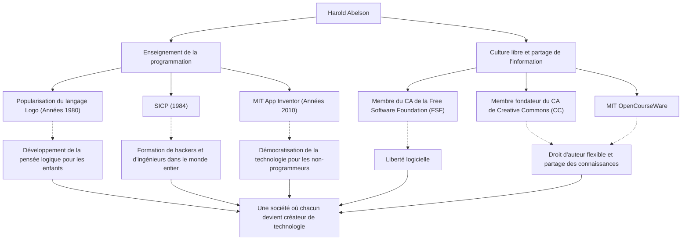

Dans l'histoire de l'informatique, certaines personnes ont eu autant d'impact sur « comment l'enseigner et la partager » que sur la technologie elle-même. Harold Abelson, souvent appelé « Hal Abelson », professeur au Massachusetts Institute of Technology (MIT) et figure centrale de l'enseignement de la programmation et du mouvement des logiciels libres, est l'une de ces personnes.

Cet article explore sa vie, sa philosophie et l'impact incommensurable qu'il a eu sur les générations futures, libérant la programmation d'un groupe d'experts restreint pour l'offrir à tous, et jetant les bases de la culture libre d'aujourd'hui.

## La programmation comme « outil de pensée » : le langage Logo et ses premières activités

Né à la fin des années 1940, Abelson a obtenu sa licence à l'Université de Princeton avant de décrocher un doctorat en mathématiques au MIT. Au début de sa carrière, sa contribution à la popularisation du langage de programmation éducatif « Logo » est particulièrement remarquable.

Développé par Seymour Papert et d'autres, Logo visait à enseigner aux enfants le plaisir de la programmation et de la pensée logique par le biais de la « géométrie de la tortue ». Abelson s'est profondément impliqué dans l'implémentation de Logo pour l'Apple II et a fait connaître sa valeur éducative dans le monde entier à travers ses livres. Pour lui, la programmation n'était pas seulement un moyen de donner des instructions à une machine, mais un « outil pour exprimer et explorer la pensée » humaine.

## Un chef-d'œuvre de l'informatique : la naissance de "SICP"

La réputation d'Abelson a été cimentée par le manuel « Structure and Interpretation of Computer Programs » (Structure et interprétation des programmes informatiques, communément appelé SICP, ou le Livre du Sorcier), coécrit avec Gerald Jay Sussman et Julie Sussman. Publié en 1984, ce livre a été utilisé pendant de nombreuses années dans le cours d'introduction du MIT (6.001) et a été adopté par des universités du monde entier.

Plutôt que d'enseigner la syntaxe d'un langage de programmation spécifique (il utilise Scheme, un dialecte de Lisp), SICP approfondit les concepts universels de l'informatique tels que l'abstraction, la récursivité, la modularité et l'abstraction métalinguistique. Cette approche est devenue la chair et le sang de générations de hackers et d'ingénieurs en tant que « philosophie de conception » de l'ingénierie logicielle.

## Partage des connaissances et promotion de la culture libre

Les réalisations d'Abelson s'étendent au-delà du monde académique. Il croit fermement que « la connaissance et la technologie doivent être la propriété commune de l'humanité » et a activement milité pour le droit d'auteur et la liberté de l'information à l'ère numérique.

Il a été membre du conseil d'administration fondateur de la Free Software Foundation (FSF), créée par Richard Stallman, soutenant le mouvement pour la libération des logiciels. En outre, aux côtés de Lawrence Lessig et d'autres, il a siégé au conseil d'administration fondateur de « Creative Commons », œuvrant à la création d'un système de droits d'auteur flexible, adapté à l'ère d'Internet. Il a également joué un rôle crucial dans le projet « MIT OpenCourseWare », grâce auquel le MIT a été le pionnier de la publication gratuite de ses supports de cours dans le monde entier.

## Vers un monde où chacun peut être créateur : App Inventor

À la fin des années 2000, en tant que chercheur invité chez Google, Abelson a lancé le projet « App Inventor », une plateforme de développement intuitif d'applications pour smartphones. Cet outil, plus tard repris sous le nom de MIT App Inventor, permet de créer des applications par le biais d'opérations visuelles, comme l'assemblage de blocs.

Ce projet, qui a considérablement abaissé la barrière à l'entrée de la programmation, est l'aboutissement de sa conviction inébranlable que « non seulement un petit nombre de personnes capables d'écrire du code, mais tout le monde devrait pouvoir créer des logiciels pour résoudre ses propres problèmes ».

## La trajectoire et l'impact de Harold Abelson (Illustration)

Ses diverses réalisations ne sont pas indépendantes, mais reliées par les piliers de l'« éducation » et du « partage ouvert ».

## Héritage pour les générations futures : la démocratisation de la technologie

Tout au long de sa vie, Harold Abelson a prouvé que l'informatique n'est pas seulement une « science du calcul », mais un « art de l'expression et du partage ».

SICP, le chef-d'œuvre de connaissances qu'il a laissé derrière lui, continue d'être lu comme la bible des programmeurs. Les graines qu'il a semées à travers Creative Commons et App Inventor ont vigoureusement germé dans la culture open source actuelle et le mouvement no-code/low-code.

« La technologie existe pour rendre les gens libres. » On peut dire que le chemin tracé par Hal Abelson est la réponse la plus puissante et la plus chaleureuse à la question de savoir comment la technologie devrait contribuer à la société.
