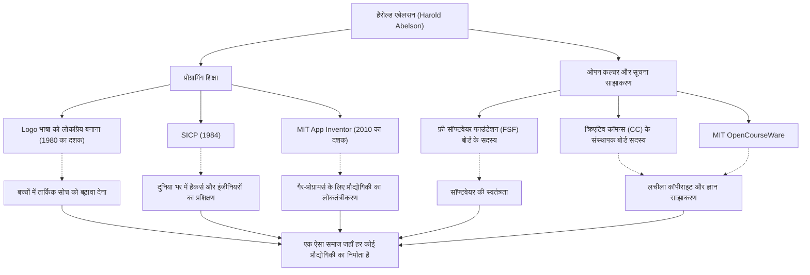

कंप्यूटर विज्ञान के इतिहास में, कुछ ऐसे व्यक्ति हैं जिनका प्रौद्योगिकी पर उतना ही प्रभाव पड़ा है जितना कि "इसे कैसे पढ़ाया जाए और साझा किया जाए" पर। मैसाचुसेट्स इंस्टीट्यूट ऑफ टेक्नोलॉजी (MIT) के प्रोफेसर हैरोल्ड एबेलसन, जिन्हें "हैल एबेलसन" के नाम से जाना जाता है, प्रोग्रामिंग शिक्षा और मुफ्त सॉफ्टवेयर आंदोलन में एक केंद्रीय व्यक्ति हैं।

यह लेख उनके जीवन और दर्शन में गहराई से उतरता है, जिसने प्रोग्रामिंग को कुछ विशेषज्ञों के हाथों से मुक्त कर इसे सभी तक पहुँचाया, आज की ओपन कल्चर की नींव रखी, और आने वाली पीढ़ियों पर उनका अथाह प्रभाव डाला।

## एक "विचार उपकरण" के रूप में प्रोग्रामिंग: लोगो (Logo) भाषा और प्रारंभिक गतिविधियाँ

1940 के दशक के अंत में जन्मे एबेलसन ने प्रिंसटन विश्वविद्यालय से स्नातक की डिग्री और MIT से गणित में पीएचडी प्राप्त की। उनके करियर की शुरुआत में एक उल्लेखनीय उपलब्धि शैक्षिक प्रोग्रामिंग भाषा "Logo" को लोकप्रिय बनाने में उनका योगदान था।

सीमोर पैपर्ट और अन्य लोगों द्वारा विकसित, Logo ने "टर्टल ज्योमेट्री" के माध्यम से बच्चों को प्रोग्रामिंग का आनंद और तार्किक सोच सिखाई। एबेलसन Apple II के लिए Logo को लागू करने में गहराई से शामिल थे, और अपनी पुस्तकों के माध्यम से दुनिया भर में Logo के शैक्षिक मूल्य का प्रसार किया। उनके लिए, प्रोग्रामिंग केवल एक मशीन को निर्देश देने का साधन नहीं था, बल्कि "विचारों को व्यक्त करने और तलाशने का एक उपकरण" था।

## कंप्यूटर विज्ञान का एक स्मारक: "SICP" का जन्म

गेराल्ड जे ससमैन और जूली ससमैन के साथ सह-लिखित पाठ्यपुस्तक "स्ट्रक्चर एंड इंटरप्रिटेशन ऑफ कंप्यूटर प्रोग्राम्स" (SICP या विज़ार्ड बुक) ने एबेलसन की प्रतिष्ठा को मजबूत किया। 1984 में प्रकाशित, यह पुस्तक कई वर्षों तक MIT के प्रारंभिक पाठ्यक्रम (6.001) में उपयोग की गई और दुनिया भर के विश्वविद्यालयों द्वारा अपनाई गई।

SICP ने किसी विशिष्ट प्रोग्रामिंग भाषा (Scheme, Lisp की एक बोली का उपयोग करते हुए) के सिंटैक्स को नहीं सिखाया, बल्कि एब्सट्रैक्शन, रिकर्सन, मॉड्यूलरिटी और मेटा-भाषाई एब्सट्रैक्शन जैसे सार्वभौमिक कंप्यूटिंग अवधारणाओं में गहराई से प्रवेश किया। यह दृष्टिकोण सॉफ्टवेयर इंजीनियरिंग में "डिज़ाइन फिलॉसफी" बन गया है, जो पीढ़ियों से अनगिनत हैकर्स और इंजीनियरों में समाहित हो गया है।

## ज्ञान साझा करना और ओपन कल्चर का नेतृत्व करना

एबेलसन की उपलब्धियां शिक्षा के दायरे से बाहर हैं। उनका दृढ़ विश्वास था कि "ज्ञान और प्रौद्योगिकी मानवता की साझा संपत्ति होनी चाहिए," और उन्होंने डिजिटल युग में कॉपीराइट और सूचना की स्वतंत्रता पर सक्रिय रूप से काम किया।

उन्होंने रिचर्ड स्टॉलमैन द्वारा शुरू किए गए फ्री सॉफ्टवेयर फाउंडेशन (FSF) के संस्थापक बोर्ड सदस्य के रूप में कार्य किया, जो सॉफ्टवेयर मुक्ति आंदोलन का समर्थन करता है। इसके अलावा, लॉरेंस लेसिग और अन्य के साथ "क्रिएटिव कॉमन्स (Creative Commons)" के संस्थापक बोर्ड सदस्य के रूप में, उन्होंने इंटरनेट युग के अनुकूल एक लचीली कॉपीराइट प्रणाली बनाने का प्रयास किया। उन्होंने "MIT ओपनकोर्सवेयर (MIT OpenCourseWare)" प्रोजेक्ट में भी महत्वपूर्ण भूमिका निभाई, जहाँ MIT ने दुनिया के लिए मुफ्त में पाठ्यक्रम सामग्री प्रकाशित करने में अग्रणी भूमिका निभाई।

## एक ऐसी दुनिया की ओर जहाँ हर कोई निर्माता बन सकता है: ऐप इन्वेंटर (App Inventor)

2000 के दशक के उत्तरार्ध में, Google में एक विजिटिंग शोधकर्ता के रूप में, एबेलसन ने सहज स्मार्टफोन ऐप विकास के लिए एक मंच "App Inventor" प्रोजेक्ट लॉन्च किया। यह टूल, जो बाद में MIT App Inventor बन गया, उपयोगकर्ताओं को ब्लॉक जोड़ने जैसे दृश्य संचालन के माध्यम से ऐप बनाने की अनुमति देता है।

प्रोग्रामिंग की बाधाओं को कम करने वाला यह प्रोजेक्ट उनके इस अटूट विश्वास की परिणति है कि "न केवल कुछ लोग जो कोड लिख सकते हैं, बल्कि सभी को अपनी समस्याओं को हल करने के लिए सॉफ्टवेयर बनाने में सक्षम होना चाहिए।"

## हैरोल्ड एबेलसन का मार्ग और प्रभाव (आरेख)

उनकी विविध उपलब्धियां स्वतंत्र नहीं हैं, बल्कि "शिक्षा" और "खुला साझाकरण" के मजबूत अक्षों से जुड़ी हैं।

## आने वाली पीढ़ियों के लिए एक विरासत: प्रौद्योगिकी का लोकतंत्रीकरण

हैरोल्ड एबेलसन ने अपना जीवन यह साबित करने में बिताया है कि कंप्यूटर विज्ञान न केवल "कंप्यूटिंग का विज्ञान" है, बल्कि "अभिव्यक्ति और साझाकरण की कला" भी है।

SICP, ज्ञान का वह स्फटिक जो उन्होंने पीछे छोड़ा है, आज भी प्रोग्रामर्स की बाइबिल के रूप में पढ़ा जाता है। और क्रिएटिव कॉमन्स और ऐप इन्वेंटर के माध्यम से उन्होंने जो बीज बोए थे, वे आज की ओपन सोर्स संस्कृति और नो-कोड/लो-कोड आंदोलन में मजबूती से अंकुरित हो रहे हैं।

"प्रौद्योगिकी लोगों को स्वतंत्र करने के लिए है।" हैल एबेलसन द्वारा अपनाया गया मार्ग शायद इस सवाल का सबसे शक्तिशाली और गर्मजोशी भरा जवाब है कि प्रौद्योगिकी को समाज में कैसे योगदान देना चाहिए।
