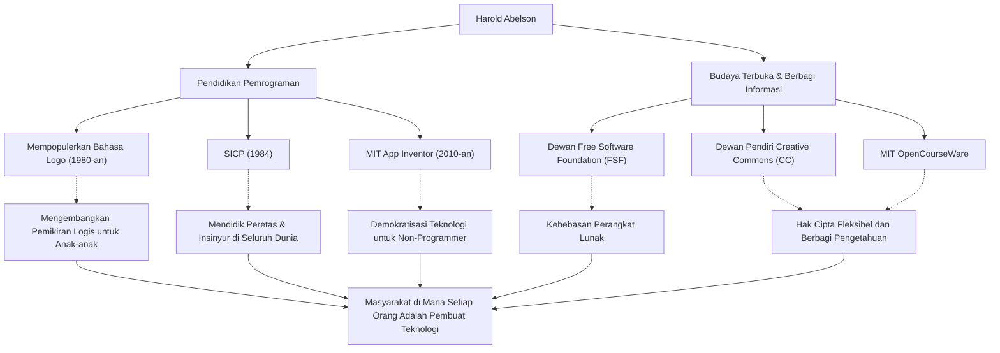

Dalam sejarah ilmu komputer, ada seorang tokoh yang memberikan pengaruh besar tidak hanya pada teknologi itu sendiri, tetapi juga pada "bagaimana mengajarkan dan membagikannya". Ia adalah Harold Abelson, biasa dipanggil "Hal Abelson", seorang profesor di Massachusetts Institute of Technology (MIT) dan tokoh sentral dalam pendidikan pemrograman serta gerakan perangkat lunak bebas.

Artikel ini akan membahas secara mendalam kehidupan dan filosofinya, yang telah membebaskan pemrograman dari genggaman segelintir ahli untuk semua orang, dan meletakkan dasar bagi budaya terbuka (open culture) saat ini, serta pengaruhnya yang tak ternilai bagi generasi mendatang.

## Pemrograman sebagai "Alat Berpikir": Bahasa Logo dan Aktivitas Awal

Lahir pada akhir tahun 1940-an, Abelson meraih gelar sarjana dari Universitas Princeton dan gelar doktor dalam bidang matematika dari MIT. Salah satu kontribusi awalnya yang patut dicatat adalah perannya dalam mempopulerkan bahasa pemrograman pendidikan "Logo".

Logo, yang dikembangkan oleh Seymour Papert dan kawan-kawan, mengajarkan kegembiraan pemrograman dan pemikiran logis kepada anak-anak melalui "Geometri Penyu" (Turtle geometry). Abelson sangat terlibat dalam implementasi Logo untuk Apple II dan menyebarkan nilai pendidikan Logo ke seluruh dunia melalui buku-bukunya. Baginya, pemrograman bukanlah sekadar alat untuk memberi perintah pada mesin, melainkan "alat untuk mengekspresikan dan mengeksplorasi pikiran" manusia.

## Mahakarya Ilmu Komputer: Lahirnya 『SICP』

Reputasi Abelson dikukuhkan melalui buku teks "Structure and Interpretation of Computer Programs" (SICP), yang ditulisnya bersama Gerald Jay Sussman dan Julie Sussman. Diterbitkan pada tahun 1984, buku ini digunakan selama bertahun-tahun dalam kursus pengantar di MIT (6.001) dan diadopsi oleh berbagai universitas di seluruh dunia.

Alih-alih mengajarkan sintaks bahasa pemrograman tertentu (meskipun menggunakan Scheme, dialek dari Lisp), SICP mendalami konsep komputasi universal seperti abstraksi, rekursi, modularitas, dan abstraksi metalinguistik. Pendekatan ini telah menjadi darah daging tak terhitung banyaknya peretas dan insinyur lintas generasi sebagai "filosofi desain" dalam rekayasa perangkat lunak.

## Berbagi Pengetahuan dan Mendorong Budaya Terbuka

Pencapaian Abelson tidak terbatas pada bidang akademik. Ia memiliki keyakinan kuat bahwa "pengetahuan dan teknologi harus menjadi milik bersama umat manusia" dan mengambil tindakan aktif mengenai hak cipta dan kebebasan informasi di era digital.

Ia menjabat sebagai dewan pendiri Free Software Foundation (FSF), yang didirikan oleh Richard Stallman, dan mendukung gerakan kebebasan perangkat lunak. Selain itu, bersama Lawrence Lessig dan lainnya, ia berperan sebagai dewan pendiri "Creative Commons", berdedikasi untuk menciptakan sistem hak cipta yang fleksibel dan sesuai untuk era internet. Ia juga memainkan peran yang sangat penting dalam proyek "MIT OpenCourseWare", di mana MIT memelopori publikasi materi kuliah secara gratis kepada dunia.

## Menuju Dunia di Mana Setiap Orang Bisa Menjadi Kreator: App Inventor

Pada akhir 2000-an, Abelson, sebagai peneliti tamu di Google, meluncurkan proyek "App Inventor", sebuah platform yang memungkinkan pengembangan aplikasi ponsel pintar secara intuitif. Alat ini, yang kemudian diambil alih sebagai MIT App Inventor, memungkinkan pengguna membuat aplikasi melalui operasi visual seperti merakit blok.

Proyek yang sangat menurunkan hambatan pemrograman ini merupakan wujud dari keyakinannya yang teguh bahwa "tidak hanya segelintir orang yang bisa menulis kode, tetapi setiap orang harus mampu membuat perangkat lunak untuk menyelesaikan masalah mereka sendiri".

## Jejak dan Pengaruh Harold Abelson (Diagram)

Pencapaiannya yang luas tidak berdiri sendiri-sendiri, melainkan terhubung oleh sumbu utama "pendidikan" dan "berbagi secara terbuka".

## Warisan untuk Generasi Mendatang: Demokratisasi Teknologi

Sepanjang hidupnya, Harold Abelson telah membuktikan bahwa ilmu komputer bukan sekadar "ilmu komputasi", melainkan "seni berekspresi dan berbagi".

Kristalisasi pengetahuannya, SICP, masih dibaca hingga kini sebagai kitab suci para pemrogram. Dan benih-benih yang ia taburkan melalui Creative Commons dan App Inventor kini tumbuh subur dalam budaya sumber terbuka dan gerakan no-code/low-code saat ini.

"Teknologi ada untuk membebaskan manusia". Jalan yang ditempuh Hal Abelson bisa dikatakan sebagai jawaban yang paling kuat dan hangat atas pertanyaan tentang bagaimana teknologi seharusnya berkontribusi pada masyarakat.
