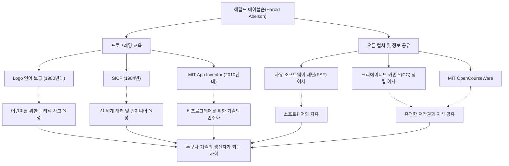

컴퓨터 과학의 역사에서 기술 그 자체만큼이나 '그것을 어떻게 가르치고 어떻게 공유할 것인가'에 지대한 영향을 미친 인물이 있습니다. 매사추세츠 공과대학교(MIT)의 교수이자 프로그래밍 교육 및 자유 소프트웨어 운동의 중심적인 역할을 해온 해럴드 에이블슨(Harold Abelson), 일명 '할 에이블슨'입니다.

이 글에서는 프로그래밍을 일부 전문가의 전유물에서 모든 이들에게 해방시키고, 오늘날의 오픈 컬처(개방형 문화)의 초석을 다진 그의 생애와 철학, 그리고 후세에 미친 헤아릴 수 없는 영향에 대해 깊이 파헤쳐 봅니다.

## '사고의 도구'로서의 프로그래밍: Logo 언어와 초기 활동

1940년대 후반에 태어난 에이블슨은 프린스턴 대학교에서 학사 학위를 받은 후, MIT에서 수학 박사 학위를 취득했습니다. 그의 경력 초기에 주목할 만한 것은 교육용 프로그래밍 언어인 'Logo'의 보급에 기여한 것입니다.

시모어 페퍼트 등이 개발한 Logo는 '거북이 기하학(Turtle geometry)'을 통해 아이들에게 프로그래밍의 즐거움과 논리적 사고를 가르치는 것이었습니다. 에이블슨은 Apple II용 Logo 구현에 깊이 관여했으며, 저서를 통해 Logo의 교육적 가치를 전 세계에 알렸습니다. 그에게 프로그래밍이란 단순히 기계에 명령을 내리기 위한 수단이 아니라, 인간의 '사고를 표현하고 탐구하기 위한 도구'였던 것입니다.

## 컴퓨터 과학의 금자탑: 『SICP』의 탄생

에이블슨의 명성을 확고히 한 것은 제럴드 제이 서스먼, 줄리 서스먼과 함께 저술한 교과서 『컴퓨터 프로그램의 구조와 해석(Structure and Interpretation of Computer Programs, 통칭 SICP 또는 마법사 책)』입니다. 1984년에 출판된 이 책은 오랫동안 MIT의 입문 코스(6.001)에서 사용되었으며 전 세계 여러 대학에서 채택되었습니다.

SICP는 특정 프로그래밍 언어(Lisp의 방언인 Scheme 사용)의 문법을 가르치는 것이 아니라, 추상화, 재귀, 모듈성, 메타 언어적 추상화와 같은 계산의 보편적인 개념을 깊이 탐구했습니다. 이 접근 방식은 소프트웨어 엔지니어링의 '설계 철학'으로서 세대를 넘어 수많은 해커와 엔지니어들의 피와 살이 되었습니다.

## 지식 공유와 오픈 컬처의 견인

에이블슨의 업적은 학문적인 틀에 머물지 않습니다. 그는 '지식이나 기술은 인류의 공동 재산이어야 한다'는 강한 신념을 가지고 있었으며, 디지털 시대의 저작권과 정보의 자유에 대해 적극적으로 행동했습니다.

리처드 스톨만이 설립한 자유 소프트웨어 재단(FSF)의 창립 이사를 역임하며 소프트웨어 자유화 운동을 지원했습니다. 또한, 로렌스 레식 등과 함께 '크리에이티브 커먼즈(Creative Commons)'의 창립 이사로서 인터넷 시대에 적합한 유연한 저작권 시스템을 구축하는 데 진력했습니다. MIT가 세계 최초로 강의 자료를 무료로 공개한 'MIT OpenCourseWare' 프로젝트에서도 그는 매우 중요한 역할을 수행했습니다.

## 누구나 크리에이터가 될 수 있는 세상으로: App Inventor

2000년대 후반에 들어서면서 에이블슨은 구글의 객원 연구원으로 스마트폰 앱을 직관적으로 개발할 수 있는 플랫폼 'App Inventor' 프로젝트를 시작했습니다. 이후 MIT App Inventor로 이어진 이 도구는 블록을 조립하는 것과 같은 시각적인 조작으로 앱을 만들 수 있게 해줍니다.

프로그래밍의 장벽을 크게 낮춘 이 프로젝트는 '코드를 작성할 수 있는 소수의 사람뿐만 아니라, 누구나 자신의 문제를 해결하기 위한 소프트웨어를 만들 수 있어야 한다'는 그의 확고한 신념의 결실입니다.

## 해럴드 에이블슨의 궤적과 영향 (도해)

그의 다방면에 걸친 업적은 각각 독립된 것이 아니라 '교육'과 '개방적인 공유'라는 굵은 축으로 연결되어 있습니다.

## 후세에 남긴 유산: 기술의 민주화

해럴드 에이블슨은 컴퓨터 과학이 단순한 '계산의 과학'이 아니라 '표현과 공유의 예술'임을 평생을 바쳐 증명해 왔습니다.

그가 남긴 지식의 결정체인 SICP는 지금도 프로그래머들의 바이블로서 널리 읽히고 있습니다. 그리고 크리에이티브 커먼즈나 App Inventor를 통해 그가 뿌린 씨앗은 현재의 오픈 소스 문화와 노코드/로우코드 무브먼트 속에서 힘차게 싹트고 있습니다.

"기술은 사람을 자유롭게 하기 위해 존재한다." 할 에이블슨이 걸어온 길은 기술이 사회에 어떻게 기여해야 하는가라는 질문에 대한 가장 힘차고 따뜻한 해답이라고 할 수 있을 것입니다.
