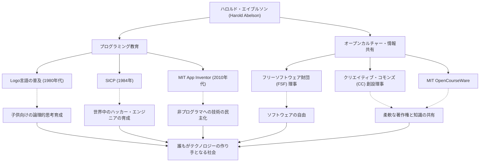

コンピュータサイエンスの歴史において、技術そのものと同じくらい「それをどう教え、どう共有するか」に多大な影響を与えた人物がいます。マサチューセッツ工科大学（MIT）の教授であり、プログラミング教育とフリーソフトウェア運動の中心的な役割を担ってきたハロルド・エイブルソン（Harold Abelson）、通称「ハル・エイブルソン」です。

本記事では、プログラミングを一部の専門家のものから万人へと解放し、今日のオープンカルチャーの礎を築いた彼の生涯と哲学、そして後世に与えた計り知れない影響について深く掘り下げます。

## 「思考の道具」としてのプログラミング：Logo言語と初期の活動

1940年代後半に生まれたエイブルソンは、プリンストン大学で学士号を取得後、MITで数学の博士号を取得しました。彼のキャリアの初期において特筆すべきは、教育用プログラミング言語「Logo」の普及への貢献です。

シーモア・パパートらによって開発されたLogoは、「タートル幾何学」を通じて子供たちにプログラミングの楽しさと論理的思考を教えるものでした。エイブルソンはApple II向けのLogoの実装に深く関わり、著書を通じてLogoの教育的価値を世界中に広めました。彼にとってプログラミングとは、単に機械に命令を下すための手段ではなく、人間の「思考を表現し、探索するための道具」だったのです。

## コンピュータサイエンスの金字塔：『SICP』の誕生

エイブルソンの名声を不動のものとしたのは、ジェラルド・ジェイ・サスマン、ジュリー・サスマンと共に著した教科書『計算機プログラムの構造と解釈』（Structure and Interpretation of Computer Programs、通称：SICP、または魔術師本）です。1984年に出版されたこの本は、長年にわたりMITの入門コース（6.001）で使われ、世界中の大学で採用されました。

SICPは、特定のプログラミング言語（Lispの方言であるSchemeを使用）の文法を教えるのではなく、抽象化、再帰、モジュール性、メタ言語的抽象化といった計算の普遍的な概念を深く掘り下げました。このアプローチは、ソフトウェアエンジニアリングにおける「設計の哲学」として、世代を超えて数え切れないほどのハッカーやエンジニアの血肉となっています。

## 知識の共有とオープンカルチャーの牽引

エイブルソンの功績は、学術的な枠にとどまりません。彼は「知識や技術は人類の共有財産であるべきだ」という強い信念を持っており、デジタル時代における著作権や情報の自由について積極的に行動しました。

リチャード・ストールマンが立ち上げたフリーソフトウェア財団（FSF）の創設時の理事を務め、ソフトウェアの自由化運動を支援。さらに、ローレンス・レッシグらと共に「クリエイティブ・コモンズ（Creative Commons）」の創設理事として、インターネット時代に適した柔軟な著作権の仕組み作りに尽力しました。MITが世界に先駆けて講義資料を無料公開した「MIT OpenCourseWare」プロジェクトにおいても、彼は極めて重要な役割を果たしています。

## 誰もがクリエイターになれる世界へ：App Inventor

2000年代後半に入ると、エイブルソンはGoogleの客員研究員として、スマートフォンアプリを直感的に開発できるプラットフォーム「App Inventor」のプロジェクトを立ち上げました。後にMIT App Inventorとして引き継がれたこのツールは、ブロックを組み合わせるような視覚的な操作でアプリを作ることができます。

プログラミングの敷居を大きく下げたこのプロジェクトは、「コードを書ける少数の人間だけでなく、誰もが自分の問題を解決するためのソフトウェアを作れるべきだ」という彼の揺るぎない信念の結実です。

## ハロルド・エイブルソンの軌跡と影響（図解）

彼の多岐にわたる功績は、それぞれが独立しているのではなく、「教育」と「オープンな共有」という太い軸で繋がっています。

## 後世への遺産：テクノロジーの民主化

ハロルド・エイブルソンは、コンピュータサイエンスが単なる「計算の科学」ではなく、「表現と共有の芸術」であることを生涯をかけて証明してきました。

彼が残したSICPという知の結晶は、今なおプログラマたちのバイブルとして読み継がれています。そして、クリエイティブ・コモンズやApp Inventorを通じて彼が蒔いた種は、現在のオープンソース文化やノーコード/ローコードムーブメントの中で力強く芽吹いています。

「技術は人を自由にするためにある」。ハル・エイブルソンの歩んだ道は、テクノロジーが社会にどう貢献すべきかという問いに対する、最も力強く、温かい解答だと言えるでしょう。
