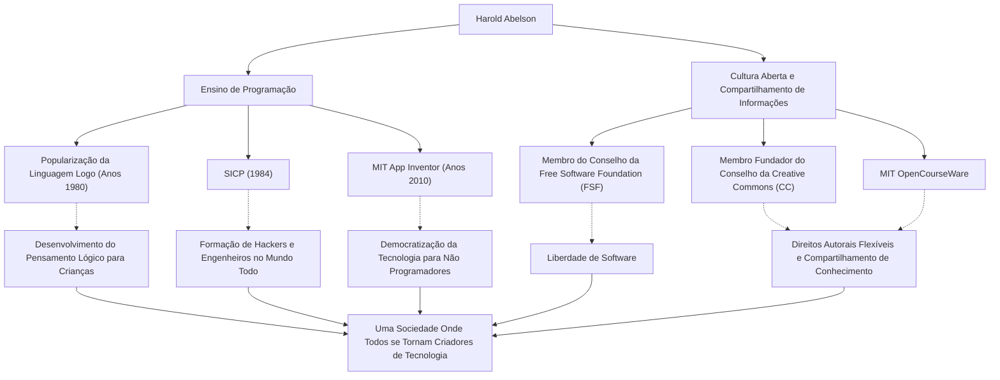

Na história da ciência da computação, existem indivíduos que tiveram um impacto tão profundo em "como ensiná-la e compartilhá-la" quanto na própria tecnologia. Harold Abelson, frequentemente chamado de "Hal Abelson", professor do Massachusetts Institute of Technology (MIT) e figura central no ensino de programação e no movimento de software livre, é um deles.

Este artigo aprofunda-se na sua vida, na sua filosofia e na imensurável influência que exerceu sobre as gerações futuras, libertando a programação de um pequeno grupo de especialistas para as massas e lançando as bases para a cultura aberta de hoje.

## A Programação como uma "Ferramenta de Pensamento": A Linguagem Logo e Atividades Iniciais

Nascido no final dos anos 1940, Abelson obteve seu diploma de bacharel na Universidade de Princeton, seguido por um doutorado em matemática no MIT. No início de sua carreira, destaca-se sua contribuição para a popularização da linguagem de programação educacional "Logo".

Desenvolvida por Seymour Papert e outros, a Logo tinha como objetivo ensinar às crianças a alegria da programação e o pensamento lógico por meio da "geometria da tartaruga". Abelson esteve profundamente envolvido na implementação da Logo para o Apple II e disseminou seu valor educacional em todo o mundo por meio de seus livros. Para ele, a programação não era apenas um meio de emitir comandos a uma máquina, mas uma "ferramenta para expressar e explorar o pensamento" humano.

## Uma Obra-prima da Ciência da Computação: O Nascimento do "SICP"

A reputação de Abelson foi consolidada pelo livro didático "Structure and Interpretation of Computer Programs" (Estrutura e Interpretação de Programas de Computador, comumente conhecido como SICP, ou o Livro do Mago), coescrito com Gerald Jay Sussman e Julie Sussman. Publicado em 1984, este livro foi usado por muitos anos no curso introdutório do MIT (6.001) e adotado por universidades em todo o mundo.

Em vez de ensinar a sintaxe de uma linguagem de programação específica (usa Scheme, um dialeto de Lisp), o SICP aprofunda-se nos conceitos universais da computação, como abstração, recursão, modularidade e abstração metalinguística. Esta abordagem tornou-se o sangue e a carne de incontáveis gerações de hackers e engenheiros como uma "filosofia de design" na engenharia de software.

## Compartilhamento de Conhecimento e a Promoção da Cultura Aberta

As realizações de Abelson estendem-se além da esfera acadêmica. Ele tinha uma forte crença de que "o conhecimento e a tecnologia deveriam ser propriedade comum da humanidade" e agiu ativamente em relação aos direitos autorais e à liberdade de informação na era digital.

Ele atuou como membro fundador do conselho da Free Software Foundation (FSF), estabelecida por Richard Stallman, apoiando o movimento pela liberação do software. Além disso, ao lado de Lawrence Lessig e outros, atuou como membro fundador do conselho da "Creative Commons", trabalhando para criar um sistema de direitos autorais flexível, adequado à era da internet. Ele também desempenhou um papel crucial no projeto "MIT OpenCourseWare", por meio do qual o MIT foi pioneiro na publicação gratuita de seus materiais de curso para o mundo todo.

## Em Direção a um Mundo Onde Qualquer Pessoa Pode Ser Criadora: App Inventor

No final dos anos 2000, Abelson iniciou o projeto "App Inventor", uma plataforma para o desenvolvimento intuitivo de aplicativos para smartphones, enquanto pesquisador visitante no Google. Esta ferramenta, posteriormente assumida como MIT App Inventor, permite a criação de aplicativos por meio de operações visuais, combinando blocos.

Este projeto, que reduziu significativamente a barreira de entrada para a programação, é o resultado de sua crença inabalável de que "não apenas um pequeno número de pessoas que podem escrever código, mas todos deveriam ser capazes de criar software para resolver seus próprios problemas".

## A Trajetória e Influência de Harold Abelson (Ilustração)

Suas muitas conquistas não são independentes, mas estão conectadas pelos fortes pilares da "educação" e do "compartilhamento aberto".

## Legado para as Futuras Gerações: A Democratização da Tecnologia

Ao longo de sua vida, Harold Abelson provou que a ciência da computação não é apenas uma "ciência do cálculo", mas uma "arte de expressão e compartilhamento".

O cristal de conhecimento que ele deixou para trás, o SICP, continua sendo lido como a bíblia dos programadores. E as sementes que plantou através do Creative Commons e do App Inventor brotaram com força na cultura de código aberto atual e no movimento no-code/low-code.

"A tecnologia existe para libertar as pessoas." Pode-se dizer que o caminho percorrido por Hal Abelson é a resposta mais forte e calorosa à questão de como a tecnologia deve contribuir para a sociedade.
