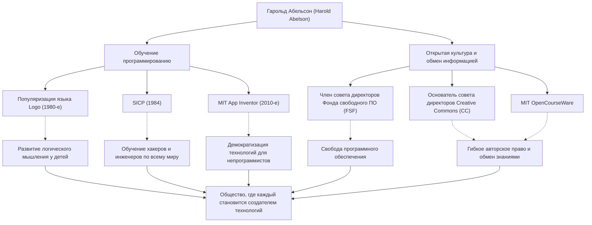

В истории информатики есть люди, которые оказали такое же огромное влияние на то, «как ее преподавать и как ею делиться», как и на саму технологию. Один из таких людей — Гарольд Абельсон (Harold Abelson), известный как «Хэл Абельсон», профессор Массачусетского технологического института (MIT) и центральная фигура в обучении программированию и движении за свободное программное обеспечение.

В этой статье мы подробно рассмотрим его жизнь, философию и неизмеримое влияние, которое он оказал на будущие поколения, освободив программирование от узкого круга специалистов и сделав его доступным для всех, тем самым заложив основы современной открытой культуры.

## Программирование как «инструмент мышления»: язык Logo и ранняя деятельность

Родившийся в конце 1940-х годов, Абельсон получил степень бакалавра в Принстонском университете, а затем степень доктора математики в MIT. На раннем этапе его карьеры особенно стоит отметить его вклад в популяризацию обучающего языка программирования «Logo».

Разработанный Сеймуром Папертом и другими, язык Logo был призван научить детей радости программирования и логическому мышлению через «черепашью графику». Абельсон принимал активное участие в реализации Logo для Apple II и через свои книги распространил его образовательную ценность по всему миру. Для него программирование было не просто средством отдачи команд машине, а человеческим «инструментом для выражения и исследования мысли».

## Монументальный труд в информатике: рождение «SICP»

Репутацию Абельсона окончательно утвердил учебник «Структура и интерпретация компьютерных программ» (Structure and Interpretation of Computer Programs, известный как SICP, или Книга Волшебника), написанный им в соавторстве с Джеральдом Джеем Сассманом и Джули Сассман. Опубликованная в 1984 году, эта книга на протяжении многих лет использовалась во вводном курсе MIT (6.001) и была принята в университетах по всему миру.

Вместо того чтобы обучать синтаксису конкретного языка программирования (в книге используется Scheme, диалект Lisp), SICP глубоко исследует универсальные концепции вычислений, такие как абстракция, рекурсия, модульность и металингвистическая абстракция. Этот подход стал плотью и кровью бесчисленных хакеров и инженеров разных поколений как «философия проектирования» в программной инженерии.

## Обмен знаниями и продвижение открытой культуры

Достижения Абельсона выходят за академические рамки. Он твердо верил, что «знания и технологии должны быть общим достоянием человечества», и активно выступал за авторское право и свободу информации в цифровую эпоху.

Он был одним из основателей совета директоров Фонда свободного программного обеспечения (FSF), созданного Ричардом Столлманом, поддерживая движение за освобождение программного обеспечения. Кроме того, вместе с Лоуренсом Лессигом и другими он работал в качестве члена-основателя совета директоров «Creative Commons», стремясь создать гибкую систему авторского права, подходящую для эпохи Интернета. Он также сыграл решающую роль в проекте «MIT OpenCourseWare», в рамках которого MIT стал пионером в бесплатной публикации материалов своих курсов для всего мира.

## К миру, где каждый может быть творцом: App Inventor

В конце 2000-х годов, будучи приглашенным исследователем в Google, Абельсон запустил проект «App Inventor» — платформу для интуитивной разработки приложений для смартфонов. Этот инструмент, позже переданный MIT как MIT App Inventor, позволяет создавать приложения с помощью визуальных операций, объединяя блоки.

Этот проект, который значительно снизил порог входа в программирование, является результатом его непоколебимой веры в то, что «не только небольшое количество людей, умеющих писать код, но и каждый должен иметь возможность создавать программное обеспечение для решения своих проблем».

## Траектория и влияние Гарольда Абельсона (Иллюстрация)

Его многочисленные достижения не независимы друг от друга, а связаны прочными осями «образования» и «открытого обмена».

## Наследие для будущих поколений: демократизация технологий

На протяжении всей своей жизни Гарольд Абельсон доказывал, что информатика — это не просто «наука о вычислениях», а «искусство выражения и обмена».

Кристалл знаний, который он оставил после себя, SICP, продолжает читаться как библия программистов. А семена, которые он посеял через Creative Commons и App Inventor, мощно проросли в современной культуре открытого исходного кода и движении no-code/low-code.

«Технологии существуют для того, чтобы делать людей свободными». Путь, пройденный Хэлом Абельсоном, можно назвать самым сильным и теплым ответом на вопрос о том, как технологии должны служить обществу.
