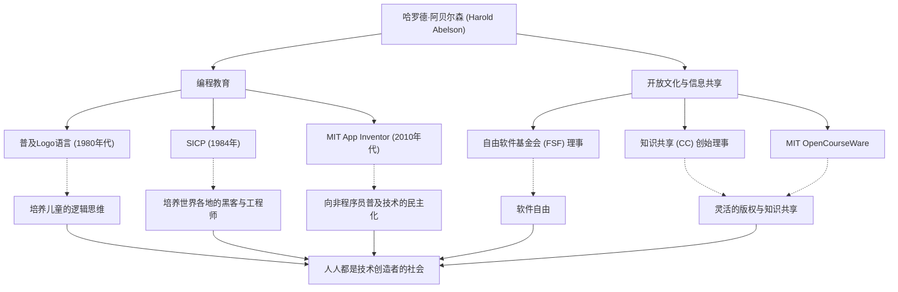

在计算机科学的历史上，有一位人物在“如何教授和分享技术”方面产生了与技术本身同等重大的影响。他就是麻省理工学院（MIT）的教授，在编程教育和自由软件运动中扮演核心角色的哈罗德·阿贝尔森（Harold Abelson），通常被称为“哈尔·阿贝尔森”。

本文将深入探讨他的生平与哲学，以及他对后世产生的不可估量的影响。正是他将编程从少数专家的专属解放为大众的工具，并奠定了今天开放文化的基础。

## 作为“思考工具”的编程：Logo语言与早期活动

阿贝尔森出生于1940年代后半期，在普林斯顿大学获得学士学位后，在MIT获得了数学博士学位。在他早期的职业生涯中，特别值得一提的是他对普及教育编程语言“Logo”的贡献。

由西摩·帕普特（Seymour Papert）等人开发的Logo，旨在通过“海龟几何”向孩子们传授编程的乐趣和逻辑思维。阿贝尔森深度参与了针对Apple II的Logo实现，并通过著作将Logo的教育价值推广到全世界。对他来说，编程不仅仅是向机器下达命令的手段，更是人类“表达和探索思考的工具”。

## 计算机科学的金字塔：《SICP》的诞生

让阿贝尔森名声大噪的，是他与杰拉德·杰伊·萨斯曼（Gerald Jay Sussman）和朱莉·萨斯曼（Julie Sussman）合著的教科书《计算机程序的构造和解释》（Structure and Interpretation of Computer Programs，通称：SICP，或魔法书）。这本书于1984年出版，多年来一直被用作MIT的入门课程（6.001），并被世界各地的大学采用。

SICP并没有教授特定编程语言（使用了Lisp的方言Scheme）的语法，而是深入探讨了抽象、递归、模块化和元语言抽象等计算的普遍概念。这种方法作为软件工程中的“设计哲学”，跨越世代，融入了无数黑客和工程师的血肉之中。

## 知识共享与引领开放文化

阿贝尔森的功绩不仅限于学术领域。他坚信“知识和技术应是人类的共同财产”，并在数字时代的版权和信息自由方面采取了积极的行动。

他曾担任理查德·斯托曼（Richard Stallman）创立的自由软件基金会（FSF）的创始理事，支持软件自由化运动。此外，他还与劳伦斯·莱斯格（Lawrence Lessig）等人一起，作为“知识共享（Creative Commons）”的创始理事，致力于创建适合互联网时代的灵活版权机制。在MIT率先向全球免费公开讲义资料的“MIT OpenCourseWare”项目中，他也发挥了极其重要的作用。

## 走向人人皆可成为创作者的世界：App Inventor

进入2000年代后期，阿贝尔森作为Google的客座研究员，发起了一个名为“App Inventor”的项目，这是一个可以直观地开发智能手机应用程序的平台。后来作为MIT App Inventor被接手，该工具允许通过像组合积木一样的可视化操作来制作应用程序。

这个大大降低了编程门槛的项目，正是他“不仅是少数能写代码的人，而是每个人都应该能够编写软件来解决自己的问题”这一坚定信念的结晶。

## 哈罗德·阿贝尔森的轨迹与影响（图解）

他广泛的功绩并不是各自独立的，而是通过“教育”和“开放共享”这一主轴连接在一起。

## 留给后世的遗产：技术的民主化

哈罗德·阿贝尔森用一生证明了，计算机科学不仅仅是“计算科学”，更是“表达与分享的艺术”。

他留下的名为SICP的智慧结晶，至今仍作为程序员的圣经被广泛阅读。他通过知识共享（Creative Commons）和App Inventor播下的种子，在如今的开源文化和无代码/低代码运动中正茁壮成长。

“技术是为了让人自由而存在的”。哈尔·阿贝尔森所走过的道路，可以说是对技术应当如何为社会做出贡献这一问题，最有力且最温暖的解答。
