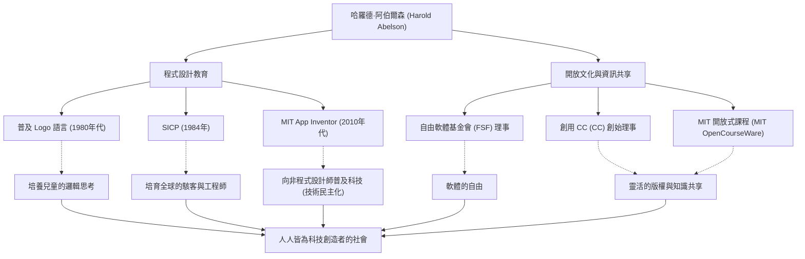

在電腦科學的歷史中，有些人對「如何教導和分享科技」的影響力，與科技本身一樣深遠。麻省理工學院（MIT）教授、在程式設計教育與自由軟體運動中扮演核心角色的哈羅德·阿伯爾森（Harold Abelson），通常被稱為「哈爾·阿伯爾森（Hal Abelson）」，就是這樣一位人物。

本文將深入探討他如何將程式設計從少數專家的專利解放出來、為所有人所用，並奠定今日開放文化基礎的生平、哲學，以及他對後世產生的無可估量的影響。

## 作為「思考工具」的程式設計：Logo 語言與早期活動

出生於 1940 年代後期的阿伯爾森，在普林斯頓大學獲得學士學位後，於 MIT 取得了數學博士學位。在他職業生涯的早期，特別值得一提的是他對普及教育用程式語言「Logo」的貢獻。

由西摩·派普特（Seymour Papert）等人開發的 Logo，透過「海龜幾何（Turtle graphics）」向孩子們傳授程式設計的樂趣與邏輯思考。阿伯爾森深度參與了 Apple II 版本的 Logo 實作，並透過著作將 Logo 的教育價值推廣到全世界。對他而言，程式設計不僅僅是向機器下達指令的手段，更是人類「表達與探索思考的工具」。

## 電腦科學的里程碑：《SICP》的誕生

讓阿伯爾森名聲大噪的，是他與傑拉德·傑伊·薩斯曼（Gerald Jay Sussman）及茱莉·薩斯曼（Julie Sussman）合著的教科書《電腦程式的構造和解釋》（Structure and Interpretation of Computer Programs，簡稱：SICP，或稱魔法書）。這本書於 1984 年出版，多年來一直被用作 MIT 的入門課程（6.001），並被全球許多大學採用。

SICP 不僅僅是教導特定程式語言（使用 Lisp 的方言 Scheme）的語法，而是深入探討抽象化、遞迴、模組化和元語言抽象等計算的普遍概念。這種方法作為軟體工程中的「設計哲學」，已跨越世代，成為無數駭客與工程師的血肉。

## 知識共享與開放文化的推手

阿伯爾森的成就並未侷限於學術領域。他堅信「知識與技術應該是人類的共同財產」，並在數位時代的版權與資訊自由方面積極採取行動。

他擔任理查·斯托曼（Richard Stallman）創立的自由軟體基金會（FSF）的創始理事，支持軟體自由化運動。此外，他與勞倫斯·雷席格（Lawrence Lessig）等人共同擔任「創用 CC（Creative Commons）」的創始理事，致力於建立適合網際網路時代、靈活的版權機制。在 MIT 領先全球免費公開課程資料的「MIT 開放式課程（MIT OpenCourseWare）」計畫中，他也扮演了極其重要的角色。

## 邁向人人皆為創作者的世界：App Inventor

進入 2000 年代後期，阿伯爾森作為 Google 的客座研究員，發起了「App Inventor」計畫，這是一個可以直觀開發智慧型手機應用程式的平台。這個後來由 MIT 接手的工具（MIT App Inventor），讓人們能像組合積木一樣，透過視覺化操作來製作應用程式。

這個計畫大幅降低了程式設計的門檻，是他堅定信念的結晶：「不應只有少數會寫程式碼的人，每個人都應該能夠編寫解決自己問題的軟體。」

## 哈羅德·阿伯爾森的軌跡與影響（圖解）

他多方面的成就並非各自獨立，而是由「教育」與「開放分享」這兩條粗大的主軸緊密相連。

## 留給後世的遺產：科技的民主化

哈羅德·阿伯爾森終其一生都在證明，電腦科學不僅僅是「計算的科學」，更是「表達與分享的藝術」。

他留下的智慧結晶 SICP，至今仍被視為程式設計師的聖經而廣為流傳。而他透過創用 CC 和 App Inventor 播下的種子，如今在開源文化與無程式碼 / 低程式碼（No-code / Low-code）運動中茁壯成長。

「科技的存在是為了讓人們自由。」哈爾·阿伯爾森走過的道路，可以說是對「科技應如何貢獻社會」這個問題，最有力且溫暖的解答。
