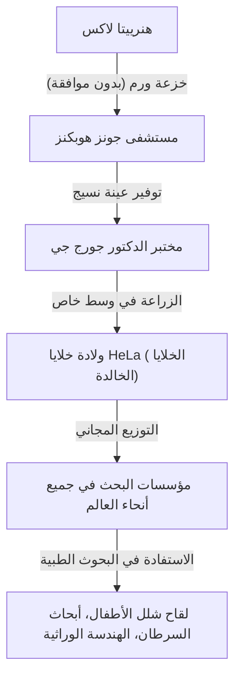
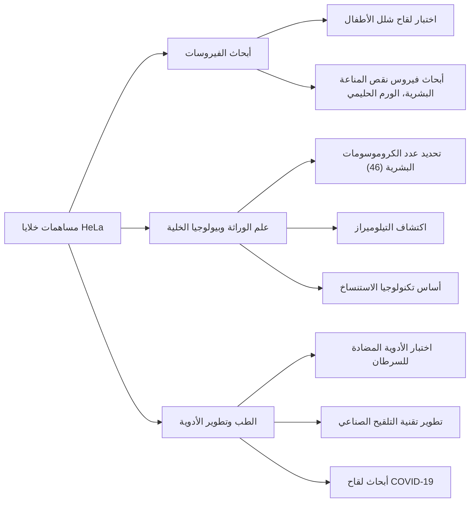

## بطلة الطب الحديث المجهولة: هنرييتا لاكس

الكثير من التكنولوجيا الطبية التي نتمتع بها اليوم - تطوير لقاح شلل الأطفال، والتقدم في علاج السرطان، ونجاح التخصيب في المختبر، وحتى أبحاث لقاح كوفيد-19 - لا يمكن مناقشتها دون ذكر خلايا امرأة أمريكية من أصل أفريقي. كان اسمها **هنرييتا لاكس (Henrietta Lacks)**. أطلق على الخلايا المأخوذة من جسدها اسم "خلايا هيلا (HeLa)" وأصبحت أول "خلايا خالدة" في تاريخ البشرية تستمر في التكاثر إلى أجل غير مسمى خارج الجسم.

ومع ذلك، خلال العقود التي تكاثرت فيها خلاياها في المختبرات في جميع أنحاء العالم وأنقذت أرواحًا لا حصر لها، لم تكن عائلتها على دراية تامة بهذه الحقيقة. في هذا المقال، سنتعمق في حياة هنرييتا لاكس، والاختراقات العلمية التي أحدثتها خلايا HeLa، والمناقشات العميقة حول أخلاقيات علم الأحياء (الموافقة المستنيرة والخصوصية الجينية) التي أثارتها قصتها.

---

## نشأة هنرييتا لاكس: من حقول التبغ إلى بالتيمور

ولدت هنرييتا لاكس (المولودة باسم لوريتا بليزانت) في 1 أغسطس 1920 في رونوك، فيرجينيا. عندما كانت في الرابعة من عمرها، توفيت والدتها بعد فترة وجيزة من ولادة طفلها العاشر، ونظرًا لأن والدها وجد صعوبة في تربية الأطفال، فقد تم إرسالهم للعيش مع أقاربهم. أخذ جدها، تومي لاكس، هنرييتا للعيش معه في كلوفر، فيرجينيا، حيث نشأت مع ابن عمها ديفيد (داي) لاكس.

كان أساس حياتهم هو العمل في مزرعة تبغ. في حقول التبغ التي استمرت منذ عصر العبودية، انخرطوا في عمل شاق من شروق الشمس إلى غروبها منذ سن مبكرة. كانت فرص هنرييتا للذهاب إلى المدرسة محدودة، واضطرت إلى إنهاء تعليمها في الصف السادس.

في عام 1941، تزوجت هنرييتا وداي، وبحثًا عن حياة أفضل وسط الازدهار الصناعي المرتبط بالحرب العالمية الثانية، انتقلوا إلى محطة تيرنر بالقرب من بالتيمور، ماريلاند. عمل داي في مصنع بيت لحم للصلب، بينما أمضت هنرييتا أيامها كأم مخلصة تربي أطفالهم الخمسة (لورانس، إلسي، سوني، ديبورا، وزكريا).

---

## مرض مفاجئ وعلاج في مستشفى جونز هوبكنز

في أوائل عام 1951، بدأت هنرييتا تشعر بوجود تشوهات في جسدها. وصفتها بأنها "عقدة في الرحم" وعانت من نزيف غير طبيعي مستمر. في ذلك الوقت، كان أحد المستشفيات الكبيرة القليلة في بالتيمور التي تقبل المرضى السود هو **مستشفى جونز هوبكنز**. قدم المستشفى رعاية مجانية للفقراء، ولكن بسبب سياسات الفصل العنصري (قوانين جيم كرو)، تم فصل الأجنحة بدقة بين البيض والسود.

بعد الفحص، تم العثور على ورم خبيث في عنق رحم هنرييتا، وتم تشخيص إصابتها بسرطان عنق الرحم (تحدد لاحقًا باسم سرطان غدي). قرر طبيبها المعالج، الدكتور هوارد جونز، المضي قدمًا في العلاج الإشعاعي بالراديوم، والذي كان العلاج القياسي في ذلك الوقت.

ومع ذلك، خلال هذا العلاج، وقع حدث كبير من منظور المعايير الأخلاقية الحديثة. بينما كانت هنرييتا غائبة عن الوعي تحت التخدير، أخذ الجراح المعالج عينات من كل من أنسجة الورم والأنسجة السليمة المجاورة له تمامًا، **دون موافقتها أو علمها**.

في ذلك الوقت، كان جمع عينات الأنسجة من المرضى أثناء الجراحة للبحث ممارسة شائعة بين الأطباء، ولم يكن مفهوم الحصول على الموافقة (الموافقة المستنيرة) في حد ذاته راسخًا قانونيًا.

---

## جورج جي وولادة "الخلايا الخالدة"

تم إرسال عينات الأنسجة المجمعة إلى **الدكتور جورج جي (George Gey)**، رئيس مختبر زراعة الأنسجة في جامعة جونز هوبكنز. كان الدكتور جي وزوجته مارغريت يبحثان لسنوات عديدة عن "طريقة لزراعة الخلايا البشرية باستمرار إلى أجل غير مسمى خارج الجسم (في المختبر)". في ذلك الوقت، كانت الخلايا البشرية المأخوذة خارج الجسم تموت عادة في غضون أيام قليلة إلى أسابيع.

وضعت ماري كوبيتشيك، وهي مساعدة في مختبر الدكتور جي، خلايا هنرييتا في وسط استنباتي (مزيج خاص من بلازما الدجاج، ومستخلص الجنين البقري، وما إلى ذلك). ثم حدث شيء مذهل.

بينما ماتت الخلايا الأخرى بسرعة، فإن خلايا هنرييتا، بدلاً من أن تموت، استمرت في التضاعف كل 24 ساعة. تكاثرت هذه الخلايا بمعدل غير طبيعي، وغطت بسرعة جدران دورق الاستزراع. أطلق الدكتور جي على هذا الخط الخلوي اسم **"HeLa (هيلا)"** بأخذ أول حرفين من اسمي المريض الأول والأخير. كان هذا ميلاد أول "خط خلوي بشري خالد" في تاريخ البشرية.

كان اكتشاف خلايا HeLa ثورة حقيقية في علم الأحياء والطب. حتى ذلك الحين، كانت التجارب باستخدام الخلايا البشرية الحية صعبة للغاية، ولكن مع ظهور خلايا HeLa القوية وسهلة الاستخدام والتي تتكاثر بشكل لا نهائي، تمكن الباحثون في جميع أنحاء العالم من إجراء تجارب باستخدام الخلايا البشرية في بيئة مستقرة.

---

## التقدم العلمي ووفاة هنرييتا

في غضون ذلك، تدهورت حالة هنرييتا نفسها، المالكة الأصلية للخلايا، بسرعة على الرغم من علاجات الراديوم والأشعة السينية. انتشر السرطان في جميع أنحاء جسدها، وعانت من ألم لا يوصف.

في 4 أكتوبر 1951، في الوقت الذي كانت فيه خلايا HeLa على وشك تغيير العالم، توفيت هنرييتا لاكس عن عمر يناهز 31 عامًا. لم تكن لديها أي وسيلة لمعرفة مدى مساهمتها في الطب أو أن خلاياها ستستمر في العيش كـ "خالدة". دُفن جسدها في قبر غير مميز في مسقط رأسها كلوفر.

---

## لماذا تعد خلايا HeLa "خالدة"؟

لماذا تمتلك خلايا HeLa مثل هذه القدرات التكاثرية القوية ولا تموت؟ على مدى العقود التالية من البحث، تم توضيح الآليات العلمية وراء ذلك.

1. **الإفراط في التعبير عن التيلوميراز**:
   في الخلايا البشرية الطبيعية، يقصر جزء في نهاية الكروموسوم يسمى "التيلومير" في كل مرة تنقسم فيها الخلية. عندما يصل التيلومير إلى قصر معين، لا يمكن للخلية أن تنقسم بعد ذلك، وتشيخ وتموت (حد هايفليك). ومع ذلك، تنتج خلايا HeLa بشكل غير طبيعي ونشط إنزيمًا يسمى "التيلوميراز". نظرًا لأن هذا الإنزيم يقوم بإصلاح التيلوميرات باستمرار، يمكن للخلايا الاستمرار في الانقسام (التكاثر) إلى الأبد.

2. **تأثير فيروس الورم الحليمي البشري (HPV)**:
   نتج سرطان عنق الرحم لدى هنرييتا عن عدوى فيروس خبيث للغاية يسمى فيروس الورم الحليمي البشري (HPV) من النوع 18. ونتيجة لاندماج الحمض النووي لهذا الفيروس في جينوم خلايا هنرييتا، تم تثبيط وظيفة الجينات الكابتة للورم (مثل p53 و Rb)، مما يعني أنه لم يعد هناك أي مكابح على تكاثر الخلايا.

3. **شذوذ الكروموسومات**:
   تحتوي الخلايا البشرية الطبيعية على 46 كروموسومًا، ولكن خلايا HeLa تعاني من تشوهات كروموسومية شديدة، حيث تمتلك ما بين 76 و 80 كروموسومًا. تساهم هذه الطفرة الجينية الشديدة أيضًا في قوتها التكاثرية غير الطبيعية.

---

## الاختراقات الطبية التي أحدثتها خلايا HeLa

لم يقم الدكتور جي بتسجيل براءة اختراع لخلايا HeLa، بل بدأ في تقديمها مجانًا للعلماء حول العالم لأغراض البحث. في النهاية، بدأ إنتاج خلايا HeLa بكميات كبيرة تجاريًا وأصبحت "النموذج القياسي" لعلم الأحياء الحديث. يُقدر أن إجمالي وزن خلايا HeLa المنتجة حتى الآن يصل إلى عشرات الملايين من الأطنان.

نتائج الأبحاث باستخدام خلايا HeLa متنوعة للغاية لدرجة أنها ولدت جوائز نوبل متعددة.

### 1. تطوير لقاح شلل الأطفال
في الخمسينيات من القرن الماضي، كان شلل الأطفال مرضًا مرعبًا يهدد الأطفال في جميع أنحاء العالم. عندما كان الدكتور جوناس سالك يطور لقاح شلل الأطفال، كان بحاجة إلى خلايا لاختبار فعاليته وسلامته على نطاق واسع. كانت خلايا HeLa شديدة الحساسية لفيروس شلل الأطفال ويمكن استزراعها بكميات كبيرة، مما جعلها مادة مثالية لاختبار اللقاحات. مع الخلايا المنتجة في مصنع كبير لخلايا HeLa تم إنشاؤه في جامعة توسكيجي، تسارع التطبيق العملي للقاح بشكل كبير، وتم القضاء على شلل الأطفال بنجاح من العالم تقريبًا.

### 2. أبحاث الكروموسومات ورسم الخرائط الجينية
حتى منتصف الخمسينيات من القرن الماضي، لم يكن هناك دليل قاطع على عدد الكروموسومات الدقيق لدى البشر. بينما كان الباحثون في جامعة تكساس يجرون تجارب باستخدام خلايا HeLa، قاموا بطريق الخطأ بنقع الخلايا في محلول ناقص التوتر. ونتيجة لذلك، تضخمت الخلايا، وانفصلت الكروموسومات الداخلية بدقة، مما يسهل مراقبتها. من خلال تطبيق هذه التقنية، تم تحديد أن العدد الطبيعي للكروموسومات البشرية هو 46، مما أدى لاحقًا إلى اكتشاف الاضطرابات الوراثية مثل متلازمة داون (التثلث الصبغي 21).

### 3. علم الفيروسات وأبحاث السرطان
تم استخدام خلايا HeLa في أبحاث مسببات الأمراض المختلفة، بما في ذلك فيروس نقص المناعة البشرية (فيروس الإيدز)، والهربس، وفيروس زيكا، والسل، والسالمونيلا. كما حظيت بتقدير كبير كخلايا نموذجية للتحقيق في كيفية تحول الخلايا إلى خلايا سرطانية وكيف تؤثر الأدوية المضادة للسرطان على الخلايا.

### 4. رحلة إلى الفضاء
سافرت خلايا HeLa إلى الفضاء قبل البشر، على متن قمر صناعي سوفيتي. كانت بمثابة مواضيع اختبار للتحقيق في آثار انعدام الجاذبية والإشعاع الكوني على الخلايا البشرية. وبشكل مذهل، تم التأكيد على أن خلايا HeLa تتكاثر بشكل أسرع في الفضاء مقارنة بوجودها على الأرض.

---

## العائلة غير المطلعة والخلافات الأخلاقية

بينما ولدت خلايا HeLa صناعة بمليارات الدولارات في جميع أنحاء العالم، وزينت أغلفة المجلات العلمية، وظهرت في الكتب المدرسية الطبية، عاشت عائلة هنرييتا (عائلة لاكس) في حي فقير للطبقة العاملة في بالتيمور، غير قادرين حتى على تحمل تكاليف التأمين الصحي.

لم تعلم عائلة لاكس بوجود خلايا HeLa لأول مرة إلا في عام 1973، بعد أكثر من 20 عامًا على وفاة هنرييتا. في ذلك الوقت، أدت القدرة التكاثرية القوية لخلايا HeLa إلى نتائج عكسية، مما تسبب في "مشاكل تلوث HeLa" حيث لوثت خلايا HeLa ثقافات الخلايا الأخرى (بما في ذلك الخلايا الطبيعية) في جميع أنحاء العالم، مما أدى إلى تدمير النتائج التجريبية.

لتحديد العلامات الجينية الفريدة لخلايا HeLa، احتاج العلماء إلى عينات دم من أطفال هنرييتا. شعرت العائلة، التي اتصل بها الباحثون فجأة وأخبروها أن "خلايا والدتهم لا تزال على قيد الحياة"، بارتباك وخوف شديدين. تم سحب الدم دون تفسير كافٍ، واعتقدت العائلة خطأً أنهم، أيضًا، يخضعون لاختبار السرطان.

من هنا، ظهرت المشاكل الأخلاقية الخطيرة المحيطة بخلايا HeLa.

1. **الافتقار إلى الموافقة المستنيرة**: هل يجوز أخذ وجمع أنسجة مريض واستخدامها دون موافقة؟
2. **توزيع الأرباح**: أليس لمقدمي الأنسجة الأصليين أو عائلاتهم أي حقوق في الأرباح الهائلة الناتجة عن الخلايا؟ (أثبت حكم عام 1990 في قضية مور ضد حكام جامعة كاليفورنيا أن المرضى لا يمتلكون حقوق ملكية على خلاياهم المستأصلة.)
3. **انتهاك الخصوصية**: في عام 2013، قام فريق بحث أوروبي بتسلسل الجينوم الكامل لخلايا HeLa ونشره على قاعدة بيانات عامة على الإنترنت. ونظرًا لأن تسلسل الحمض النووي لخلايا HeLa يشاركه بقوة أبناء وأحفاد هنرييتا، فقد كان هذا عملاً من أعمال نشر المعلومات الجينية للعائلة (مثل مخاطر الأمراض المستقبلية) للعالم بأسره دون إذن.

أصبح هذا الحدث في عام 2013 نقطة تحول رئيسية في أخلاقيات علم الأحياء. احتجت عائلة لاكس بشدة على نشر معلوماتهم الجينية دون موافقة. أخذت المعاهد الوطنية للصحة (NIH) الأمر على محمل الجد، وأزالت البيانات الجينومية المنشورة مؤقتًا، وتشاوروا مع ممثلي عائلة لاكس.

ونتيجة لذلك، تم نقل البيانات الجينومية لخلايا HeLa إلى قاعدة بيانات مقيدة الوصول، ويُطلب من الباحثين الآن الحصول على موافقة من مجلس مراجعة، يضم عضوين من عائلة لاكس، لاستخدام البيانات. أصبح هذا اتفاقًا تاريخيًا عالج مظالم الماضي واعترف بمشاركة العائلات في البحث.

---

## الإرث الحقيقي لـ "الخلايا الخالدة"

قصة هنرييتا لاكس ليست مجرد قصة نجاح علمي. إنها تواجهنا بالحقيقة التاريخية الثقيلة المتمثلة في أن التقدم الطبي قد بُني أحيانًا على تضحيات الأشخاص المستضعفين اجتماعيًا.

في عام 2010، أصبح الكتاب الواقعي "الحياة الخالدة لهنرييتا لاكس"، الذي نشرته الصحفية ريبيكا سكلوت، من أكثر الكتب مبيعًا على مستوى العالم، وأصبحت قصتها معروفة على نطاق واسع في العالم. وبفضل هذا الكتاب، أقيم نصب تذكاري في مسقط رأس هنرييتا، وتم تسمية كويكب باسمها، ومنحت شهادات فخرية من جامعات متعددة.

علاوة على ذلك، في عام 2023، تم التوصل إلى تسوية في دعوى قضائية رفعتها عائلة لاكس ضد شركة التكنولوجيا الحيوية Thermo Fisher Scientific (بدعوى أن الشركة استفادت بشكل غير عادل من استخدام خلايا HeLa التي تم جمعها دون موافقة). على الرغم من أن تفاصيل التسوية سرية، إلا أن هذا يعتبر حدثًا تاريخيًا حيث تم تقديم تعويض للعائلة المكلومة عن الاستخدام التجاري للأنسجة البيولوجية التي تم جمعها دون موافقة.

---

## خاتمة

أصبحت هنرييتا لاكس، بغض النظر عن نواياها، ولكن بلا شك، واحدة من أهم المساهمين في الطب الحديث. تستمر خلاياها في الانقسام في المختبرات حول العالم في هذه اللحظة بالذات، وتكرس نفسها للبحث لإنقاذ البشرية من الأمراض.

عندما نتلقى فوائد أحدث رعاية طبية، يجب ألا ننسى أن حياة امرأة أمريكية من أصل أفريقي تعيش بداخلها. تستمر قصة خلايا HeLa في تعليمنا إلى الأبد كلاً من عظمة الاستكشاف العلمي والمسؤوليات الأخلاقية التي تصاحبه.
