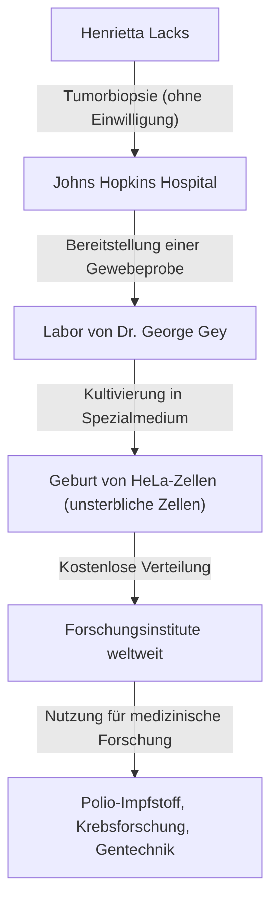
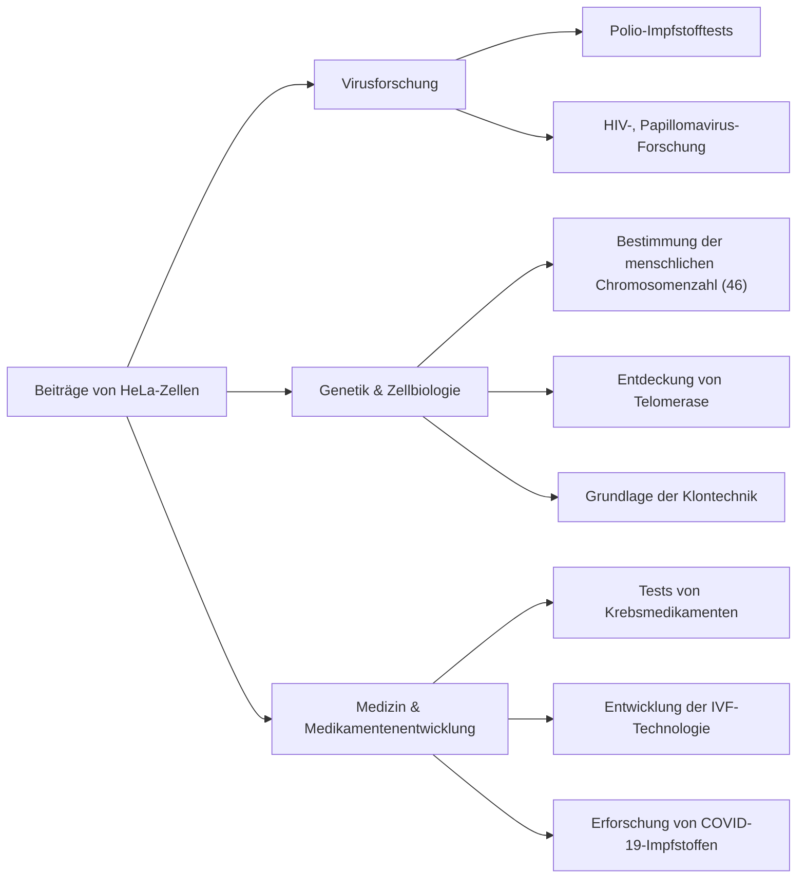

## Henrietta Lacks: Die unbesungene Heldin der modernen Medizin

Ein Großteil der medizinischen Technologie, die wir heute genießen – die Entwicklung des Polio-Impfstoffs, Fortschritte in der Krebsbehandlung, der Erfolg der In-vitro-Fertilisation und sogar die Erforschung des COVID-19-Impfstoffs – kann ohne die Zellen einer afroamerikanischen Frau nicht diskutiert werden. Ihr Name war **Henrietta Lacks**. Die aus ihrem Körper entnommenen Zellen wurden "HeLa-Zellen" genannt und waren die ersten "unsterblichen Zellen" in der Geschichte der Menschheit, die sich außerhalb des Körpers unendlich weiter vermehrten.

Doch während der Jahrzehnte, in denen sich ihre Zellen in Laboren auf der ganzen Welt vermehrten und unzählige Leben retteten, wusste ihre Familie nichts davon. In diesem Artikel werden wir uns eingehend mit dem Leben von Henrietta Lacks, den wissenschaftlichen Durchbrüchen, die durch HeLa-Zellen erzielt wurden, und den tiefgreifenden Diskussionen über Bioethik (informierte Einwilligung und genetische Privatsphäre), die durch ihre Geschichte ausgelöst wurden, befassen.

---

## Die Erziehung von Henrietta Lacks: Von den Tabakfeldern nach Baltimore

Henrietta Lacks (geborene Loretta Pleasant) wurde am 1. August 1920 in Roanoke, Virginia, geboren. Als sie 4 Jahre alt war, starb ihre Mutter kurz nach der Geburt ihres 10. Kindes, und da es ihrem Vater schwerfiel, die Kinder großzuziehen, wurden sie zu Verwandten geschickt. Henrietta wurde von ihrem Großvater, Tommy Lacks, in Clover, Virginia, aufgenommen, wo sie neben ihrem Cousin David (Day) Lacks aufwuchs.

Die Grundlage ihres Lebens war die Arbeit auf einer Tabakplantage. Auf den Tabakfeldern, die seit der Zeit der Sklaverei bestanden, verrichteten sie von klein auf von Sonnenaufgang bis Sonnenuntergang zermürbende Arbeit. Henriettas Möglichkeiten, die Schule zu besuchen, waren begrenzt, und sie musste ihre Schulbildung in der 6. Klasse beenden.

1941 heirateten Henrietta und Day und zogen auf der Suche nach einem besseren Leben inmitten des mit dem Zweiten Weltkrieg verbundenen Industriebooms nach Turner Station in der Nähe von Baltimore, Maryland. Day arbeitete im Stahlwerk Bethlehem Steel, während Henrietta ihre Tage als hingebungsvolle Mutter verbrachte, um ihre fünf Kinder (Lawrence, Elsie, Sonny, Deborah und Zakariyya) großzuziehen.

---

## Plötzliche Krankheit und Behandlung im Johns Hopkins Hospital

Anfang 1951 begann Henrietta, Anomalien in ihrem Körper zu spüren. Sie beschrieb es als einen "Knoten in ihrem Mutterleib" und erlebte anhaltende anormale Blutungen. Zu dieser Zeit war eines der wenigen großen Krankenhäuser in Baltimore, das schwarze Patienten aufnahm, das **Johns Hopkins Hospital**. Das Krankenhaus bot kostenlose Versorgung für die Armen, aber aufgrund der Segregationspolitik (Jim-Crow-Gesetze) waren die Stationen streng in Weiße und Schwarze getrennt.

Nach der Untersuchung wurde ein bösartiger Tumor an Henriettas Gebärmutterhals gefunden, und bei ihr wurde Gebärmutterhalskrebs (später als Adenokarzinom identifiziert) diagnostiziert. Ihr behandelnder Arzt, Dr. Howard Jones, entschied sich für eine Radium-Strahlentherapie, die zu dieser Zeit die Standardbehandlung war.

Während dieser Behandlung ereignete sich jedoch ein aus Sicht der modernen ethischen Standards schwerwiegendes Ereignis. Während Henrietta unter Narkose bewusstlos war, entnahm der operierende Chirurg **ohne ihre Zustimmung oder ihr Wissen** Proben sowohl aus ihrem Tumorgewebe als auch aus dem gesunden Gewebe direkt daneben.

Zu dieser Zeit war die Entnahme von Gewebeproben von Patienten während Operationen für Forschungszwecke eine gängige Praxis unter Ärzten, und das Konzept der Einholung der Zustimmung (informierte Einwilligung) selbst war gesetzlich nicht verankert.

---

## George Gey und die Geburt der "unsterblichen Zellen"

Die entnommenen Gewebeproben wurden an **Dr. George Gey**, den Leiter des Gewebekulturlabors an der Johns Hopkins University, geschickt. Dr. Gey und seine Frau Margaret hatten viele Jahre nach einer "Methode zur kontinuierlichen unendlichen Kultivierung menschlicher Zellen außerhalb des Körpers (in vitro)" gesucht. Zu dieser Zeit starben menschliche Zellen, die aus dem Körper entnommen wurden, typischerweise innerhalb weniger Tage bis Wochen ab.

Mary Kubicek, eine Assistentin im Labor von Dr. Gey, platzierte Henriettas Zellen in einem Kulturmedium (einer speziellen Mischung aus Hühnerplasma, Rinderfötusextrakt usw.). Dann passierte etwas Erstaunliches.

Während andere Zellen schnell abstarben, starben Henriettas Zellen nicht, sondern verdoppelten sich weiterhin alle 24 Stunden. Diese Zellen vermehrten sich mit einer abnormalen Geschwindigkeit und bedeckten schnell die Wände des Kulturkolbens. Dr. Gey nannte diese Zelllinie **"HeLa"**, indem er die ersten beiden Buchstaben des Vor- und Nachnamens der Patientin nahm. Dies war die Geburt der ersten "unsterblichen menschlichen Zelllinie" in der Geschichte der Menschheit.

Die Entdeckung der HeLa-Zellen war eine wahre Revolution in der Biologie und Medizin. Bis dahin waren Experimente mit lebenden menschlichen Zellen extrem schwierig gewesen, aber mit dem Aufkommen der unendlich sich vermehrenden, robusten und leicht zu handhabenden HeLa-Zellen waren Forscher auf der ganzen Welt in der Lage, Experimente mit menschlichen Zellen in einer stabilen Umgebung durchzuführen.

---

## Wissenschaftlicher Fortschritt und Henriettas Tod

Währenddessen verschlechterte sich der Zustand von Henrietta selbst, der ursprünglichen Besitzerin der Zellen, trotz Radium- und Röntgenbehandlungen rapide. Der Krebs metastasierte im ganzen Körper, und sie litt unter unbeschreiblichen Schmerzen.

Am 4. Oktober 1951, gerade als HeLa-Zellen die Welt verändern sollten, verstarb Henrietta Lacks im jungen Alter von 31 Jahren. Sie konnte nicht wissen, wie viel sie zur Medizin beigetragen hatte oder dass ihre Zellen als "Unsterbliche" weiterleben würden. Ihr Körper wurde in einem unmarkierten Grab in ihrer Heimatstadt Clover beigesetzt.

---

## Warum sind HeLa-Zellen "unsterblich"?

Warum besitzen HeLa-Zellen solch starke Proliferationsfähigkeiten und sterben nicht? In den folgenden Jahrzehnten der Forschung wurden die wissenschaftlichen Mechanismen dahinter aufgeklärt.

1. **Überexpression von Telomerase**:
   In normalen menschlichen Zellen verkürzt sich ein Teil am Ende des Chromosoms, das "Telomer", jedes Mal, wenn sich die Zelle teilt. Wenn das Telomer eine bestimmte Kürze erreicht, kann sich die Zelle nicht mehr teilen, altert und stirbt (die Hayflick-Grenze). HeLa-Zellen produzieren jedoch abnormal und aktiv ein Enzym namens "Telomerase". Weil dieses Enzym die Telomere kontinuierlich repariert, können sich die Zellen für immer weiter teilen (vermehren).

2. **Einfluss des Humanen Papillomavirus (HPV)**:
   Henriettas Gebärmutterhalskrebs wurde durch eine Infektion mit einem hochmalignen Virus namens Humanes Papillomavirus (HPV) Typ 18 verursacht. Infolge der Integration der DNA dieses Virus in das Genom von Henriettas Zellen wurde die Funktion von Tumorsuppressorgenen (wie p53 und Rb) gehemmt, was bedeutet, dass es keine Bremsen mehr für die Zellproliferation gab.

3. **Chromosomenanomalien**:
   Normale menschliche Zellen haben 46 Chromosomen, aber HeLa-Zellen weisen schwere Chromosomenanomalien auf und besitzen zwischen 76 und 80 Chromosomen. Diese intensive genetische Mutation trägt auch zu ihrer abnormalen Proliferationskraft bei.

---

## Medizinische Durchbrüche durch HeLa-Zellen

Dr. Gey ließ HeLa-Zellen nicht patentieren, sondern stellte sie Wissenschaftlern auf der ganzen Welt für Forschungszwecke kostenlos zur Verfügung. Schließlich wurden HeLa-Zellen kommerziell in Massen produziert und wurden zum "Standardmodell" der modernen Biologie. Es wird geschätzt, dass sich das Gesamtgewicht der bisher produzierten HeLa-Zellen auf zig Millionen Tonnen beläuft.

Die Forschungsergebnisse mit HeLa-Zellen sind so vielfältig, dass sie mehrere Nobelpreise hervorgebracht haben.

### 1. Entwicklung des Polio-Impfstoffs
In den 1950er Jahren war die Kinderlähmung (Polio) eine schreckliche Krankheit, die Kinder weltweit bedrohte. Als Dr. Jonas Salk den Polio-Impfstoff entwickelte, benötigte er Zellen, um dessen Wirksamkeit und Sicherheit in großem Maßstab zu testen. HeLa-Zellen waren sehr anfällig für das Poliovirus und konnten in großen Mengen kultiviert werden, was sie zum perfekten Material für Impfstofftests machte. Mit Zellen, die in einer großen HeLa-Zellfabrik an der Tuskegee University hergestellt wurden, beschleunigte sich die praktische Anwendung des Impfstoffs dramatisch, und Polio wurde fast erfolgreich auf der ganzen Welt ausgerottet.

### 2. Chromosomenforschung und Genkartierung
Bis Mitte der 1950er Jahre gab es keinen soliden Beweis dafür, wie viele Chromosomen der Mensch genau hatte. Während Forscher der University of Texas Experimente mit HeLa-Zellen durchführten, tränkten sie die Zellen versehentlich in einer hypotonen Lösung. Infolgedessen schwollen die Zellen an, und die inneren Chromosomen trennten sich sauber, was sie leichter zu beobachten machte. Durch die Anwendung dieser Technik wurde festgestellt, dass die normale Anzahl der menschlichen Chromosomen 46 beträgt, was später zur Entdeckung von genetischen Erkrankungen wie dem Down-Syndrom (Trisomie 21) führte.

### 3. Virologie und Krebsforschung
HeLa-Zellen wurden bei der Erforschung verschiedener Krankheitserreger verwendet, darunter HIV (das AIDS-Virus), Herpes, Zika-Virus, Tuberkulose und Salmonellen. Sie wurden auch sehr als Modellzellen geschätzt, um zu untersuchen, wie Zellen krebsartig werden und wie sich Krebsmedikamente auf Zellen auswirken.

### 4. Reise ins All
HeLa-Zellen reisten noch vor den Menschen an Bord eines sowjetischen Satelliten ins All. Sie dienten als Versuchsobjekte zur Untersuchung der Auswirkungen von Schwerelosigkeit und kosmischer Strahlung auf menschliche Zellen. Erstaunlicherweise wurde bestätigt, dass sich HeLa-Zellen im Weltraum sogar noch schneller vermehren als auf der Erde.

---

## Die uninformierte Familie und ethische Kontroversen

Während HeLa-Zellen weltweit eine Multi-Billionen-Dollar-Industrie hervorbrachten, die Titelseiten von Wissenschaftszeitschriften zierten und in medizinischen Lehrbüchern abgedruckt wurden, lebte Henriettas Familie (die Lacks-Familie) in einem armen Arbeiterviertel in Baltimore und konnte sich nicht einmal eine Krankenversicherung leisten.

Erst 1973, mehr als 20 Jahre nach Henriettas Tod, erfuhr die Lacks-Familie erstmals von der Existenz der HeLa-Zellen. Zu dieser Zeit ging die starke Proliferationsfähigkeit von HeLa-Zellen nach hinten los und verursachte "HeLa-Kontaminationsprobleme", bei denen HeLa-Zellen andere Zellkulturen (einschließlich normaler Zellen) auf der ganzen Welt kontaminierten und Versuchsergebnisse ruinierten.

Um genetische Marker zu identifizieren, die für HeLa-Zellen einzigartig sind, benötigten Wissenschaftler Blutproben von Henriettas Kindern. Die Familie, die plötzlich von Forschern kontaktiert wurde und erfuhr, dass "die Zellen ihrer Mutter noch leben", geriet in große Verwirrung und Angst. Blut wurde ohne ausreichende Erklärung abgenommen, und die Familie glaubte fälschlicherweise, dass auch sie auf Krebs getestet würden.

Von hier an kamen die schwerwiegenden ethischen Probleme im Zusammenhang mit HeLa-Zellen an die Oberfläche.

1. **Fehlende informierte Einwilligung**: Ist es zulässig, das Gewebe eines Patienten ohne Einwilligung zu entnehmen und zu verwenden?
2. **Gewinnverteilung**: Haben die ursprünglichen Gewebespender oder ihre Familien keine Rechte an den enormen Gewinnen, die aus den Zellen erwirtschaftet werden? (Das Urteil im Fall Moore gegen die Regents der University of California von 1990 stellte fest, dass Patienten keine Eigentumsrechte an ihren entnommenen Zellen haben.)
3. **Verletzung der Privatsphäre**: Im Jahr 2013 sequenzierte ein europäisches Forschungsteam das gesamte Genom von HeLa-Zellen und veröffentlichte es in einer öffentlichen Datenbank im Internet. Da die DNA-Sequenz von HeLa-Zellen stark mit Henriettas Kindern und Enkeln geteilt wird, war dies ein Akt der Veröffentlichung der genetischen Informationen der Familie (wie zukünftige Krankheitsrisiken) für die ganze Welt ohne Erlaubnis.

Dieses Ereignis im Jahr 2013 wurde zu einem großen Wendepunkt in der Bioethik. Die Familie Lacks protestierte entschieden gegen die Veröffentlichung ihrer genetischen Informationen ohne Einwilligung. Die National Institutes of Health (NIH) nahmen die Angelegenheit ernst, entfernten vorübergehend die veröffentlichten Genomdaten und berieten sich mit Vertretern der Lacks-Familie.

Infolgedessen wurden die Genomdaten der HeLa-Zellen in eine Datenbank mit Zugangsbeschränkung überführt, und Forscher müssen nun die Genehmigung eines Prüfungsausschusses einholen, dem zwei Mitglieder der Lacks-Familie angehören, um die Daten verwenden zu können. Dies wurde zu einer bahnbrechenden Vereinbarung, die vergangene Ungerechtigkeiten ansprach und die Einbeziehung von Familien in die Forschung anerkannte.

---

## Das wahre Erbe der "unsterblichen Zellen"

Die Geschichte von Henrietta Lacks ist nicht nur eine Geschichte von wissenschaftlichem Erfolg. Sie konfrontiert uns mit der schweren historischen Tatsache, dass medizinischer Fortschritt manchmal auf den Opfern sozial benachteiligter Menschen aufgebaut wurde.

Im Jahr 2010 wurde das Sachbuch "Die Unsterblichkeit der Henrietta Lacks", das von der Journalistin Rebecca Skloot veröffentlicht wurde, zu einem weltweiten Bestseller, und ihre Geschichte wurde auf der ganzen Welt weithin bekannt. Angeregt durch dieses Buch wurde in Henriettas Heimatstadt ein Denkmal errichtet, ein Asteroid nach ihr benannt, und ihr wurden Ehrendoktorwürden von mehreren Universitäten verliehen.

Darüber hinaus wurde 2023 in einer Klage der Familie Lacks gegen das Biotechnologieunternehmen Thermo Fisher Scientific ein Vergleich erzielt (mit der Behauptung, das Unternehmen habe sich durch die Verwendung von ohne Einwilligung entnommenen HeLa-Zellen ungerechtfertigt bereichert). Obwohl die Details des Vergleichs vertraulich sind, wird dies als historisches Ereignis angesehen, bei dem der trauernden Familie eine Entschädigung für die kommerzielle Nutzung von ohne Einwilligung entnommenem biologischem Gewebe gewährt wurde.

---

## Fazit

Henrietta Lacks wurde, unabhängig von ihren eigenen Absichten, aber zweifellos zu einer der wichtigsten Persönlichkeiten, die zur modernen Medizin beigetragen haben. Ihre Zellen teilen sich genau in diesem Moment in Laboren auf der ganzen Welt und widmen sich der Forschung, um die Menschheit vor Krankheiten zu retten.

Wenn wir die Vorteile der neuesten medizinischen Versorgung in Anspruch nehmen, dürfen wir nicht vergessen, dass das Leben einer afroamerikanischen Frau darin weiterlebt. Die Geschichte der HeLa-Zellen lehrt uns für immer sowohl die Größe der wissenschaftlichen Forschung als auch die ethische Verantwortung, die damit einhergeht.
