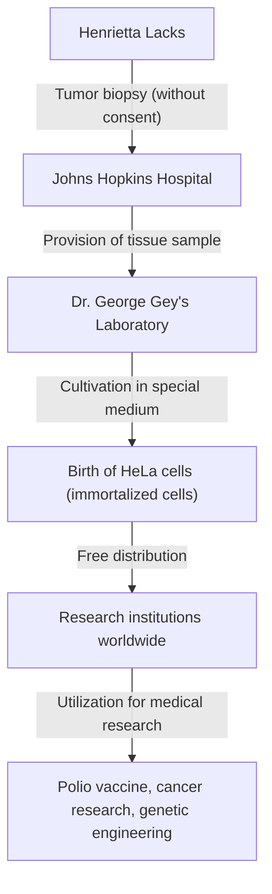
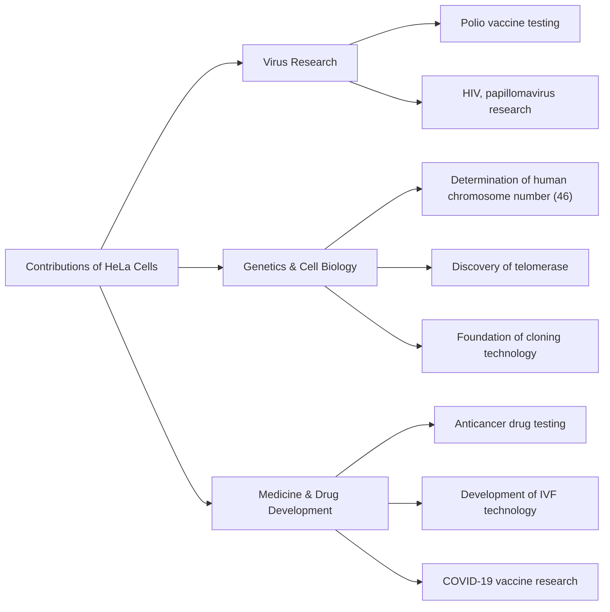

## Henrietta Lacks: The Unsung Hero of Modern Medicine

Much of the medical technology we enjoy today—the development of the polio vaccine, advances in cancer treatment, the success of in vitro fertilization, and even COVID-19 vaccine research—cannot be discussed without the cells of an African American woman. Her name was **Henrietta Lacks**. The cells taken from her body were named "HeLa cells" and became the first "immortal cells" in human history to continue multiplying indefinitely outside the body.

However, during the decades that her cells multiplied in laboratories worldwide and saved countless lives, her family was completely unaware of this fact. In this article, we will delve deeply into the life of Henrietta Lacks, the scientific breakthroughs brought about by HeLa cells, and the profound discussions on bioethics (informed consent and genetic privacy) triggered by her story.

---

## The Upbringing of Henrietta Lacks: From Tobacco Fields to Baltimore

Henrietta Lacks (born Loretta Pleasant) was born on August 1, 1920, in Roanoke, Virginia. When she was 4, her mother died shortly after giving birth to her 10th child, and since her father found it difficult to raise the children, they were sent to live with relatives. Henrietta was taken in by her grandfather, Tommy Lacks, in Clover, Virginia, where she grew up alongside her cousin David (Day) Lacks.

The foundation of their lives was labor on a tobacco farm. In the tobacco fields that had continued since the era of slavery, they engaged in grueling labor from sunrise to sunset from a young age. Henrietta's opportunities to attend school were limited, and she had to end her education in the 6th grade.

In 1941, Henrietta and Day married and, seeking a better life amidst the industrial boom associated with World War II, moved to Turner Station near Baltimore, Maryland. Day worked at the Bethlehem Steel plant, while Henrietta spent her days as a devoted mother raising their five children (Lawrence, Elsie, Sonny, Deborah, and Zakariyya).

---

## Sudden Illness and Treatment at Johns Hopkins Hospital

In early 1951, Henrietta began to feel abnormalities in her body. She described it as having a "knot in her womb" and experienced continuous abnormal bleeding. At the time, one of the few large hospitals in Baltimore that accepted Black patients was **Johns Hopkins Hospital**. The hospital provided free care to the poor, but due to segregation policies (Jim Crow laws), the wards were strictly separated between whites and Blacks.

After examination, a malignant tumor was found on Henrietta's cervix, and she was diagnosed with cervical cancer (later identified as adenocarcinoma). Her attending physician, Dr. Howard Jones, decided to proceed with radium radiation therapy, which was the standard treatment at the time.

However, during this treatment, a major event from the perspective of modern ethical standards occurred. While Henrietta was unconscious under anesthesia, the attending surgeon took samples from both her tumor tissue and the healthy tissue right next to it, **without her consent or knowledge**.

At the time, collecting tissue samples from patients during surgery for research was a common practice among doctors, and the concept of obtaining consent (informed consent) itself was not legally established.

---

## George Gey and the Birth of "Immortal Cells"

The collected tissue samples were sent to **Dr. George Gey**, the head of the tissue culture laboratory at Johns Hopkins University. Dr. Gey and his wife Margaret had been searching for many years for a "method to continuously cultivate human cells indefinitely outside the body (in vitro)." At the time, human cells taken outside the body typically died within a few days to weeks.

Mary Kubicek, an assistant in Dr. Gey's laboratory, placed Henrietta's cells in a culture medium (a special mixture of chicken plasma, bovine fetal extract, etc.). Then, something astonishing happened.

While other cells quickly died off, Henrietta's cells, rather than dying, continued to double every 24 hours. These cells multiplied at an abnormal rate, quickly covering the walls of the culture flask. Dr. Gey named this cell line **"HeLa"** by taking the first two letters of the patient's first and last names. This was the birth of the first "immortal human cell line" in human history.

The discovery of HeLa cells was a true revolution in biology and medicine. Until then, experiments using living human cells had been extremely difficult, but with the advent of the infinitely multiplying, robust, and easy-to-handle HeLa cells, researchers around the world were able to conduct experiments using human cells in a stable environment.

---

## Scientific Progress and Henrietta's Death

Meanwhile, the condition of Henrietta herself, the original owner of the cells, rapidly deteriorated despite radium and X-ray treatments. The cancer metastasized throughout her body, and she suffered from indescribable pain.

On October 4, 1951, just as HeLa cells were about to change the world, Henrietta Lacks passed away at the young age of 31. She had no way of knowing how much she had contributed to medicine or that her cells would continue to live on as "immortals." Her body was buried in an unmarked grave in her hometown of Clover.

---

## Why are HeLa Cells "Immortal"?

Why do HeLa cells possess such powerful proliferative capabilities and not die? Over the following decades of research, the scientific mechanisms behind this have been elucidated.

1. **Overexpression of Telomerase**:
   In normal human cells, a portion at the end of the chromosome called the "telomere" shortens each time the cell divides. When the telomere reaches a certain shortness, the cell can no longer divide, ages, and dies (the Hayflick limit). However, HeLa cells abnormally and actively produce an enzyme called "telomerase." Because this enzyme continuously repairs the telomeres, the cells can continue to divide (multiply) forever.

2. **Influence of Human Papillomavirus (HPV)**:
   Henrietta's cervical cancer was caused by an infection of a highly malignant virus called Human Papillomavirus (HPV) type 18. As a result of the DNA of this virus integrating into the genome of Henrietta's cells, the function of tumor suppressor genes (such as p53 and Rb) was inhibited, meaning there were no longer any brakes on the cell's proliferation.

3. **Chromosomal Abnormalities**:
   Normal human cells have 46 chromosomes, but HeLa cells have severe chromosomal abnormalities, possessing between 76 and 80 chromosomes. This intense genetic mutation also contributes to their abnormal proliferative power.

---

## Medical Breakthroughs Brought by HeLa Cells

Dr. Gey did not patent HeLa cells but began providing them free of charge to scientists around the world for research purposes. Eventually, HeLa cells came to be mass-produced commercially and became the "standard model" for modern biology. It is estimated that the total weight of HeLa cells produced to date amounts to tens of millions of tons.

The research results using HeLa cells are so diverse that they have generated multiple Nobel Prizes.

### 1. Development of the Polio Vaccine
In the 1950s, infantile paralysis (polio) was a terrifying disease that threatened children worldwide. When Dr. Jonas Salk was developing the polio vaccine, he needed cells to test its efficacy and safety on a large scale. HeLa cells were highly susceptible to the poliovirus and could be cultured in large quantities, making them the perfect material for vaccine testing. With cells produced at a large HeLa cell factory established at Tuskegee University, the practical application of the vaccine accelerated dramatically, and polio was successfully almost eradicated from the world.

### 2. Chromosome Research and Gene Mapping
Until the mid-1950s, there was no solid proof of exactly how many chromosomes humans had. While researchers at the University of Texas were conducting experiments using HeLa cells, they accidentally soaked the cells in a hypotonic solution. As a result, the cells swelled, and the internal chromosomes neatly separated, making them easier to observe. By applying this technique, it was determined that the normal number of human chromosomes is 46, which later led to the discovery of genetic disorders such as Down syndrome (trisomy 21).

### 3. Virology and Cancer Research
HeLa cells have been used in the research of various pathogens, including HIV (the AIDS virus), herpes, Zika virus, tuberculosis, and Salmonella. They have also been highly valued as model cells for investigating how cells become cancerous and how anticancer drugs affect cells.

### 4. Journey into Space
HeLa cells traveled into space before humans, aboard a Soviet satellite. They served as test subjects to investigate the effects of zero gravity and cosmic radiation on human cells. Astoundingly, it was confirmed that HeLa cells multiply even faster in space than on Earth.

---

## The Uninformed Family and Ethical Controversies

While HeLa cells generated a multi-trillion-dollar industry worldwide, graced the covers of scientific journals, and were featured in medical textbooks, Henrietta's family (the Lacks family) lived in a poor working-class neighborhood in Baltimore, unable even to afford health insurance.

It was not until 1973, more than 20 years after Henrietta's death, that the Lacks family first learned of the existence of HeLa cells. At the time, the powerful proliferative ability of HeLa cells backfired, causing "HeLa contamination problems" where HeLa cells contaminated other cell cultures (including normal cells) around the world, ruining experimental results.

To identify genetic markers unique to HeLa cells, scientists needed blood samples from Henrietta's children. The family, suddenly contacted by researchers and told that "their mother's cells are still alive," was thrown into great confusion and fear. Blood was drawn without sufficient explanation, and the family mistakenly believed that they, too, were being tested for cancer.

From here, the serious ethical issues surrounding HeLa cells surfaced.

1. **Lack of Informed Consent**: Is it permissible to collect and use a patient's tissue without consent?
2. **Distribution of Profits**: Do the original tissue providers or their families have no rights to the enormous profits generated from the cells? (The 1990 ruling in Moore v. Regents of the University of California established that patients do not hold property rights to their excised cells.)
3. **Invasion of Privacy**: In 2013, a European research team sequenced the entire genome of HeLa cells and published it on a public database on the internet. Because the DNA sequence of HeLa cells is strongly shared with Henrietta's children and grandchildren, this was an act of publishing the family's genetic information (such as future disease risks) to the whole world without permission.

This 2013 event became a major turning point in bioethics. The Lacks family strongly protested the publication of their genetic information without consent. The National Institutes of Health (NIH) took the matter seriously, temporarily removed the published genomic data, and consulted with representatives of the Lacks family.

As a result, the genomic data of HeLa cells was moved to a restricted-access database, and researchers are now required to obtain approval from a review board, which includes two members of the Lacks family, to use the data. This became a landmark agreement that addressed past injustices and recognized the involvement of families in research.

---

## The True Legacy of "Immortal Cells"

The story of Henrietta Lacks is not merely a tale of scientific success. It confronts us with the heavy historical fact that medical progress has sometimes been built upon the sacrifices of socially vulnerable people.

In 2010, the non-fiction book "The Immortal Life of Henrietta Lacks," published by journalist Rebecca Skloot, became a global bestseller, and her story became widely known to the world. Sparked by this book, a monument was erected in Henrietta's hometown, an asteroid was named after her, and she was awarded honorary degrees from multiple universities.

Furthermore, in 2023, a settlement was reached in a lawsuit filed by the Lacks family against the biotechnology company Thermo Fisher Scientific (alleging that the company unjustly profited from the use of HeLa cells collected without consent). Although the details of the settlement are confidential, this is regarded as a historical event where compensation was provided to the bereaved family for the commercial use of biological tissue collected without consent.

---

## Conclusion

Henrietta Lacks became, regardless of her own intentions, but undoubtedly, one of the most important contributors to modern medicine. Her cells continue to divide in laboratories around the world at this very moment, dedicating themselves to research to save humanity from disease.

When we receive the benefits of the latest medical care, we must not forget that the life of one African American woman lives on within it. The story of HeLa cells continues to teach us forever both the greatness of scientific exploration and the ethical responsibilities that accompany it.
