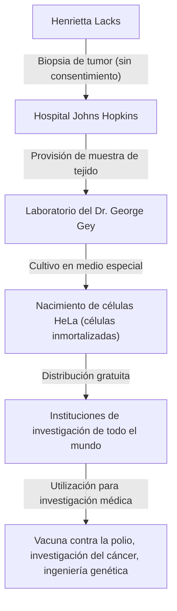
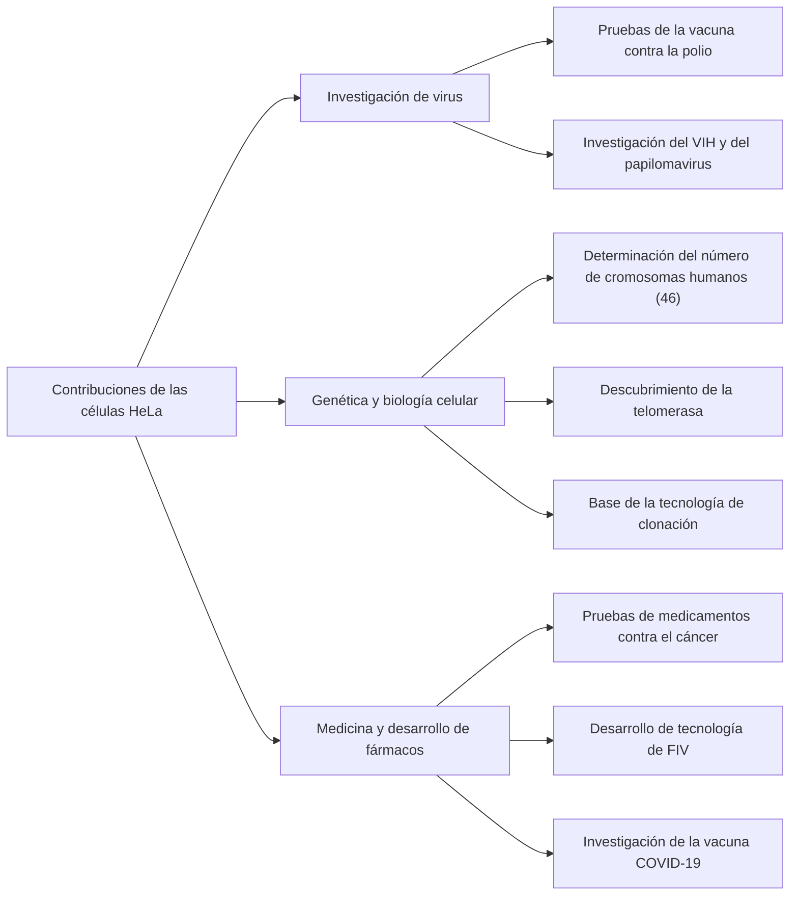

## Henrietta Lacks: la heroína olvidada de la medicina moderna

Gran parte de la tecnología médica que disfrutamos hoy en día —el desarrollo de la vacuna contra la polio, los avances en el tratamiento del cáncer, el éxito de la fertilización in vitro e incluso la investigación de la vacuna COVID-19— no se puede discutir sin las células de una mujer afroamericana. Su nombre era **Henrietta Lacks**. Las células tomadas de su cuerpo se denominaron "células HeLa" y se convirtieron en las primeras "células inmortales" en la historia de la humanidad en continuar multiplicándose indefinidamente fuera del cuerpo.

Sin embargo, durante las décadas en que sus células se multiplicaron en laboratorios de todo el mundo y salvaron innumerables vidas, su familia ignoraba por completo este hecho. En este artículo, profundizaremos en la vida de Henrietta Lacks, los avances científicos provocados por las células HeLa y las profundas discusiones sobre bioética (consentimiento informado y privacidad genética) desencadenadas por su historia.

---

## La crianza de Henrietta Lacks: de los campos de tabaco a Baltimore

Henrietta Lacks (nacida Loretta Pleasant) nació el 1 de agosto de 1920 en Roanoke, Virginia. Cuando tenía 4 años, su madre murió poco después de dar a luz a su décimo hijo y, dado que a su padre le resultaba difícil criar a los niños, fueron enviados a vivir con parientes. Henrietta fue acogida por su abuelo, Tommy Lacks, en Clover, Virginia, donde creció junto a su primo David (Day) Lacks.

La base de sus vidas era el trabajo en una plantación de tabaco. En los campos de tabaco que continuaban desde la era de la esclavitud, se dedicaban a un trabajo agotador desde el amanecer hasta el atardecer desde una edad temprana. Las oportunidades de Henrietta para asistir a la escuela eran limitadas, y tuvo que terminar su educación en el sexto grado.

En 1941, Henrietta y Day se casaron y, buscando una vida mejor en medio del auge industrial asociado con la Segunda Guerra Mundial, se mudaron a Turner Station, cerca de Baltimore, Maryland. Day trabajaba en la planta de Bethlehem Steel, mientras que Henrietta pasaba sus días como una madre devota criando a sus cinco hijos (Lawrence, Elsie, Sonny, Deborah y Zakariyya).

---

## Enfermedad repentina y tratamiento en el Hospital Johns Hopkins

A principios de 1951, Henrietta comenzó a sentir anomalías en su cuerpo. Lo describió como tener un "nudo en el vientre" y experimentó un sangrado anormal continuo. En ese momento, uno de los pocos grandes hospitales de Baltimore que aceptaba pacientes negros era el **Hospital Johns Hopkins**. El hospital brindaba atención gratuita a los pobres, pero debido a las políticas de segregación (leyes de Jim Crow), las salas estaban estrictamente separadas entre blancos y negros.

Después de examinarla, se encontró un tumor maligno en el cuello uterino de Henrietta y se le diagnosticó cáncer de cuello uterino (luego identificado como adenocarcinoma). Su médico tratante, el Dr. Howard Jones, decidió proceder con radioterapia con radio, que era el tratamiento estándar en ese momento.

Sin embargo, durante este tratamiento, ocurrió un evento importante desde la perspectiva de los estándares éticos modernos. Mientras Henrietta estaba inconsciente bajo anestesia, el cirujano tratante tomó muestras tanto de su tejido tumoral como del tejido sano justo al lado, **sin su consentimiento ni conocimiento**.

En ese momento, recolectar muestras de tejido de pacientes durante la cirugía para investigación era una práctica común entre los médicos, y el concepto de obtener consentimiento (consentimiento informado) en sí mismo no estaba establecido legalmente.

---

## George Gey y el nacimiento de las "células inmortales"

Las muestras de tejido recolectadas se enviaron al **Dr. George Gey**, jefe del laboratorio de cultivo de tejidos de la Universidad Johns Hopkins. El Dr. Gey y su esposa Margaret habían estado buscando durante muchos años un "método para cultivar continuamente células humanas indefinidamente fuera del cuerpo (in vitro)". En ese momento, las células humanas tomadas fuera del cuerpo generalmente morían en unos pocos días o semanas.

Mary Kubicek, asistente en el laboratorio del Dr. Gey, colocó las células de Henrietta en un medio de cultivo (una mezcla especial de plasma de pollo, extracto fetal bovino, etc.). Entonces, sucedió algo asombroso.

Mientras que otras células murieron rápidamente, las células de Henrietta, en lugar de morir, continuaron duplicándose cada 24 horas. Estas células se multiplicaron a un ritmo anormal, cubriendo rápidamente las paredes del matraz de cultivo. El Dr. Gey nombró a esta línea celular **"HeLa"** tomando las dos primeras letras del nombre y apellido del paciente. Este fue el nacimiento de la primera "línea celular humana inmortal" en la historia de la humanidad.

El descubrimiento de las células HeLa fue una verdadera revolución en la biología y la medicina. Hasta entonces, los experimentos con células humanas vivas habían sido extremadamente difíciles, pero con el advenimiento de las células HeLa de multiplicación infinita, robustas y fáciles de manejar, los investigadores de todo el mundo pudieron realizar experimentos con células humanas en un entorno estable.

---

## Progreso científico y la muerte de Henrietta

Mientras tanto, la condición de Henrietta misma, la dueña original de las células, se deterioró rápidamente a pesar de los tratamientos de radio y rayos X. El cáncer hizo metástasis en todo su cuerpo y ella sufrió un dolor indescriptible.

El 4 de octubre de 1951, justo cuando las células HeLa estaban a punto de cambiar el mundo, Henrietta Lacks falleció a la temprana edad de 31 años. No tenía forma de saber cuánto había contribuido a la medicina o que sus células seguirían viviendo como "inmortales". Su cuerpo fue enterrado en una tumba sin nombre en su ciudad natal de Clover.

---

## ¿Por qué las células HeLa son "inmortales"?

¿Por qué las células HeLa poseen capacidades proliferativas tan poderosas y no mueren? Durante las siguientes décadas de investigación, se han dilucidado los mecanismos científicos detrás de esto.

1. **Sobreexpresión de telomerasa**:
   En las células humanas normales, una porción al final del cromosoma llamada "telómero" se acorta cada vez que la célula se divide. Cuando el telómero alcanza cierta brevedad, la célula ya no puede dividirse, envejece y muere (el límite de Hayflick). Sin embargo, las células HeLa producen de forma anormal y activa una enzima llamada "telomerasa". Debido a que esta enzima repara continuamente los telómeros, las células pueden continuar dividiéndose (multiplicándose) para siempre.

2. **Influencia del Virus del Papiloma Humano (VPH)**:
   El cáncer de cuello uterino de Henrietta fue causado por una infección de un virus altamente maligno llamado Virus del Papiloma Humano (VPH) tipo 18. Como resultado de que el ADN de este virus se integrara en el genoma de las células de Henrietta, se inhibió la función de los genes supresores de tumores (como p53 y Rb), lo que significa que ya no había frenos en la proliferación celular.

3. **Anomalías cromosómicas**:
   Las células humanas normales tienen 46 cromosomas, pero las células HeLa tienen anomalías cromosómicas graves, poseyendo entre 76 y 80 cromosomas. Esta intensa mutación genética también contribuye a su poder proliferativo anormal.

---

## Avances médicos traídos por las células HeLa

El Dr. Gey no patentó las células HeLa, sino que comenzó a proporcionarlas de forma gratuita a científicos de todo el mundo con fines de investigación. Con el tiempo, las células HeLa comenzaron a producirse en masa comercialmente y se convirtieron en el "modelo estándar" para la biología moderna. Se estima que el peso total de las células HeLa producidas hasta la fecha asciende a decenas de millones de toneladas.

Los resultados de las investigaciones con células HeLa son tan diversos que han generado múltiples Premios Nobel.

### 1. Desarrollo de la vacuna contra la polio
En la década de 1950, la parálisis infantil (polio) era una enfermedad aterradora que amenazaba a los niños de todo el mundo. Cuando el Dr. Jonas Salk estaba desarrollando la vacuna contra la polio, necesitaba células para probar su eficacia y seguridad a gran escala. Las células HeLa eran muy susceptibles al poliovirus y podían cultivarse en grandes cantidades, lo que las convertía en el material perfecto para probar vacunas. Con células producidas en una gran fábrica de células HeLa establecida en la Universidad de Tuskegee, la aplicación práctica de la vacuna se aceleró dramáticamente y la polio fue erradicada con éxito del mundo.

### 2. Investigación de cromosomas y mapeo genético
Hasta mediados de la década de 1950, no había pruebas sólidas de exactamente cuántos cromosomas tenían los humanos. Mientras investigadores de la Universidad de Texas realizaban experimentos con células HeLa, remojaron accidentalmente las células en una solución hipotónica. Como resultado, las células se hincharon y los cromosomas internos se separaron ordenadamente, haciéndolos más fáciles de observar. Al aplicar esta técnica, se determinó que el número normal de cromosomas humanos es 46, lo que luego llevó al descubrimiento de trastornos genéticos como el síndrome de Down (trisomía 21).

### 3. Virología e investigación del cáncer
Las células HeLa se han utilizado en la investigación de varios patógenos, incluidos el VIH (el virus del SIDA), el herpes, el virus del Zika, la tuberculosis y la Salmonella. También han sido muy valoradas como células modelo para investigar cómo las células se vuelven cancerosas y cómo los medicamentos contra el cáncer afectan a las células.

### 4. Viaje al espacio
Las células HeLa viajaron al espacio antes que los humanos, a bordo de un satélite soviético. Sirvieron como sujetos de prueba para investigar los efectos de la gravedad cero y la radiación cósmica en las células humanas. Sorprendentemente, se confirmó que las células HeLa se multiplican incluso más rápido en el espacio que en la Tierra.

---

## La familia desinformada y las controversias éticas

Mientras que las células HeLa generaron una industria multimillonaria en todo el mundo, adornaron las portadas de revistas científicas y aparecieron en libros de texto de medicina, la familia de Henrietta (la familia Lacks) vivía en un barrio pobre de clase trabajadora en Baltimore, sin poder permitirse siquiera un seguro médico.

No fue sino hasta 1973, más de 20 años después de la muerte de Henrietta, que la familia Lacks se enteró por primera vez de la existencia de las células HeLa. En ese momento, la poderosa capacidad proliferativa de las células HeLa fracasó, causando "problemas de contaminación por HeLa" en los que las células HeLa contaminaron otros cultivos celulares (incluidas las células normales) en todo el mundo, arruinando los resultados experimentales.

Para identificar marcadores genéticos exclusivos de las células HeLa, los científicos necesitaban muestras de sangre de los hijos de Henrietta. La familia, contactada repentinamente por investigadores y advertida de que "las células de su madre todavía están vivas", se vio sumida en una gran confusión y miedo. Se extrajo sangre sin explicación suficiente y la familia creyó erróneamente que también les estaban haciendo pruebas de detección de cáncer.

A partir de aquí, surgieron los graves problemas éticos que rodearon a las células HeLa.

1. **Falta de consentimiento informado**: ¿Está permitido recolectar y usar el tejido de un paciente sin su consentimiento?
2. **Distribución de las ganancias**: ¿Los proveedores originales de tejidos o sus familias no tienen derechos sobre las enormes ganancias generadas por las células? (El fallo de 1990 en Moore contra los Regentes de la Universidad de California estableció que los pacientes no tienen derechos de propiedad sobre sus células extirpadas).
3. **Invasión de la privacidad**: En 2013, un equipo de investigación europeo secuenció el genoma completo de las células HeLa y lo publicó en una base de datos pública en Internet. Debido a que la secuencia de ADN de las células HeLa se comparte fuertemente con los hijos y nietos de Henrietta, este fue un acto de publicar la información genética de la familia (como los riesgos futuros de enfermedades) al mundo entero sin permiso.

Este evento de 2013 se convirtió en un importante punto de inflexión en la bioética. La familia Lacks protestó enérgicamente por la publicación de su información genética sin consentimiento. Los Institutos Nacionales de Salud (NIH) se tomaron el asunto en serio, eliminaron temporalmente los datos genómicos publicados y consultaron con representantes de la familia Lacks.

Como resultado, los datos genómicos de las células HeLa se trasladaron a una base de datos de acceso restringido, y ahora los investigadores deben obtener la aprobación de una junta de revisión, que incluye a dos miembros de la familia Lacks, para usar los datos. Este se convirtió en un acuerdo histórico que abordó injusticias pasadas y reconoció la participación de las familias en la investigación.

---

## El verdadero legado de las "células inmortales"

La historia de Henrietta Lacks no es simplemente una historia de éxito científico. Nos confronta con el pesado hecho histórico de que el progreso médico a veces se ha construido sobre los sacrificios de personas socialmente vulnerables.

En 2010, el libro de no ficción "La vida inmortal de Henrietta Lacks", publicado por la periodista Rebecca Skloot, se convirtió en un éxito de ventas mundial y su historia se hizo ampliamente conocida en todo el mundo. Impulsado por este libro, se erigió un monumento en la ciudad natal de Henrietta, se le dio su nombre a un asteroide y se le otorgaron títulos honoríficos de múltiples universidades.

Además, en 2023, se llegó a un acuerdo en una demanda presentada por la familia Lacks contra la empresa de biotecnología Thermo Fisher Scientific (alegando que la empresa se benefició injustamente del uso de células HeLa recolectadas sin consentimiento). Aunque los detalles del acuerdo son confidenciales, esto se considera un evento histórico en el que se brindó compensación a la familia en duelo por el uso comercial de tejido biológico recolectado sin consentimiento.

---

## Conclusión

Henrietta Lacks se convirtió, independientemente de sus propias intenciones, pero sin duda, en una de las contribuyentes más importantes a la medicina moderna. Sus células continúan dividiéndose en laboratorios de todo el mundo en este mismo momento, dedicándose a la investigación para salvar a la humanidad de enfermedades.

Cuando recibimos los beneficios de la atención médica más moderna, no debemos olvidar que la vida de una mujer afroamericana sigue viva dentro de ella. La historia de las células HeLa continúa enseñándonos para siempre tanto la grandeza de la exploración científica como las responsabilidades éticas que la acompañan.
