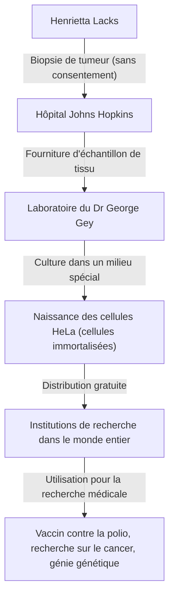
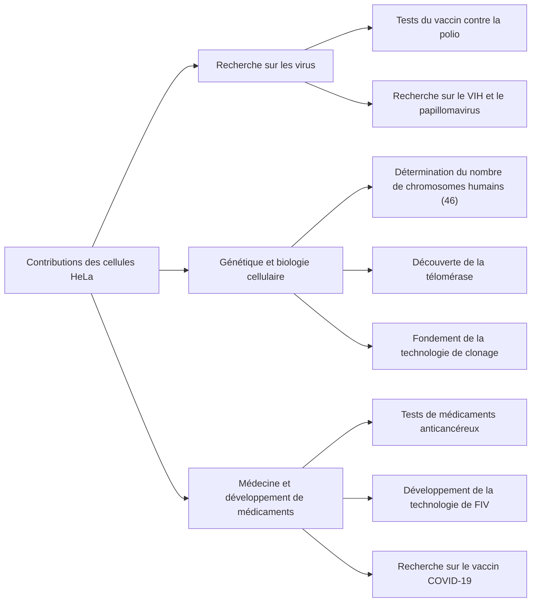

## Henrietta Lacks : l'héroïne méconnue de la médecine moderne

Une grande partie de la technologie médicale dont nous bénéficions aujourd'hui — le développement du vaccin contre la polio, les progrès dans le traitement du cancer, le succès de la fécondation in vitro et même la recherche sur le vaccin COVID-19 — ne pourrait être abordée sans les cellules d'une femme afro-américaine. Son nom était **Henrietta Lacks**. Les cellules prélevées sur son corps ont été nommées « cellules HeLa » et sont devenues les premières « cellules immortelles » de l'histoire de l'humanité à continuer de se multiplier indéfiniment en dehors du corps.

Cependant, pendant les décennies où ses cellules se sont multipliées dans les laboratoires du monde entier et ont sauvé d'innombrables vies, sa famille ignorait totalement ce fait. Dans cet article, nous plongerons au cœur de la vie d'Henrietta Lacks, des avancées scientifiques apportées par les cellules HeLa et des profonds débats sur la bioéthique (consentement éclairé et confidentialité génétique) déclenchés par son histoire.

---

## L'éducation d'Henrietta Lacks : des champs de tabac à Baltimore

Henrietta Lacks (née Loretta Pleasant) a vu le jour le 1er août 1920 à Roanoke, en Virginie. Alors qu'elle n'avait que 4 ans, sa mère est décédée peu après avoir donné naissance à son 10e enfant. Comme son père avait des difficultés à élever les enfants, ils ont été envoyés vivre chez des parents. Henrietta a été recueillie par son grand-père, Tommy Lacks, à Clover, en Virginie, où elle a grandi aux côtés de son cousin David (Day) Lacks.

Le fondement de leur vie était le travail dans une plantation de tabac. Dans les champs de tabac qui persistaient depuis l'ère de l'esclavage, ils se sont livrés dès leur plus jeune âge à un travail éreintant, du lever au coucher du soleil. Les opportunités pour Henrietta d'aller à l'école étaient limitées, et elle a dû mettre un terme à son éducation en sixième année.

En 1941, Henrietta et Day se sont mariés et, en quête d'une vie meilleure au milieu du boom industriel lié à la Seconde Guerre mondiale, ils ont déménagé à Turner Station, près de Baltimore, dans le Maryland. Day travaillait à l'usine sidérurgique de Bethlehem, tandis qu'Henrietta passait ses journées en tant que mère dévouée à élever leurs cinq enfants (Lawrence, Elsie, Sonny, Deborah et Zakariyya).

---

## Maladie soudaine et traitement à l'hôpital Johns Hopkins

Au début de 1951, Henrietta a commencé à ressentir des anomalies dans son corps. Elle décrivait cela comme ayant un « nœud dans son ventre » et souffrait de saignements anormaux continus. À l'époque, l'un des rares grands hôpitaux de Baltimore acceptant les patients noirs était **l'hôpital Johns Hopkins**. L'hôpital prodiguait des soins gratuits aux plus démunis, mais en raison des politiques de ségrégation (lois Jim Crow), les services étaient strictement séparés entre Blancs et Noirs.

Après examen, une tumeur maligne a été découverte sur le col de l'utérus d'Henrietta, et on lui a diagnostiqué un cancer du col de l'utérus (identifié plus tard comme un adénocarcinome). Son médecin traitant, le Dr Howard Jones, a décidé de procéder à une radiothérapie au radium, qui était le traitement standard à l'époque.

Cependant, au cours de ce traitement, un événement majeur du point de vue des normes éthiques modernes s'est produit. Alors qu'Henrietta était inconsciente sous anesthésie, le chirurgien traitant a prélevé des échantillons à la fois de son tissu tumoral et du tissu sain juste à côté, **sans son consentement ni à sa connaissance**.

À l'époque, le prélèvement d'échantillons de tissus sur des patients pendant une intervention chirurgicale à des fins de recherche était une pratique courante chez les médecins, et le concept d'obtention du consentement (consentement éclairé) lui-même n'était pas légalement établi.

---

## George Gey et la naissance des « cellules immortelles »

Les échantillons de tissus prélevés ont été envoyés au **Dr George Gey**, chef du laboratoire de culture tissulaire de l'Université Johns Hopkins. Le Dr Gey et son épouse Margaret cherchaient depuis de nombreuses années une « méthode pour cultiver continuellement des cellules humaines indéfiniment en dehors du corps (in vitro) ». À l'époque, les cellules humaines prélevées en dehors du corps mouraient généralement en quelques jours à quelques semaines.

Mary Kubicek, assistante dans le laboratoire du Dr Gey, a placé les cellules d'Henrietta dans un milieu de culture (un mélange spécial de plasma de poulet, d'extrait de fœtus bovin, etc.). Puis, une chose étonnante s'est produite.

Alors que d'autres cellules mouraient rapidement, les cellules d'Henrietta, au lieu de mourir, continuaient de doubler toutes les 24 heures. Ces cellules se multipliaient à un rythme anormal, recouvrant rapidement les parois du flacon de culture. Le Dr Gey a nommé cette lignée cellulaire **« HeLa »** en prenant les deux premières lettres du prénom et du nom de famille de la patiente. Ce fut la naissance de la première « lignée cellulaire humaine immortelle » de l'histoire de l'humanité.

La découverte des cellules HeLa fut une véritable révolution en biologie et en médecine. Jusqu'alors, les expériences utilisant des cellules humaines vivantes étaient extrêmement difficiles, mais avec l'avènement des cellules HeLa se multipliant à l'infini, robustes et faciles à manipuler, les chercheurs du monde entier ont pu mener des expériences utilisant des cellules humaines dans un environnement stable.

---

## Progrès scientifique et décès d'Henrietta

Pendant ce temps, l'état d'Henrietta elle-même, la propriétaire originale des cellules, s'est rapidement détérioré malgré les traitements au radium et aux rayons X. Le cancer s'est métastasé dans tout son corps, et elle a souffert de douleurs indescriptibles.

Le 4 octobre 1951, juste au moment où les cellules HeLa étaient sur le point de changer le monde, Henrietta Lacks est décédée à l'âge précoce de 31 ans. Elle n'avait aucun moyen de savoir à quel point elle avait contribué à la médecine ou que ses cellules continueraient à vivre en tant qu'« immortelles ». Son corps a été enterré dans une tombe anonyme dans sa ville natale de Clover.

---

## Pourquoi les cellules HeLa sont-elles « immortelles » ?

Pourquoi les cellules HeLa possèdent-elles des capacités de prolifération aussi puissantes et ne meurent-elles pas ? Au cours des décennies de recherche qui ont suivi, les mécanismes scientifiques à l'origine de ce phénomène ont été élucidés.

1. **Surexpression de la télomérase** :
   Dans les cellules humaines normales, une portion à l'extrémité du chromosome appelée « télomère » raccourcit chaque fois que la cellule se divise. Lorsque le télomère atteint une certaine brièveté, la cellule ne peut plus se diviser, vieillit et meurt (limite de Hayflick). Cependant, les cellules HeLa produisent de manière anormale et active une enzyme appelée « télomérase ». Parce que cette enzyme répare continuellement les télomères, les cellules peuvent continuer à se diviser (se multiplier) indéfiniment.

2. **Influence du virus du papillome humain (VPH)** :
   Le cancer du col de l'utérus d'Henrietta a été causé par une infection par un virus hautement malin appelé virus du papillome humain (VPH) de type 18. En conséquence de l'intégration de l'ADN de ce virus dans le génome des cellules d'Henrietta, la fonction des gènes suppresseurs de tumeurs (tels que p53 et Rb) a été inhibée, ce qui signifie qu'il n'y avait plus aucun frein à la prolifération cellulaire.

3. **Anomalies chromosomiques** :
   Les cellules humaines normales possèdent 46 chromosomes, mais les cellules HeLa présentent de graves anomalies chromosomiques, possédant entre 76 et 80 chromosomes. Cette mutation génétique intense contribue également à leur pouvoir prolifératif anormal.

---

## Avancées médicales apportées par les cellules HeLa

Le Dr Gey n'a pas breveté les cellules HeLa, mais a commencé à les fournir gratuitement aux scientifiques du monde entier à des fins de recherche. Finalement, les cellules HeLa ont commencé à être produites en masse à des fins commerciales et sont devenues le « modèle standard » de la biologie moderne. On estime que le poids total des cellules HeLa produites à ce jour s'élève à des dizaines de millions de tonnes.

Les résultats des recherches utilisant des cellules HeLa sont si diversifiés qu'ils ont généré de multiples prix Nobel.

### 1. Développement du vaccin contre la polio
Dans les années 1950, la paralysie infantile (polio) était une maladie terrifiante qui menaçait les enfants du monde entier. Lorsque le Dr Jonas Salk développait le vaccin contre la polio, il avait besoin de cellules pour tester son efficacité et sa sécurité à grande échelle. Les cellules HeLa étaient très sensibles au virus de la polio et pouvaient être cultivées en grande quantité, ce qui en faisait le matériel parfait pour les tests de vaccins. Grâce aux cellules produites dans une grande usine de cellules HeLa établie à l'Université de Tuskegee, l'application pratique du vaccin s'est accélérée de manière spectaculaire, et la polio a été presque éradiquée du monde avec succès.

### 2. Recherche sur les chromosomes et cartographie génétique
Jusqu'au milieu des années 1950, il n'y avait aucune preuve solide du nombre exact de chromosomes chez l'homme. Alors que des chercheurs de l'Université du Texas menaient des expériences à l'aide de cellules HeLa, ils ont accidentellement trempé les cellules dans une solution hypotonique. En conséquence, les cellules ont gonflé et les chromosomes internes se sont séparés proprement, les rendant plus faciles à observer. En appliquant cette technique, il a été déterminé que le nombre normal de chromosomes humains est de 46, ce qui a conduit plus tard à la découverte de troubles génétiques tels que le syndrome de Down (trisomie 21).

### 3. Virologie et recherche sur le cancer
Les cellules HeLa ont été utilisées dans la recherche sur divers agents pathogènes, notamment le VIH (le virus du SIDA), l'herpès, le virus Zika, la tuberculose et la salmonelle. Elles ont également été très appréciées comme cellules modèles pour étudier comment les cellules deviennent cancéreuses et comment les médicaments anticancéreux affectent les cellules.

### 4. Voyage dans l'espace
Les cellules HeLa ont voyagé dans l'espace avant les humains, à bord d'un satellite soviétique. Elles ont servi de sujets de test pour étudier les effets de l'apesanteur et des rayonnements cosmiques sur les cellules humaines. De manière stupéfiante, il a été confirmé que les cellules HeLa se multiplient encore plus vite dans l'espace que sur Terre.

---

## La famille mal informée et les controverses éthiques

Alors que les cellules HeLa généraient une industrie de plusieurs milliards de dollars dans le monde entier, ornaient les couvertures de revues scientifiques et figuraient dans les manuels de médecine, la famille d'Henrietta (la famille Lacks) vivait dans un quartier pauvre de la classe ouvrière de Baltimore, incapable même de s'offrir une assurance maladie.

Ce n'est qu'en 1973, plus de 20 ans après la mort d'Henrietta, que la famille Lacks a appris l'existence des cellules HeLa pour la première fois. À l'époque, la puissante capacité de prolifération des cellules HeLa s'est retournée contre elles, provoquant des « problèmes de contamination par HeLa » où les cellules HeLa ont contaminé d'autres cultures cellulaires (y compris des cellules normales) dans le monde entier, ruinant les résultats expérimentaux.

Pour identifier les marqueurs génétiques uniques aux cellules HeLa, les scientifiques avaient besoin d'échantillons de sang des enfants d'Henrietta. La famille, soudainement contactée par des chercheurs et informée que « les cellules de leur mère sont toujours en vie », a été plongée dans une grande confusion et dans la peur. Du sang a été prélevé sans explication suffisante, et la famille a cru à tort qu'elle aussi subissait des tests de dépistage du cancer.

De là, les graves problèmes éthiques entourant les cellules HeLa ont fait surface.

1. **Manque de consentement éclairé** : Est-il permis de prélever et d'utiliser les tissus d'un patient sans son consentement ?
2. **Répartition des bénéfices** : Les fournisseurs de tissus d'origine ou leurs familles n'ont-ils aucun droit sur les énormes profits générés par les cellules ? (La décision de 1990 dans l'affaire Moore v. Regents of the University of California a établi que les patients ne détiennent pas de droits de propriété sur leurs cellules excisées.)
3. **Atteinte à la vie privée** : En 2013, une équipe de recherche européenne a séquencé le génome entier des cellules HeLa et l'a publié sur une base de données publique sur Internet. Étant donné que la séquence d'ADN des cellules HeLa est fortement partagée avec les enfants et petits-enfants d'Henrietta, il s'agissait d'un acte consistant à publier les informations génétiques de la famille (telles que les risques futurs de maladies) au monde entier sans autorisation.

Cet événement de 2013 est devenu un tournant majeur en bioéthique. La famille Lacks a vivement protesté contre la publication de ses informations génétiques sans consentement. Les National Institutes of Health (NIH) ont pris l'affaire au sérieux, ont temporairement retiré les données génomiques publiées et ont consulté des représentants de la famille Lacks.

En conséquence, les données génomiques des cellules HeLa ont été déplacées vers une base de données à accès restreint, et les chercheurs sont désormais tenus d'obtenir l'approbation d'un comité d'examen, qui comprend deux membres de la famille Lacks, pour utiliser les données. Il s'agit d'un accord historique qui a remédié aux injustices passées et reconnu l'implication des familles dans la recherche.

---

## Le véritable héritage des « cellules immortelles »

L'histoire d'Henrietta Lacks n'est pas simplement un conte de réussite scientifique. Elle nous confronte au lourd fait historique que les progrès médicaux se sont parfois construits sur les sacrifices de personnes socialement vulnérables.

En 2010, le livre documentaire « La vie immortelle d'Henrietta Lacks », publié par la journaliste Rebecca Skloot, est devenu un best-seller mondial, et son histoire est devenue largement connue dans le monde entier. Inspirée par ce livre, une commémoration a été érigée dans la ville natale d'Henrietta, un astéroïde porte son nom, et elle a reçu des diplômes honorifiques de plusieurs universités.

De plus, en 2023, un accord a été conclu dans une action en justice intentée par la famille Lacks contre la société de biotechnologie Thermo Fisher Scientific (alléguant que la société avait injustement profité de l'utilisation de cellules HeLa prélevées sans consentement). Bien que les détails du règlement soient confidentiels, ceci est considéré comme un événement historique où une compensation a été accordée à la famille endeuillée pour l'utilisation commerciale de tissus biologiques prélevés sans consentement.

---

## Conclusion

Henrietta Lacks est devenue, indépendamment de ses propres intentions, mais indubitablement, l'une des contributrices les plus importantes à la médecine moderne. Ses cellules continuent de se diviser dans les laboratoires du monde entier en ce moment même, se consacrant à la recherche pour sauver l'humanité de la maladie.

Lorsque nous recevons les bienfaits des soins médicaux les plus récents, nous ne devons pas oublier que la vie d'une femme afro-américaine y perdure. L'histoire des cellules HeLa continue de nous enseigner à jamais à la fois la grandeur de l'exploration scientifique et les responsabilités éthiques qui l'accompagnent.
