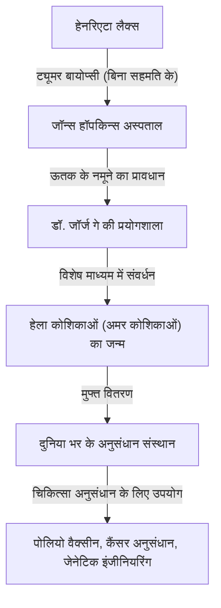
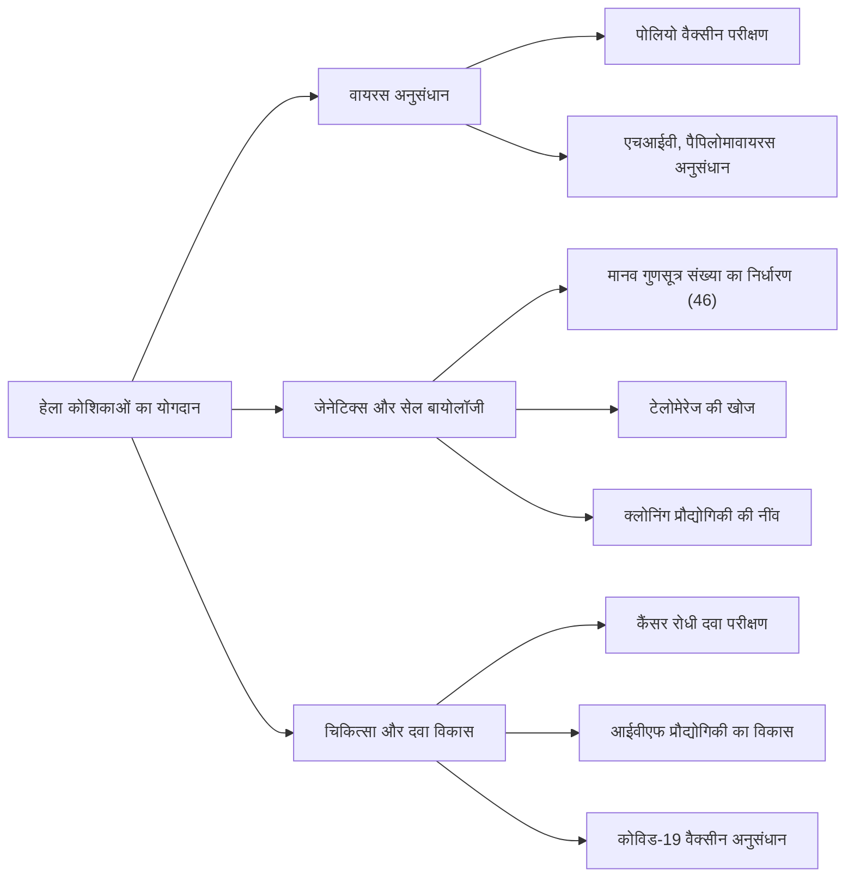

## आधुनिक चिकित्सा की छिपी हुई नायिका: हेनरिएटा लैक्स

आज हम जिस चिकित्सा तकनीक का आनंद लेते हैं - पोलियो वैक्सीन का विकास, कैंसर के इलाज में प्रगति, इन विट्रो फर्टिलाइजेशन (आईवीएफ) की सफलता, और यहां तक कि कोविड-19 वैक्सीन का शोध - इनमें से अधिकांश एक अफ्रीकी-अमेरिकी महिला की कोशिकाओं के बिना संभव नहीं था। उनका नाम **हेनरिएटा लैक्स (Henrietta Lacks)** था। उनके शरीर से ली गई कोशिकाओं का नाम "हेला (HeLa) कोशिकाएं" रखा गया और वे मानव इतिहास में पहली "अमर कोशिकाएं" बन गईं जो शरीर के बाहर असीमित रूप से बढ़ती रहीं।

हालांकि, दशकों तक जब उनकी कोशिकाएं दुनिया भर की प्रयोगशालाओं में गुणा होती रहीं और अनगिनत जीवन बचाती रहीं, उनके परिवार को इस तथ्य की कोई जानकारी नहीं थी। इस लेख में, हम हेनरिएटा लैक्स के जीवन, हेला कोशिकाओं द्वारा लाई गई वैज्ञानिक सफलताओं, और उनकी कहानी द्वारा शुरू की गई जैव नैतिकता (सूचित सहमति और आनुवंशिक गोपनीयता) पर गहरी चर्चाओं के बारे में विस्तार से जानेंगे।

---

## हेनरिएटा लैक्स की परवरिश: तंबाकू के खेतों से बाल्टीमोर तक

हेनरिएटा लैक्स (जन्म के समय लोररेटा प्लेजेंट) का जन्म 1 अगस्त, 1920 को वर्जीनिया के रोनोक में हुआ था। जब वह 4 साल की थीं, उनकी मां की 10वें बच्चे को जन्म देने के तुरंत बाद मृत्यु हो गई, और क्योंकि उनके पिता को बच्चों की परवरिश करना मुश्किल लगा, बच्चों को रिश्तेदारों के पास रहने के लिए भेज दिया गया। हेनरिएटा को वर्जीनिया के क्लोवर में उनके दादा, टॉमी लैक्स ने पाला, जहां वह अपने चचेरे भाई डेविड (डे) लैक्स के साथ बड़ी हुईं।

उनके जीवन का आधार तंबाकू के खेत पर श्रम था। गुलामी के युग से चले आ रहे तंबाकू के खेतों में, वे कम उम्र से ही सूर्योदय से सूर्यास्त तक कठिन श्रम करते थे। हेनरिएटा के स्कूल जाने के अवसर सीमित थे, और उन्हें छठी कक्षा में अपनी शिक्षा समाप्त करनी पड़ी।

1941 में, हेनरिएटा और डे ने शादी कर ली, और द्वितीय विश्व युद्ध से जुड़े औद्योगिक उछाल के बीच बेहतर जीवन की तलाश में, वे मैरीलैंड के बाल्टीमोर के पास टर्नर स्टेशन चले गए। डे बेथलहम स्टील प्लांट में काम करते थे, जबकि हेनरिएटा अपने पांच बच्चों (लॉरेंस, एल्सी, सन्नी, डेबोरा और जकारिया) की परवरिश करने वाली एक समर्पित मां के रूप में अपना दिन बिताती थीं।

---

## अचानक बीमारी और जॉन्स हॉपकिन्स अस्पताल में इलाज

1951 की शुरुआत में, हेनरिएटा को अपने शरीर में असामान्यताएं महसूस होने लगीं। उसने इसे "गर्भ में एक गांठ" के रूप में वर्णित किया और लगातार असामान्य रक्तस्राव का अनुभव किया। उस समय, बाल्टीमोर में काले रोगियों को स्वीकार करने वाले कुछ बड़े अस्पतालों में से एक **जॉन्स हॉपकिन्स अस्पताल** था। अस्पताल गरीबों को मुफ्त देखभाल प्रदान करता था, लेकिन अलगाव नीतियों (जिम क्रो कानूनों) के कारण, वार्डों को गोरों और अश्वेतों के बीच कड़ाई से अलग किया गया था।

जांच के बाद, हेनरिएटा के गर्भाशय ग्रीवा पर एक घातक ट्यूमर पाया गया, और उन्हें सर्वाइकल कैंसर (बाद में एडेनोकार्सिनोमा के रूप में पहचाना गया) का निदान किया गया। उनके उपस्थित चिकित्सक, डॉ. हॉवर्ड जोन्स ने रेडियम विकिरण चिकित्सा के साथ आगे बढ़ने का फैसला किया, जो उस समय का मानक उपचार था।

हालांकि, इस उपचार के दौरान, आधुनिक नैतिक मानकों के दृष्टिकोण से एक बड़ी घटना हुई। जबकि हेनरिएटा एनेस्थीसिया के तहत बेहोश थी, उपस्थित सर्जन ने **उसकी सहमति या ज्ञान के बिना**, उसके ट्यूमर के ऊतकों और उसके ठीक बगल के स्वस्थ ऊतकों दोनों से नमूने लिए।

उस समय, अनुसंधान के लिए सर्जरी के दौरान रोगियों से ऊतक के नमूने लेना डॉक्टरों के बीच एक आम बात थी, और सहमति (सूचित सहमति) प्राप्त करने की अवधारणा कानूनी रूप से स्थापित नहीं थी।

---

## जॉर्ज गे और "अमर कोशिकाओं" का जन्म

एकत्र किए गए ऊतक के नमूनों को जॉन्स हॉपकिन्स विश्वविद्यालय में ऊतक संवर्धन प्रयोगशाला के प्रमुख **डॉ. जॉर्ज गे (George Gey)** के पास भेजा गया था। डॉ. गे और उनकी पत्नी मार्गरेट कई वर्षों से "मानव कोशिकाओं को शरीर के बाहर (इन विट्रो में) अनिश्चित काल तक निरंतर संवर्धित करने की विधि" खोज रहे थे। उस समय, शरीर के बाहर ली गई मानव कोशिकाएं आमतौर पर कुछ दिनों से हफ्तों में मर जाती थीं।

डॉ. गे की प्रयोगशाला में सहायक, मैरी कुबिसेक ने हेनरिएटा की कोशिकाओं को एक कल्चर माध्यम (चिकन प्लाज्मा, गोजातीय भ्रूण अर्क, आदि का एक विशेष मिश्रण) में रखा। फिर, कुछ आश्चर्यजनक हुआ।

जबकि अन्य कोशिकाएं जल्दी मर गईं, हेनरिएटा की कोशिकाएं मरने के बजाय हर 24 घंटे में दोगुनी होती रहीं। ये कोशिकाएं असामान्य दर से गुणा हुईं, जिससे कल्चर फ्लास्क की दीवारें तेजी से ढक गईं। डॉ. गे ने रोगी के पहले और अंतिम नाम के पहले दो अक्षरों को लेकर इस सेल लाइन का नाम **"HeLa (हेला)"** रखा। यह मानव इतिहास में पहली "अमर मानव सेल लाइन" का जन्म था।

हेला कोशिकाओं की खोज जीव विज्ञान और चिकित्सा में एक सच्ची क्रांति थी। तब तक, जीवित मानव कोशिकाओं का उपयोग करके प्रयोग करना बेहद मुश्किल था, लेकिन असीम रूप से गुणा करने वाली, मजबूत और आसानी से संभाले जाने वाली हेला कोशिकाओं के आगमन के साथ, दुनिया भर के शोधकर्ता एक स्थिर वातावरण में मानव कोशिकाओं का उपयोग करके प्रयोग करने में सक्षम हो गए।

---

## वैज्ञानिक प्रगति और हेनरिएटा की मृत्यु

इस बीच, खुद कोशिकाओं की मूल मालकिन हेनरिएटा की स्थिति, रेडियम और एक्स-रे उपचार के बावजूद तेजी से खराब हो गई। कैंसर उनके पूरे शरीर में फैल गया, और उन्हें अवर्णनीय दर्द का सामना करना पड़ा।

4 अक्टूबर, 1951 को, ठीक उसी समय जब हेला कोशिकाएं दुनिया को बदलने वाली थीं, हेनरिएटा लैक्स का 31 वर्ष की कम उम्र में निधन हो गया। उन्हें यह जानने का कोई उपाय नहीं था कि उन्होंने चिकित्सा में कितना योगदान दिया था या कि उनकी कोशिकाएं "अमर" के रूप में जीवित रहेंगी। उनके शरीर को उनके गृहनगर क्लोवर में एक अचिह्नित कब्र में दफनाया गया था।

---

## हेला कोशिकाएं "अमर" क्यों हैं?

हेला कोशिकाओं में इतनी शक्तिशाली प्रसार क्षमता क्यों होती है और वे क्यों नहीं मरती हैं? बाद के दशकों के शोध के दौरान, इसके पीछे के वैज्ञानिक तंत्र को स्पष्ट किया गया है।

1. **टेलोमेरेज की अधिकता**:
   सामान्य मानव कोशिकाओं में, टेलोमेयर नामक गुणसूत्र के अंत का एक हिस्सा हर बार कोशिका के विभाजित होने पर छोटा हो जाता है। जब टेलोमेयर एक निश्चित कमी तक पहुंच जाता है, तो कोशिका विभाजित नहीं हो सकती है, बूढ़ी हो जाती है और मर जाती है (हेफ्लिक सीमा)। हालांकि, हेला कोशिकाएं असामान्य रूप से और सक्रिय रूप से "टेलोमेरेज" नामक एक एंजाइम का उत्पादन करती हैं। क्योंकि यह एंजाइम टेलोमेयर्स की लगातार मरम्मत करता है, कोशिकाएं हमेशा के लिए विभाजित (गुणा) होना जारी रख सकती हैं।

2. **ह्यूमन पैपिलोमावायरस (HPV) का प्रभाव**:
   हेनरिएटा का सर्वाइकल कैंसर ह्यूमन पैपिलोमावायरस (एचपीवी) टाइप 18 नामक अत्यधिक घातक वायरस के संक्रमण के कारण हुआ था। हेनरिएटा की कोशिकाओं के जीनोम में इस वायरस के डीएनए के एकीकृत होने के परिणामस्वरूप, ट्यूमर दमन जीन (जैसे p53 और Rb) का कार्य बाधित हो गया था, जिसका अर्थ है कि कोशिका के प्रसार पर अब कोई ब्रेक नहीं था।

3. **गुणसूत्र संबंधी असामान्यताएं**:
   सामान्य मानव कोशिकाओं में 46 गुणसूत्र होते हैं, लेकिन हेला कोशिकाओं में गंभीर गुणसूत्रीय असामान्यताएं होती हैं, जिनमें 76 से 80 गुणसूत्र होते हैं। यह तीव्र आनुवंशिक उत्परिवर्तन भी उनकी असामान्य प्रसार शक्ति में योगदान देता है।

---

## हेला कोशिकाओं द्वारा लाए गए चिकित्सा सफलताएं

डॉ. गे ने हेला कोशिकाओं का पेटेंट नहीं कराया, बल्कि अनुसंधान उद्देश्यों के लिए उन्हें दुनिया भर के वैज्ञानिकों को मुफ्त में उपलब्ध कराना शुरू किया। अंततः, हेला कोशिकाओं का व्यावसायिक रूप से बड़े पैमाने पर उत्पादन किया जाने लगा और वे आधुनिक जीव विज्ञान के लिए "मानक मॉडल" बन गईं। यह अनुमान लगाया गया है कि आज तक उत्पादित हेला कोशिकाओं का कुल वजन करोड़ों टन तक है।

हेला कोशिकाओं का उपयोग करने वाले शोध परिणाम इतने विविध हैं कि उन्होंने कई नोबेल पुरस्कार उत्पन्न किए हैं।

### 1. पोलियो वैक्सीन का विकास
1950 के दशक में, पोलियोमाइलाइटिस (पोलियो) एक भयानक बीमारी थी जिसने दुनिया भर के बच्चों को खतरे में डाल दिया था। जब डॉ. जोनास साल्क पोलियो वैक्सीन विकसित कर रहे थे, तो उन्हें बड़े पैमाने पर इसकी प्रभावकारिता और सुरक्षा का परीक्षण करने के लिए कोशिकाओं की आवश्यकता थी। हेला कोशिकाएं पोलियोवायरस के प्रति अत्यधिक संवेदनशील थीं और बड़ी मात्रा में संवर्धित की जा सकती थीं, जिससे वे वैक्सीन परीक्षण के लिए एकदम सही सामग्री बन गईं। टस्केगी विश्वविद्यालय में स्थापित एक बड़े हेला सेल कारखाने में उत्पादित कोशिकाओं के साथ, वैक्सीन का व्यावहारिक अनुप्रयोग नाटकीय रूप से तेज हो गया, और दुनिया से पोलियो को सफलतापूर्वक लगभग मिटा दिया गया।

### 2. गुणसूत्र अनुसंधान और जीन मैपिंग
1950 के दशक के मध्य तक, मनुष्य में ठीक कितने गुणसूत्र होते हैं, इसका कोई ठोस प्रमाण नहीं था। जब टेक्सास विश्वविद्यालय के शोधकर्ता हेला कोशिकाओं का उपयोग करके प्रयोग कर रहे थे, तो उन्होंने गलती से कोशिकाओं को हाइपोटोनिक समाधान में भिगो दिया। परिणामस्वरूप, कोशिकाएं सूज गईं और आंतरिक गुणसूत्र बड़े करीने से अलग हो गए, जिससे उनका निरीक्षण करना आसान हो गया। इस तकनीक को लागू करके, यह निर्धारित किया गया था कि मानव गुणसूत्रों की सामान्य संख्या 46 है, जिसके कारण बाद में डाउन सिंड्रोम (ट्राइसॉमी 21) जैसे आनुवंशिक विकारों की खोज हुई।

### 3. वायरोलॉजी और कैंसर अनुसंधान
हेला कोशिकाओं का उपयोग एचआईवी (एड्स वायरस), हरपीज, जीका वायरस, तपेदिक और साल्मोनेला सहित विभिन्न रोगजनकों के शोध में किया गया है। कोशिकाएं कैंसरग्रस्त कैसे हो जाती हैं और कैंसर रोधी दवाएं कोशिकाओं को कैसे प्रभावित करती हैं, इसकी जांच करने के लिए मॉडल कोशिकाओं के रूप में उन्हें भी अत्यधिक महत्व दिया गया है।

### 4. अंतरिक्ष की यात्रा
सोवियत उपग्रह पर सवार होकर हेला कोशिकाएं इंसानों से पहले अंतरिक्ष में गईं। उन्होंने मानव कोशिकाओं पर शून्य गुरुत्वाकर्षण और ब्रह्मांडीय विकिरण के प्रभावों की जांच करने के लिए परीक्षण विषयों के रूप में कार्य किया। आश्चर्यजनक रूप से, यह पुष्टि की गई कि हेला कोशिकाएं पृथ्वी की तुलना में अंतरिक्ष में भी तेजी से गुणा करती हैं।

---

## अनजान परिवार और नैतिक विवाद

जबकि हेला कोशिकाओं ने दुनिया भर में खरबों डॉलर का उद्योग उत्पन्न किया, वैज्ञानिक पत्रिकाओं के कवर की शोभा बढ़ाई, और चिकित्सा पाठ्यपुस्तकों में शामिल हुईं, हेनरिएटा का परिवार (लैक्स परिवार) बाल्टीमोर में एक गरीब मजदूर वर्ग के पड़ोस में रहता था, जो स्वास्थ्य बीमा का जोखिम भी नहीं उठा सकता था।

यह 1973 तक नहीं था, हेनरिएटा की मृत्यु के 20 साल से अधिक समय बाद, कि लैक्स परिवार को पहली बार हेला कोशिकाओं के अस्तित्व के बारे में पता चला। उस समय, हेला कोशिकाओं की शक्तिशाली प्रसार क्षमता उल्टी पड़ गई, जिससे "हेला संदूषण की समस्याएं" पैदा हुईं, जहां हेला कोशिकाओं ने दुनिया भर में अन्य कोशिका संस्कृतियों (सामान्य कोशिकाओं सहित) को दूषित कर दिया, जिससे प्रयोगात्मक परिणाम बर्बाद हो गए।

हेला कोशिकाओं के लिए अद्वितीय आनुवंशिक मार्करों की पहचान करने के लिए, वैज्ञानिकों को हेनरिएटा के बच्चों के रक्त के नमूनों की आवश्यकता थी। परिवार, अचानक शोधकर्ताओं द्वारा संपर्क किया गया और बताया गया कि "उनकी माँ की कोशिकाएं अभी भी जीवित हैं", बहुत भ्रम और भय में पड़ गया। पर्याप्त स्पष्टीकरण के बिना रक्त निकाला गया, और परिवार ने गलती से माना कि कैंसर के लिए उनका भी परीक्षण किया जा रहा था।

यहां से, हेला कोशिकाओं के आसपास के गंभीर नैतिक मुद्दे सामने आए।

1. **सूचित सहमति का अभाव**: क्या बिना सहमति के रोगी के ऊतकों को इकट्ठा करने और उपयोग करने की अनुमति है?
2. **लाभ का वितरण**: क्या मूल ऊतक प्रदाताओं या उनके परिवारों को कोशिकाओं से उत्पन्न भारी मुनाफे का कोई अधिकार नहीं है? (1990 में मूर बनाम कैलिफोर्निया विश्वविद्यालय के रीजेंट्स के फैसले ने स्थापित किया कि रोगियों को अपनी निकाली गई कोशिकाओं के संपत्ति अधिकार नहीं हैं।)
3. **गोपनीयता पर आक्रमण**: 2013 में, एक यूरोपीय शोध दल ने हेला कोशिकाओं के पूरे जीनोम को अनुक्रमित किया और इसे इंटरनेट पर एक सार्वजनिक डेटाबेस पर प्रकाशित किया। क्योंकि हेला कोशिकाओं का डीएनए अनुक्रम हेनरिएटा के बच्चों और पोते-पोतियों के साथ दृढ़ता से साझा किया जाता है, यह परिवार की आनुवंशिक जानकारी (जैसे भविष्य के रोग जोखिम) को अनुमति के बिना पूरी दुनिया में प्रकाशित करने का एक कार्य था।

यह 2013 की घटना जैव नैतिकता में एक प्रमुख महत्वपूर्ण मोड़ बन गई। लैक्स परिवार ने बिना सहमति के अपनी आनुवंशिक जानकारी के प्रकाशन का कड़ा विरोध किया। राष्ट्रीय स्वास्थ्य संस्थान (एनआईएच) ने मामले को गंभीरता से लिया, प्रकाशित जीनोमिक डेटा को अस्थायी रूप से हटा दिया, और लैक्स परिवार के प्रतिनिधियों के साथ परामर्श किया।

परिणामस्वरूप, हेला कोशिकाओं के जीनोमिक डेटा को एक प्रतिबंधित-पहुंच डेटाबेस में स्थानांतरित कर दिया गया था, और शोधकर्ताओं को डेटा का उपयोग करने के लिए लैक्स परिवार के दो सदस्यों सहित समीक्षा बोर्ड से अनुमोदन प्राप्त करने की आवश्यकता है। यह एक ऐतिहासिक समझौता बन गया जिसने पिछले अन्याय को संबोधित किया और अनुसंधान में परिवारों की भागीदारी को मान्यता दी।

---

## "अमर कोशिकाओं" की सच्ची विरासत

हेनरिएटा लैक्स की कहानी केवल वैज्ञानिक सफलता की कहानी नहीं है। यह हमें इस भारी ऐतिहासिक तथ्य का सामना कराता है कि चिकित्सा प्रगति कभी-कभी सामाजिक रूप से कमजोर लोगों के बलिदान पर बनी है।

2010 में, पत्रकार रेबेका स्क्लूट द्वारा प्रकाशित नॉन-फिक्शन पुस्तक "द इम्मोर्टल लाइफ ऑफ हेनरिएटा लैक्स", एक वैश्विक बेस्टसेलर बन गई, और उनकी कहानी दुनिया भर में व्यापक रूप से जानी जाने लगी। इस पुस्तक से प्रेरित होकर, हेनरिएटा के गृहनगर में एक स्मारक बनाया गया, उनके नाम पर एक क्षुद्रग्रह का नाम रखा गया, और उन्हें कई विश्वविद्यालयों से मानद उपाधियां प्रदान की गईं।

इसके अलावा, 2023 में, जैव प्रौद्योगिकी कंपनी थर्मो फिशर साइंटिफिक के खिलाफ लैक्स परिवार द्वारा दायर एक मुकदमे (यह आरोप लगाते हुए कि कंपनी ने बिना सहमति के एकत्र की गई हेला कोशिकाओं के उपयोग से अन्यायपूर्ण रूप से लाभ कमाया) में एक समझौता हुआ। हालांकि समझौते का विवरण गोपनीय है, इसे एक ऐतिहासिक घटना माना जाता है जहां सहमति के बिना एकत्र किए गए जैविक ऊतक के व्यावसायिक उपयोग के लिए शोक संतप्त परिवार को मुआवजा प्रदान किया गया था।

---

## निष्कर्ष

हेनरिएटा लैक्स, अपने स्वयं के इरादों की परवाह किए बिना, लेकिन निस्संदेह, आधुनिक चिकित्सा में सबसे महत्वपूर्ण योगदानकर्ताओं में से एक बन गईं। उनकी कोशिकाएं इसी क्षण दुनिया भर की प्रयोगशालाओं में विभाजित होती रहती हैं, जो मानवता को बीमारी से बचाने के लिए खुद को अनुसंधान के लिए समर्पित करती हैं।

जब हम नवीनतम चिकित्सा देखभाल के लाभ प्राप्त करते हैं, तो हमें यह नहीं भूलना चाहिए कि एक अफ्रीकी-अमेरिकी महिला का जीवन इसके भीतर जीवित है। हेला कोशिकाओं की कहानी हमें हमेशा वैज्ञानिक अन्वेषण की महानता और उसके साथ आने वाली नैतिक जिम्मेदारियों दोनों के बारे में सिखाती रहती है।
