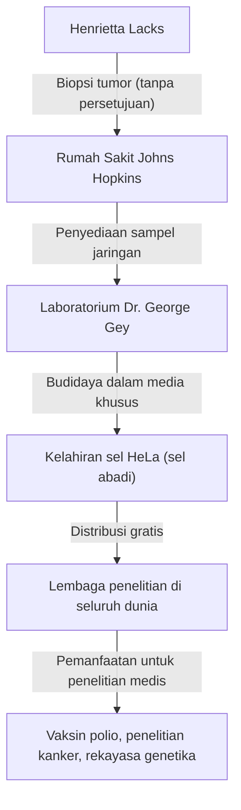
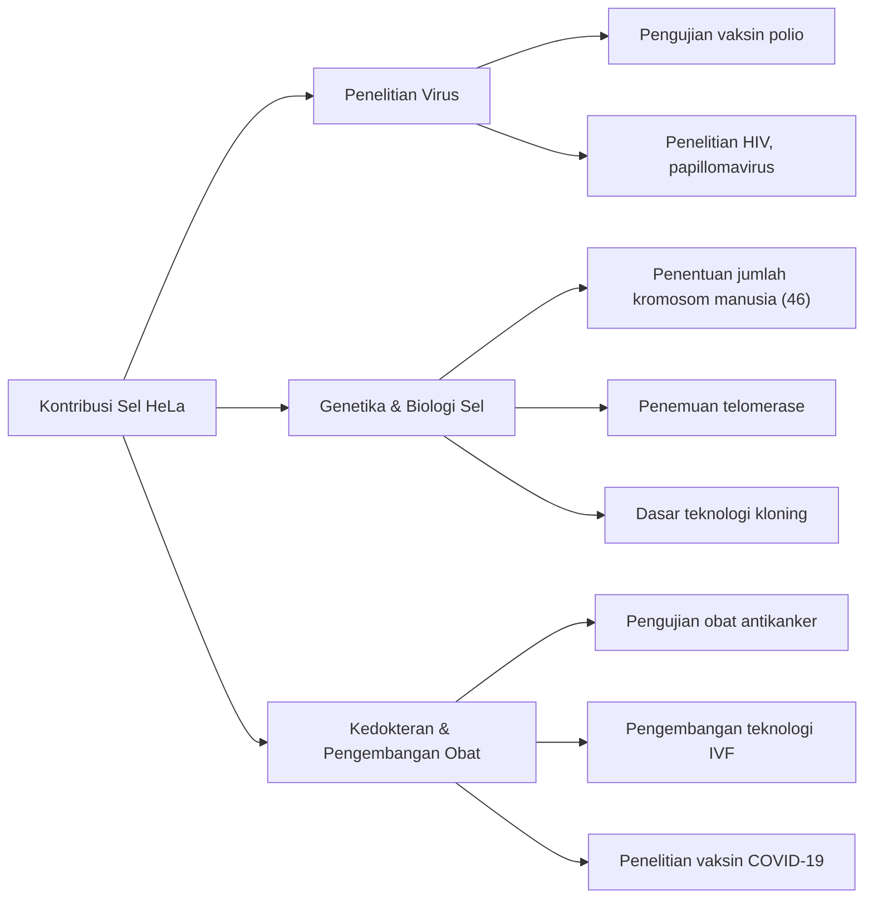

## Henrietta Lacks: Pahlawan Tanpa Tanda Jasa dalam Kedokteran Modern

Sebagian besar teknologi medis yang kita nikmati saat ini—pengembangan vaksin polio, kemajuan dalam pengobatan kanker, keberhasilan fertilisasi in vitro, dan bahkan penelitian vaksin COVID-19—tidak dapat dibahas tanpa sel seorang wanita Afrika-Amerika. Namanya adalah **Henrietta Lacks**. Sel yang diambil dari tubuhnya diberi nama "sel HeLa" dan menjadi "sel abadi" pertama dalam sejarah manusia yang terus berkembang biak tanpa batas di luar tubuh.

Namun, selama puluhan tahun ketika sel-selnya berkembang biak di laboratorium di seluruh dunia dan menyelamatkan tak terhitung banyaknya nyawa, keluarganya sama sekali tidak menyadari fakta ini. Dalam artikel ini, kita akan menggali lebih dalam kehidupan Henrietta Lacks, terobosan ilmiah yang dibawa oleh sel HeLa, dan diskusi mendalam tentang bioetika (persetujuan berdasarkan informasi dan privasi genetik) yang dipicu oleh kisahnya.

---

## Masa Kecil Henrietta Lacks: Dari Ladang Tembakau ke Baltimore

Henrietta Lacks (lahir dengan nama Loretta Pleasant) lahir pada tanggal 1 Agustus 1920, di Roanoke, Virginia. Ketika dia berusia 4 tahun, ibunya meninggal tak lama setelah melahirkan anak ke-10, dan karena ayahnya merasa kesulitan membesarkan anak-anaknya, mereka dikirim untuk tinggal bersama kerabat. Henrietta diasuh oleh kakeknya, Tommy Lacks, di Clover, Virginia, di mana dia tumbuh besar bersama sepupunya David (Day) Lacks.

Fondasi kehidupan mereka adalah bekerja di perkebunan tembakau. Di ladang tembakau yang telah ada sejak zaman perbudakan, mereka terlibat dalam kerja keras dari matahari terbit hingga terbenam sejak usia muda. Kesempatan Henrietta untuk bersekolah sangat terbatas, dan dia harus mengakhiri pendidikannya di kelas 6.

Pada tahun 1941, Henrietta dan Day menikah dan, demi mencari kehidupan yang lebih baik di tengah ledakan industri yang terkait dengan Perang Dunia II, pindah ke Turner Station dekat Baltimore, Maryland. Day bekerja di pabrik Bethlehem Steel, sementara Henrietta menghabiskan hari-harinya sebagai ibu yang mengabdi untuk membesarkan kelima anak mereka (Lawrence, Elsie, Sonny, Deborah, dan Zakariyya).

---

## Penyakit Mendadak dan Perawatan di Rumah Sakit Johns Hopkins

Pada awal tahun 1951, Henrietta mulai merasakan keanehan pada tubuhnya. Dia menggambarkannya sebagai "simpul di rahimnya" dan mengalami pendarahan abnormal yang terus-menerus. Pada saat itu, salah satu dari sedikit rumah sakit besar di Baltimore yang menerima pasien kulit hitam adalah **Rumah Sakit Johns Hopkins**. Rumah sakit tersebut memberikan perawatan gratis kepada orang miskin, namun karena kebijakan segregasi (hukum Jim Crow), bangsal dipisahkan secara ketat antara orang kulit putih dan kulit hitam.

Setelah diperiksa, sebuah tumor ganas ditemukan di leher rahim Henrietta, dan dia didiagnosis menderita kanker serviks (kemudian diidentifikasi sebagai adenokarsinoma). Dokter yang merawatnya, Dr. Howard Jones, memutuskan untuk melanjutkan dengan terapi radiasi radium, yang merupakan pengobatan standar pada saat itu.

Namun, selama perawatan ini, sebuah peristiwa besar dari perspektif standar etika modern terjadi. Sementara Henrietta tidak sadar di bawah pengaruh anestesi, dokter bedah yang merawatnya mengambil sampel baik dari jaringan tumornya maupun jaringan sehat yang tepat berada di sebelahnya, **tanpa persetujuan atau pengetahuannya**.

Pada saat itu, mengumpulkan sampel jaringan dari pasien selama operasi untuk penelitian adalah praktik umum di kalangan dokter, dan konsep mendapatkan persetujuan (informed consent) itu sendiri belum ditetapkan secara hukum.

---

## George Gey dan Kelahiran "Sel Abadi"

Sampel jaringan yang dikumpulkan dikirim ke **Dr. George Gey**, kepala laboratorium kultur jaringan di Universitas Johns Hopkins. Dr. Gey dan istrinya Margaret telah bertahun-tahun mencari "metode untuk membiakkan sel manusia secara terus-menerus tanpa batas waktu di luar tubuh (in vitro)." Pada saat itu, sel manusia yang diambil di luar tubuh biasanya mati dalam beberapa hari hingga beberapa minggu.

Mary Kubicek, asisten di laboratorium Dr. Gey, menempatkan sel Henrietta dalam media kultur (campuran khusus plasma ayam, ekstrak janin sapi, dll.). Kemudian, hal yang menakjubkan terjadi.

Sementara sel-sel lain dengan cepat mati, sel Henrietta, alih-alih mati, terus berlipat ganda setiap 24 jam. Sel-sel ini berkembang biak pada tingkat yang tidak normal, dengan cepat menutupi dinding labu kultur. Dr. Gey menamai galur sel ini **"HeLa"** dengan mengambil dua huruf pertama dari nama depan dan belakang pasien. Ini adalah kelahiran "galur sel manusia abadi" pertama dalam sejarah manusia.

Penemuan sel HeLa benar-benar merupakan revolusi dalam biologi dan kedokteran. Hingga saat itu, eksperimen menggunakan sel manusia hidup sangatlah sulit, tetapi dengan munculnya sel HeLa yang berkembang biak tanpa batas, kuat, dan mudah ditangani, para peneliti di seluruh dunia mampu melakukan eksperimen menggunakan sel manusia dalam lingkungan yang stabil.

---

## Kemajuan Ilmiah dan Kematian Henrietta

Sementara itu, kondisi Henrietta sendiri, pemilik asli sel tersebut, dengan cepat memburuk meskipun telah menjalani perawatan radium dan sinar-X. Kanker bermetastasis ke seluruh tubuhnya, dan dia menderita rasa sakit yang tak terlukiskan.

Pada 4 Oktober 1951, tepat saat sel HeLa akan mengubah dunia, Henrietta Lacks meninggal dunia pada usia muda, 31 tahun. Dia tidak mungkin tahu seberapa banyak kontribusinya pada dunia kedokteran atau bahwa sel-selnya akan terus hidup sebagai "abadi". Jenazahnya dimakamkan di makam tak bertanda di kampung halamannya di Clover.

---

## Mengapa Sel HeLa "Abadi"?

Mengapa sel HeLa memiliki kemampuan proliferasi yang begitu kuat dan tidak mati? Selama beberapa dekade penelitian berikutnya, mekanisme ilmiah di balik ini telah dijelaskan.

1. **Ekspresi Berlebih Telomerase**:
   Pada sel manusia normal, bagian di ujung kromosom yang disebut "telomer" memendek setiap kali sel membelah. Ketika telomer mencapai batas pendek tertentu, sel tidak dapat lagi membelah, menua, dan mati (batas Hayflick). Namun, sel HeLa secara tidak normal dan aktif memproduksi enzim yang disebut "telomerase". Karena enzim ini terus memperbaiki telomer, sel dapat terus membelah (berkembang biak) selamanya.

2. **Pengaruh Human Papillomavirus (HPV)**:
   Kanker serviks Henrietta disebabkan oleh infeksi virus yang sangat ganas yang disebut Human Papillomavirus (HPV) tipe 18. Sebagai akibat dari DNA virus ini yang terintegrasi ke dalam genom sel Henrietta, fungsi gen penekan tumor (seperti p53 dan Rb) terhambat, yang berarti tidak ada lagi rem pada proliferasi sel.

3. **Kelainan Kromosom**:
   Sel manusia normal memiliki 46 kromosom, tetapi sel HeLa memiliki kelainan kromosom yang parah, memiliki antara 76 dan 80 kromosom. Mutasi genetik yang intens ini juga berkontribusi pada kekuatan proliferasinya yang tidak normal.

---

## Terobosan Medis yang Dibawa oleh Sel HeLa

Dr. Gey tidak mematenkan sel HeLa tetapi mulai menyediakannya secara gratis kepada para ilmuwan di seluruh dunia untuk tujuan penelitian. Akhirnya, sel HeLa mulai diproduksi massal secara komersial dan menjadi "model standar" untuk biologi modern. Diperkirakan total berat sel HeLa yang diproduksi hingga saat ini berjumlah puluhan juta ton.

Hasil penelitian menggunakan sel HeLa sangat beragam sehingga telah menghasilkan beberapa Hadiah Nobel.

### 1. Pengembangan Vaksin Polio
Pada tahun 1950-an, kelumpuhan anak (polio) adalah penyakit mengerikan yang mengancam anak-anak di seluruh dunia. Ketika Dr. Jonas Salk mengembangkan vaksin polio, dia membutuhkan sel untuk menguji kemanjuran dan keamanannya dalam skala besar. Sel HeLa sangat rentan terhadap virus polio dan dapat dibiakkan dalam jumlah besar, menjadikannya bahan yang sempurna untuk pengujian vaksin. Dengan sel yang diproduksi di pabrik sel HeLa besar yang didirikan di Universitas Tuskegee, penerapan praktis vaksin tersebut semakin cepat, dan polio hampir berhasil diberantas dari dunia.

### 2. Penelitian Kromosom dan Pemetaan Genetik
Hingga pertengahan 1950-an, belum ada bukti kuat mengenai berapa tepatnya kromosom yang dimiliki manusia. Sementara para peneliti di Universitas Texas sedang melakukan eksperimen menggunakan sel HeLa, mereka secara tidak sengaja merendam sel dalam larutan hipotonik. Akibatnya, sel membengkak, dan kromosom internal terpisah dengan rapi, membuatnya lebih mudah diamati. Dengan menerapkan teknik ini, ditentukan bahwa jumlah normal kromosom manusia adalah 46, yang kemudian mengarah pada penemuan kelainan genetik seperti sindrom Down (trisomi 21).

### 3. Virologi dan Penelitian Kanker
Sel HeLa telah digunakan dalam penelitian berbagai patogen, termasuk HIV (virus AIDS), herpes, virus Zika, tuberkulosis, dan Salmonella. Sel ini juga sangat dihargai sebagai sel model untuk menyelidiki bagaimana sel menjadi kanker dan bagaimana obat antikanker memengaruhi sel.

### 4. Perjalanan ke Luar Angkasa
Sel HeLa melakukan perjalanan ke luar angkasa sebelum manusia, di atas satelit Soviet. Mereka berfungsi sebagai subjek uji untuk menyelidiki efek gravitasi nol dan radiasi kosmik pada sel manusia. Secara mencengangkan, dipastikan bahwa sel HeLa berkembang biak lebih cepat di luar angkasa daripada di Bumi.

---

## Keluarga yang Kurang Informasi dan Kontroversi Etis

Sementara sel HeLa menghasilkan industri bernilai triliunan dolar di seluruh dunia, menghiasi sampul jurnal ilmiah, dan ditampilkan dalam buku teks kedokteran, keluarga Henrietta (keluarga Lacks) tinggal di lingkungan kelas pekerja miskin di Baltimore, bahkan tidak mampu membayar asuransi kesehatan.

Baru pada tahun 1973, lebih dari 20 tahun setelah kematian Henrietta, keluarga Lacks pertama kali mengetahui keberadaan sel HeLa. Pada saat itu, kemampuan proliferasi yang kuat dari sel HeLa menjadi bumerang, menyebabkan "masalah kontaminasi HeLa" di mana sel HeLa mengontaminasi kultur sel lain (termasuk sel normal) di seluruh dunia, merusak hasil eksperimen.

Untuk mengidentifikasi penanda genetik yang unik pada sel HeLa, para ilmuwan memerlukan sampel darah dari anak-anak Henrietta. Keluarga tersebut, yang tiba-tiba dihubungi oleh para peneliti dan diberitahu bahwa "sel ibu mereka masih hidup," dilanda kebingungan dan ketakutan yang hebat. Darah diambil tanpa penjelasan yang cukup, dan keluarga secara keliru percaya bahwa mereka juga sedang dites kanker.

Dari sinilah, masalah etika serius seputar sel HeLa muncul ke permukaan.

1. **Kurangnya Informed Consent**: Apakah diizinkan untuk mengambil dan menggunakan jaringan pasien tanpa persetujuan?
2. **Distribusi Keuntungan**: Apakah penyedia jaringan asli atau keluarga mereka tidak memiliki hak atas keuntungan besar yang dihasilkan dari sel tersebut? (Putusan tahun 1990 dalam kasus Moore v. Regents of the University of California menetapkan bahwa pasien tidak memegang hak milik atas sel mereka yang dieksisi.)
3. **Pelanggaran Privasi**: Pada tahun 2013, tim peneliti Eropa mengurutkan seluruh genom sel HeLa dan menerbitkannya di database publik di internet. Karena urutan DNA sel HeLa sangat mirip dengan anak dan cucu Henrietta, ini adalah tindakan memublikasikan informasi genetik keluarga (seperti risiko penyakit di masa depan) ke seluruh dunia tanpa izin.

Acara tahun 2013 ini menjadi titik balik utama dalam bioetika. Keluarga Lacks memprotes keras penerbitan informasi genetik mereka tanpa persetujuan. National Institutes of Health (NIH) menganggap serius masalah ini, menghapus sementara data genomik yang diterbitkan, dan berkonsultasi dengan perwakilan keluarga Lacks.

Akibatnya, data genomik sel HeLa dipindahkan ke database dengan akses terbatas, dan para peneliti sekarang diharuskan mendapatkan persetujuan dari dewan peninjau, yang mencakup dua anggota keluarga Lacks, untuk menggunakan data tersebut. Ini menjadi perjanjian penting yang mengatasi ketidakadilan masa lalu dan mengakui keterlibatan keluarga dalam penelitian.

---

## Warisan Sejati "Sel Abadi"

Kisah Henrietta Lacks bukan sekadar kisah kesuksesan ilmiah. Ini menghadapkan kita dengan fakta sejarah yang berat bahwa kemajuan medis terkadang dibangun di atas pengorbanan orang-orang yang rentan secara sosial.

Pada tahun 2010, buku non-fiksi "The Immortal Life of Henrietta Lacks," yang diterbitkan oleh jurnalis Rebecca Skloot, menjadi buku terlaris global, dan kisahnya menjadi dikenal luas di dunia. Dipicu oleh buku ini, sebuah monumen didirikan di kampung halaman Henrietta, sebuah asteroid dinamai menurut namanya, dan dia dianugerahi gelar kehormatan dari berbagai universitas.

Selain itu, pada tahun 2023, penyelesaian dicapai dalam gugatan yang diajukan oleh keluarga Lacks terhadap perusahaan bioteknologi Thermo Fisher Scientific (dengan tuduhan bahwa perusahaan secara tidak adil mengambil keuntungan dari penggunaan sel HeLa yang dikumpulkan tanpa persetujuan). Meskipun rincian penyelesaian tersebut dirahasiakan, ini dianggap sebagai peristiwa bersejarah di mana kompensasi diberikan kepada keluarga yang berduka atas penggunaan komersial jaringan biologis yang dikumpulkan tanpa persetujuan.

---

## Kesimpulan

Henrietta Lacks menjadi, terlepas dari niatnya sendiri, namun tidak diragukan lagi, salah satu kontributor terpenting bagi pengobatan modern. Sel-selnya terus membelah di laboratorium di seluruh dunia saat ini juga, mendedikasikan diri untuk penelitian untuk menyelamatkan umat manusia dari penyakit.

Saat kita menerima manfaat perawatan medis terbaru, kita tidak boleh lupa bahwa kehidupan seorang wanita Afrika-Amerika tetap hidup di dalamnya. Kisah sel HeLa terus mengajari kita selamanya tentang kehebatan eksplorasi ilmiah dan tanggung jawab etis yang menyertainya.
