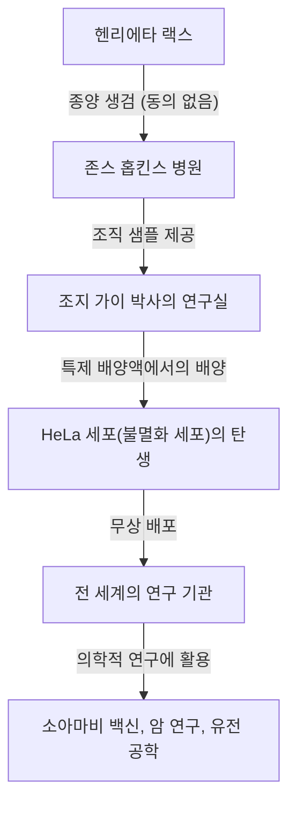
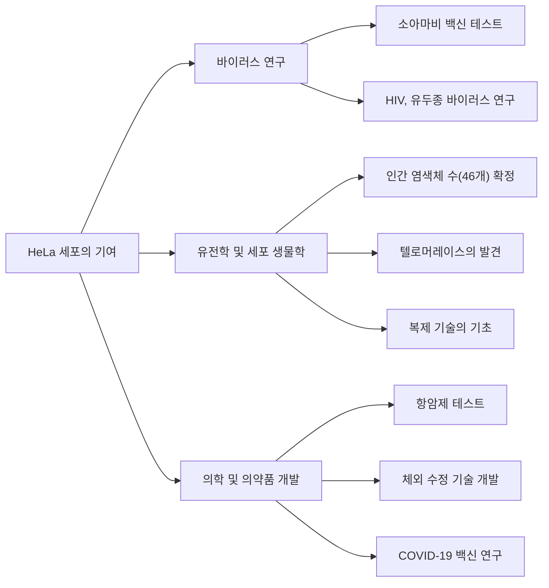

## 현대 의학의 숨은 영웅: 헨리에타 랙스

소아마비 백신의 개발, 암 치료의 발전, 체외 수정의 성공, 심지어 COVID-19 백신 연구에 이르기까지 우리가 오늘날 누리는 의료 기술의 상당 부분은 한 아프리카계 미국인 여성의 세포 없이는 논할 수 없습니다. 그녀의 이름은 **헨리에타 랙스(Henrietta Lacks)**입니다. 그녀의 체내에서 채취된 세포는 "HeLa(헬라) 세포"로 명명되었으며, 체외에서 무한히 증식하는 인류 역사상 최초의 "불멸의 세포"가 되었습니다.

그러나 그녀의 세포가 전 세계의 연구실에서 증식하여 수많은 생명을 구하는 수십 년 동안, 그녀의 가족은 이 사실을 전혀 알지 못했습니다. 본 기사에서는 헨리에타 랙스의 생애, HeLa 세포가 가져온 과학적 돌파구, 그리고 그녀의 이야기가 촉발한 생명윤리(사전 동의 및 유전 정보의 프라이버시)에 관한 심도 있는 논의를 자세히 파헤쳐 보겠습니다.

---

## 헨리에타 랙스의 성장: 담배 밭에서 볼티모어까지

헨리에타 랙스(결혼 전 이름 로레타 플레전트)는 1920년 8월 1일 버지니아주 로어노크에서 태어났습니다. 그녀가 4살 때, 어머니가 10번째 아이를 출산한 직후 세상을 떠났고, 아버지가 아이들을 키우기 어려워져 아이들은 친척들에게 맡겨졌습니다. 헨리에타는 버지니아주 클로버에 사는 할아버지 토미 랙스에게 거두어져 사촌인 데이비드(통칭 데이) 랙스와 함께 자랐습니다.

그들의 생활 기반은 담배 농장에서의 노동이었습니다. 노예제 시대부터 이어진 담배 밭에서, 그들은 어린 시절부터 해가 뜰 때부터 질 때까지 가혹한 노동을 해야 했습니다. 헨리에타는 학교에 다닐 기회도 제한적이어서 초등학교 6학년으로 학업을 마쳐야 했습니다.

1941년 헨리에타와 데이는 결혼했고, 제2차 세계 대전과 관련된 산업 붐 속에서 더 나은 삶을 찾아 메릴랜드주 볼티모어 근처의 터너 스테이션으로 이주했습니다. 데이는 베들레헴 철강 공장에서 일했고, 헨리에타는 5명의 아이들(로런스, 엘시, 소니, 데보라, 자카리야)을 헌신적으로 키우는 어머니로서 나날을 보냈습니다.

---

## 갑작스러운 병과 존스 홉킨스 병원에서의 치료

1951년 초, 헨리에타는 몸에 이상을 느끼기 시작했습니다. 그녀는 "배에 매듭이 있다"고 표현했으며, 비정상적인 출혈도 계속되었습니다. 당시 볼티모어에서 흑인 환자를 받아주는 몇 안 되는 대형 병원 중 하나가 **존스 홉킨스 병원**이었습니다. 이 병원은 빈곤층에게 무료 진료를 제공했지만, 인종 분리 정책(짐 크로우 법)의 영향으로 병동은 백인과 흑인으로 엄격히 나뉘어 있었습니다.

진찰 결과 헨리에타의 자궁경부에 악성 종양이 발견되었고, 자궁경부암(나중에 선암으로 판명됨) 진단을 받았습니다. 주치의인 하워드 존스 박사는 당시의 표준 치료법이었던 라듐을 이용한 방사선 치료를 진행하기로 결정했습니다.

그러나 이 치료 과정에서 현대 윤리 기준에서 볼 때 중대한 사건이 발생합니다. 헨리에타가 마취로 의식을 잃은 사이, 담당 외과의가 그녀의 종양 조직과 그 바로 옆의 건강한 조직 모두에서 **그녀의 동의나 지식 없이** 샘플을 채취한 것입니다.

당시 수술 중 환자로부터 조직 샘플을 채취하여 연구에 사용하는 것은 의사들 사이에서 일반적인 관행이었고, 동의를 얻는다는 개념(사전 동의) 자체도 법적으로 확립되지 않았습니다.

---

## 조지 가이와 "불멸의 세포"의 탄생

채취된 조직 샘플은 존스 홉킨스 대학의 조직 배양 연구실 책임자인 **조지 가이(George Gey) 박사**에게 보내졌습니다. 가이 박사와 그의 아내 마가렛은 수년간 "인간의 세포를 체외(시험관 내)에서 무한히 배양하는 방법"을 모색하고 있었습니다. 당시 체외로 꺼낸 인간 세포는 보통 며칠에서 몇 주 만에 사멸하곤 했습니다.

가이 박사 연구실의 조수인 메리 쿠비섹은 헨리에타의 세포를 배양액(닭의 혈장과 소 태아 추출물 등을 혼합한 특제 배양액)에 넣었습니다. 그러자 놀라운 일이 일어났습니다.

다른 세포들은 금방 사멸하는 반면, 헨리에타의 세포는 죽기는커녕 24시간마다 두 배로 계속 늘어났습니다. 이 세포는 비정상적인 속도로 증식하여 배양 플라스크의 벽면을 순식간에 덮어버렸습니다. 가이 박사는 환자의 성과 이름의 첫 두 글자를 따서 이 세포주를 **"HeLa(헬라)"**라고 명명했습니다. 이것이 인류 역사상 최초의 "불멸의 인간 세포주"의 탄생이었습니다.

HeLa 세포의 발견은 그야말로 생물학 및 의학에 있어서 혁명이었습니다. 그전까지 살아있는 인간 세포를 이용한 실험은 극히 어려웠으나, 무한히 증식하고 튼튼하며 다루기 쉬운 HeLa 세포의 등장으로 전 세계의 연구자들은 안정적인 환경에서 인간 세포를 이용한 실험을 할 수 있게 되었습니다.

---

## 과학의 진보와 헨리에타의 죽음

한편, 세포의 원래 주인이었던 헨리에타 자신의 병세는 라듐 치료와 X선 치료에도 불구하고 급격히 악화되었습니다. 암은 온몸으로 전이되었고, 그녀는 이루 말할 수 없는 고통에 시달렸습니다.

1951년 10월 4일, HeLa 세포가 세상을 바꾸려 하던 바로 그 순간, 헨리에타 랙스는 31세의 젊은 나이로 세상을 떠났습니다. 그녀는 자신이 의학에 얼마나 큰 기여를 했는지, 자신의 세포가 "불멸"이 되어 살아 숨 쉬고 있다는 사실을 알 길이 없었습니다. 그녀의 시신은 고향 클로버의 이름 없는 무덤에 묻혔습니다.

---

## 왜 HeLa 세포는 "불멸"인가?

HeLa 세포는 왜 이렇게 강력한 증식 능력을 가지고 죽지 않는 것일까요? 그 후 수십 년에 걸친 연구를 통해 그 과학적인 메커니즘이 규명되었습니다.

1. **텔로머레이스의 과발현**:
   정상적인 인간 세포는 세포 분열을 반복할 때마다 염색체 끝에 있는 "텔로미어"라는 부분이 짧아집니다. 텔로미어가 일정 길이 이하로 짧아지면 세포는 더 이상 분열하지 못하고 노화되어 죽습니다(헤이플릭 한계). 그러나 HeLa 세포는 "텔로머레이스"라는 효소를 비정상적으로 활발하게 만들어냅니다. 이 효소가 텔로미어를 계속 복구하기 때문에 세포는 영원히 분열(증식)을 계속할 수 있는 것입니다.

2. **인유두종 바이러스(HPV)의 영향**:
   헨리에타의 자궁경부암은 인유두종 바이러스(HPV) 18형이라는 매우 악성도가 높은 바이러스의 감염에 의해 유발되었습니다. 이 바이러스의 DNA가 헨리에타 세포의 게놈에 삽입된 결과, 암 억제 유전자(p53, Rb 등)의 기능이 저해되어 세포 증식에 브레이크가 걸리지 않게 된 것입니다.

3. **염색체 이상**:
   정상적인 인간 세포는 46개의 염색체를 가지지만, HeLa 세포는 심한 염색체 이상을 안고 있어 76~80개의 염색체를 가지고 있습니다. 이 극심한 유전자 돌연변이 또한 비정상적인 증식력의 원인이 됩니다.

---

## HeLa 세포가 가져온 의학적 돌파구

가이 박사는 HeLa 세포의 특허를 취득하지 않고, 연구를 목적으로 하는 전 세계의 과학자들에게 무상으로 제공하기 시작했습니다. 이윽고 HeLa 세포는 상업적으로 대량 생산되기 시작하여 현대 생물학의 "표준 모델"이 되었습니다. 지금까지 생산된 HeLa 세포의 총 중량은 수천만 톤에 이르는 것으로 추정됩니다.

HeLa 세포를 이용한 연구 성과는 노벨상을 여러 번 낳을 정도로 매우 다양합니다.

### 1. 소아마비 백신의 개발
1950년대 소아마비(폴리오)는 전 세계 아이들을 위협하는 공포의 질병이었습니다. 조너스 소크 박사가 소아마비 백신을 개발할 당시, 그 유효성과 안전성을 대규모로 테스트하기 위한 세포가 필요했습니다. HeLa 세포는 소아마비 바이러스에 잘 감염되고 대량으로 배양할 수 있었기 때문에 백신 테스트에 최적의 소재가 되었습니다. 터스키기 대학에 설립된 대규모 HeLa 세포 공장에서 생산된 세포 덕분에 백신의 실용화는 단숨에 가속화되었고, 전 세계에서 소아마비를 거의 근절하는 데 성공했습니다.

### 2. 염색체 연구와 유전자 지도 작성
1950년대 중반까지 인간의 염색체가 정확히 몇 개인지 확증을 얻지 못하고 있었습니다. 텍사스 대학의 연구자가 HeLa 세포를 이용한 실험 중 우연히 세포를 저장액에 담그는 실수를 저질렀습니다. 그러자 세포가 팽창하여 내부의 염색체가 깔끔하게 분리되어 관찰하기 쉬워진 것입니다. 이 기술을 응용하여 인간의 정상 염색체가 46개임을 확정했고, 이후 다운 증후군(21번 염색체 삼체성) 등 유전성 질환의 발견으로 이어졌습니다.

### 3. 바이러스학과 암 연구
HeLa 세포는 HIV(에이즈 바이러스), 헤르페스, 지카 바이러스, 결핵, 살모넬라 등 다양한 병원체의 연구에 이용되었습니다. 또한 세포가 어떻게 암세포로 변하는지, 항암제가 세포에 어떻게 작용하는지 조사하기 위한 모델 세포로도 매우 유용하게 쓰였습니다.

### 4. 우주 공간으로의 여행
HeLa 세포는 소련의 인공위성에 탑재되어 인간보다 먼저 우주 공간으로 날아갔습니다. 무중력 상태나 우주 방사선이 인간 세포에 어떤 영향을 미치는지 조사하기 위한 실험 대상이 된 것입니다. 놀랍게도 HeLa 세포는 우주 공간에서는 지상에서보다 훨씬 더 빠르게 증식하는 것이 확인되었습니다.

---

## 진실을 몰랐던 가족과 윤리적 논쟁

HeLa 세포가 전 세계에서 수조 달러 규모의 산업을 창출하고, 과학 잡지의 표지를 장식하며, 의학 교과서에 실리는 동안, 헨리에타의 가족(랙스 가문)은 볼티모어의 가난한 노동자 계급 동네에서 의료 보험조차 가입하지 못한 채 살아가고 있었습니다.

랙스 가문이 HeLa 세포의 존재를 처음 알게 된 것은 헨리에타의 죽음으로부터 20년 이상이 지난 1973년이 되어서였습니다. 당시 HeLa 세포의 강력한 증식 능력이 화근이 되어, 전 세계의 다른 세포 배양(정상 세포 포함)에 HeLa 세포가 섞여 들어가 실험 결과를 망쳐버리는 "HeLa 오염 문제"가 발생하고 있었습니다.

과학자들은 HeLa 세포 특유의 유전적 마커를 특정하기 위해 헨리에타 아이들의 혈액 샘플이 필요했습니다. 연구자들로부터 갑작스러운 연락을 받은 가족은 "어머니의 세포가 아직 살아 있다"는 말을 듣고 큰 혼란과 두려움에 빠졌습니다. 충분한 설명 없이 채혈이 이루어졌고, 가족들은 "자신들도 암 검사를 받고 있는 것은 아닌가"하고 오해하고 있었습니다.

이때부터 HeLa 세포를 둘러싼 심각한 윤리적 문제가 표면화됩니다.

1. **사전 동의의 부재**: 환자의 조직을 동의 없이 채취하고 사용하는 것이 허용되는가.
2. **이익의 분배**: 세포에서 창출된 막대한 이익에 대해 원조직 제공자나 그 가족은 아무런 권리가 없는가. (1990년 무어 대 캘리포니아 대학 이사회 사건의 판결에 따라 환자는 적출된 자신의 세포에 대한 재산권을 갖지 않는다고 판시되었습니다.)
3. **프라이버시 침해**: 2013년 유럽의 한 연구팀이 HeLa 세포의 전체 게놈 서열을 해독하여 인터넷상의 공개 데이터베이스에 발표했습니다. HeLa 세포의 DNA 서열은 헨리에타의 자녀나 손자들과 강하게 공유되기 때문에, 이는 가족의 유전 정보(미래의 질병 위험 등)를 무단으로 전 세계에 공개하는 행위였습니다.

이 2013년의 사건은 생명윤리에 있어 중대한 전환점이 되었습니다. 랙스 가문은 자신들의 유전 정보가 동의 없이 공개된 것에 강력히 항의했습니다. 미국 국립보건원(NIH)은 사태를 무겁게 받아들여 공개된 게놈 데이터를 일단 삭제하고, 랙스 가문의 대표자와 협의를 진행했습니다.

그 결과, HeLa 세포의 게놈 데이터는 접근이 제한된 데이터베이스로 이관되었으며, 연구자가 데이터를 사용할 때는 랙스 가문의 일원 2명을 포함하는 심사 위원회의 승인을 얻도록 의무화되었습니다. 이는 과거의 불의에 대처하고 연구에 있어 가족의 관여를 인정하는 획기적인 협정이 되었습니다.

---

## "불멸의 세포"가 남긴 진정한 유산

헨리에타 랙스의 이야기는 단순한 과학적 성공담이 아닙니다. 그것은 의학의 진보가 때로는 사회적 약자의 희생 위에 이루어져 왔다는 무거운 역사의 사실을 일깨워줍니다.

2010년 저널리스트 레베카 스클루트가 출간한 논픽션 도서 『불멸의 세포 헨리에타 랙스(The Immortal Life of Henrietta Lacks)』는 세계적인 베스트셀러가 되었고, 그녀의 이야기는 널리 세상에 알려지게 되었습니다. 이 책을 계기로 헨리에타의 고향에는 기념비가 세워졌고, 소행성에 그녀의 이름이 붙여졌으며, 여러 대학에서 그녀에게 명예 학위를 수여했습니다.

나아가 2023년에는 랙스 가문의 유족이 생명공학 기업 서모 피셔 사이언티픽을 상대로 제기한 소송(동의 없이 채취된 HeLa 세포를 이용하여 부당하게 이익을 얻고 있다는 주장)에서 합의가 성립되었습니다. 합의의 상세한 내용은 비공개이지만, 이는 동의 없이 채취된 생체 조직의 상업적 이용에 대해 유족에게 보상이 이루어진 역사적인 사건으로 평가받고 있습니다.

---

## 맺음말

헨리에타 랙스는 자신의 의도와 무관하게, 그러나 의심의 여지 없이 현대 의학에 있어 가장 중요한 공헌자 중 한 명이 되었습니다. 그녀의 세포는 지금 이 순간에도 전 세계의 연구실에서 분열을 계속하며, 인류를 질병으로부터 구원하기 위한 연구에 헌신하고 있습니다.

우리가 최신 의료의 혜택을 받을 때, 거기에는 한 아프리카계 미국인 여성의 생명이 숨 쉬고 있음을 결코 잊어서는 안 됩니다. HeLa 세포의 이야기는 과학적 탐구의 위대함과 그에 수반되는 윤리적 책임 모두를 우리에게 영원히 가르쳐 줄 것입니다.
