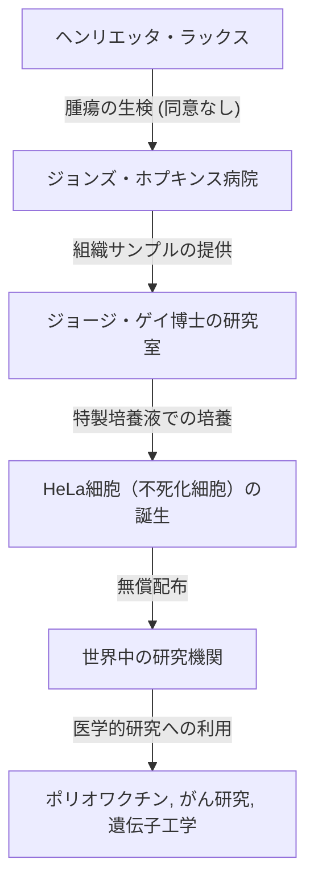
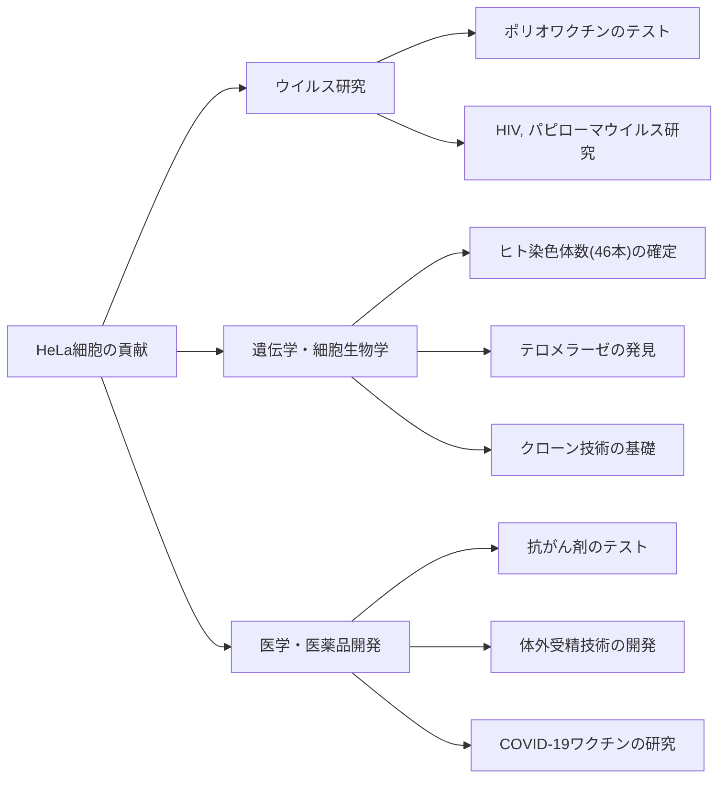

## 現代医学の陰の立役者、ヘンリエッタ・ラックス

私たちが現在享受している医療技術の多く——ポリオワクチンの開発、がん治療の進歩、体外受精の成功、さらにはCOVID-19ワクチンの研究に至るまで——は、ある一人のアフリカ系アメリカ人女性の細胞なしには語ることができません。彼女の名前は**ヘンリエッタ・ラックス（Henrietta Lacks）**。彼女の体内から採取された細胞は「HeLa（ヒーラ）細胞」と名付けられ、人類史上初めて体外で無限に増殖し続ける「不死の細胞」となりました。

しかし、彼女の細胞が世界中の研究室で増殖し、数え切れないほどの命を救っていた数十年間、彼女の家族はその事実を一切知らされていませんでした。本記事では、ヘンリエッタ・ラックスの生涯、HeLa細胞がもたらした科学的ブレイクスルー、そして彼女の物語が引き起こした生命倫理（インフォームド・コンセントや遺伝情報のプライバシー）に関する深い議論について、非常に詳細に深掘りしていきます。

---

## ヘンリエッタ・ラックスの生い立ち：タバコ畑からボルチモアへ

ヘンリエッタ・ラックス（旧姓ロレッタ・プレザント）は、1920年8月1日にバージニア州ロアノークで生まれました。彼女が4歳の時に母親が10番目の子供を出産した直後に亡くなり、父親は子供たちを育てるのが困難になったため、子供たちは親戚に預けられることになりました。ヘンリエッタはバージニア州クローバーに住む祖父のトミー・ラックスに引き取られ、そこで従兄弟のデイビッド（通称デイ）・ラックスと共に育ちました。

彼らの生活の基盤はタバコ農園での労働でした。奴隷制の時代から続くタバコ畑で、彼らは幼い頃から日の出から日の入りまで過酷な労働に従事していました。ヘンリエッタは学校に通う機会も限られ、小学6年生で教育を終えざるを得ませんでした。

1941年、ヘンリエッタとデイは結婚し、第二次世界大戦に伴う産業ブームを背景に、より良い生活を求めてメリーランド州ボルチモア近郊のターナー・ステーションへと移住しました。デイはベスレヘム・スチール社の製鉄所で働き、ヘンリエッタは5人の子供たち（ローレンス、エルシー、ソニー、デボラ、ザカライヤ）を育てる献身的な母親として日々を送っていました。

---

## 突然の病とジョンズ・ホプキンス病院での治療

1951年初頭、ヘンリエッタは体調の異変を感じ始めます。「お腹に結び目がある」と彼女は表現し、不正出血も続いていました。当時、ボルチモアで黒人の患者を受け入れていた数少ない大規模病院の一つが**ジョンズ・ホプキンス病院**でした。同病院は貧困層への無料診療を行っていましたが、人種隔離政策（ジム・クロウ法）の影響により、病棟は白人と黒人で厳格に分けられていました。

診察の結果、ヘンリエッタの子宮頸部に悪性の腫瘍が発見され、子宮頸がん（後に腺がんと判明）と診断されました。主治医のハワード・ジョーンズ医師は、当時の標準的治療であったラジウムによる放射線療法を行うことを決定しました。

しかし、この治療の最中、現代の倫理基準から見れば重大な出来事が発生します。ヘンリエッタが麻酔で意識を失っている間、担当の執刀医が彼女の腫瘍組織と、そのすぐ隣にある健康な組織の両方から、**彼女の同意や知識なしにサンプルを採取**したのです。

当時、手術中に患者から組織サンプルを採取し研究に回すことは、医師の間で一般的な慣行であり、同意を得るという概念（インフォームド・コンセント）自体が法的に確立されていませんでした。

---

## ジョージ・ゲイと「不死の細胞」の誕生

採取された細胞組織は、ジョンズ・ホプキンス大学の組織培養研究室の責任者であった**ジョージ・ゲイ（George Gey）博士**の元に送られました。ゲイ博士と彼の妻マーガレットは、長年にわたり「人間の細胞を体外（試験管内）で無限に培養し続ける方法」を模索していました。当時、体外に取り出された人間の細胞は、数日から数週間で死滅してしまうのが常でした。

ゲイ博士の研究室の助手であったメアリー・キュービックは、ヘンリエッタの細胞を培養液（ニワトリの血漿や牛の胎児の抽出物などを混合した特製の培養液）に入れました。すると、驚くべきことが起きました。

他の細胞がすぐに死滅する中、ヘンリエッタの細胞は死ぬどころか、24時間ごとに倍増し続けたのです。この細胞は異常な速度で増殖し、培養フラスコの壁面をあっという間に覆い尽くしました。ゲイ博士はこの細胞株を、患者の姓名の頭文字2文字ずつを取って<strong>「HeLa（ヒーラ）」</strong>と名付けました。これが、人類史上初となる「不死のヒト細胞株」の誕生でした。

HeLa細胞の発見は、まさに生物学・医学における革命でした。それまで生きたヒトの細胞を使った実験は困難を極めていましたが、無限に増殖し、かつ丈夫で扱いやすいHeLa細胞の登場により、世界中の研究者が安定した環境でヒトの細胞を用いた実験を行えるようになったのです。

---

## 科学の進歩とヘンリエッタの死

一方で、細胞の元の持ち主であるヘンリエッタ自身の病状は、ラジウム治療やX線治療の甲斐なく急速に悪化していきました。がんは体中に転移し、筆舌に尽くしがたい痛みに苦しめられました。

1951年10月4日、HeLa細胞が世界を変えようとしていた正にその時、ヘンリエッタ・ラックスは31歳の若さでこの世を去りました。彼女は自分が医学にどれほどの貢献をしたのか、自分の細胞が「不死」となって生き続けていることなど知る由もありませんでした。彼女の遺体は、故郷クローバーの無銘の墓に埋葬されました。

---

## 何故HeLa細胞は「不死」なのか？

HeLa細胞がなぜこれほどまでに強力な増殖能力を持ち、死なないのか。その後の数十年にわたる研究によって、その科学的なメカニズムが解明されてきました。

1. **テロメラーゼの過剰発現**:
   正常な人間の細胞は、細胞分裂を繰り返すたびに染色体の末端にある「テロメア」という部分が短くなっていきます。テロメアが一定の短さに達すると、細胞はそれ以上分裂できなくなり老化して死を迎えます（ヘイフリック限界）。しかし、HeLa細胞は「テロメラーゼ」という酵素を異常なほど活発に作り出しています。この酵素がテロメアを修復し続けるため、細胞は永遠に分裂（増殖）し続けることができるのです。

2. **ヒトパピローマウイルス（HPV）の影響**:
   ヘンリエッタの子宮頸がんは、ヒトパピローマウイルス（HPV）18型という非常に悪性度の高いウイルスの感染によって引き起こされたものでした。このウイルスのDNAがヘンリエッタの細胞のゲノムに組み込まれた結果、がん抑制遺伝子（p53やRbなど）の働きが阻害され、細胞の増殖にブレーキがかからなくなってしまったのです。

3. **染色体異常**:
   正常なヒトの細胞は46本の染色体を持ちますが、HeLa細胞は著しい染色体異常を抱えており、76〜80本もの染色体を持っています。この激しい遺伝子変異も、異常な増殖力の一因となっています。

---

## HeLa細胞がもたらした医学的ブレイクスルー

ゲイ博士はHeLa細胞の特許を取得することなく、研究を目的とする世界中の科学者に無償で提供し始めました。やがてHeLa細胞は商業的に大量生産されるようになり、現代生物学の「標準モデル」となりました。これまでに生産されたHeLa細胞の総重量は数千万トンにも及ぶと推定されています。

HeLa細胞を用いた研究成果は、ノーベル賞を複数回生み出すほど多岐にわたります。

### 1. ポリオワクチンの開発
1950年代、小児マヒ（ポリオ）は世界中で子供たちを脅かす恐怖の病でした。ジョナス・ソーク博士がポリオワクチンを開発する際、その有効性と安全性を大規模にテストするための細胞が必要でした。HeLa細胞はポリオウイルスによく感染し、かつ大量に培養できたため、ワクチンテストに最適な素材となりました。タスキーギ大学に設立された大規模なHeLa細胞工場で生産された細胞により、ワクチンの実用化は一気に加速し、世界からポリオをほぼ根絶することに成功しました。

### 2. 染色体研究と遺伝子マッピング
1950年代半ばまで、人間の染色体が正確に何本あるのかは確証が得られていませんでした。テキサス大学の研究者がHeLa細胞を用いた実験中に、偶然細胞を低張液に浸すミスを犯しました。すると細胞が膨張し、内部の染色体がきれいに分離して観察しやすくなったのです。この技術を応用して、ヒトの正常な染色体が46本であることが確定し、後のダウン症（21番染色体トリソミー）などの遺伝性疾患の発見へと繋がりました。

### 3. ウイルス学とがん研究
HeLa細胞は、HIV（エイズウイルス）、ヘルペス、ジカ熱、結核、サルモネラ菌など、様々な病原体の研究に用いられました。また、細胞がどのようにがん化するのか、抗がん剤が細胞にどのように作用するのかを調べるためのモデル細胞としても重宝されました。

### 4. 宇宙空間への旅
HeLa細胞は、ソ連の人工衛星に乗って人間より先に宇宙空間に飛び立ちました。無重力状態や宇宙放射線が人間の細胞にどのような影響を与えるかを調べるための実験台となったのです。驚くべきことに、HeLa細胞は宇宙空間では地上よりもさらに速く増殖することが確認されました。

---

## 知らされなかった家族と倫理的論争

HeLa細胞が世界中で数兆ドルの産業を生み出し、科学雑誌の表紙を飾り、医学の教科書に載る一方で、ヘンリエッタの家族（ラックス家）は、ボルチモアの貧しい労働者階級の街で、医療保険にも入れない生活を送っていました。

ラックス家がHeLa細胞の存在を初めて知ったのは、ヘンリエッタの死から20年以上が経過した1973年のことでした。当時、HeLa細胞の強力な増殖力が仇となり、世界中の他の細胞培養（正常細胞を含む）にHeLa細胞が混入し、実験結果を台無しにしてしまうという「HeLa汚染問題」が発生していました。

科学者たちはHeLa細胞特有の遺伝的マーカーを特定するため、ヘンリエッタの子供たちの血液サンプルを必要としました。研究者から突然連絡を受けた家族は、「母親の細胞がまだ生きている」と聞かされ、大きな混乱と恐怖に陥りました。十分な説明がないまま採血が行われ、家族は「自分たちもがんの検査を受けているのではないか」と誤解していました。

ここから、HeLa細胞を取り巻く深刻な倫理的問題が表面化します。

1. **インフォームド・コンセントの欠如**: 患者の組織を同意なく採取・使用することは許されるのか。
2. **利益の分配**: 細胞から生み出された莫大な利益に対し、元の組織の提供者やその家族には何の権利もないのか。（1990年のムーア対カリフォルニア大学理事会事件の判決により、患者は摘出された自分の細胞に対する財産権を持たないとされました）
3. **プライバシーの侵害**: 2013年、欧州の研究チームがHeLa細胞の全ゲノム配列を解読し、インターネット上の公開データベースに発表しました。HeLa細胞のDNA配列はヘンリエッタの子供や孫たちと強く共有されているため、これは家族の遺伝情報（将来の病気のリスクなど）を無断で全世界に公開する行為でした。

この2013年の出来事は、生命倫理における重大な転換点となりました。ラックス家は、自分たちの遺伝情報が同意なく公開されたことに強く抗議しました。米国国立衛生研究所（NIH）は事態を重く見て、公開されたゲノムデータを一旦削除し、ラックス家の代表者と協議を行いました。

その結果、HeLa細胞のゲノムデータはアクセス制限付きのデータベースに移行され、研究者がデータを使用する際は、ラックス家のメンバー2名を含む審査委員会の承認を得ることが義務付けられました。これは、過去の不正義に対処し、研究における家族の関与を認める画期的な協定となりました。

---

## 「不死の細胞」が残した真の遺産

ヘンリエッタ・ラックスの物語は、単なる科学的な成功譚ではありません。それは、医学の進歩が時に社会的に弱い立場にある人々の犠牲の上に成り立ってきたという、重い歴史の事実を突きつけています。

2010年、ジャーナリストのレベッカ・スクルートによって出版されたノンフィクション書籍『The Immortal Life of Henrietta Lacks（邦題：不死細胞ヒーラ ヘンリエッタ・ラックスの永遠なる人生）』は世界的なベストセラーとなり、彼女の物語は広く世に知られるようになりました。この本をきっかけに、ヘンリエッタの故郷には記念碑が建てられ、小惑星に彼女の名前が付けられ、複数の大学から彼女に名誉学位が授与されました。

さらに2023年には、ラックス家の遺族がバイオテクノロジー企業サーモフィッシャー・サイエンティフィックを相手取って起こしていた訴訟（同意なく採取されたHeLa細胞を利用して不当に利益を得ているという主張）において、和解が成立しました。和解の詳細は非公開ですが、これは同意なしに採取された生体組織の商業利用に対して、遺族への補償がなされた歴史的な出来事と評価されています。

---

## 結びにかえて

ヘンリエッタ・ラックスは、自らの意図とは無関係に、しかし疑いなく現代医学における最も重要な貢献者の一人となりました。彼女の細胞は今この瞬間も世界中の研究室で分裂を続け、人類を病から救うための研究に身を捧げています。

私たちが最新の医療の恩恵を受けるとき、そこには一人のアフリカ系アメリカ人女性の命が息づいていることを忘れてはなりません。HeLa細胞の物語は、科学的探求の偉大さと、それに伴う倫理的責任の両方を、私たちに永遠に教え続けてくれるのです。
