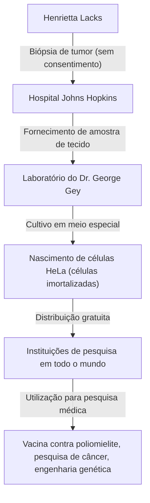
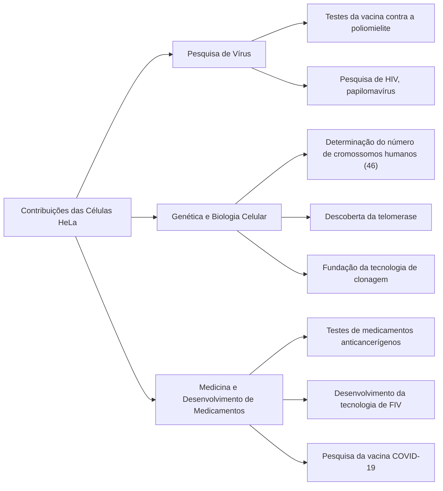

## Henrietta Lacks: A Heroína Anônima da Medicina Moderna

Grande parte da tecnologia médica que desfrutamos hoje — o desenvolvimento da vacina contra a poliomielite, avanços no tratamento do câncer, o sucesso da fertilização in vitro e até mesmo pesquisas para a vacina contra a COVID-19 — não pode ser discutida sem as células de uma mulher afro-americana. Seu nome era **Henrietta Lacks**. As células retiradas de seu corpo foram nomeadas "células HeLa" e tornaram-se as primeiras "células imortais" na história humana a continuar se multiplicando indefinidamente fora do corpo.

No entanto, durante as décadas em que suas células se multiplicaram em laboratórios em todo o mundo e salvaram inúmeras vidas, sua família desconhecia completamente esse fato. Neste artigo, vamos nos aprofundar na vida de Henrietta Lacks, nos avanços científicos proporcionados pelas células HeLa e nas profundas discussões sobre bioética (consentimento informado e privacidade genética) desencadeadas por sua história.

---

## A Criação de Henrietta Lacks: Dos Campos de Tabaco a Baltimore

Henrietta Lacks (nascida Loretta Pleasant) nasceu em 1º de agosto de 1920, em Roanoke, Virgínia. Quando ela tinha 4 anos, sua mãe morreu pouco depois de dar à luz ao 10º filho, e como seu pai achava difícil criar as crianças, elas foram enviadas para viver com parentes. Henrietta foi acolhida por seu avô, Tommy Lacks, em Clover, Virgínia, onde cresceu ao lado de seu primo David (Day) Lacks.

A base de suas vidas era o trabalho em uma plantação de tabaco. Nos campos de tabaco que continuavam desde a era da escravidão, eles se engajavam em trabalhos extenuantes do nascer ao pôr do sol desde tenra idade. As oportunidades de Henrietta frequentar a escola eram limitadas, e ela teve que encerrar sua educação na 6ª série.

Em 1941, Henrietta e Day se casaram e, buscando uma vida melhor em meio ao boom industrial associado à Segunda Guerra Mundial, mudaram-se para Turner Station, perto de Baltimore, Maryland. Day trabalhava na usina siderúrgica da Bethlehem Steel, enquanto Henrietta passava seus dias como uma mãe dedicada criando seus cinco filhos (Lawrence, Elsie, Sonny, Deborah e Zakariyya).

---

## Doença Repentina e Tratamento no Hospital Johns Hopkins

No início de 1951, Henrietta começou a sentir anormalidades em seu corpo. Ela descreveu isso como tendo um "nó no ventre" e experimentou sangramento anormal contínuo. Na época, um dos poucos grandes hospitais em Baltimore que aceitava pacientes negros era o **Hospital Johns Hopkins**. O hospital fornecia atendimento gratuito aos pobres, mas devido a políticas de segregação (leis de Jim Crow), as alas eram estritamente separadas entre brancos e negros.

Após exame, um tumor maligno foi encontrado no colo do útero de Henrietta, e ela foi diagnosticada com câncer cervical (posteriormente identificado como adenocarcinoma). Seu médico assistente, Dr. Howard Jones, decidiu prosseguir com a radioterapia com rádio, que era o tratamento padrão na época.

No entanto, durante esse tratamento, ocorreu um evento importante do ponto de vista dos padrões éticos modernos. Enquanto Henrietta estava inconsciente sob anestesia, o cirurgião assistente coletou amostras tanto de seu tecido tumoral quanto do tecido saudável logo ao lado, **sem seu consentimento ou conhecimento**.

Na época, coletar amostras de tecido de pacientes durante a cirurgia para pesquisa era uma prática comum entre os médicos, e o conceito de obter consentimento (consentimento informado) em si não estava legalmente estabelecido.

---

## George Gey e o Nascimento das "Células Imortais"

As amostras de tecido coletadas foram enviadas ao **Dr. George Gey**, chefe do laboratório de cultura de tecidos da Universidade Johns Hopkins. O Dr. Gey e sua esposa Margaret procuravam há muitos anos por um "método para cultivar continuamente células humanas indefinidamente fora do corpo (in vitro)". Na época, as células humanas retiradas do corpo normalmente morriam em alguns dias a semanas.

Mary Kubicek, uma assistente no laboratório do Dr. Gey, colocou as células de Henrietta em um meio de cultura (uma mistura especial de plasma de galinha, extrato fetal bovino, etc.). Então, algo surpreendente aconteceu.

Enquanto outras células morreram rapidamente, as células de Henrietta, em vez de morrer, continuaram a dobrar a cada 24 horas. Essas células se multiplicaram a uma taxa anormal, cobrindo rapidamente as paredes do frasco de cultura. O Dr. Gey nomeou esta linha de células **"HeLa"** pegando as duas primeiras letras do nome e sobrenome da paciente. Este foi o nascimento da primeira "linha de células humanas imortais" na história da humanidade.

A descoberta das células HeLa foi uma verdadeira revolução na biologia e na medicina. Até então, experimentos usando células humanas vivas tinham sido extremamente difíceis, mas com o advento das células HeLa, robustas, fáceis de manusear e que se multiplicam infinitamente, pesquisadores ao redor do mundo foram capazes de conduzir experimentos usando células humanas em um ambiente estável.

---

## Progresso Científico e a Morte de Henrietta

Enquanto isso, a condição da própria Henrietta, a dona original das células, deteriorou-se rapidamente apesar dos tratamentos com rádio e raios-X. O câncer sofreu metástase por todo o corpo, e ela sofreu de dores indescritíveis.

Em 4 de outubro de 1951, no momento em que as células HeLa estavam prestes a mudar o mundo, Henrietta Lacks faleceu precocemente aos 31 anos. Ela não tinha como saber o quanto havia contribuído para a medicina ou que suas células continuariam a viver como "imortais". Seu corpo foi enterrado em uma cova não identificada em sua cidade natal, Clover.

---

## Por que as Células HeLa são "Imortais"?

Por que as células HeLa possuem capacidades proliferativas tão poderosas e não morrem? Ao longo das décadas seguintes de pesquisa, os mecanismos científicos por trás disso foram elucidados.

1. **Super-expressão da Telomerase**:
   Nas células humanas normais, uma porção na extremidade do cromossomo chamada "telômero" encurta cada vez que a célula se divide. Quando o telômero atinge uma certa brevidade, a célula não pode mais se dividir, envelhece e morre (o limite de Hayflick). No entanto, as células HeLa produzem anormalmente e ativamente uma enzima chamada "telomerase". Como essa enzima repara continuamente os telômeros, as células podem continuar a se dividir (multiplicar) para sempre.

2. **Influência do Papilomavírus Humano (HPV)**:
   O câncer cervical de Henrietta foi causado por uma infecção por um vírus altamente maligno chamado Papilomavírus Humano (HPV) tipo 18. Como resultado do DNA desse vírus se integrando ao genoma das células de Henrietta, a função dos genes supressores de tumor (como p53 e Rb) foi inibida, o que significa que não havia mais freios na proliferação celular.

3. **Anormalidades Cromossômicas**:
   As células humanas normais têm 46 cromossomos, mas as células HeLa apresentam graves anormalidades cromossômicas, possuindo entre 76 e 80 cromossomos. Esta intensa mutação genética também contribui para o seu poder proliferativo anormal.

---

## Avanços Médicos Trazidos pelas Células HeLa

O Dr. Gey não patenteou as células HeLa, mas começou a fornecê-las gratuitamente a cientistas de todo o mundo para fins de pesquisa. Eventualmente, as células HeLa passaram a ser produzidas em massa comercialmente e se tornaram o "modelo padrão" para a biologia moderna. Estima-se que o peso total das células HeLa produzidas até o momento chega a dezenas de milhões de toneladas.

Os resultados das pesquisas usando células HeLa são tão diversos que geraram múltiplos Prêmios Nobel.

### 1. Desenvolvimento da Vacina contra a Poliomielite
Na década de 1950, a paralisia infantil (poliomielite) era uma doença aterrorizante que ameaçava as crianças em todo o mundo. Quando o Dr. Jonas Salk estava desenvolvendo a vacina contra a poliomielite, ele precisava de células para testar sua eficácia e segurança em larga escala. As células HeLa eram altamente suscetíveis ao poliovírus e podiam ser cultivadas em grandes quantidades, tornando-as o material perfeito para testes de vacinas. Com células produzidas em uma grande fábrica de células HeLa estabelecida na Universidade de Tuskegee, a aplicação prática da vacina acelerou dramaticamente, e a poliomielite foi erradicada quase com sucesso em todo o mundo.

### 2. Pesquisa de Cromossomos e Mapeamento Genético
Até meados da década de 1950, não havia provas sólidas de exatamente quantos cromossomos os humanos tinham. Enquanto pesquisadores da Universidade do Texas realizavam experimentos usando células HeLa, eles mergulharam acidentalmente as células em uma solução hipotônica. Como resultado, as células incharam e os cromossomos internos se separaram perfeitamente, tornando-os mais fáceis de observar. Aplicando esta técnica, determinou-se que o número normal de cromossomos humanos é 46, o que mais tarde levou à descoberta de distúrbios genéticos como a síndrome de Down (trissomia 21).

### 3. Virologia e Pesquisa de Câncer
As células HeLa foram usadas na pesquisa de vários patógenos, incluindo HIV (o vírus da AIDS), herpes, vírus Zika, tuberculose e Salmonella. Elas também foram altamente valorizadas como células modelo para investigar como as células se tornam cancerígenas e como os medicamentos anticancerígenos afetam as células.

### 4. Jornada ao Espaço
As células HeLa viajaram para o espaço antes dos humanos, a bordo de um satélite soviético. Elas serviram como cobaias para investigar os efeitos da gravidade zero e da radiação cósmica nas células humanas. Surpreendentemente, confirmou-se que as células HeLa se multiplicam ainda mais rápido no espaço do que na Terra.

---

## A Família Desinformada e Controvérsias Éticas

Enquanto as células HeLa geravam uma indústria multibilionária em todo o mundo, enfeitavam as capas de revistas científicas e eram apresentadas em livros de medicina, a família de Henrietta (a família Lacks) vivia em um bairro pobre da classe trabalhadora em Baltimore, incapaz de sequer pagar um plano de saúde.

Não foi até 1973, mais de 20 anos após a morte de Henrietta, que a família Lacks soube pela primeira vez da existência das células HeLa. Na época, a poderosa capacidade proliferativa das células HeLa saiu pela culatra, causando "problemas de contaminação por HeLa", onde as células HeLa contaminaram outras culturas de células (incluindo células normais) em todo o mundo, arruinando os resultados experimentais.

Para identificar marcadores genéticos exclusivos das células HeLa, os cientistas precisavam de amostras de sangue dos filhos de Henrietta. A família, contatada repentinamente por pesquisadores e avisada de que "as células da sua mãe ainda estão vivas", foi lançada em grande confusão e medo. O sangue foi coletado sem explicação suficiente, e a família acreditou erroneamente que eles também estavam sendo testados para câncer.

A partir daqui, os sérios problemas éticos em torno das células HeLa vieram à tona.

1. **Falta de Consentimento Informado**: É permitido coletar e usar o tecido de um paciente sem consentimento?
2. **Distribuição de Lucros**: Os provedores de tecido originais ou suas famílias não têm direitos sobre os enormes lucros gerados pelas células? (A decisão de 1990 no caso Moore v. Regents of the University of California estabeleceu que os pacientes não têm direitos de propriedade sobre as suas células extirpadas).
3. **Invasão de Privacidade**: Em 2013, uma equipe de pesquisa europeia sequenciou todo o genoma das células HeLa e o publicou em um banco de dados público na internet. Como a sequência de DNA das células HeLa é fortemente compartilhada com os filhos e netos de Henrietta, este foi um ato de publicação da informação genética da família (como riscos futuros de doenças) para todo o mundo sem permissão.

Este evento de 2013 tornou-se um importante ponto de viragem na bioética. A família Lacks protestou veementemente contra a publicação das suas informações genéticas sem consentimento. Os Institutos Nacionais de Saúde (NIH) levaram a questão a sério, removeram temporariamente os dados genômicos publicados e consultaram representantes da família Lacks.

Como resultado, os dados genômicos das células HeLa foram transferidos para um banco de dados de acesso restrito, e os pesquisadores agora precisam obter a aprovação de um conselho de revisão, que inclui dois membros da família Lacks, para usar os dados. Isto tornou-se um acordo histórico que abordou injustiças passadas e reconheceu o envolvimento de famílias em pesquisas.

---

## O Verdadeiro Legado das "Células Imortais"

A história de Henrietta Lacks não é meramente um conto de sucesso científico. Ela confronta-nos com o pesado fato histórico de que o progresso médico foi, por vezes, construído sobre os sacrifícios de pessoas socialmente vulneráveis.

Em 2010, o livro de não-ficção "A Vida Imortal de Henrietta Lacks", publicado pela jornalista Rebecca Skloot, tornou-se um best-seller global, e sua história tornou-se amplamente conhecida em todo o mundo. Estimulado por este livro, um monumento foi erguido na cidade natal de Henrietta, um asteroide recebeu o seu nome e ela recebeu títulos honorários de várias universidades.

Além disso, em 2023, foi alcançado um acordo num processo instaurado pela família Lacks contra a empresa de biotecnologia Thermo Fisher Scientific (alegando que a empresa lucrou injustamente com o uso de células HeLa coletadas sem consentimento). Embora os detalhes do acordo sejam confidenciais, isso é considerado um evento histórico em que uma compensação foi fornecida à família em luto pelo uso comercial de tecido biológico coletado sem consentimento.

---

## Conclusão

Henrietta Lacks tornou-se, independentemente das suas próprias intenções, mas indubitavelmente, uma das contribuidoras mais importantes da medicina moderna. Suas células continuam a se dividir em laboratórios ao redor do mundo neste exato momento, dedicando-se à pesquisa para salvar a humanidade das doenças.

Quando recebemos os benefícios dos cuidados médicos mais recentes, não devemos esquecer que a vida de uma mulher afro-americana continua viva lá dentro. A história das células HeLa continua a ensinar-nos para sempre tanto a grandeza da exploração científica como as responsabilidades éticas que a acompanham.
