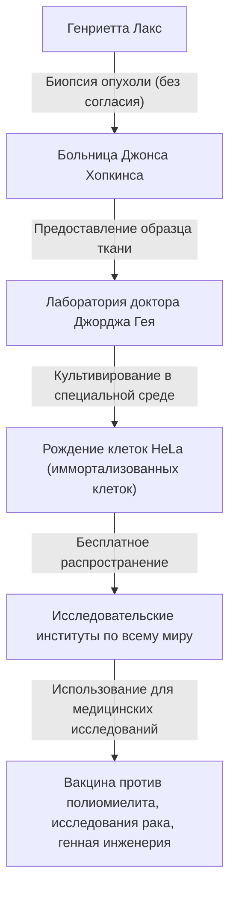
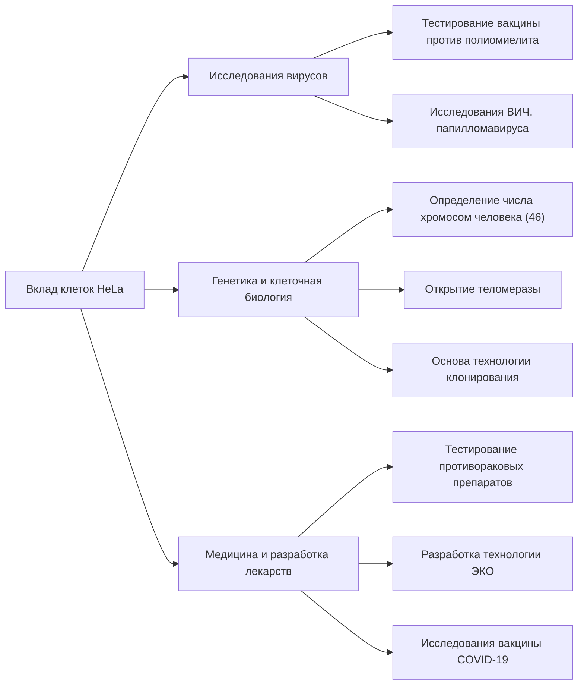

## Генриетта Лакс: невоспетый герой современной медицины

Многие из медицинских технологий, которыми мы пользуемся сегодня — разработка вакцины против полиомиелита, достижения в лечении рака, успех экстракорпорального оплодотворения и даже исследования вакцины против COVID-19 — невозможно обсуждать без упоминания клеток одной афроамериканской женщины. Ее звали **Генриетта Лакс (Henrietta Lacks)**. Клетки, взятые из ее тела, были названы «клетками HeLa» и стали первыми «бессмертными клетками» в истории человечества, которые продолжали бесконечно размножаться вне тела.

Однако в течение десятилетий, пока ее клетки размножались в лабораториях по всему миру и спасали бесчисленное количество жизней, ее семья совершенно ничего не знала об этом факте. В этой статье мы подробно рассмотрим жизнь Генриетты Лакс, научные прорывы, вызванные клетками HeLa, и глубокие дискуссии о биоэтике (информированном согласии и генетической конфиденциальности), спровоцированные ее историей.

---

## Воспитание Генриетты Лакс: от табачных плантаций до Балтимора

Генриетта Лакс (урожденная Лоретта Плезант) родилась 1 августа 1920 года в Роаноке, штат Вирджиния. Когда ей было 4 года, ее мать умерла вскоре после рождения своего 10-го ребенка, и поскольку отцу было трудно растить детей, их отправили жить к родственникам. Генриетту взял к себе ее дедушка, Томми Лакс, в Кловер, штат Вирджиния, где она росла вместе со своим двоюродным братом Дэвидом (Дэем) Лаксом.

Основой их жизни был труд на табачной плантации. На табачных полях, которые существовали еще со времен рабства, они с ранних лет занимались изнурительным трудом от рассвета до заката. Возможности Генриетты посещать школу были ограничены, и ей пришлось закончить образование в 6-м классе.

В 1941 году Генриетта и Дэй поженились и, в поисках лучшей жизни на фоне промышленного бума, связанного со Второй мировой войной, переехали в Тернер-Стейшн недалеко от Балтимора, штат Мэриленд. Дэй работал на сталелитейном заводе Вифлеем, в то время как Генриетта проводила свои дни как преданная мать, воспитывая пятерых детей (Лоуренса, Элси, Сонни, Дебору и Закарию).

---

## Внезапная болезнь и лечение в больнице Джонса Хопкинса

В начале 1951 года Генриетта начала чувствовать аномалии в своем теле. Она описывала это как «узел в матке» и испытывала постоянные аномальные кровотечения. В то время одной из немногих крупных больниц в Балтиморе, которая принимала чернокожих пациентов, была **больница Джонса Хопкинса**. Больница предоставляла бесплатную помощь бедным, но из-за политики сегрегации (законов Джима Кроу) палаты были строго разделены для белых и чернокожих.

После обследования на шейке матки Генриетты была обнаружена злокачественная опухоль, и ей поставили диагноз: рак шейки матки (позже идентифицированный как аденокарцинома). Ее лечащий врач, доктор Говард Джонс, решил продолжить лучевую терапию радием, которая в то время была стандартным методом лечения.

Однако во время этого лечения произошло важное событие с точки зрения современных этических стандартов. В то время как Генриетта находилась без сознания под наркозом, оперирующий хирург взял образцы как ее опухолевой ткани, так и здоровой ткани, находящейся рядом с ней, **без ее согласия или ведома**.

В то время взятие образцов тканей у пациентов во время операции для исследований было обычной практикой среди врачей, а концепция получения согласия (информированного согласия) сама по себе не была законодательно закреплена.

---

## Джордж Гей и рождение «бессмертных клеток»

Собранные образцы тканей были отправлены **доктору Джорджу Гею (George Gey)**, руководителю лаборатории культуры тканей в Университете Джонса Хопкинса. Доктор Гей и его жена Маргарет в течение многих лет искали «метод непрерывного бесконечного культивирования человеческих клеток вне тела (in vitro)». В то время человеческие клетки, взятые из тела, обычно погибали в течение нескольких дней или недель.

Мэри Кубичек, ассистентка в лаборатории доктора Гея, поместила клетки Генриетты в питательную среду (специальную смесь из куриной плазмы, экстракта коровьего плода и т.д.). И тут произошло нечто удивительное.

В то время как другие клетки быстро погибли, клетки Генриетты вместо того, чтобы умереть, продолжали удваиваться каждые 24 часа. Эти клетки размножались с аномальной скоростью, быстро покрывая стенки культуральной колбы. Доктор Гей назвал эту клеточную линию **«HeLa»**, взяв первые две буквы имени и фамилии пациентки. Это было рождение первой «бессмертной линии человеческих клеток» в истории человечества.

Открытие клеток HeLa стало настоящей революцией в биологии и медицине. До этого времени эксперименты с использованием живых человеческих клеток были крайне сложными, но с появлением бесконечно размножающихся, надежных и простых в обращении клеток HeLa исследователи по всему миру получили возможность проводить эксперименты с использованием человеческих клеток в стабильной среде.

---

## Научный прогресс и смерть Генриетты

Тем временем состояние самой Генриетты, первоначальной владелицы клеток, стремительно ухудшалось, несмотря на лечение радием и рентгеновским излучением. Рак дал метастазы по всему ее телу, и она страдала от неописуемой боли.

4 октября 1951 года, как раз в тот момент, когда клетки HeLa собирались изменить мир, Генриетта Лакс скончалась в молодом возрасте 31 года. Она никак не могла знать, какой вклад она внесла в медицину, или что ее клетки будут продолжать жить как «бессмертные». Ее тело было похоронено в безымянной могиле в ее родном городе Кловер.

---

## Почему клетки HeLa «бессмертны»?

Почему клетки HeLa обладают такими мощными пролиферативными способностями и не умирают? За последующие десятилетия исследований научные механизмы, лежащие в основе этого, были выяснены.

1. **Сверхэкспрессия теломеразы**:
   В нормальных клетках человека участок на конце хромосомы, называемый «теломерой», укорачивается каждый раз, когда клетка делится. Когда теломера достигает определенной короткой длины, клетка больше не может делиться, стареет и умирает (предел Хейфлика). Однако клетки HeLa аномально и активно вырабатывают фермент под названием «теломераза». Поскольку этот фермент непрерывно восстанавливает теломеры, клетки могут продолжать делиться (размножаться) вечно.

2. **Влияние вируса папилломы человека (ВПЧ)**:
   Рак шейки матки у Генриетты был вызван инфекцией высокозлокачественным вирусом, называемым вирусом папилломы человека (ВПЧ) 18 типа. В результате интеграции ДНК этого вируса в геном клеток Генриетты функция генов-супрессоров опухолей (таких как p53 и Rb) была подавлена, что означало отсутствие тормозов для пролиферации клеток.

3. **Хромосомные аномалии**:
   Нормальные клетки человека имеют 46 хромосом, но клетки HeLa имеют серьезные хромосомные аномалии, обладая от 76 до 80 хромосомами. Эта интенсивная генетическая мутация также способствует их аномальной пролиферативной силе.

---

## Медицинские прорывы, вызванные клетками HeLa

Доктор Гей не стал патентовать клетки HeLa, а начал бесплатно предоставлять их ученым по всему миру для исследовательских целей. В конце концов, клетки HeLa стали коммерчески производиться в больших количествах и стали «стандартной моделью» для современной биологии. По оценкам, общий вес произведенных на сегодняшний день клеток HeLa составляет десятки миллионов тонн.

Результаты исследований с использованием клеток HeLa настолько разнообразны, что они принесли несколько Нобелевских премий.

### 1. Разработка вакцины против полиомиелита
В 1950-х годах детский паралич (полиомиелит) был ужасающей болезнью, угрожавшей детям по всему миру. Когда доктор Джонас Солк разрабатывал вакцину против полиомиелита, ему нужны были клетки для масштабного тестирования ее эффективности и безопасности. Клетки HeLa были очень восприимчивы к вирусу полиомиелита и могли культивироваться в больших количествах, что делало их идеальным материалом для тестирования вакцины. Благодаря клеткам, производимым на крупной фабрике клеток HeLa, созданной при Университете Таскиги, практическое применение вакцины резко ускорилось, и полиомиелит был почти успешно искоренен во всем мире.

### 2. Исследования хромосом и генетическое картирование
До середины 1950-х годов не было веских доказательств того, сколько именно хромосом у человека. В то время как исследователи из Техасского университета проводили эксперименты с использованием клеток HeLa, они случайно замочили клетки в гипотоническом растворе. В результате клетки набухли, а внутренние хромосомы аккуратно разделились, что облегчило их наблюдение. Применив эту технику, было определено, что нормальное количество хромосом человека составляет 46, что позже привело к открытию таких генетических нарушений, как синдром Дауна (трисомия 21).

### 3. Вирусология и исследования рака
Клетки HeLa использовались в исследованиях различных патогенов, включая ВИЧ (вирус СПИДа), герпес, вирус Зика, туберкулез и сальмонеллу. Они также высоко ценились как модельные клетки для изучения того, как клетки становятся раковыми и как противораковые препараты влияют на клетки.

### 4. Путешествие в космос
Клетки HeLa отправились в космос раньше людей, на борту советского спутника. Они служили подопытными объектами для изучения воздействия невесомости и космической радиации на клетки человека. Удивительно, но было подтверждено, что клетки HeLa в космосе размножаются даже быстрее, чем на Земле.

---

## Неосведомленная семья и этические споры

В то время как клетки HeLa создали многомиллиардную индустрию по всему миру, украшали обложки научных журналов и фигурировали в медицинских учебниках, семья Генриетты (семья Лакс) жила в бедном районе рабочего класса в Балтиморе, не имея возможности даже оплатить медицинскую страховку.

Только в 1973 году, более чем через 20 лет после смерти Генриетты, семья Лакс впервые узнала о существовании клеток HeLa. В то время мощная пролиферативная способность клеток HeLa привела к обратным результатам, вызвав «проблемы с загрязнением HeLa», когда клетки HeLa загрязняли другие клеточные культуры (включая нормальные клетки) по всему миру, разрушая экспериментальные результаты.

Чтобы идентифицировать генетические маркеры, уникальные для клеток HeLa, ученым понадобились образцы крови детей Генриетты. Семья, с которой внезапно связались исследователи и сказали, что «клетки их матери все еще живы», пришла в огромное замешательство и страх. Кровь была взята без достаточных объяснений, и семья ошибочно полагала, что их тоже проверяют на рак.

С этого момента на поверхность всплыли серьезные этические проблемы, связанные с клетками HeLa.

1. **Отсутствие информированного согласия**: Разрешено ли брать и использовать ткани пациента без его согласия?
2. **Распределение прибыли**: Неужели первоначальные доноры тканей или их семьи не имеют никаких прав на огромную прибыль, полученную от клеток? (Постановление 1990 года по делу «Мур против регентов Калифорнийского университета» установило, что пациенты не имеют прав собственности на свои удаленные клетки).
3. **Вторжение в частную жизнь**: В 2013 году европейская исследовательская группа секвенировала весь геном клеток HeLa и опубликовала его в общедоступной базе данных в Интернете. Поскольку последовательность ДНК клеток HeLa сильно пересекается с последовательностью ДНК детей и внуков Генриетты, это был акт публикации генетической информации семьи (такой как будущие риски заболеваний) для всего мира без разрешения.

Это событие 2013 года стало главным поворотным моментом в биоэтике. Семья Лакс решительно протестовала против публикации своей генетической информации без согласия. Национальные институты здравоохранения (NIH) серьезно отнеслись к этому вопросу, временно удалили опубликованные геномные данные и провели консультации с представителями семьи Лакс.

В результате геномные данные клеток HeLa были перемещены в базу данных с ограниченным доступом, и теперь исследователи обязаны получать одобрение наблюдательного совета, в который входят два члена семьи Лакс, для использования данных. Это стало историческим соглашением, которое устранило несправедливость прошлого и признало участие семей в исследованиях.

---

## Истинное наследие «бессмертных клеток»

История Генриетты Лакс — это не просто история научного успеха. Она сталкивает нас с тяжелым историческим фактом, что медицинский прогресс иногда строился на жертвах социально уязвимых людей.

В 2010 году документальная книга «Бессмертная жизнь Генриетты Лакс», опубликованная журналисткой Ребеккой Склут, стала мировым бестселлером, и ее история стала широко известна всему миру. Вдохновленный этой книгой, в родном городе Генриетты был установлен памятник, в ее честь был назван астероид, и она была удостоена почетных степеней нескольких университетов.

Кроме того, в 2023 году было достигнуто мировое соглашение по иску, поданному семьей Лакс против биотехнологической компании Thermo Fisher Scientific (с утверждением, что компания несправедливо получала прибыль от использования клеток HeLa, взятых без согласия). Хотя детали урегулирования носят конфиденциальный характер, это считается историческим событием, когда семье погибшей была выплачена компенсация за коммерческое использование биологических тканей, взятых без согласия.

---

## Заключение

Генриетта Лакс, независимо от своих собственных намерений, но, несомненно, стала одним из самых важных людей, внесших вклад в современную медицину. Ее клетки продолжают делиться в лабораториях по всему миру прямо сейчас, посвятив себя исследованиям по спасению человечества от болезней.

Когда мы получаем блага новейшей медицинской помощи, мы не должны забывать, что в ней продолжает жить жизнь одной афроамериканской женщины. История клеток HeLa продолжает вечно учить нас как величию научных исследований, так и этической ответственности, которая им сопутствует.
