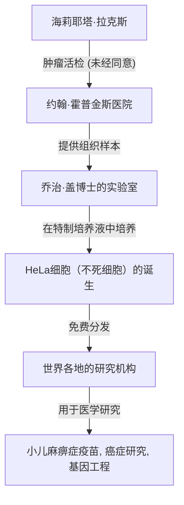
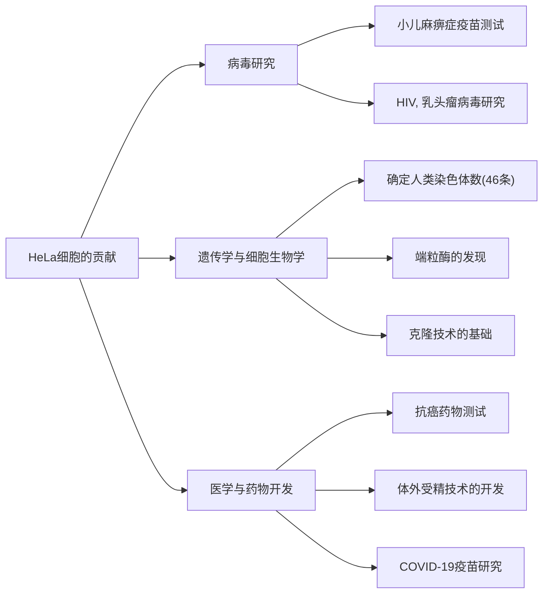

## 现代医学的幕后英雄：海莉耶塔·拉克斯

我们今天享有的许多医疗技术——从小儿麻痹症疫苗的开发、癌症治疗的进步、体外受精的成功，甚至到COVID-19疫苗的研究——如果没有一位非裔美国女性的细胞，都是无从谈起的。她的名字是**海莉耶塔·拉克斯（Henrietta Lacks）**。从她体内提取的细胞被命名为“HeLa（海拉）细胞”，并成为人类历史上第一批在体外无限增殖的“不死细胞”。

然而，在她的细胞于世界各地的实验室中增殖并拯救了无数生命的几十年里，她的家人对此却一无所知。本文将深入探讨海莉耶塔·拉克斯的一生、HeLa细胞带来的科学突破，以及她的故事所引发的关于生命伦理（知情同意和基因隐私）的深刻讨论。

---

## 海莉耶塔·拉克斯的生平：从烟草田到巴尔的摩

海莉耶塔·拉克斯（原名洛蕾塔·普莱森特）于1920年8月1日出生在弗吉尼亚州罗亚诺克。她4岁时，母亲在生下第10个孩子后不久去世。由于父亲无力抚养这么多孩子，他们被送到亲戚家寄养。海莉耶塔由住在弗吉尼亚州克洛弗的祖父汤米·拉克斯收养，并与她的表哥大卫（戴伊）·拉克斯一起长大。

他们生活的基础是在烟草种植园劳动。在从奴隶制时代延续下来的烟草田里，他们从小就从事从日出到日落的艰苦劳动。海莉耶塔上学的机会有限，只能在小学六年级时结束她的学业。

1941年，海莉耶塔与戴伊结婚，并随着二战带来的工业繁荣，为了追求更好的生活，搬到了马里兰州巴尔的摩附近的特纳站。戴伊在伯利恒钢铁厂工作，而海莉耶塔则作为一位全心全意的母亲，抚养着他们的五个孩子（劳伦斯、埃尔西、桑尼、黛博拉和扎卡里亚）。

---

## 突如其来的疾病与约翰·霍普金斯医院的治疗

1951年初，海莉耶塔开始感到身体不适。她描述为“肚子里有个结”，并且持续出现异常出血。当时，在巴尔的摩，为数不多接受黑人患者的大型医院之一是**约翰·霍普金斯医院**。该医院为贫困人群提供免费医疗，但受种族隔离政策（吉姆·克劳法）的影响，病房严格按照白人和黑人划分。

检查结果发现，海莉耶塔的宫颈处有一个恶性肿瘤，被诊断为宫颈癌（后来确诊为腺癌）。主治医生霍华德·琼斯决定采用当时的标准化疗法——镭放射治疗。

然而，在治疗过程中发生了一件以现代伦理标准来看极为严重的事件。在海莉耶塔因麻醉失去知觉时，主刀医生**在未经她同意或不知情的情况下**，从她的肿瘤组织和紧邻的健康组织中都提取了样本。

在当时，手术中从患者身上提取组织样本用于研究是医生间的普遍做法，“知情同意（Informed Consent）”这一概念本身在法律上也尚未确立。

---

## 乔治·盖与“不死细胞”的诞生

被提取的细胞组织被送到了约翰·霍普金斯大学组织培养实验室的负责人**乔治·盖（George Gey）博士**那里。盖博士和他的妻子玛格丽特多年来一直在寻找“让全人类的细胞在体外（试管内）无限期存活的方法”。当时，被取出体外的人类细胞通常会在几天到几周内死亡。

盖博士实验室的助手玛丽·库比切克将海莉耶塔的细胞放入培养液中（一种由鸡血浆和牛胎儿提取物等混合而成的特制培养液）。接着，令人震惊的事情发生了。

其他细胞很快就死亡了，而海莉耶塔的细胞不仅没有死，反而每24小时数量就翻一番。这种细胞以异常的速度增殖，瞬间覆盖了培养瓶的内壁。盖博士取患者姓名的前两个字母，将这种细胞株命名为<strong>“HeLa（海拉）”</strong>。这就是人类历史上首个“不死的人类细胞株”的诞生。

HeLa细胞的发现绝对是生物学和医学的一场革命。在此之前，使用活体人类细胞进行实验极其困难，但随着可以无限增殖、生命力顽强且易于处理的HeLa细胞的出现，世界各地的研究人员终于能够在稳定的环境中利用人类细胞进行实验。

---

## 科学的进步与海莉耶塔的逝世

另一方面，细胞的原始主人海莉耶塔本人的病情，尽管接受了镭疗和X光治疗，却迅速恶化。癌症转移到了她全身，她遭受了难以言表的痛苦。

1951年10月4日，正当HeLa细胞准备改变世界之时，海莉耶塔·拉克斯英年早逝，年仅31岁。她根本无从知晓自己为医学做出了多大的贡献，也不知道自己的细胞已经“长生不老”并继续存活。她的遗体被埋葬在故乡克洛弗的一个无名墓中。

---

## 为什么HeLa细胞是“不死的”？

HeLa细胞为什么具有如此强大的增殖能力且不会死亡呢？在随后的几十年研究中，其科学机制被逐渐揭开。

1. **端粒酶的过度表达**:
   正常的人类细胞在每次细胞分裂时，染色体末端的“端粒”部分都会缩短。当端粒缩短到一定程度时，细胞就不能再分裂，从而老化并死亡（海弗里克极限）。然而，HeLa细胞异常活跃地产生一种称为“端粒酶”的酶。由于这种酶不断修复端粒，细胞就能够永远持续分裂（增殖）。

2. **人类乳头瘤病毒（HPV）的影响**:
   海莉耶塔的宫颈癌是由一种恶性度极高的病毒——人类乳头瘤病毒（HPV）18型的感染引起的。这种病毒的DNA整合到海莉耶塔细胞的基因组中，导致抑癌基因（如p53和Rb等）的功能受阻，细胞增殖的刹车失灵了。

3. **染色体异常**:
   正常的人类细胞有46条染色体，但HeLa细胞存在显著的染色体异常，拥有76到80条染色体。这种剧烈的基因突变也是其异常增殖力的原因之一。

---

## HeLa细胞带来的医学突破

盖博士没有为HeLa细胞申请专利，而是开始无偿提供给世界各地以研究为目的的科学家。不久，HeLa细胞开始被商业化大量生产，成为了现代生物学的“标准模型”。据估计，迄今为止生产的HeLa细胞总重量已达数千万吨。

使用HeLa细胞取得的研究成果极其广泛，甚至多次催生了诺贝尔奖。

### 1. 小儿麻痹症疫苗的开发
20世纪50年代，小儿麻痹症（脊髓灰质炎）是威胁全世界儿童的恐怖疾病。当乔纳斯·索尔克博士开发小儿麻痹症疫苗时，他需要细胞来大规模测试其有效性和安全性。HeLa细胞很容易感染脊髓灰质炎病毒，并且能够大量培养，因此成为疫苗测试的最佳材料。通过塔斯基吉大学建立的大规模HeLa细胞工厂生产的细胞，疫苗的实用化进程一举加速，成功地从世界上几乎根除了小儿麻痹症。

### 2. 染色体研究与基因定位
直到20世纪50年代中期，人类究竟有多少条染色体一直没有确凿的证据。德克萨斯大学的研究人员在使用HeLa细胞进行实验时，偶然犯了一个将细胞浸泡在低渗溶液中的错误。结果细胞膨胀，内部的染色体清晰地分离开来，变得容易观察。应用这项技术，确定了人类正常染色体数为46条，并为后来发现唐氏综合征（21三体综合征）等遗传性疾病奠定了基础。

### 3. 病毒学与癌症研究
HeLa细胞被用于研究各种病原体，包括HIV（艾滋病病毒）、疱疹、寨卡热、结核病和沙门氏菌。此外，它们作为模型细胞也被广泛用于研究细胞如何癌变，以及抗癌药物如何对细胞产生作用。

### 4. 太空之旅
HeLa细胞乘坐苏联的人造卫星，比人类更早地飞向了太空。它们成为实验对象，以调查失重状态和宇宙辐射对人类细胞的影响。令人惊讶的是，已证实在太空中，HeLa细胞的增殖速度比在地面上还要快。

---

## 毫不知情的家庭与伦理争议

虽然HeLa细胞在世界各地创造了数万亿美元的产业，登上了科学杂志的封面，并被载入医学教科书，但海莉耶塔的家人（拉克斯家族）却在巴尔的摩贫穷的工人阶级街区生活，甚至买不起医疗保险。

拉克斯家族第一次知道HeLa细胞的存在，是在海莉耶塔去世20多年后的1973年。当时，HeLa细胞强大的增殖能力反而成了祸害，发生了“HeLa污染问题”，即HeLa细胞混入了全世界其他的细胞培养物（包括正常细胞）中，毁掉了实验结果。

为了确定HeLa细胞特有的遗传标记，科学家们需要海莉耶塔孩子们的血液样本。突然接到研究人员联系的家人被告知“母亲的细胞还活着”，陷入了极大的混乱和恐惧之中。在没有得到充分解释的情况下进行了抽血，家人甚至误以为“自己是不是也在接受癌症检查”。

由此，围绕HeLa细胞的严重伦理问题浮出水面。

1. **缺乏知情同意**: 未经同意提取和使用患者的组织是允许的吗？
2. **利益分配**: 面对从细胞中产生的巨大收益，原始组织的提供者或其家人难道没有任何权利吗？（根据1990年摩尔诉加州大学董事会案的判决，患者对其被摘除的细胞不享有财产权。）
3. **侵犯隐私**: 2013年，一个欧洲研究团队破译了HeLa细胞的全基因组序列，并在互联网上的公共数据库中发表。由于HeLa细胞的DNA序列与海莉耶塔的子孙高度共享，这是一种未经许可向全世界公开家族遗传信息（如未来患病风险等）的行为。

2013年的这一事件成为生命伦理学的一个重大转折点。拉克斯家族对未经同意就公开他们的遗传信息提出了强烈抗议。美国国立卫生研究院（NIH）高度重视此事，暂时删除了已公布的基因组数据，并与拉克斯家族的代表进行了协商。

结果是，HeLa细胞的基因组数据被转移到了一个受访问限制的数据库中，研究人员在使用数据时，必须获得包括两名拉克斯家族成员在内的审查委员会的批准。这是一项旨在解决过去的非正义行为并承认家庭在研究中参与权利的具有里程碑意义的协议。

---

## “不死细胞”留下的真正遗产

海莉耶塔·拉克斯的故事不仅仅是一个科学成功的故事。它向我们展示了一个沉重的历史事实：医学的进步有时是建立在社会弱势群体的牺牲之上的。

2010年，记者丽贝卡·斯克鲁特出版的非小说类书籍《永生的海拉》（The Immortal Life of Henrietta Lacks）成为全球畅销书，她的故事也因此广为人知。以这本书为契机，海莉耶塔的故乡建起了纪念碑，一颗小行星以她的名字命名，多所大学也授予她荣誉学位。

此外，在2023年，拉克斯家族遗属针对生物技术公司赛默飞世尔科技提起的诉讼（指控其利用未经同意提取的HeLa细胞获取不当利益）达成了和解。虽然和解的细节未公开，但这被认为是对未经同意提取的生物组织进行商业利用，并向遗属提供赔偿的历史性事件。

---

## 结语

海莉耶塔·拉克斯与她自己的意愿无关，但毋庸置疑，她成为了现代医学中最重要的贡献者之一。她的细胞在这一瞬间依然在世界各地的实验室中不断分裂，投身于拯救人类免受疾病折磨的研究中。

当我们享受着最新医疗的恩惠时，绝不能忘记其中蕴含着一位非裔美国女性的生命。HeLa细胞的故事将永远告诫我们：科学探索的伟大与随之而来的伦理责任并重。
