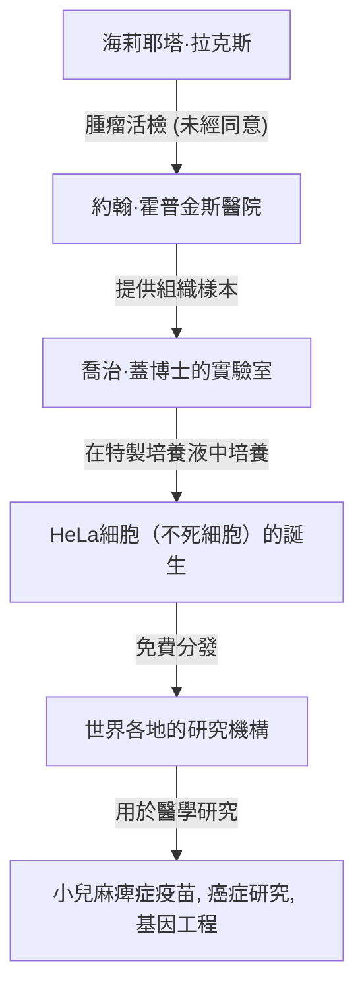
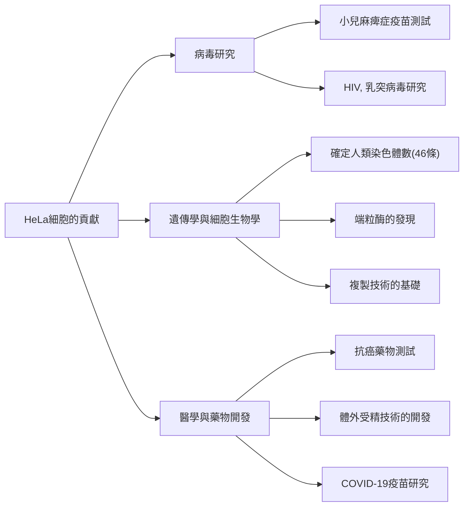

## 現代醫學的幕後英雄：海莉耶塔·拉克斯

我們今天享有的許多醫療技術——從小兒麻痺症疫苗的開發、癌症治療的進步、體外受精的成功，甚至到COVID-19疫苗的研究——如果沒有一位非裔美國女性的細胞，都是無從談起的。她的名字是**海莉耶塔·拉克斯（Henrietta Lacks）**。從她體內提取的細胞被命名為「HeLa（海拉）細胞」，並成為人類歷史上第一批在體外無限增殖的「不死細胞」。

然而，在她的細胞於世界各地的實驗室中增殖並拯救了無數生命的幾十年裡，她的家人對此卻一無所知。本文將深入探討海莉耶塔·拉克斯的一生、HeLa細胞帶來的科學突破，以及她的故事所引發的關於生命倫理（知情同意和基因隱私）的深刻討論。

---

## 海莉耶塔·拉克斯的生平：從菸草田到巴爾的摩

海莉耶塔·拉克斯（原名洛蕾塔·普萊森特）於1920年8月1日出生在維吉尼亞州羅亞諾克。她4歲時，母親在生下第10個孩子後不久去世。由於父親無力撫養這麼多孩子，他們被送到親戚家寄養。海莉耶塔由住在維吉尼亞州克洛弗的祖父湯米·拉克斯收養，並與她的表哥大衛（戴伊）·拉克斯一起長大。

他們生活的基礎是在菸草種植園勞動。在從奴隸制時代延續下來的菸草田裡，他們從小就從事從日出到日落的艱苦勞動。海莉耶塔上學的機會有限，只能在小學六年級時結束她的學業。

1941年，海莉耶塔與戴伊結婚，並隨著二戰帶來的工業繁榮，為了追求更好的生活，搬到了馬里蘭州巴爾的摩附近的特納站。戴伊在伯利恆鋼鐵廠工作，而海莉耶塔則作為一位全心全意的母親，撫養著他們的五個孩子（勞倫斯、埃爾西、桑尼、黛博拉和扎卡里亞）。

---

## 突如其來的疾病與約翰·霍普金斯醫院的治療

1951年初，海莉耶塔開始感到身體不適。她描述為「肚子裡有個結」，並且持續出現異常出血。當時，在巴爾的摩，為數不多接受黑人患者的大型醫院之一是**約翰·霍普金斯醫院**。該醫院為貧困人群提供免費醫療，但受種族隔離政策（吉姆·克勞法）的影響，病房嚴格按照白人和黑人劃分。

檢查結果發現，海莉耶塔的子宮頸處有一個惡性腫瘤，被診斷為子宮頸癌（後來確診為腺癌）。主治醫生霍華德·瓊斯決定採用當時的標準化療法——鐳放射治療。

然而，在治療過程中發生了一件以現代倫理標準來看極為嚴重的事件。在海莉耶塔因麻醉失去知覺時，主刀醫生**在未經她同意或不知情的情況下**，從她的腫瘤組織和緊鄰的健康組織中都提取了樣本。

在當時，手術中從患者身上提取組織樣本用於研究是醫生間的普遍做法，「知情同意（Informed Consent）」這一概念本身在法律上也尚未確立。

---

## 喬治·蓋與「不死細胞」的誕生

被提取的細胞組織被送到了約翰·霍普金斯大學組織培養實驗室的負責人**喬治·蓋（George Gey）博士**那裡。蓋博士和他的妻子瑪格麗特多年來一直在尋找「讓人類的細胞在體外（試管內）無限期存活的方法」。當時，被取出體外的人類細胞通常會在幾天到幾週內死亡。

蓋博士實驗室的助手瑪麗·庫比切克將海莉耶塔的細胞放入培養液中（一種由雞血漿和牛胎兒提取物等混合而成的特製培養液）。接著，令人震驚的事情發生了。

其他細胞很快就死亡了，而海莉耶塔的細胞不僅沒有死，反而每24小時數量就翻一倍。這種細胞以異常的速度增殖，瞬間覆蓋了培養瓶的內壁。蓋博士取患者姓名的前兩個字母，將這種細胞株命名為**「HeLa（海拉）」**。這就是人類歷史上首個「不死的人類細胞株」的誕生。

HeLa細胞的發現絕對是生物學和醫學的一場革命。在此之前，使用活體人類細胞進行實驗極其困難，但隨著可以無限增殖、生命力頑強且易於處理的HeLa細胞的出現，世界各地的研究人員終於能夠在穩定的環境中利用人類細胞進行實驗。

---

## 科學的進步與海莉耶塔的逝世

另一方面，細胞的原始主人海莉耶塔本人的病情，儘管接受了鐳療和X光治療，卻迅速惡化。癌症轉移到了她全身，她遭受了難以言表的痛苦。

1951年10月4日，正當HeLa細胞準備改變世界之時，海莉耶塔·拉克斯英年早逝，年僅31歲。她根本無從知曉自己為醫學做出了多大的貢獻，也不知道自己的細胞已經「長生不老」並繼續存活。她的遺體被埋葬在故鄉克洛弗的一個無名墓中。

---

## 為什麼HeLa細胞是「不死的」？

HeLa細胞為什麼具有如此強大的增殖能力且不會死亡呢？在隨後的幾十年研究中，其科學機制被逐漸揭開。

1. **端粒酶的過度表達**:
   正常的人類細胞在每次細胞分裂時，染色體末端的「端粒」部分都會縮短。當端粒縮短到一定程度時，細胞就不能再分裂，從而老化並死亡（海弗里克極限）。然而，HeLa細胞異常活躍地產生一種稱為「端粒酶」的酶。由於這種酶不斷修復端粒，細胞就能夠永遠持續分裂（增殖）。

2. **人類乳突病毒（HPV）的影響**:
   海莉耶塔的子宮頸癌是由一種惡性度極高的病毒——人類乳突病毒（HPV）18型的感染引起的。這種病毒的DNA整合到海莉耶塔細胞的基因組中，導致抑癌基因（如p53和Rb等）的功能受阻，細胞增殖的煞車失靈了。

3. **染色體異常**:
   正常的人類細胞有46條染色體，但HeLa細胞存在顯著的染色體異常，擁有76到80條染色體。這種劇烈的基因突變也是其異常增殖力的原因之一。

---

## HeLa細胞帶來的醫學突破

蓋博士沒有為HeLa細胞申請專利，而是開始無償提供給世界各地以研究為目的的科學家。不久，HeLa細胞開始被商業化大量生產，成為了現代生物學的「標準模型」。據估計，迄今為止生產的HeLa細胞總重量已達數千萬噸。

使用HeLa細胞取得的研究成果極其廣泛，甚至多次催生了諾貝爾獎。

### 1. 小兒麻痺症疫苗的開發
20世紀50年代，小兒麻痺症（脊髓灰質炎）是威脅全世界兒童的恐怖疾病。當喬納斯·索爾克博士開發小兒麻痺症疫苗時，他需要細胞來大規模測試其有效性和安全性。HeLa細胞很容易感染脊髓灰質炎病毒，並且能夠大量培養，因此成為疫苗測試的最佳材料。透過塔斯基吉大學建立的大規模HeLa細胞工廠生產的細胞，疫苗的實用化進程一舉加速，成功地從世界上幾乎根除了小兒麻痺症。

### 2. 染色體研究與基因定位
直到20世紀50年代中期，人類究竟有多少條染色體一直沒有確鑿的證據。德克薩斯大學的研究人員在使用HeLa細胞進行實驗時，偶然犯了一個將細胞浸泡在低滲溶液中的錯誤。結果細胞膨脹，內部的染色體清晰地分離開來，變得容易觀察。應用這項技術，確定了人類正常染色體數為46條，並為後來發現唐氏症（21三體症）等遺傳性疾病奠定了基礎。

### 3. 病毒學與癌症研究
HeLa細胞被用於研究各種病原體，包括HIV（愛滋病病毒）、皰疹、茲卡病毒、結核病和沙門氏菌。此外，它們作為模型細胞也被廣泛用於研究細胞如何癌變，以及抗癌藥物如何對細胞產生作用。

### 4. 太空之旅
HeLa細胞乘坐蘇聯的人造衛星，比人類更早地飛向了太空。它們成為實驗對象，以調查失重狀態和宇宙輻射對人類細胞的影響。令人驚訝的是，已證實在太空中，HeLa細胞的增殖速度比在地面上還要快。

---

## 毫不知情的家庭與倫理爭議

雖然HeLa細胞在世界各地創造了數萬億美元的產業，登上了科學雜誌的封面，並被載入醫學教科書，但海莉耶塔的家人（拉克斯家族）卻在巴爾的摩貧窮的工人階級街區生活，甚至買不起醫療保險。

拉克斯家族第一次知道HeLa細胞的存在，是在海莉耶塔去世20多年後的1973年。當時，HeLa細胞強大的增殖能力反而成了禍害，發生了「HeLa污染問題」，即HeLa細胞混入了全世界其他的細胞培養物（包括正常細胞）中，毀掉了實驗結果。

為了確定HeLa細胞特有的遺傳標記，科學家們需要海莉耶塔孩子們的血液樣本。突然接到研究人員聯繫的家人被告知「母親的細胞還活著」，陷入了極大的混亂和恐懼之中。在沒有得到充分解釋的情況下進行了抽血，家人甚至誤以為「自己是不是也在接受癌症檢查」。

由此，圍繞HeLa細胞的嚴重倫理問題浮出水面。

1. **缺乏知情同意**: 未經同意提取和使用患者的組織是允許的嗎？
2. **利益分配**: 面對從細胞中產生的巨大收益，原始組織的提供者或其家人難道沒有任何權利嗎？（根據1990年摩爾訴加州大學董事會案的判決，患者對其被摘除的細胞不享有財產權。）
3. **侵犯隱私**: 2013年，一個歐洲研究團隊破譯了HeLa細胞的全基因組序列，並在網際網路上的公共資料庫中發表。由於HeLa細胞的DNA序列與海莉耶塔的子孫高度共享，這是一種未經許可向全世界公開家族遺傳資訊（如未來患病風險等）的行為。

2013年的這一事件成為生命倫理學的一個重大轉折點。拉克斯家族對未經同意就公開他們的遺傳資訊提出了強烈抗議。美國國立衛生研究院（NIH）高度重視此事，暫時刪除了已公布的基因組資料，並與拉克斯家族的代表進行了協商。

結果是，HeLa細胞的基因組資料被轉移到了一個受存取限制的資料庫中，研究人員在使用資料時，必須獲得包括兩名拉克斯家族成員在內的審查委員會的批准。這是一項旨在解決過去的非正義行為並承認家庭在研究中參與權利的具有里程碑意義的協議。

---

## 「不死細胞」留下的真正遺產

海莉耶塔·拉克斯的故事不僅僅是一個科學成功的故事。它向我們展示了一個沉重的歷史事實：醫學的進步有時是建立在社會弱勢群體的犧牲之上的。

2010年，記者麗貝卡·斯克魯特出版的非小說類書籍《永生的海拉》（The Immortal Life of Henrietta Lacks）成為全球暢銷書，她的故事也因此廣為人知。以這本書為契機，海莉耶塔的故鄉建起了紀念碑，一顆小行星以她的名字命名，多所大學也授予她榮譽學位。

此外，在2023年，拉克斯家族遺屬針對生物技術公司賽默飛世爾科技提起的訴訟（指控其利用未經同意提取的HeLa細胞獲取不當利益）達成了和解。雖然和解的細節未公開，但這被認為是對未經同意提取的生物組織進行商業利用，並向遺屬提供賠償的歷史性事件。

---

## 結語

海莉耶塔·拉克斯與她自己的意願無關，但毋庸置疑，她成為了現代醫學中最重要的貢獻者之一。她的細胞在這一瞬間依然在世界各地的實驗室中不斷分裂，投身於拯救人類免受疾病折磨的研究中。

當我們享受著最新醫療的恩惠時，絕不能忘記其中蘊含著一位非裔美國女性的生命。HeLa細胞的故事將永遠告誡我們：科學探索的偉大與隨之而來的倫理責任並重。
