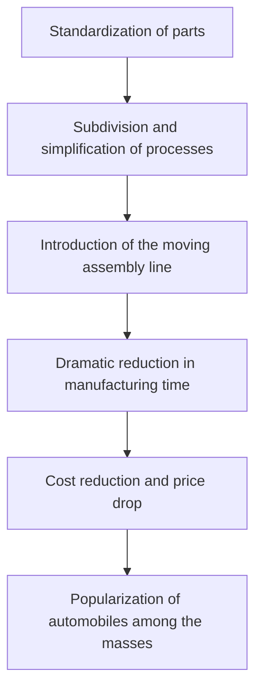

Henry Ford (1863-1947) went beyond being just the founder of an automobile manufacturing company; he etched his name in history as the "Automobile King" who fundamentally transformed the industrial structure and people's lifestyles in the 20th century. His greatest achievement was not inventing the automobile, but "turning the automobile from a luxury item for a wealthy few into an everyday means of transportation for the masses."

In this article, we will unravel Henry Ford's life, the philosophy he practiced known as "Fordism," and the profound marks he left on modern society.

## From Farm Boy to Mechanical Genius

Born in 1863 to a farming family in Dearborn, Michigan, Ford showed a strong interest in tinkering with machines rather than farm work from an early age. After disassembling and reassembling a pocket watch given to him by his father at the age of 15, he became a well-regarded repairman in the neighborhood. At 16, he moved to Detroit to start his life as an apprentice machinist.

While working as an engineer at the Edison Illuminating Company, he devoted his nights to developing a gasoline engine in his backyard. In 1896, he finally completed his self-made four-wheel vehicle, the "Quadricycle." This passion and technical skill became the foundation of his future massive empire.

## The "Model T" and the Shock of the Moving Assembly Line

After several failures and challenges, he founded the Ford Motor Company in 1903. His goal was "a sturdy, inexpensive car that anyone could afford." Then, in 1908, the masterpiece that would change automotive history, the "Model T," was born.

The true revolution of the Model T lay in its manufacturing process. In 1913, inspired by the disassembly process in meatpacking plants, Ford introduced the "moving assembly line (conveyor belt system)" into automobile manufacturing.

Thanks to this system, the assembly time for a chassis was drastically reduced from twelve and a half hours to just one hour and 33 minutes. The price of the Model T, which was $825 in 1908, plummeted to $260 by the 1920s, literally becoming the "car of the masses."

## Fordism: High Wages Generate Mass Consumption

When discussing Ford's ideology, one cannot overlook his unique economic and management philosophy called "Fordism." He was quick to realize the truth that "mass production requires mass consumption."

In 1914, Ford suddenly announced an astonishing wage level of the "Five-Dollar Day," which was more than double the average factory worker's wage at the time. Simultaneously, he reduced working hours from nine to eight hours a day and introduced a three-shift system, enabling the factory to operate 24 hours a day.

This decision meant more than just giving back to the workers.
1. **Reducing turnover and improving productivity**: Preventing high turnover rates caused by harsh line work and retaining skilled workers.
2. **Turning workers into consumers**: Giving the employees working in his factories enough purchasing power to buy the company's cars.

This signified the completion of the "mass production and mass consumption" cycle in a capitalist society.

## Dictatorship, Decline, and Leftover Legacy

However, Ford's later years were not entirely smooth sailing. He strongly adhered to his own success story, stubbornly continuing the single-model production of the black Model T even as consumers began demanding diverse designs and comfort. As a result, he gradually lost market share to rival companies like General Motors (GM).

Furthermore, his ideology, including strong anti-unionism, a dictatorial management style, and extreme anti-Semitic rhetoric, contained deep prejudices and contradictions, casting a dark shadow over future generations.

## Conclusion

Henry Ford was not a perfect saint. Yet, the systems he established—the "moving assembly line" and the "creation of a mass consumption society through high wages"—served as a blueprint for the capitalist economy of the 20th century that followed.

The "affordable industrial products" and "middle-class lifestyle" that we enjoy as a matter of course today began from the vision drawn by a machine-loving boy born on a farm in Dearborn. Ford's life can be said to be a record of a powerful historical paradigm shift, showing how one individual's obsession and innovation can shape the world.
