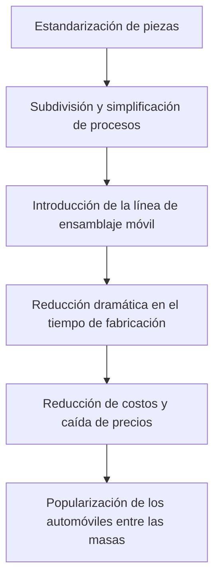

Henry Ford (1863-1947) fue más allá de ser solo el fundador de una empresa de fabricación de automóviles; grabó su nombre en la historia como el "Rey del Automóvil" que transformó fundamentalmente la estructura industrial y el estilo de vida de las personas en el siglo XX. Su mayor logro no fue inventar el automóvil, sino "convertir el automóvil de un artículo de lujo para unos pocos ricos en un medio de transporte cotidiano para las masas".

En este artículo, desentrañaremos la vida de Henry Ford, la filosofía que practicó conocida como "Fordismo" y las profundas huellas que dejó en la sociedad moderna.

## De chico de granja a genio mecánico

Nacido en 1863 en una familia de agricultores en Dearborn, Michigan, Ford mostró un fuerte interés en jugar con máquinas en lugar de trabajar en la granja desde una edad temprana. Después de desarmar y volver a armar un reloj de bolsillo que le regaló su padre a la edad de 15 años, se convirtió en un reparador bien considerado en el vecindario. A los 16, se mudó a Detroit para comenzar su vida como aprendiz de maquinista.

Mientras trabajaba como ingeniero en la Edison Illuminating Company, dedicaba sus noches a desarrollar un motor de gasolina en su patio trasero. En 1896, finalmente completó su vehículo de cuatro ruedas hecho a sí mismo, el "Cuadriciclo". Esta pasión y habilidad técnica se convirtieron en la base de su futuro imperio masivo.

## El "Modelo T" y el impacto de la línea de ensamblaje móvil

Después de varios fracasos y desafíos, fundó la Ford Motor Company en 1903. Su objetivo era "un automóvil robusto y económico que cualquiera pudiera pagar". Luego, en 1908, nació la obra maestra que cambiaría la historia automotriz, el "Modelo T".

La verdadera revolución del Modelo T residía en su proceso de fabricación. En 1913, inspirado por el proceso de despiece en las plantas empacadoras de carne, Ford introdujo la "línea de ensamblaje móvil (sistema de cinta transportadora)" en la fabricación de automóviles.

Gracias a este sistema, el tiempo de ensamblaje de un chasis se redujo drásticamente de doce horas y media a solo una hora y 33 minutos. El precio del Modelo T, que era de $825 en 1908, cayó a $260 en la década de 1920, convirtiéndose literalmente en el "automóvil de las masas".

## Fordismo: Los altos salarios generan consumo masivo

Al discutir la ideología de Ford, no se puede pasar por alto su singular filosofía económica y de gestión llamada "Fordismo". Rápidamente se dio cuenta de la verdad de que "la producción masiva requiere un consumo masivo".

En 1914, Ford anunció repentinamente un asombroso nivel salarial de "Cinco dólares al día", que era más del doble del salario promedio de un trabajador de fábrica en ese momento. Simultáneamente, redujo las horas de trabajo de nueve a ocho horas al día e introdujo un sistema de tres turnos, permitiendo que la fábrica operara las 24 horas del día.

Esta decisión significó más que simplemente retribuir a los trabajadores:
1. **Reducir la rotación y mejorar la productividad**: Prevenir las altas tasas de rotación causadas por el duro trabajo en la línea y retener a los trabajadores calificados.
2. **Convertir a los trabajadores en consumidores**: Dar a los empleados que trabajan en sus fábricas suficiente poder adquisitivo para comprar los automóviles de la empresa.

Esto significó la finalización del ciclo de "producción masiva y consumo masivo" en una sociedad capitalista.

## Dictadura, declive y el legado dejado

Sin embargo, los últimos años de Ford no fueron del todo tranquilos. Se adhirió fuertemente a su propia historia de éxito, continuando obstinadamente la producción de un solo modelo del Modelo T negro incluso cuando los consumidores comenzaron a exigir diseños diversos y comodidad. Como resultado, gradualmente perdió participación de mercado frente a empresas rivales como General Motors (GM).

Además, su ideología, que incluía un fuerte antisindicalismo, un estilo de gestión dictatorial y una retórica antisemita extrema, contenía profundos prejuicios y contradicciones, arrojando una oscura sombra sobre las generaciones futuras.

## Conclusión

Henry Ford no era un santo perfecto. Sin embargo, los sistemas que estableció, la "línea de ensamblaje móvil" y la "creación de una sociedad de consumo masivo a través de altos salarios", sirvieron como un plano para la economía capitalista del siglo XX que siguió.

Los "productos industriales asequibles" y el "estilo de vida de clase media" que disfrutamos como algo natural hoy en día comenzaron a partir de la visión dibujada por un chico amante de las máquinas nacido en una granja en Dearborn. Se puede decir que la vida de Ford es un registro de un poderoso cambio de paradigma histórico, que muestra cómo la obsesión e innovación de un individuo pueden dar forma al mundo.
