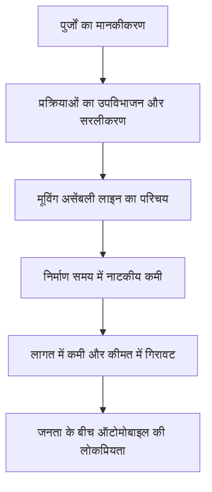

हेनरी फोर्ड (1863-1947) न केवल एक ऑटोमोबाइल निर्माता कंपनी के संस्थापक थे, बल्कि उन्होंने 20वीं सदी के औद्योगिक ढांचे और लोगों की जीवनशैली को मौलिक रूप से बदलने वाले "ऑटोमोबाइल किंग" के रूप में इतिहास में अपना नाम दर्ज कराया। उनकी सबसे बड़ी उपलब्धि कार का आविष्कार करना नहीं था, बल्कि "ऑटोमोबाइल को कुछ अमीर लोगों की विलासिता की वस्तु से हटाकर आम जनता के लिए परिवहन के दैनिक साधन में बदलना" था।

इस लेख में, हम हेनरी फोर्ड के जीवन, उनके द्वारा अभ्यास किए गए "फोर्डिज़्म" दर्शन और आधुनिक समाज पर उनके द्वारा छोड़े गए गहरे निशानों के बारे में जानेंगे।

## खेत के लड़के से मैकेनिकल जीनियस तक

1863 में डियरबॉर्न, मिशिगन में एक कृषि परिवार में जन्मे, फोर्ड ने कम उम्र से ही कृषि कार्य के बजाय मशीनों के साथ काम करने में गहरी रुचि दिखाई। 15 साल की उम्र में अपने पिता द्वारा दी गई पॉकेट वॉच को अलग करने और फिर से जोड़ने के बाद, वह पड़ोस में एक प्रसिद्ध रिपेयरमैन बन गए। 16 साल की उम्र में, वह एक अपरेंटिस मशीनिस्ट के रूप में अपना जीवन शुरू करने के लिए डेट्रायट चले गए।

एडीसन इल्युमिनेटिंग कंपनी में एक इंजीनियर के रूप में काम करते हुए, उन्होंने अपना रात का समय अपने पिछवाड़े में गैसोलीन इंजन विकसित करने में समर्पित कर दिया। 1896 में, उन्होंने अंततः अपना स्वयं निर्मित चार-पहिया वाहन, "क्वाड्रिसाइकिल" पूरा किया। यह जुनून और तकनीकी कौशल उनके भविष्य के विशाल साम्राज्य की नींव बन गया।

## "मॉडल टी" और मूविंग असेंबली लाइन का प्रभाव

कई विफलताओं और चुनौतियों के बाद, उन्होंने 1903 में फोर्ड मोटर कंपनी (Ford Motor Company) की स्थापना की। उनका लक्ष्य "एक मजबूत, सस्ती कार थी जिसे कोई भी खरीद सके।" फिर, 1908 में, ऑटोमोटिव इतिहास को बदलने वाली उत्कृष्ट कृति, "मॉडल टी (Model T)" का जन्म हुआ।

मॉडल टी की असली क्रांति इसकी निर्माण प्रक्रिया में निहित थी। 1913 में, मीटपैकिंग संयंत्रों में वियोजन प्रक्रिया से प्रेरित होकर, फोर्ड ने ऑटोमोबाइल निर्माण में "मूविंग असेंबली लाइन (कन्वेयर बेल्ट सिस्टम)" की शुरुआत की।

इस प्रणाली के लिए धन्यवाद, एक चेसिस के लिए असेंबली का समय साढ़े बारह घंटे से घटकर मात्र एक घंटा 33 मिनट रह गया। मॉडल टी की कीमत, जो 1908 में $825 थी, 1920 के दशक तक गिरकर $260 हो गई, जो सचमुच "जनता की कार" बन गई।

## फोर्डिज़्म: उच्च वेतन बड़े पैमाने पर खपत उत्पन्न करता है

फोर्ड की विचारधारा पर चर्चा करते समय, कोई भी उनके अद्वितीय आर्थिक और प्रबंधन दर्शन को नजरअंदाज नहीं कर सकता है जिसे "फोर्डिज़्म" कहा जाता है। वह इस सच्चाई को जल्द ही समझ गए थे कि "बड़े पैमाने पर उत्पादन के लिए बड़े पैमाने पर खपत की आवश्यकता होती है।"

1914 में, फोर्ड ने अचानक "फाइव-डॉलर डे (Five-Dollar Day)" के आश्चर्यजनक वेतन स्तर की घोषणा की, जो उस समय एक औसत कारखाने के कर्मचारी के वेतन से दोगुने से भी अधिक था। इसके साथ ही, उन्होंने काम के घंटे नौ से घटाकर आठ घंटे कर दिए और तीन-शिफ्ट प्रणाली की शुरुआत की, जिससे कारखाने 24 घंटे काम कर सके।

इस निर्णय का अर्थ केवल श्रमिकों को वापस देने से कहीं अधिक था:
1. **कारोबार कम करना और उत्पादकता में सुधार करना**: कठोर लाइन वर्क के कारण होने वाली उच्च टर्नओवर दर को रोकना और कुशल श्रमिकों को बनाए रखना।
2. **श्रमिकों को उपभोक्ता बनाना**: अपने कारखानों में काम करने वाले कर्मचारियों को कंपनी की कारें खरीदने के लिए पर्याप्त क्रय शक्ति देना।

यह एक पूंजीवादी समाज में "बड़े पैमाने पर उत्पादन और बड़े पैमाने पर खपत" चक्र के पूरा होने का प्रतीक था।

## तानाशाही, पतन और छोड़ी गई विरासत

हालाँकि, फोर्ड के बाद के वर्ष पूरी तरह से सुचारू रूप से नहीं बीते। वह अपनी खुद की सफलता की कहानी से दृढ़ता से जुड़े रहे, जिद्दी रूप से ब्लैक मॉडल टी का सिंगल-मॉडल उत्पादन जारी रखा, तब भी जब उपभोक्ता विविध डिजाइन और आराम की मांग करने लगे। नतीजतन, उन्होंने धीरे-धीरे जनरल मोटर्स (GM) जैसी प्रतिद्वंद्वी कंपनियों के लिए बाजार हिस्सेदारी खो दी।

इसके अलावा, उनकी विचारधारा, जिसमें मजबूत संघ-विरोधीवाद, एक तानाशाही प्रबंधन शैली, और चरम यहूदी विरोधी बयानबाजी शामिल है, में गहरे पूर्वाग्रह और विरोधाभास थे, जिन्होंने आने वाली पीढ़ियों पर एक काली छाया डाली।

## निष्कर्ष

हेनरी फोर्ड कोई पूर्ण संत नहीं थे। फिर भी, उन्होंने जो प्रणालियाँ स्थापित कीं—"मूविंग असेंबली लाइन" और "उच्च वेतन के माध्यम से जन उपभोग समाज का निर्माण"—उनके बाद की 20वीं सदी की पूंजीवादी अर्थव्यवस्था के लिए एक खाका के रूप में कार्य करती हैं।

"किफायती औद्योगिक उत्पाद" और "मध्यम वर्ग की जीवनशैली" जिसका हम आज सहज रूप से आनंद लेते हैं, डियरबॉर्न के एक खेत में पैदा हुए मशीन-प्रेमी लड़के द्वारा खींचे गए दृष्टिकोण से शुरू हुआ था। फोर्ड के जीवन को एक शक्तिशाली ऐतिहासिक प्रतिमान बदलाव का एक रिकॉर्ड कहा जा सकता है, यह दर्शाता है कि कैसे एक व्यक्ति का जुनून और नवाचार दुनिया को आकार दे सकता है।
