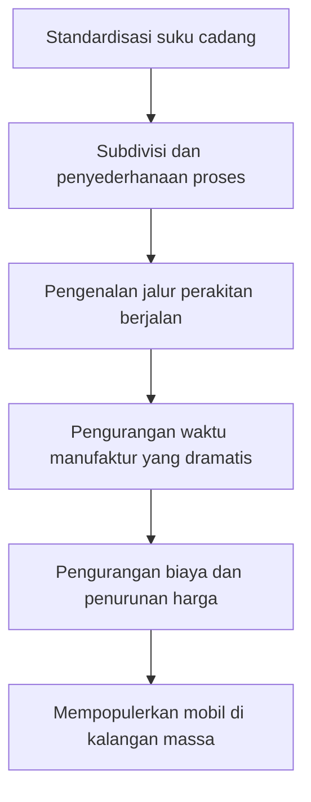

Henry Ford (1863-1947) tidak sekadar menjadi pendiri perusahaan manufaktur mobil; ia menorehkan namanya dalam sejarah sebagai "Raja Mobil" yang secara fundamental mengubah struktur industri dan gaya hidup masyarakat pada abad ke-20. Pencapaian terbesarnya bukanlah menemukan mobil, tetapi "mengubah mobil dari barang mewah untuk segelintir orang kaya menjadi sarana transportasi sehari-hari untuk masyarakat umum."

Dalam artikel ini, kita akan mengurai kehidupan Henry Ford, filosofi yang ia praktikkan yang dikenal sebagai "Fordisme," dan jejak mendalam yang ditinggalkannya pada masyarakat modern.

## Dari Anak Petani Menjadi Jenius Mekanik

Lahir pada tahun 1863 dari keluarga petani di Dearborn, Michigan, Ford menunjukkan minat yang kuat untuk mengutak-atik mesin daripada bertani sejak usia dini. Setelah membongkar dan merakit kembali jam saku pemberian ayahnya pada usia 15 tahun, ia menjadi tukang reparasi yang disegani di lingkungannya. Pada usia 16 tahun, ia pindah ke Detroit untuk memulai kehidupannya sebagai mekanik magang.

Saat bekerja sebagai insinyur di Edison Illuminating Company, ia mendedikasikan malam-malamnya untuk mengembangkan mesin bensin di halaman belakang rumahnya. Pada tahun 1896, ia akhirnya menyelesaikan kendaraan roda empat buatannya sendiri, "Quadricycle". Semangat dan keterampilan teknis inilah yang menjadi fondasi bagi kerajaan masa depannya yang masif.

## "Model T" dan Kejutan Jalur Perakitan Berjalan

Setelah beberapa kegagalan dan tantangan, ia mendirikan Ford Motor Company pada tahun 1903. Tujuannya adalah membuat "mobil yang kokoh dan murah yang mampu dibeli siapa saja." Kemudian, pada tahun 1908, mahakarya yang mengubah sejarah otomotif, "Model T", lahir.

Revolusi sesungguhnya dari Model T terletak pada proses manufakturnya. Pada tahun 1913, terinspirasi oleh proses pembongkaran di pabrik pengepakan daging, Ford memperkenalkan "jalur perakitan berjalan (sistem sabuk konveyor)" ke dalam manufaktur otomotif.

Berkat sistem ini, waktu perakitan sasis berkurang drastis dari dua belas setengah jam menjadi hanya satu jam 33 menit. Harga Model T, yang tadinya $825 pada tahun 1908, anjlok menjadi $260 pada tahun 1920-an, dan secara harfiah menjadi "mobil rakyat."

## Fordisme: Upah Tinggi Menghasilkan Konsumsi Massal

Saat membahas ideologi Ford, kita tidak bisa mengabaikan filosofi ekonomi dan manajemennya yang unik, yang disebut "Fordisme." Ia segera menyadari kebenaran bahwa "produksi massal membutuhkan konsumsi massal."

Pada tahun 1914, Ford tiba-tiba mengumumkan tingkat upah yang menakjubkan, yaitu "Lima Dolar Sehari" (Five-Dollar Day), yang jumlahnya lebih dari dua kali lipat upah rata-rata pekerja pabrik pada saat itu. Bersamaan dengan itu, ia mengurangi jam kerja dari sembilan menjadi delapan jam sehari dan memperkenalkan sistem tiga shift, sehingga pabrik dapat beroperasi 24 jam sehari.

Keputusan ini memiliki arti lebih dari sekadar memberikan imbalan kepada para pekerja:
1. **Mengurangi perputaran karyawan dan meningkatkan produktivitas**: Mencegah tingkat pergantian (turnover) yang tinggi akibat pekerjaan di jalur perakitan yang keras dan mempertahankan pekerja terampil.
2. **Mengubah pekerja menjadi konsumen**: Memberikan daya beli yang cukup kepada karyawan yang bekerja di pabriknya untuk membeli mobil buatan perusahaan tersebut.

Ini menandakan selesainya siklus "produksi massal dan konsumsi massal" dalam masyarakat kapitalis.

## Kediktatoran, Kemunduran, dan Warisan yang Ditinggalkan

Akan tetapi, tahun-tahun terakhir Ford tidak berjalan mulus. Ia sangat berpegang teguh pada kisah suksesnya sendiri, dengan keras kepala melanjutkan produksi satu model dari Model T berwarna hitam meskipun konsumen mulai menuntut desain yang beragam dan kenyamanan. Akibatnya, ia perlahan-lahan kehilangan pangsa pasarnya dan direbut oleh perusahaan pesaing seperti General Motors (GM).

Selain itu, ideologinya, yang mencakup anti-serikat pekerja yang kuat, gaya manajemen diktator, dan retorika anti-Semit yang ekstrem, mengandung prasangka dan kontradiksi yang mendalam, membayangi generasi mendatang.

## Kesimpulan

Henry Ford bukanlah seorang santo yang sempurna. Namun, sistem yang ia dirikan—"jalur perakitan berjalan" dan "penciptaan masyarakat konsumsi massal melalui upah tinggi"—berfungsi sebagai cetak biru bagi ekonomi kapitalis abad ke-20 yang mengikutinya.

"Produk industri yang terjangkau" dan "gaya hidup kelas menengah" yang kita nikmati sebagai hal yang biasa saat ini bermula dari visi yang digambar oleh seorang bocah lelaki pecinta mesin yang lahir di sebuah peternakan di Dearborn. Kehidupan Ford dapat dikatakan sebagai catatan pergeseran paradigma sejarah yang kuat, yang menunjukkan bagaimana obsesi dan inovasi seorang individu dapat membentuk dunia.
