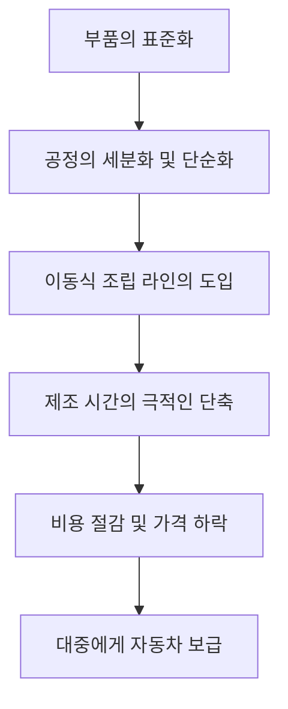

헨리 포드(Henry Ford, 1863-1947)는 단순한 자동차 제조 회사의 창업자를 넘어, 20세기의 산업 구조와 사람들의 라이프스타일을 근본적으로 변화시킨 '자동차 왕'으로 역사에 이름을 남겼습니다. 그의 가장 큰 업적은 자동차를 발명한 것이 아니라, "자동차를 소수 부유층의 사치품에서 대중의 일상적인 교통수단으로 바꾼 것"에 있습니다.

본 기사에서는 헨리 포드의 생애, 그가 실천한 철학 '포디즘', 그리고 현대 사회에 남긴 깊은 자취에 대해 풀어보겠습니다.

## 농장의 소년에서 기계의 천재로

1863년 미시간주 디어본의 농가에서 태어난 포드는 어릴 적부터 농사일보다는 기계 만지는 일에 강한 흥미를 보였습니다. 15세에 아버지로부터 받은 회중시계를 분해하고 조립하며 동네에서 평판이 자자한 수리공이 된 그는, 16세에 디트로이트로 건너가 기계공 견습생으로서의 삶을 시작합니다.

에디슨 일루미네이팅 컴퍼니(Edison Illuminating Company)에서 엔지니어로 일하면서, 매일 밤 뒷마당에서 가솔린 엔진 개발에 몰두했습니다. 1896년, 마침내 그가 직접 만든 4륜 자동차 '쿼드리사이클(Quadricycle)'을 완성합니다. 이러한 열정과 기술력이 훗날 거대한 제국의 초석이 되었습니다.

## '모델 T'와 이동식 조립 라인의 충격

몇 번의 실패와 도전을 거쳐, 1903년 포드 모터 컴퍼니(Ford Motor Company)를 설립합니다. 그가 목표로 한 것은 "누구나 살 수 있는 튼튼하고 저렴한 자동차"였습니다. 그리고 1908년, 자동차의 역사를 바꿀 걸작 '모델 T(Model T)'가 탄생합니다.

모델 T의 진정한 혁명은 그 제조 공정에 있었습니다. 1913년, 포드는 식육 공장의 해체 공정에서 착안하여 '이동식 조립 라인(컨베이어 벨트 시스템)'을 자동차 제조에 도입합니다.

이 시스템 덕분에 섀시 조립 시간은 12시간 반에서 불과 1시간 33분으로 극적으로 단축되었습니다. 1908년에 825달러였던 모델 T의 가격은 1920년대에는 260달러까지 떨어져 말 그대로 '대중의 차'가 되었습니다.

## 포디즘: 고임금이 대량 소비를 낳다

포드의 사상을 이야기할 때 빼놓을 수 없는 것이 '포디즘(Fordism)'이라 불리는 독자적인 경제·경영 철학입니다. 그는 "대량 생산에는 대량 소비가 필요하다"는 진리를 일찍이 깨달았습니다.

1914년, 포드는 당시 일반 공장 노동자 평균 임금의 두 배 이상에 달하는 놀라운 임금 수준인 '일급 5달러(Five-Dollar Day)'를 갑작스럽게 발표했습니다. 동시에 노동 시간을 하루 9시간에서 8시간으로 단축하고, 3교대 제도를 도입하여 공장의 24시간 가동을 실현했습니다.

이 결정에는 단순히 노동자에게 환원한다는 것 이상의 의미가 있었습니다.
1. **이직률 저하와 생산성 향상**: 가혹한 라인 작업으로 인한 높은 이직률을 방지하고 숙련공을 정착시킨다.
2. **노동자의 소비자화**: 자기 공장에서 일하는 직원들이 자사의 자동차를 살 수 있을 만큼의 구매력을 갖게 한다.

이것이야말로 자본주의 사회에서 '대량 생산·대량 소비'라는 사이클의 완성을 의미했습니다.

## 독재와 쇠퇴, 그리고 남겨진 유산

그러나 포드의 말년은 결코 순탄치 않았습니다. 그는 자신의 성공 경험에 강하게 집착하여, 소비자가 다양한 디자인이나 편안함을 요구하게 되었음에도 검은색 모델 T의 단일 모델 생산만을 고집했습니다. 그 결과, 제너럴 모터스(GM) 등 경쟁 기업들에게 점차 시장 점유율을 빼앗기게 됩니다.

또한, 강경한 반노동조합주의와 독재적인 경영 스타일, 나아가 극단적인 반유대주의적 언동 등 그의 사상에는 강한 편견과 모순도 내포되어 있어 후세에 어두운 그림자를 드리우기도 했습니다.

## 맺음말

헨리 포드는 완벽한 성인은 아니었습니다. 하지만 그가 확립한 '이동식 조립 라인'과 '고임금에 의한 대중 소비 사회의 창출'이라는 시스템은 그 후 20세기 자본주의 경제의 청사진이 되었습니다.

우리가 오늘날 당연하게 누리고 있는 '합리적인 가격의 공산품'과 '중산층의 라이프스타일'은 디어본의 농장에서 태어난 기계광 소년이 그렸던 비전에서 시작된 것입니다. 포드의 생애는 한 인간의 집념과 혁신이 어떻게 세상을 형성하는지를 보여주는, 역사상 강렬한 패러다임 전환의 기록이라고 할 수 있습니다.
