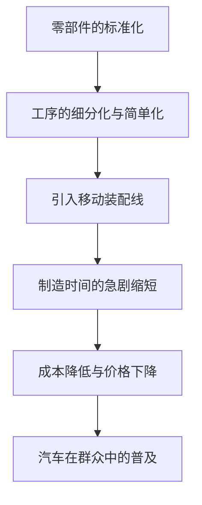

亨利·福特（Henry Ford, 1863-1947）超越了单纯的汽车制造商创始人的范畴，作为从根本上改变了20世纪产业结构和人们生活方式的“汽车大王”被载入史册。他最大的功绩并非发明了汽车，而是“将汽车从少数富人的奢侈品变成了大众日常的代步工具”。

在本文中，我们将深入探讨亨利·福特的一生、他所践行的“福特主义”哲学，以及他给现代社会留下的深刻印记。

## 从农场少年到机械天才

1863年，福特出生于密歇根州迪尔伯恩的一个农场家庭。从小，比起农活，他对摆弄机械表现出了浓厚的兴趣。15岁时，他将父亲赠送的怀表拆解并重新组装，成为了邻里间小有名气的修理工。16岁时，他前往底特律，开始了机械学徒的生活。

在爱迪生照明公司担任工程师期间，他每晚都在自家后院潜心研发汽油发动机。1896年，他终于完成了自己制作的四轮汽车“四轮车（Quadricycle）”。这份热情与技术实力，成为了后来庞大帝国的基石。

## “T型车”与移动装配线的冲击

经历了多次失败和挑战后，他于1903年创立了福特汽车公司（Ford Motor Company）。他的目标是制造“人人都买得起的坚固耐用且廉价的汽车”。随后在1908年，改变汽车历史的杰作“T型车（Model T）”诞生了。

T型车真正的革命在于其制造工艺。1913年，福特从肉类加工厂的解体流程中获得灵感，将“移动装配线（传送带方式）”引入了汽车制造。

得益于这一系统，底盘的装配时间从12个半小时急剧缩短到了仅1小时33分钟。1908年售价825美元的T型车，到了1920年代已经降至260美元，真正成为了“大众的汽车”。

## 福特主义：高工资催生大量消费

在谈论福特的思想时，不可忽视的是被称为“福特主义（Fordism）”的独特经济和管理哲学。他敏锐地察觉到了“大量生产需要大量消费”这一真理。

1914年，福特突然宣布了“日薪5美元（Five-Dollar Day）”的惊人工资水平，这相当于当时普通工厂工人平均工资的两倍多。同时，他将工作时间从每天9小时缩短至8小时，并引入了三班倒制度，实现了工厂的24小时不间断运转。

这一决定不仅仅是对工人的回馈，还具有更深层的意义：
1. **降低离职率和提高生产率**：防止因严酷的流水线作业导致的高离职率，留住熟练工人。
2. **工人转化为消费者**：使在自己工厂工作的员工拥有足够的购买力去购买自己公司生产的汽车。

这标志着资本主义社会中“大量生产、大量消费”循环的完成。

## 独裁与衰退，以及留下的遗产

然而，福特的晚年并非一帆风顺。他极度固执于自己的成功经验，即使消费者开始追求多样化的设计和舒适性，他依然坚持单一生产黑色的T型车。结果，他逐渐将市场份额拱手让给了通用汽车（GM）等竞争对手。

此外，他强硬的反工会主义、独裁的管理风格，乃至极端的反犹太主义言行，都表明他的思想中夹杂着强烈的偏见和矛盾，这也给后世留下了阴影。

## 结语

亨利·福特并非完美的圣人。但是，他所确立的“移动装配线”和“通过高工资创造大众消费社会”的系统，成为了此后20世纪资本主义经济的蓝图。

我们今天习以为常的“价格实惠的工业产品”和“中产阶级的生活方式”，正是始于那个诞生在迪尔伯恩农场、热爱机械的少年所描绘的愿景。福特的一生，可以说是记录了一次强烈的历史范式转变，展示了一个人的执念和创新是如何塑造这个世界的。
