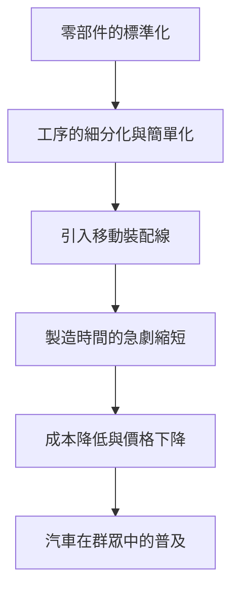

亨利·福特（Henry Ford, 1863-1947）超越了單純的汽車製造商創始人的範疇，作為從根本上改變了20世紀產業結構和人們生活方式的「汽車大王」被載入史冊。他最大的功績並非發明了汽車，而是「將汽車從少數富人的奢侈品變成了大眾日常的代步工具」。

在本文中，我們將深入探討亨利·福特的一生、他所踐行的「福特主義」哲學，以及他給現代社會留下的深刻印記。

## 從農場少年到機械天才

1863年，福特出生於密西根州迪爾伯恩的一個農場家庭。從小，比起農活，他對擺弄機械表現出了濃厚的興趣。15歲時，他將父親贈送的懷錶拆解並重新組裝，成為了鄰里間小有名氣的修理工。16歲時，他前往底特律，開始了機械學徒的生活。

在愛迪生照明公司擔任工程師期間，他每晚都在自家後院潛心研發汽油發動機。1896年，他終於完成了自己製作的四輪汽車「四輪車（Quadricycle）」。這份熱情與技術實力，成為了後來龐大帝國的基石。

## 「T型車」與移動裝配線的衝擊

經歷了多次失敗和挑戰後，他於1903年創立了福特汽車公司（Ford Motor Company）。他的目標是製造「人人都買得起的堅固耐用且廉價的汽車」。隨後在1908年，改變汽車歷史的傑作「T型車（Model T）」誕生了。

T型車真正的革命在於其製造工藝。1913年，福特從肉類加工廠的解體流程中獲得靈感，將「移動裝配線（輸送帶方式）」引入了汽車製造。

得益於這一系統，底盤的裝配時間從12個半小時急劇縮短到了僅1小時33分鐘。1908年售價825美元的T型車，到了1920年代已經降至260美元，真正成為了「大眾的汽車」。

## 福特主義：高工資催生大量消費

在談論福特的思想時，不可忽視的是被稱為「福特主義（Fordism）」的獨特經濟和管理哲學。他敏銳地察覺到了「大量生產需要大量消費」這一真理。

1914年，福特突然宣布了「日薪5美元（Five-Dollar Day）」的驚人工資水平，這相當於當時普通工廠工人平均工資的兩倍多。同時，他將工作時間從每天9小時縮短至8小時，並引入了三班制，實現了工廠的24小時不間斷運轉。

這一決定不僅僅是對工人的回饋，還具有更深層的意義：
1. **降低離職率和提高生產率**：防止因嚴酷的流水線作業導致的高離職率，留住熟練工人。
2. **工人轉化為消費者**：使在自己工廠工作的員工擁有足夠的購買力去購買自己公司生產的汽車。

這標誌著資本主義社會中「大量生產、大量消費」循環的完成。

## 獨裁與衰退，以及留下的遺產

然而，福特的晚年並非一帆風順。他極度固執於自己的成功經驗，即使消費者開始追求多樣化的設計和舒適性，他依然堅持單一生產黑色的T型車。結果，他逐漸將市場份額拱手讓給了通用汽車（GM）等競爭對手。

此外，他強硬的反工會主義、獨裁的管理風格，乃至極端的反猶太主義言行，都表明他的思想中夾雜著強烈的偏見和矛盾，這也給後世留下了陰影。

## 結語

亨利·福特並非完美的聖人。但是，他所確立的「移動裝配線」和「通過高工資創造大眾消費社會」的系統，成為了此後20世紀資本主義經濟的藍圖。

我們今天習以為常的「價格實惠的工業產品」和「中產階級的生活方式」，正是始於那個誕生在迪爾伯恩農場、熱愛機械的少年所描繪的願景。福特的一生，可以說是記錄了一次強烈的歷史範式轉變，展示了一個人的執念和創新是如何塑造這個世界的。
