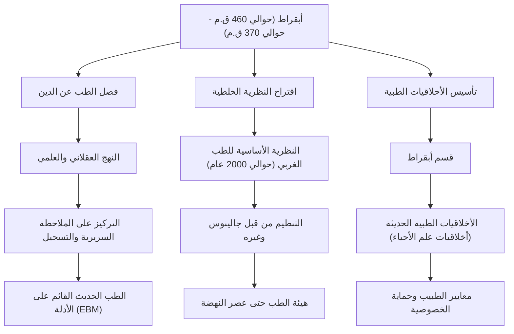

في اليونان القديمة، ارتبط الطب لفترة طويلة بشكل وثيق بالصلاة للآلهة والخرافات والسحر. في عصر كان يُنظر فيه إلى المرض على أنه "عقاب إلهي" أو "عمل الأرواح الشريرة"، كان هناك شخص قلب هذا المفهوم رأساً على عقب وارتقى بالطب إلى تخصص علمي وعقلاني. إنه أبقراط (Hippocrates)، الذي يُعرف بلقب "أبو الطب". في هذا المقال، سنتعمق في حياته، وفلسفته الطبية الرائدة، وتأثيره الهائل الذي لا يزال يشكل أساس الأخلاقيات الطبية حتى يومنا هذا.

## ولادته في جزيرة كوس وحياته المليئة بالترحال

ولد أبقراط حوالي عام 460 قبل الميلاد في جزيرة كوس في بحر إيجة. انتمت عائلته إلى نقابة الأطباء التي ادعت انحدارها من أسقليبيوس (إله الطب)، ونشأ في بيئة جعلته على تماس مع الطب منذ صغره. ويُقال إنه تعلم أساسيات الطب من والده هيراكليدس.

ومع ذلك، لم يكتفِ أبقراط بمجرد وراثة مهنة الطب في مسقط رأسه. بل سافر في جميع أنحاء اليونان، وحتى إلى مصر وآسيا الصغرى (تركيا الحالية)، حيث قدم الرعاية الطبية في أماكن مختلفة وجمع بيانات سريرية هائلة. وفي عصر كانت فيه وسائل النقل محدودة، ساعده هذا الترحال الواسع على تنمية قدرته على الملاحظة الموضوعية لكيفية تأثير المناخ، والطبيعة، والنظام الغذائي على صحة الإنسان. ومن بين مؤلفاته التي تُعرف بـ "مجموعة كوربوس أبقراط"، توجد أطروحة بعنوان "عن الأهوية والمياه والبلدان" والتي يمكن اعتبارها رائدة في الطب البيئي، حيث تعكس بوضوح نتائج عمله الميداني في تلك الفترة.

## التحرر من "العقاب الإلهي": النهج العقلاني

تكمن أعظم إنجازات أبقراط في تحويل مسببات الأمراض من "القوى الخارقة للطبيعة" إلى "قوانين الطبيعة والتوازن الجسدي البشري".

في ذلك الوقت، كان الصرع يُعرف باسم "المرض المقدس"، وكان يُخشى منه كمرض غامض ناتج عن مس شيطاني أو غضب إلهي. ومع ذلك، جادل أبقراط بأن الصرع ليس مرضاً استثنائياً، بل هو حالة طبيعية ناتجة عن خلل في الدماغ. كان هذا تحولاً نموذجياً تاريخياً لفصل الطب عن الدين والخرافات وتأسيسه كعلم طبيعي مستقل.

كان جوهر نظامه الطبي هو "النظرية الخلطية (Humorism)". وهي نظرية تفيد بأن جسم الإنسان يتكون من أربعة أخلاط: "الدم"، "البلغم"، "الصفراء"، و"السوداء"، وأن الأمراض تحدث عندما يختل التوازن بينها. وعلى الرغم من عدم دقتها من منظور علم التشريح ووظائف الأعضاء الحديث، إلا أن الفكرة القائلة بأن "المرض ينشأ من خلل في التوازن الفيزيائي والكيميائي داخل الجسم" ظلت النظرية الأساسية للطب الغربي لما يقرب من 2000 عام بعد ذلك. وقد أكد على الأساليب التي تعزز قوة الشفاء الطبيعية مثل النظام الغذائي، والتمارين الرياضية، والراحة، ومارس علاجاً "يتمحور حول المريض" ويتجنب الإفراط في تناول الأدوية والعمليات الجراحية.

## قمة الأخلاقيات الطبية: قسم أبقراط

لا يزال اسم أبقراط يُتداول بين المتخصصين في الرعاية الصحية اليوم من خلال "قسم أبقراط (Hippocratic Oath)". يمثل هذا القسم نصاً مكتوباً للواجبات الأخلاقية التي يجب على الأطباء الالتزام بها تجاه مرضاهم.

تتطابق البنود مثل "عدم إيذاء المريض"، و"حماية الخصوصية"، و"معرفة حدود القدرات الشخصية وإحالة الأمر للمختصين" بشكل مذهل مع روح الأخلاقيات الطبية الحديثة (أخلاقيات علم الأحياء). وعلى وجه الخصوص، يظل المبدأ القائل "أولاً، لا تؤذِ" باعتباره أهم الوصايا الطبية المستمدة من تعاليمه، كلمات محفورة في قلوب طلاب الطب في جميع أنحاء العالم عند ارتدائهم المعطف الأبيض حتى يومنا هذا. تكمن عمق فلسفته في حقيقة أنه لم يطالب بالمعرفة والمهارات فحسب، بل ركز بقوة على "الشخصية" و"الأخلاق" للطبيب.

## الإنجازات والتأثير على الأجيال القادمة

يلخص المخطط التالي مساهمات أبقراط في الطب وكيف انعكست على الرعاية الطبية في الأجيال اللاحقة.

## خاتمة: روح أبقراط التي تعيش في العصر الحديث

توفي أبقراط حوالي عام 370 قبل الميلاد في لاريسا بمنطقة ثيساليا. وحتى بعد وفاته، تناقل تلاميذه وأطباء الأجيال اللاحقة تعاليمه، التي أصبحت الأساس المطلق للطب الغربي.

في المجتمع الحديث، تطورت التكنولوجيا الطبية مثل التشخيص بالذكاء الاصطناعي والعلاج الجيني إلى أبعاد لم يكن أبقراط ليتخيلها. ومع ذلك، فإن النظرة الشمولية التي تنظر إلى المريض كـ "كُل" وتحاول تعظيم قوة الشفاء الطبيعية، وروح الأخلاقيات الطبية التي تسأل "كيفية التعامل مع المريض كإنسان" قبل التكنولوجيا، لم تفقد بريقها على الإطلاق.

بل يمكن القول إنه في ظل الرعاية الطبية الحديثة المتخصصة والمجزأة للغاية، فإن "الطب المرتكز على المريض" و"الأخلاقيات كطبيب" التي دعا إليها أبقراط تتألق بشكل أكبر. إن البذور التي زرعها "أبو الطب" متجذرة بعمق في أساس الطب الذي يدعم حياتنا اليوم، حتى بعد مرور 2400 عام.
