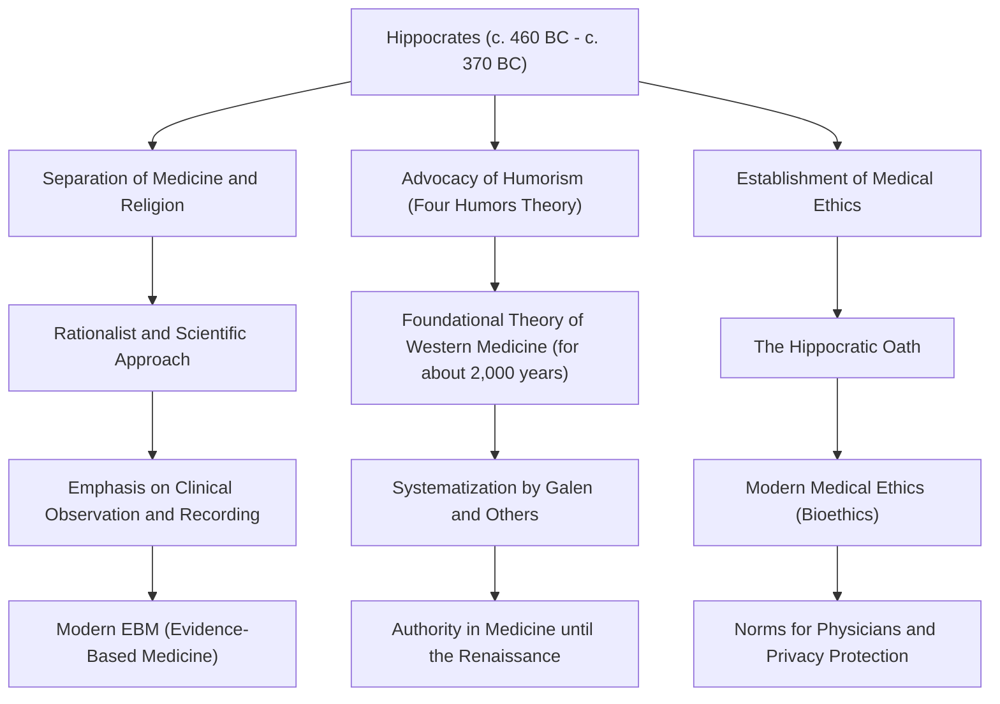

In ancient Greece, medicine was long deeply tied to prayers to the gods, superstitions, and magic. In an era when illness was considered "divine punishment" or the "work of evil spirits," there was a figure who completely overturned this common sense and elevated medicine into a scientific and rational discipline. That is Hippocrates, known as the "Father of Medicine." In this article, we will delve deeply into his life, his groundbreaking medical philosophy, and his tremendous influence that continues to form the foundation of medical ethics to this day.

## Birth on the Island of Kos and a Life of Wandering

Hippocrates was born around 460 BC on the island of Kos in the Aegean Sea. His lineage belonged to a guild of physicians who claimed to be descendants of Asclepius (the god of medicine), and he grew up in an environment where he was exposed to the medical arts from a young age. It is said that he also learned the basics of medicine from his father, Heracleides.

However, Hippocrates did not simply succeed the medical practice in his hometown. He traveled all over Greece, and even as far as Egypt and Asia Minor (present-day Turkey), collecting vast amounts of clinical data while practicing medicine in various places. Although transportation was limited at the time, it was these extensive travels that helped him cultivate an objective eye for observing how climate, geography, and diet affect human health. Among the texts attributed to him, the *Hippocratic Corpus*, is a treatise called *On Airs, Waters, and Places*, which can be called a pioneer of environmental medicine, and it strongly reflects the results of his fieldwork during this period.

## Breaking Away from "Divine Punishment": A Rationalist Approach

Hippocrates' greatest achievement lies in shifting the cause of illness from "supernatural forces" to "the laws of nature and the physical balance of the human body."

At that time, epilepsy was called the "sacred disease" and was feared as a mysterious illness caused by divine possession. However, Hippocrates argued directly that epilepsy was not a special disease, but a natural disorder caused by an abnormality in the brain. This was a historical paradigm shift that separated medicine from religion and superstition, establishing it as an independent natural science.

The foundation of his medical system is "Humorism" (the theory of the four humors). It is the theory that the human body is composed of four humors: "blood," "phlegm," "yellow bile," and "black bile," and that disease occurs when their balance is disrupted. Although inaccurate from the perspective of modern anatomy and physiology, the idea that "disease arises from physical and chemical imbalances within the body" continued to reign as the foundational theory of Western medicine for about 2,000 years thereafter. He emphasized an approach that enhanced the natural healing power, such as diet therapy, exercise, and rest, and practiced "patient-centered" treatment that avoided excessive medication and surgery.

## The Pinnacle of Medical Ethics: The Hippocratic Oath

The name of Hippocrates is still passed down among medical professionals today as the "Hippocratic Oath." This oath codifies the ethical duties that a physician must uphold toward their patients.

Items such as "do no harm to the patient," "protect privacy," and "know the limits of one's own abilities and defer to specialists" coincide surprisingly well with the spirit of modern medical ethics (bioethics). In particular, the principle of "first, do no harm" is the most important precept of medicine derived from his teachings, and it remains a phrase that medical students around the world engrave in their hearts when they don coat today. The profoundness of his philosophy lies in the fact that he strongly demanded not only knowledge and skills, but also "character" and "moral sense" as a physician.

## Achievements and Influence on Future Generations

The contributions Hippocrates brought to medicine and how they connected to later medical practice are summarized in the diagram below.

## Conclusion: The Spirit of Hippocrates Alive Today

Hippocrates passed away around 370 BC in Larissa, in the region of Thessaly. Even after his death, his teachings were passed on by his disciples and subsequent physicians, becoming the absolute foundation of Western medicine.

In modern society, medical technology, such as AI diagnosis and gene therapy, has evolved to a dimension that Hippocrates could never have imagined. However, the holistic perspective of viewing the patient as a "whole" and trying to maximize their natural healing power, as well as the spirit of medical ethics that asks "how to face the patient as a human being" before technology, have not faded at all.

Rather, it is precisely in the highly specialized and fragmented modern medical field that the "patient-centered medicine" and "ethical sense as a physician" advocated by Hippocrates shine even brighter. The seeds sown by the "Father of Medicine" have taken deep root in the foundation of medicine that supports our lives today, transcending 2,400 years of time.
