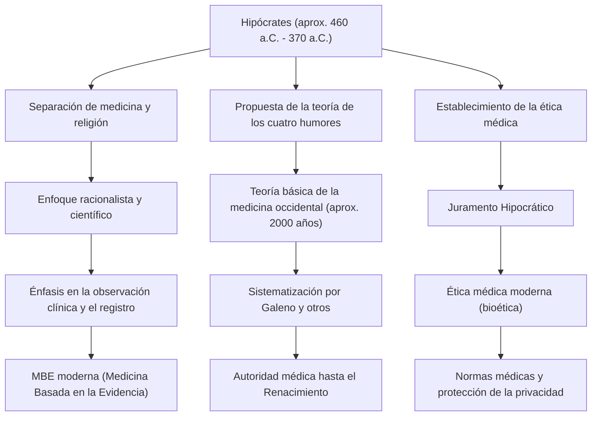

En la antigua Grecia, la medicina estuvo durante mucho tiempo profundamente vinculada a las oraciones a los dioses, la superstición y la magia. En una época en la que las enfermedades se consideraban un "castigo divino" o la "obra de espíritus malignos", hubo alguien que revolucionó por completo este sentido común y elevó la medicina a una disciplina científica y racional. Ese fue Hipócrates (Hippocrates), conocido como el "Padre de la Medicina". En este artículo, profundizaremos en su vida, su revolucionaria filosofía médica y la inmensa influencia que sigue siendo la base de la ética médica hasta nuestros días.

## Nacimiento en la isla de Cos y una vida de viajes

Hipócrates nació alrededor del año 460 a.C. en la isla de Cos, en el mar Egeo. Su familia pertenecía a un gremio de médicos que afirmaban ser descendientes de Asclepio (el dios de la medicina), y creció en un entorno en contacto con la medicina desde muy temprana edad. Se dice que también aprendió los fundamentos de la medicina de su padre, Heráclides.

Sin embargo, Hipócrates no se limitó a heredar la práctica médica en su ciudad natal. Viajó por toda Grecia, e incluso a Egipto y Asia Menor (la actual Turquía), practicando la medicina en diversos lugares mientras recopilaba una vasta cantidad de datos clínicos. En una época en la que los medios de transporte eran limitados, fueron estos extensos viajes los que le permitieron desarrollar un ojo objetivo para observar cómo el clima, el entorno y la dieta afectaban la salud humana. Entre la colección de escritos atribuidos a él, conocida como el *Corpus Hippocraticum* (Tratados hipocráticos), se incluye un ensayo pionero en medicina ambiental titulado *Sobre los aires, aguas y lugares*, que refleja fuertemente los resultados de su trabajo de campo durante este período.

## Alejamiento del "castigo divino": un enfoque racionalista

El mayor logro de Hipócrates fue trasladar la causa de las enfermedades de las "fuerzas sobrenaturales" a las "leyes de la naturaleza y el equilibrio físico humano".

En aquel entonces, la epilepsia era llamada la "enfermedad sagrada" y se le temía como una aflicción incomprensible causada por la posesión divina. Sin embargo, Hipócrates argumentó directamente que la epilepsia no era una enfermedad especial, sino una afección natural causada por una anomalía cerebral. Este fue un cambio de paradigma histórico para separar la medicina de la religión y la superstición, y establecerla como una ciencia natural independiente.

El núcleo de su sistema médico es la "Teoría de los cuatro humores" (Humorismo). El cuerpo humano está compuesto por cuatro humores: "sangre", "flema", "bilis amarilla" y "bilis negra", y la teoría sostiene que las enfermedades ocurren cuando el equilibrio de estos fluidos se altera. Aunque inexacta desde la perspectiva de la anatomía y fisiología modernas, la idea de que "las enfermedades surgen de desequilibrios físicos y químicos internos del cuerpo" reinó como la teoría fundamental de la medicina occidental durante unos 2000 años. Él valoraba un enfoque que mejorara el poder de curación natural, como la dieta, el ejercicio y el descanso, y practicaba una atención "centrada en el paciente", evitando la medicación excesiva o las cirugías.

## Un hito de la ética médica: el Juramento Hipocrático

El nombre de Hipócrates sigue vivo hoy entre los profesionales médicos como el "Juramento Hipocrático". Este juramento estipula claramente las obligaciones éticas que los médicos deben mantener hacia sus pacientes.

Principios como "no hacer daño al paciente", "proteger la privacidad" y "conocer los propios límites y delegar a especialistas" coinciden sorprendentemente con el espíritu de la ética médica moderna (bioética). En particular, el principio de "primero, no hacer daño", derivado de sus enseñanzas, sigue siendo el precepto médico más importante, grabado en el corazón de los estudiantes de medicina de todo el mundo cuando se ponen su bata blanca. La profundidad de su filosofía radica en el hecho de que exigió fuertemente a los médicos no solo conocimientos y habilidades, sino también "carácter" y "moralidad".

## Logros e influencia en las generaciones posteriores

La siguiente figura resume las contribuciones de Hipócrates a la medicina y cómo se conectan con la atención médica en las generaciones posteriores.

## Conclusión: El espíritu de Hipócrates vivo en la actualidad

Hipócrates falleció en Larisa, en la región de Tesalia, alrededor del año 370 a.C. Incluso después de su muerte, sus enseñanzas fueron continuadas por sus discípulos y médicos posteriores, convirtiéndose en la base absoluta de la medicina occidental.

En la sociedad moderna, con el diagnóstico por IA y la terapia génica, la tecnología médica ha evolucionado a una dimensión que Hipócrates nunca podría haber imaginado. Sin embargo, su perspectiva holística (integral) de tratar al paciente como un "todo" e intentar maximizar su poder de curación natural, así como su espíritu de ética médica que pregunta "cómo tratar a los pacientes como seres humanos" antes que la tecnología, no se han desvanecido en absoluto.

Más bien, se puede decir que en la atención médica moderna altamente especializada y fragmentada, la "atención médica centrada en el paciente" y la "ética como médico" defendidas por Hipócrates brillan aún más. Las semillas sembradas por el "Padre de la Medicina", 2400 años después, continúan profundamente arraigadas en los cimientos de la atención médica que sustenta nuestras vidas en la actualidad.
