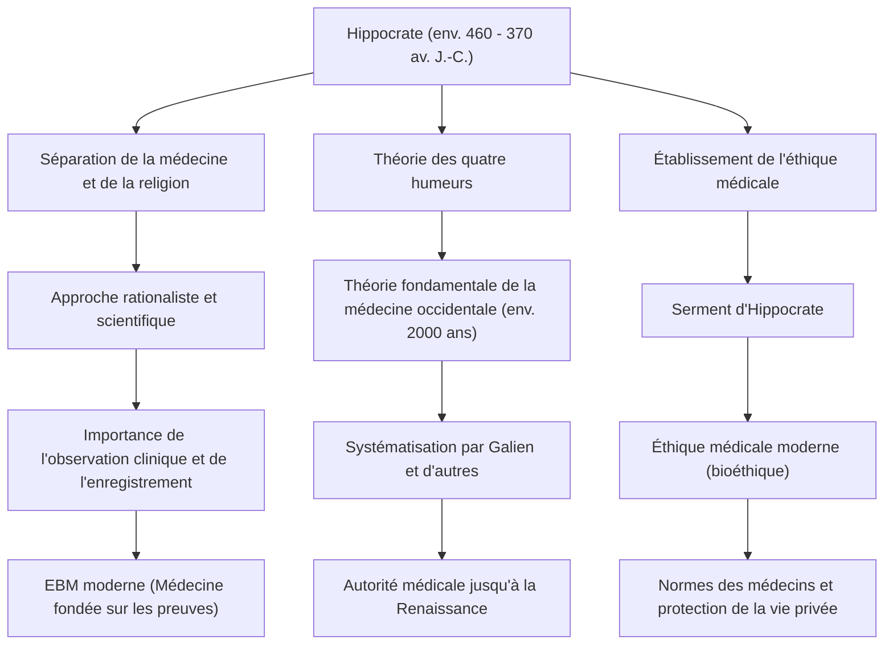

Dans la Grèce antique, la médecine a longtemps été profondément liée aux prières adressées aux dieux, à la superstition et à la magie. À une époque où la maladie était considérée comme une « punition divine » ou l'« œuvre des mauvais esprits », un homme a fondamentalement bouleversé cette croyance, élevant la médecine au rang de discipline scientifique et rationnelle. Il s'agit d'Hippocrate (Hippocrates), souvent appelé le « Père de la médecine ». Dans cet article, nous explorerons en profondeur sa vie, sa philosophie médicale révolutionnaire, et son influence immense qui continue de constituer le fondement de l'éthique médicale jusqu'à aujourd'hui.

## Naissance sur l'île de Kos et vie d'errance

Hippocrate est né vers 460 av. J.-C. sur l'île de Kos, dans la mer Égée. Sa famille appartenait à une guilde de médecins qui se disaient descendants d'Asclépios (le dieu de la médecine), et il a grandi dans un environnement où il était en contact avec l'art médical dès son plus jeune âge. On raconte qu'il a également appris les bases de la médecine de son père, Héraclide.

Cependant, Hippocrate ne s'est pas contenté de reprendre la pratique médicale dans sa ville natale. Il a voyagé à travers toute la Grèce, et même jusqu'en Égypte et en Asie Mineure (l'actuelle Turquie), prodiguant des soins médicaux et collectant d'énormes quantités de données cliniques. À une époque où les moyens de transport étaient limités, c'est ce vaste périple qui lui a permis de développer un œil objectif pour observer l'influence du climat, de la géographie et de l'alimentation sur la santé humaine. Parmi ses ouvrages, le *Corpus hippocratique*, on trouve un traité intitulé *Airs, eaux, lieux*, qui peut être considéré comme le précurseur de la médecine environnementale et reflète fortement les résultats de ses recherches sur le terrain de cette période.

## S'affranchir de la « punition divine » : l'approche rationaliste

La plus grande réalisation d'Hippocrate a été de déplacer la cause des maladies des « forces surnaturelles » vers « les lois de la nature et l'équilibre physique du corps humain ».

À l'époque, l'épilepsie était appelée la « maladie sacrée » et on la craignait comme une maladie mystérieuse causée par la possession divine. Cependant, Hippocrate a fermement soutenu que l'épilepsie n'était pas une maladie spéciale, mais une affection naturelle causée par une anomalie du cerveau. Ce fut un changement de paradigme historique pour séparer la médecine de la religion et de la superstition, et l'établir comme une science naturelle indépendante.

Le fondement de son système médical est la théorie des humeurs (Humeurisme). Selon cette théorie, le corps humain est composé de quatre fluides : le « sang », le « phlegme », la « bile jaune » et la « bile noire », et la maladie survient lorsque l'équilibre de ces fluides est rompu. Bien que cela soit inexact du point de vue de l'anatomie et de la physiologie modernes, l'idée que « la maladie résulte d'un déséquilibre physique et chimique interne du corps » a régné comme théorie fondamentale de la médecine occidentale pendant environ 2000 ans. Il privilégiait une approche renforçant le pouvoir de guérison naturelle par le régime alimentaire, l'exercice et le repos, pratiquant une médecine « centrée sur le patient » qui évitait les médications excessives et les interventions chirurgicales.

## Le sommet de l'éthique médicale : le serment d'Hippocrate

Le nom d'Hippocrate est encore aujourd'hui perpétué par les professionnels de la santé à travers le « Serment d'Hippocrate » (Hippocratic Oath). Ce serment codifie les obligations éthiques que les médecins doivent respecter envers leurs patients.

Des principes tels que « ne pas nuire au patient », « protéger la vie privée » et « connaître les limites de ses propres compétences et s'en remettre à des spécialistes » correspondent de manière frappante à l'esprit de l'éthique médicale moderne (bioéthique). En particulier, le principe de « d'abord, ne pas nuire » reste la règle la plus importante de la médecine, issue de ses enseignements, que les étudiants en médecine du monde entier gravent encore aujourd'hui dans leur cœur lorsqu'ils revêtent leur blouse blanche. La profondeur de sa philosophie réside dans le fait qu'il exigeait fortement du médecin non seulement des connaissances et des compétences, mais aussi une « personnalité » et une « moralité ».

## Réalisations et influence sur la postérité

Le diagramme ci-dessous résume les contributions d'Hippocrate à la médecine et comment elles ont influencé la médecine des générations futures.

## Conclusion : L'esprit d'Hippocrate dans le monde moderne

Hippocrate a terminé sa vie à Larissa, dans la région de Thessalie, vers 370 av. J.-C. Même après sa mort, ses enseignements ont été transmis par ses disciples et les médecins des générations futures, devenant le fondement absolu de la médecine occidentale.

Dans la société moderne, la technologie médicale, telle que le diagnostic par IA et la thérapie génique, a évolué vers des dimensions qu'Hippocrate n'aurait jamais pu imaginer. Cependant, la perspective holistique (globale) qui considère le patient comme un « tout » et cherche à maximiser le pouvoir de guérison naturel, ainsi que l'esprit de l'éthique médicale qui demande « comment traiter le patient en tant qu'être humain » avant la technologie, n'ont rien perdu de leur éclat.

Au contraire, c'est précisément dans la médecine moderne hautement spécialisée et fragmentée que les concepts de « médecine centrée sur le patient » et d'« éthique médicale du médecin » défendus par Hippocrate brillent encore plus fort. Les graines semées par le « Père de la médecine » ont traversé 2400 ans et sont encore aujourd'hui profondément enracinées à la base des soins de santé qui soutiennent nos vies.
