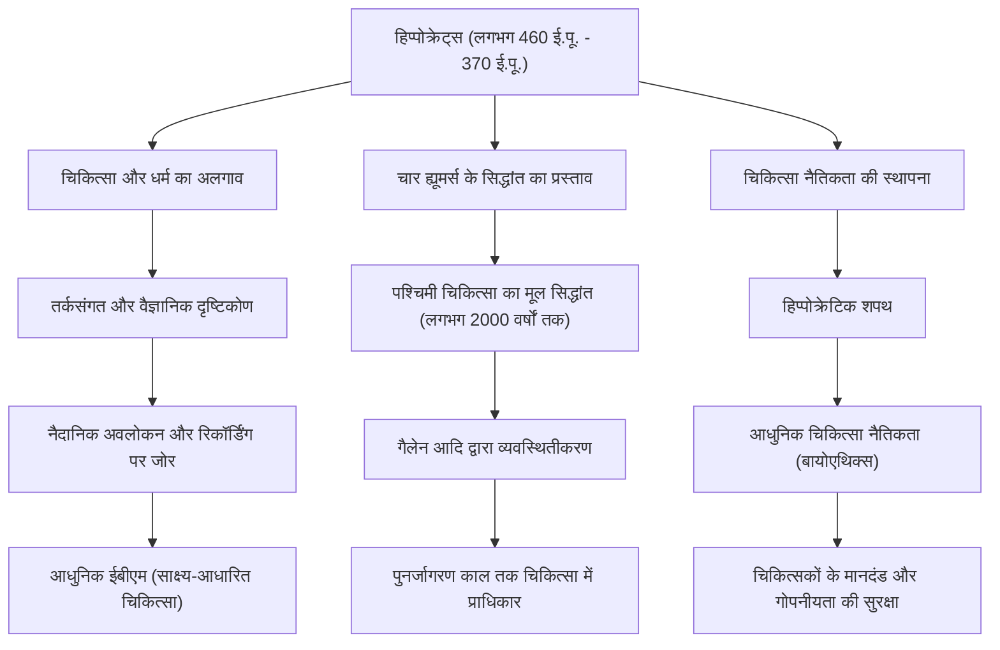

प्राचीन ग्रीस में, चिकित्सा लंबे समय तक देवताओं की प्रार्थना, अंधविश्वास और जादू-टोने से गहराई से जुड़ी हुई थी। ऐसे युग में जब बीमारी को "ईश्वर का दंड" या "बुरी आत्माओं का काम" माना जाता था, एक व्यक्ति ने इस सामान्य ज्ञान को जड़ से उखाड़ फेंका और चिकित्सा को एक वैज्ञानिक और तर्कसंगत अनुशासन में बदल दिया। वह हैं हिप्पोक्रेट्स (Hippocrates), जिन्हें "चिकित्सा का जनक" कहा जाता है। इस लेख में, हम उनके जीवन, उनके अभूतपूर्व चिकित्सा दर्शन और उनके उस गहरे प्रभाव के बारे में गहराई से जानेंगे, जो आज भी चिकित्सा नैतिकता का आधार बना हुआ है।

## कोस द्वीप पर जन्म और यात्रा का जीवन

हिप्पोक्रेट्स का जन्म 460 ईसा पूर्व के आसपास एजियन सागर के कोस द्वीप पर हुआ था। उनका परिवार एस्क्लेपियस (चिकित्सा के देवता) के वंशज होने का दावा करने वाले चिकित्सकों के एक संघ (गिल्ड) से संबंधित था, और वे एक ऐसे वातावरण में पले-बढ़े जहाँ बचपन से ही चिकित्सा का अभ्यास किया जाता था। ऐसा कहा जाता है कि उन्होंने अपने पिता हेराक्लाइड्स से चिकित्सा की मूल बातें भी सीखी थीं।

हालाँकि, हिप्पोक्रेट्स अपने गृहनगर में चिकित्सा का अभ्यास जारी रखने तक ही सीमित नहीं रहे। उन्होंने पूरे ग्रीस, यहाँ तक कि मिस्र और एशिया माइनर (आधुनिक तुर्की) की यात्रा की, विभिन्न स्थानों पर चिकित्सा का अभ्यास किया और बड़ी मात्रा में नैदानिक डेटा एकत्र किया। उस समय परिवहन के साधन सीमित थे, लेकिन इस व्यापक यात्रा ने उन्हें निष्पक्ष रूप से निरीक्षण करने की क्षमता विकसित करने में मदद की कि जलवायु, भूगोल और आहार मानव स्वास्थ्य को कैसे प्रभावित करते हैं। उनके लेखों के संग्रह "कॉर्पस हिप्पोक्रेटिकम" में "वायु, जल और स्थानों पर" नामक एक ग्रंथ शामिल है, जिसे पर्यावरण चिकित्सा का अग्रणी माना जा सकता है, और यह इस अवधि के दौरान उनके फील्डवर्क के परिणामों को दृढ़ता से दर्शाता है।

## "ईश्वर के दंड" से मुक्ति: एक तर्कसंगत दृष्टिकोण

हिप्पोक्रेट्स की सबसे बड़ी उपलब्धि बीमारी के कारणों को "अलौकिक शक्तियों" से "प्रकृति के नियमों और मानव शरीर के संतुलन" में स्थानांतरित करना था।

उस समय, मिर्गी को "पवित्र रोग" कहा जाता था और इसे देवताओं के कब्जे के कारण होने वाली एक रहस्यमय बीमारी के रूप में डर पैदा करने वाला माना जाता था। हालांकि, हिप्पोक्रेट्स ने दृढ़ता से तर्क दिया कि मिर्गी कोई विशेष बीमारी नहीं है, बल्कि मस्तिष्क में असामान्यताओं के कारण होने वाली एक प्राकृतिक बीमारी है। यह चिकित्सा को धर्म और अंधविश्वास से अलग करने और इसे एक स्वतंत्र प्राकृतिक विज्ञान के रूप में स्थापित करने के लिए एक ऐतिहासिक प्रतिमान बदलाव था।

उनकी चिकित्सा प्रणाली का मूल "चार ह्यूमर्स का सिद्धांत (Humorism)" है। यह सिद्धांत यह मानता है कि मानव शरीर चार तरल पदार्थों से बना है: "रक्त", "कफ", "पीला पित्त", और "काला पित्त", और जब इन तरल पदार्थों का संतुलन बिगड़ जाता है तो बीमारी होती है। आधुनिक शरीर रचना विज्ञान और शरीर विज्ञान के दृष्टिकोण से यह गलत है, लेकिन यह विचार कि "बीमारी शरीर के भीतर शारीरिक और रासायनिक असंतुलन से उत्पन्न होती है" लगभग 2000 वर्षों तक पश्चिमी चिकित्सा के मूल सिद्धांत के रूप में हावी रहा। उन्होंने आहार, व्यायाम और आराम जैसे दृष्टिकोणों को महत्व दिया जो प्राकृतिक उपचार शक्ति को बढ़ाते हैं, और "रोगी-केंद्रित" उपचार का अभ्यास किया जो अत्यधिक दवा और सर्जरी से बचता है।

## चिकित्सा नैतिकता का शिखर: हिप्पोक्रेटिक शपथ

हिप्पोक्रेट्स का नाम आज भी चिकित्सा पेशेवरों के बीच "हिप्पोक्रेटिक शपथ (Hippocratic Oath)" के रूप में याद किया जाता है। यह शपथ उन नैतिक दायित्वों को स्पष्ट करती है जिन्हें चिकित्सकों को रोगियों के प्रति निभाना चाहिए।

"रोगी को नुकसान न पहुँचाना", "गोपनीयता की रक्षा करना", और "अपनी क्षमता की सीमाओं को जानना और विशेषज्ञों पर भरोसा करना" जैसे खंड आश्चर्यजनक रूप से आधुनिक चिकित्सा नैतिकता (बायोएथिक्स) की भावना के अनुरूप हैं। विशेष रूप से, "सबसे पहले, कोई नुकसान न करें" का सिद्धांत, जो उनकी शिक्षाओं से उत्पन्न चिकित्सा का सबसे महत्वपूर्ण नियम है, आज भी दुनिया भर के मेडिकल छात्रों द्वारा याद किया जाता है जब वे अपना सफेद कोट पहनते हैं। उनके दर्शन की गहराई इस तथ्य में निहित है कि उन्होंने केवल ज्ञान और कौशल ही नहीं, बल्कि एक चिकित्सक के रूप में "चरित्र" और "नैतिकता" की भी दृढ़ता से मांग की।

## उपलब्धियां और भावी पीढ़ियों पर प्रभाव

निम्नलिखित आरेख चिकित्सा में हिप्पोक्रेट्स के योगदान और यह कैसे भावी पीढ़ियों की चिकित्सा पद्धति से जुड़ता है, इसका सारांश देता है।

## निष्कर्ष: आधुनिक युग में जीवित हिप्पोक्रेट्स की भावना

हिप्पोक्रेट्स का निधन लगभग 370 ईसा पूर्व थिसली क्षेत्र के लारिसा में हुआ था। उनकी मृत्यु के बाद भी, उनकी शिक्षाएं उनके शिष्यों और बाद के चिकित्सकों द्वारा पारित की गईं, और पश्चिमी चिकित्सा का पूर्ण आधार बन गईं।

आधुनिक समाज में, एआई निदान और जीन थेरेपी जैसी चिकित्सा तकनीकें ऐसे आयामों तक विकसित हो गई हैं जिनकी हिप्पोक्रेट्स कल्पना भी नहीं कर सकते थे। हालांकि, रोगी को "संपूर्ण" के रूप में देखने और प्राकृतिक उपचार शक्ति को अधिकतम करने का समग्र (होलिस्टिक) दृष्टिकोण, और चिकित्सा नैतिकता की भावना जो पूछती है कि "प्रौद्योगिकी से पहले एक व्यक्ति के रूप में रोगी के साथ कैसा व्यवहार किया जाए", बिल्कुल भी फीका नहीं पड़ा है।

इसके बजाय, यह कहा जा सकता है कि हिप्पोक्रेट्स द्वारा वकालत की गई "रोगी-केंद्रित चिकित्सा" और "एक चिकित्सक के रूप में नैतिकता" अत्यधिक विशिष्ट और खंडित आधुनिक चिकित्सा में और भी अधिक चमक बिखेर रही है। "चिकित्सा के जनक" द्वारा बोए गए बीज 2400 साल से अधिक समय तक बचे रहे हैं और आज भी उस चिकित्सा पद्धति की गहराई में मजबूती से जड़े हुए हैं जो हमारे जीवन का समर्थन करती है।
