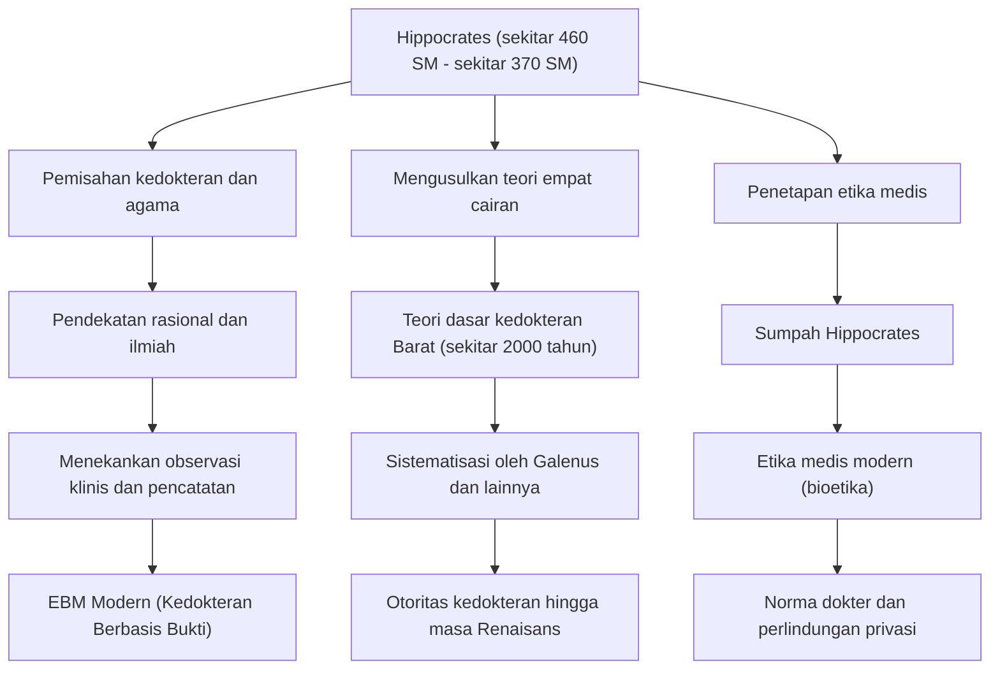

Di Yunani Kuno, kedokteran telah lama dikaitkan dengan doa kepada para dewa, takhayul, dan sihir. Di era ketika penyakit dianggap sebagai "hukuman dewa" atau "perbuatan roh jahat", ada seorang tokoh yang membalikkan akal sehat ini dari akarnya dan mengangkat kedokteran menjadi disiplin ilmu yang ilmiah dan rasional. Dialah Hippocrates, yang dikenal sebagai "Bapak Kedokteran". Artikel ini akan menggali lebih dalam tentang kehidupannya, filosofi medisnya yang inovatif, dan pengaruhnya yang sangat besar yang terus membentuk inti etika medis hingga saat ini.

## Kelahiran di Pulau Kos dan Kehidupan Mengembara

Hippocrates lahir sekitar tahun 460 SM di pulau Kos, di Laut Aegea. Keluarganya tergabung dalam gilda dokter yang mengklaim sebagai keturunan Asclepius (dewa pengobatan), dan dia tumbuh di lingkungan tempat dia terpapar praktik medis sejak usia muda. Dikatakan bahwa dia juga mempelajari dasar-dasar kedokteran dari ayahnya, Heracleides.

Namun, Hippocrates tidak hanya sekadar mewarisi praktik medis di kampung halamannya. Dia bepergian ke seluruh Yunani, dan bahkan hingga ke Mesir dan Asia Kecil (sekarang Turki), mengumpulkan data klinis yang sangat banyak sambil melakukan praktik medis di berbagai tempat. Meskipun transportasi terbatas pada saat itu, pengembaraan yang luas inilah yang membantunya mengembangkan mata untuk mengamati secara objektif bagaimana iklim, fitur geografis, dan pola makan memengaruhi kesehatan manusia. Di antara "Corpus Hippocraticum" yang dianggap sebagai karya-karyanya, terdapat sebuah risalah berjudul "On Airs, Waters, and Places" yang dapat disebut sebagai pelopor kedokteran lingkungan, dan di dalamnya hasil kerja lapangan dari periode ini sangat tercermin.

## Melepaskan Diri dari "Hukuman Dewa": Pendekatan Rasionalis

Pencapaian terbesar Hippocrates terletak pada pergeseran penyebab penyakit dari "kekuatan supernatural" ke "hukum alam dan keseimbangan fisik manusia".

Pada saat itu, epilepsi disebut "penyakit suci" dan ditakuti sebagai penyakit misterius yang disebabkan oleh kerasukan dewa. Namun, Hippocrates berpendapat dengan tegas bahwa epilepsi bukanlah penyakit khusus, melainkan kondisi alami yang disebabkan oleh kelainan otak. Ini adalah pergeseran paradigma sejarah untuk memisahkan kedokteran dari agama dan takhayul dan menetapkannya sebagai ilmu alam yang independen.

Inti dari sistem medisnya adalah teori "Empat Cairan (Humorisme)". Teori ini menyatakan bahwa tubuh manusia terdiri dari empat cairan: "darah", "dahak", "empedu kuning", dan "empedu hitam", dan penyakit terjadi ketika keseimbangan cairan ini terganggu. Meskipun tidak akurat dari perspektif anatomi atau fisiologi modern, gagasan bahwa "penyakit timbul dari ketidakseimbangan fisik dan kimia di dalam tubuh" terus berkuasa sebagai teori dasar kedokteran Barat selama sekitar 2000 tahun. Dia menekankan pendekatan yang meningkatkan kekuatan penyembuhan alami seperti diet, olahraga, dan istirahat, serta mempraktikkan perawatan "berpusat pada pasien" yang menghindari pengobatan dan operasi yang berlebihan.

## Monumen Etika Medis: Sumpah Hippocrates

Nama Hippocrates terus diturunkan di kalangan tenaga medis hingga saat ini sebagai "Sumpah Hippocrates (Hippocratic Oath)". Sumpah ini mengartikulasikan kewajiban etis yang harus dipatuhi dokter terhadap pasiennya.

Poin-poin seperti "tidak membahayakan pasien", "melindungi privasi", dan "mengetahui batas kemampuan sendiri dan menyerahkan kepada spesialis" sangat selaras dengan semangat etika medis modern (bioetika). Khususnya, prinsip "pertama, jangan menyakiti" adalah aturan pengobatan paling penting yang berasal dari ajarannya dan masih diukir di hati mahasiswa kedokteran di seluruh dunia ketika mereka mengenakan jas putih. Kedalaman filosofinya terletak pada fakta bahwa ia sangat menuntut "karakter" dan "pandangan moral" sebagai seorang dokter, bukan hanya pengetahuan dan keterampilan.

## Prestasi dan Pengaruh pada Generasi Mendatang

Kontribusi yang dibuat oleh Hippocrates pada bidang kedokteran dan bagaimana hal tersebut dihubungkan dengan pengobatan generasi selanjutnya diringkas dalam diagram berikut.

## Kesimpulan: Semangat Hippocrates yang Hidup di Era Modern

Hippocrates meninggal dunia di Larissa, di wilayah Thessaly, sekitar tahun 370 SM. Bahkan setelah kematiannya, ajarannya diteruskan oleh murid-muridnya dan dokter-dokter generasi berikutnya, menjadi fondasi mutlak kedokteran Barat.

Dalam masyarakat modern, teknologi medis seperti diagnosis AI dan terapi gen telah berevolusi ke tingkat yang tidak dapat dibayangkan oleh Hippocrates. Namun, perspektif holistik yang memandang pasien sebagai satu "keseluruhan" dan berupaya memaksimalkan kekuatan penyembuhan alami, serta semangat etika medis yang mempertanyakan "bagaimana menghadapi pasien sebagai manusia" sebelum teknologi, tidak pernah memudar.

Sebaliknya, justru dalam kedokteran modern yang sangat terspesialisasi dan terfragmentasi ini, "pengobatan yang berpusat pada pasien" dan "etika sebagai dokter" yang dianjurkan oleh Hippocrates bersinar lebih terang. Benih-benih yang ditabur oleh "Bapak Kedokteran" telah melampaui waktu selama 2400 tahun dan sekarang masih berakar kuat dalam fondasi kedokteran yang menopang kehidupan kita.
