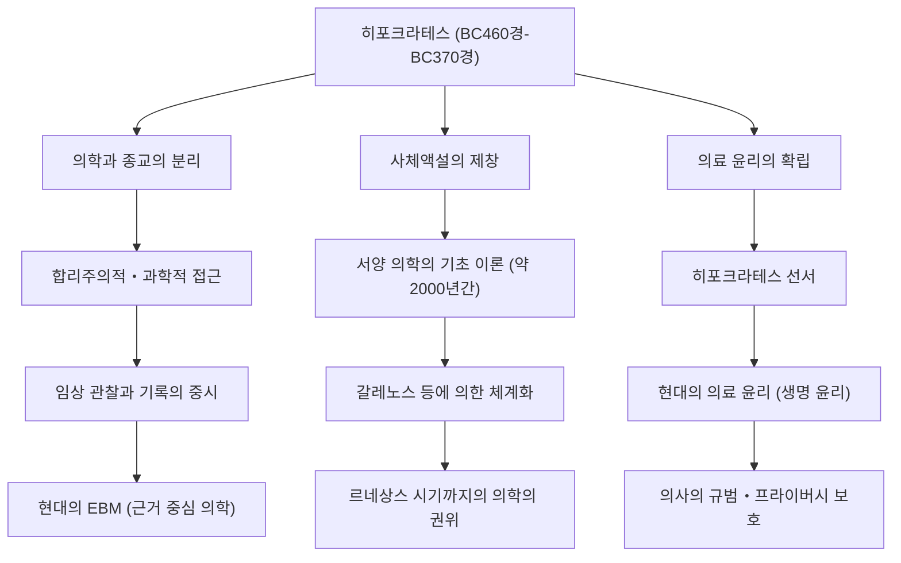

고대 그리스에서 의학은 오랫동안 신들에 대한 기도나 미신, 마술과 깊이 결부되어 있었습니다. 질병이 "신의 벌" 혹은 "악령의 소행"으로 여겨지던 시대에, 그 상식을 근본부터 뒤집고 의학을 과학적이고 합리적인 학문으로 승화시킨 인물이 있습니다. 그가 바로 "의학의 아버지"라 불리는 히포크라테스(Hippocrates)입니다. 본 기사에서는 그의 생애, 획기적인 의료 철학, 그리고 오늘날에 이르기까지 의료 윤리의 근간을 계속해서 형성하고 있는 그 지대한 영향력에 대해 깊이 파헤쳐 보겠습니다.

## 코스 섬에서의 탄생과 편력의 생애

히포크라테스는 기원전 460년경 에게해에 떠 있는 코스 섬에서 태어났습니다. 그의 가문은 아스클레피오스(의술의 신)의 후예를 자처하는 의사 길드에 속해 있었으며, 어릴 적부터 의술을 접하는 환경에서 자랐습니다. 아버지인 헤라클레이데스로부터도 의학의 기초를 배웠다고 전해집니다.

하지만 히포크라테스는 단순히 고향에서 가업을 잇는 데 그치지 않았습니다. 그는 그리스 전역, 나아가 이집트와 소아시아(현재의 튀르키예)까지 발걸음을 옮겨, 각지에서 의료 행위를 하며 방대한 임상 데이터를 수집했습니다. 당시는 교통수단도 제한적이던 시대였지만, 이러한 광범위한 편력이야말로 기후나 풍토, 식생활이 인간의 건강에 어떠한 영향을 미치는지를 객관적으로 관찰하는 눈을 기르는 데 도움이 되었습니다. 그의 저술로 여겨지는 『히포크라테스 전집』 속에는 환경 의학의 선구라고도 할 수 있는 『공기, 물, 장소에 관하여』라는 논문이 포함되어 있으며, 그곳에는 이 시기 필드워크의 성과가 짙게 반영되어 있습니다.

## "신의 벌"로부터의 탈피: 합리주의적 접근

히포크라테스의 가장 큰 업적은 질병의 원인을 "초자연적인 힘"에서 "자연계의 법칙과 인간의 신체적인 균형"으로 이동시킨 데 있습니다.

당시 뇌전증은 "신성병"이라 불리며, 신이 씌어서 생긴 불가해한 병으로 두려움의 대상이었습니다. 하지만 히포크라테스는 뇌전증을 특별한 병이 아니라 뇌의 이상으로 인해 발생하는 자연스러운 질환이라고 정면으로 주장했습니다. 이는 의학을 종교나 미신으로부터 분리하여 독립된 자연과학으로 확립하기 위한 역사적인 패러다임 전환이었습니다.

그의 의학 체계의 근간을 이루는 것이 "사체액설(Humorism)"입니다. 인간의 몸은 "혈액", "점액", "황담즙", "흑담즙"이라는 4가지 체액으로 구성되어 있으며, 이들의 균형이 무너졌을 때 질병이 발생한다는 이론입니다. 현대의 해부학이나 생리학의 관점에서 보면 부정확하지만, "질병은 신체 내부의 물리적, 화학적인 불균형에서 발생한다"는 생각은 이후 약 2000년에 걸쳐 서양 의학의 기초 이론으로 군림했습니다. 그는 식이요법이나 운동, 휴식 등 자연 치유력을 높이는 접근법을 중시했으며, 과도한 투약이나 수술을 피하는 "환자 중심"의 치료를 실천했습니다.

## 의료 윤리의 금자탑: 히포크라테스 선서

히포크라테스의 이름은 현대에도 "히포크라테스 선서(Hippocratic Oath)"로서 의료 종사자들 사이에서 전해져 내려오고 있습니다. 이 선서는 의사가 환자에게 지켜야 할 윤리적 의무를 명문화한 것입니다.

"환자에게 해를 끼치지 않을 것", "프라이버시를 보호할 것", "자신의 능력의 한계를 알고 전문가에게 맡길 것" 등의 항목은 현대 의료 윤리(생명 윤리)의 정신과 놀라울 정도로 일치합니다. 특히 "무엇보다도 해를 끼치지 말라"는 원칙은 그의 가르침에서 유래한 의료의 가장 중요한 계율로서, 지금도 전 세계 의대생들이 백의를 입을 때 가슴에 새기는 말입니다. 지식이나 기술뿐만 아니라 의사로서의 "인격"이나 "도덕관"을 강하게 요구했다는 점에 그의 철학의 깊이가 있습니다.

## 업적과 후세에 미친 영향

히포크라테스가 가져온 의학에 대한 공헌과 그것이 후세의 의료에 어떻게 이어졌는지를 아래 그림에 정리했습니다.

## 맺음말: 현대에 살아 숨쉬는 히포크라테스의 정신

히포크라테스는 기원전 370년경 테살리아 지방의 라리사에서 생애를 마감했습니다. 그의 사후에도 그 가르침은 제자들과 후세 의사들에 의해 계승되어, 서양 의학의 절대적인 기반이 되었습니다.

현대 사회에서는 AI 진단이나 유전자 치료 등, 의료 기술은 히포크라테스가 상상조차 할 수 없었던 차원으로 진화하고 있습니다. 하지만 환자를 하나의 "전체"로 파악하고, 자연 치유력을 최대한으로 이끌어내려는 전인적(Holistic)인 시각이나, 기술보다 먼저 "인간으로서 환자를 어떻게 대할 것인가"를 묻는 의료 윤리의 정신은 전혀 퇴색되지 않았습니다.

오히려 고도로 전문화되고 세분화된 현대 의료에서야말로, 히포크라테스가 제창한 "환자 중심의 의료"와 "의사로서의 윤리관"은 한층 더 빛을 발하고 있다고 할 수 있을 것입니다. "의학의 아버지"가 뿌린 씨앗은 2400년의 시간을 넘어, 지금도 우리의 생명을 지탱하는 의료의 근저에 깊이 뿌리를 내리고 있습니다.
