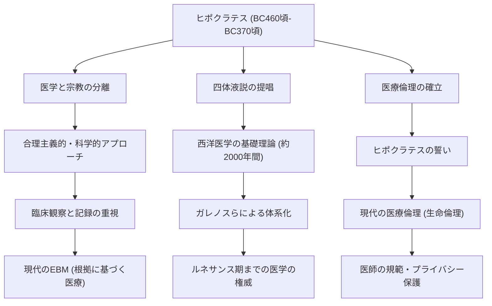

古代ギリシアにおいて、医学は長らく神々への祈りや迷信、魔術と深く結びついていました。病は「神の罰」あるいは「悪霊の仕業」と考えられていた時代に、その常識を根本から覆し、医学を科学的かつ合理的な学問へと昇華させた人物がいます。それが「医学の父」と称されるヒポクラテス（Hippocrates）です。本記事では、彼の生涯、画期的な医療哲学、そして今日に至るまで医療倫理の根幹をなし続けるその多大な影響力について深く掘り下げていきます。

## コス島での誕生と遍歴の生涯

ヒポクラテスは紀元前460年頃、エーゲ海に浮かぶコス島で誕生しました。彼の家系はアスクレピオス（医術の神）の末裔を自称する医師のギルドに属しており、幼い頃から医術に触れる環境で育ちました。父親であるヘラクレイデスからも医学の基礎を学んだと伝えられています。

しかし、ヒポクラテスは単に故郷で医業を継ぐにとどまりませんでした。彼はギリシア全土、さらにはエジプトや小アジア（現在のトルコ）にまで足を運び、各地で医療行為を行いながら膨大な臨床データを収集しました。当時は交通手段も限られていた時代ですが、この広範な遍歴こそが、気候や風土、食生活が人間の健康にどのような影響を与えるかを客観的に観察する目を養うことにつながったのです。彼の著書群とされる『ヒポクラテス集典』のなかには、環境医学の先駆とも言える『空気・水・場所について』という論文が含まれており、そこにはこの時期のフィールドワークの成果が色濃く反映されています。

## 「神の罰」からの脱却：合理主義的アプローチ

ヒポクラテスの最大の功績は、病気の原因を「超自然的な力」から「自然界の法則と人間の身体的なバランス」へと移行させたことにあります。

当時、てんかんは「神聖病」と呼ばれ、神が取り憑いたことによる不可解な病として恐れられていました。しかしヒポクラテスは、てんかんを特別な病気ではなく、脳の異常によって引き起こされる自然な疾患であると真っ向から主張しました。これは、医学を宗教や迷信から切り離し、独立した自然科学として確立するための歴史的なパラダイムシフトでした。

彼の医学体系の根幹をなすのが「四体液説（Humorism）」です。人間の体は「血液」「粘液」「黄胆汁」「黒胆汁」の4つの体液で構成されており、これらのバランスが崩れたときに病気が発生するという理論です。現代の解剖学や生理学から見れば不正確ですが、「病気は身体内部の物理的・化学的な不均衡から生じる」という考え方は、その後約2000年にわたり西洋医学の基礎理論として君臨し続けました。彼は、食事療法や運動、休息といった自然治癒力を高めるアプローチを重んじ、過度な投薬や手術を避ける「患者中心」の治療を実践しました。

## 医療倫理の金字塔：ヒポクラテスの誓い

ヒポクラテスの名は、現代においても「ヒポクラテスの誓い（Hippocratic Oath）」として医療従事者の間で語り継がれています。この誓いは、医師が患者に対して守るべき倫理的義務を明文化したものです。

「患者に害を与えないこと」「プライバシーを保護すること」「自身の能力の限界を知り、専門家に委ねること」といった項目は、現代の医療倫理（バイオエシックス）の精神と驚くほど合致しています。特に「まず第一に、害を与えないこと」という原則は、彼の教えに由来する医療の最も重要な戒律として、今もなお世界中の医学生が白衣を着る際に胸に刻む言葉です。知識や技術だけでなく、医師としての「人格」や「道徳観」を強く求めた点に、彼の哲学の奥深さがあります。

## 功績と後世への影響

ヒポクラテスがもたらした医学への貢献と、それが後世の医療にどのようにつながっていったかを以下の図にまとめました。

## 結びとして：現代に息づくヒポクラテスの精神

ヒポクラテスは紀元前370年頃にテッサリア地方のラリッサでその生涯を閉じました。彼の死後も、その教えは弟子たちや後世の医師によって受け継がれ、西洋医学の絶対的な基盤となりました。

現代社会では、AI診断や遺伝子治療など、医療技術はヒポクラテスが想像もできなかった次元へと進化しています。しかし、患者を一つの「全体」として捉え、自然治癒力を最大限に引き出そうとするホリスティック（全人的）な視点や、技術よりも前に「人として患者にどう向き合うか」を問う医療倫理の精神は、一切色褪せていません。

むしろ、高度に専門化し、細分化された現代医療においてこそ、ヒポクラテスが提唱した「患者中心の医療」と「医師としての倫理観」は、より一層の輝きを放っていると言えるでしょう。「医学の父」が蒔いた種は、2400年の時を超えて、今も私たちの命を支える医療の根底に深く根を張っているのです。
