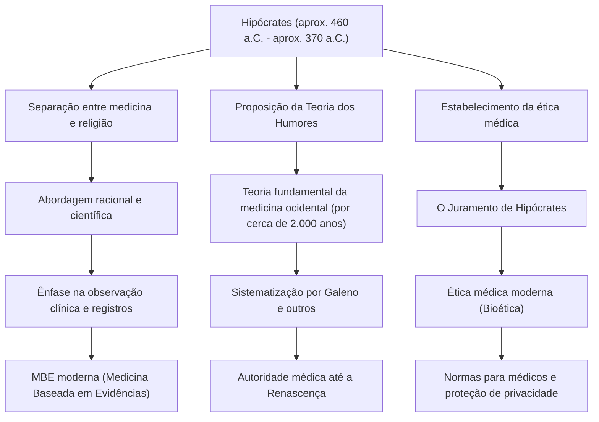

Na Grécia Antiga, a medicina esteve por muito tempo profundamente ligada a orações aos deuses, superstições e magia. Em uma época em que a doença era considerada um "castigo divino" ou "obra de espíritos malignos", houve um homem que derrubou fundamentalmente esse senso comum e elevou a medicina a uma disciplina científica e racional. Este é Hipócrates (Hippocrates), aclamado como o "Pai da Medicina". Neste artigo, vamos aprofundar a sua vida, a sua inovadora filosofia médica e a sua enorme influência que continua a formar a base da ética médica até hoje.

## Nascimento na Ilha de Cós e uma Vida de Andanças

Hipócrates nasceu por volta de 460 a.C. na ilha de Cós, no Mar Egeu. Sua família pertencia a uma guilda de médicos que afirmavam ser descendentes de Asclépio (o deus da medicina), e ele cresceu em um ambiente exposto às artes médicas desde cedo. Diz-se que ele também aprendeu os fundamentos da medicina com o seu pai, Heráclides.

No entanto, Hipócrates não se limitou a continuar a prática médica em sua cidade natal. Ele viajou por toda a Grécia e até pelo Egito e Ásia Menor (atual Turquia), coletando uma vasta quantidade de dados clínicos enquanto praticava a medicina em vários lugares. Numa época em que os meios de transporte eram limitados, foram essas extensas andanças que o ajudaram a cultivar um olhar objetivo sobre como o clima, o ambiente e a dieta afetam a saúde humana. Entre os escritos atribuídos a ele, o "Corpus Hippocraticum", encontra-se um tratado intitulado "Dos Ares, Águas e Lugares", que pode ser considerado um precursor da medicina ambiental, e que reflete fortemente os resultados de seu trabalho de campo nesse período.

## A Ruptura com o "Castigo Divino": Uma Abordagem Racionalista

A maior conquista de Hipócrates reside em ter mudado a causa das doenças de "forças sobrenaturais" para as "leis da natureza e o equilíbrio físico humano".

Naquela época, a epilepsia era chamada de "doença sagrada" e era temida como uma doença misteriosa causada por possessão divina. No entanto, Hipócrates argumentou veementemente que a epilepsia não era uma doença especial, mas sim um distúrbio natural causado por uma anormalidade no cérebro. Esta foi uma mudança de paradigma histórico para separar a medicina da religião e superstição, estabelecendo-a como uma ciência natural independente.

A base de seu sistema médico é a "Teoria dos Humores" (Humorismo). A teoria sustenta que o corpo humano é composto por quatro humores: "sangue", "fleuma", "bílis amarela" e "bílis negra", e que as doenças ocorrem quando o equilíbrio entre eles é perturbado. Embora seja impreciso sob a perspectiva da anatomia e fisiologia modernas, a ideia de que "a doença surge de um desequilíbrio físico e químico interno do corpo" reinou como a teoria fundamental da medicina ocidental por cerca de 2.000 anos. Ele valorizava abordagens que melhoravam o poder de cura natural, como dieta, exercícios e descanso, praticando um tratamento "centrado no paciente" que evitava medicações e cirurgias excessivas.

## O Monumento da Ética Médica: O Juramento de Hipócrates

O nome de Hipócrates ainda hoje é transmitido entre os profissionais de saúde como o "Juramento de Hipócrates" (Hippocratic Oath). Este juramento documentou as obrigações éticas que os médicos devem manter em relação aos seus pacientes.

Itens como "não causar danos ao paciente", "proteger a privacidade" e "conhecer os limites da própria capacidade e encaminhar a especialistas" coincidem surpreendentemente com o espírito da ética médica moderna (bioética). Em particular, o princípio "antes de tudo, não causar danos" ("primum non nocere") é o preceito mais importante da medicina derivado de seus ensinamentos, e continua a ser uma frase que os estudantes de medicina ao redor do mundo gravam em seus corações ao vestirem seus jalecos brancos. A profundidade de sua filosofia reside no fato de que ele exigia fortemente não apenas conhecimento e habilidade, mas também "caráter" e "moralidade" como médico.

## Conquistas e Influência nas Gerações Posteriores

A figura abaixo resume a contribuição de Hipócrates para a medicina e como ela se conectou com a medicina nas gerações posteriores.

## Conclusão: O Espírito de Hipócrates Vivo na Era Moderna

Hipócrates concluiu sua vida em Lárissa, na região da Tessália, por volta de 370 a.C. Mesmo após a sua morte, os seus ensinamentos foram passados aos seus discípulos e a médicos das gerações posteriores, tornando-se a base absoluta da medicina ocidental.

Na sociedade moderna, com diagnósticos por IA e terapia genética, a tecnologia médica evoluiu para uma dimensão que Hipócrates nem poderia imaginar. No entanto, a perspectiva holística de olhar para o paciente como um "todo" e tentar maximizar o poder de cura natural, bem como o espírito da ética médica que questiona "como enfrentar o paciente como ser humano" antes da tecnologia, não perderam de forma alguma a sua força.

Pelo contrário, é exatamente na medicina moderna, altamente especializada e fragmentada, que se pode dizer que o "cuidado centrado no paciente" e o "senso de ética como médico" propostos por Hipócrates brilham ainda mais intensamente. As sementes plantadas pelo "Pai da Medicina" enraizaram-se profundamente, transpondo 2.400 anos, e continuam a formar a base da medicina que sustenta as nossas vidas hoje.
