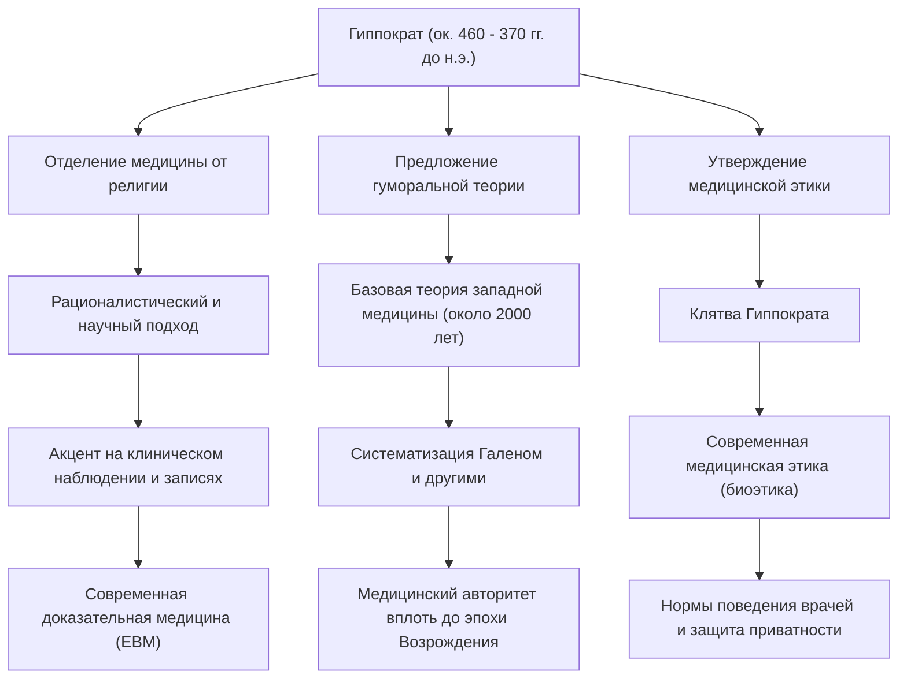

В Древней Греции медицина долгое время была тесно связана с молитвами богам, суевериями и магией. В эпоху, когда болезни считались «карой богов» или «проделками злых духов», один человек в корне перевернул эти представления и возвысил медицину до уровня научной и рациональной дисциплины. Это был Гиппократ, которого называют «отцом медицины». В этой статье мы подробно рассмотрим его жизнь, новаторскую медицинскую философию и его огромное влияние, которое до сих пор является основой медицинской этики.

## Рождение на острове Кос и жизнь в странствиях

Гиппократ родился около 460 года до н.э. на острове Кос в Эгейском море. Его семья принадлежала к гильдии врачей, утверждавшей, что они ведут свой род от Асклепия (бога медицины), и он вырос в среде, где с детства соприкасался с врачебным искусством. Считается, что он также изучал основы медицины у своего отца, Гераклида.

Однако Гиппократ не ограничился лишь продолжением врачебной практики на родине. Он путешествовал по всей Греции, а также побывал в Египте и Малой Азии (на территории современной Турции), собирая обширные клинические данные во время медицинской практики в разных местах. Хотя в то время средства передвижения были ограничены, именно эти обширные странствия помогли ему развить способность объективно наблюдать, как климат, природные условия и питание влияют на здоровье человека. Среди трудов, входящих в так называемый «Гиппократов сборник» (Corpus Hippocraticum), есть трактат «О воздухах, водах и местностях», который можно назвать предвестником экологической медицины, и в нем ярко отражены результаты его полевых исследований того периода.

## Отказ от «кары богов»: рационалистический подход

Величайшим достижением Гиппократа стал переход в поиске причин болезней от «сверхъестественных сил» к «законам природы и телесному равновесию человека».

В то время эпилепсию называли «священной болезнью» и боялись как загадочного недуга, вызванного одержимостью духами. Однако Гиппократ прямо заявил, что эпилепсия — это не особая болезнь, а естественное заболевание, вызванное патологией мозга. Это был исторический сдвиг парадигмы, направленный на отделение медицины от религии и суеверий и утверждение ее как независимой естественной науки.

Основой его медицинской системы была «гуморальная теория» (учение о четырех жидкостях). Согласно этой теории, человеческое тело состоит из четырех жидкостей: крови, слизи, желтой желчи и черной желчи, и когда их баланс нарушается, возникает болезнь. Хотя с точки зрения современной анатомии и физиологии это неточно, идея о том, что «болезнь возникает из-за физического и химического дисбаланса внутри организма», господствовала в качестве базовой теории западной медицины на протяжении почти 2000 лет. Он придавал большое значение подходам, повышающим естественную способность организма к исцелению, таким как диета, физические упражнения и отдых, и практиковал «пациентоцентричное» лечение, избегая чрезмерного использования лекарств и хирургических вмешательств.

## Монумент медицинской этики: Клятва Гиппократа

Имя Гиппократа и сегодня передается из поколения в поколение среди медицинских работников как «Клятва Гиппократа». Эта клятва закрепляет этические обязательства, которые врач должен соблюдать по отношению к пациенту.

Такие пункты, как «не навреди пациенту», «сохраняй тайну (конфиденциальность)» и «знай пределы своих возможностей и доверяй специалистам», поразительно совпадают с духом современной медицинской этики (биоэтики). В частности, принцип «прежде всего, не навреди» (Primum non nocere), являющийся самым важным медицинским правилом, вытекающим из его учений, до сих пор остается в сердцах студентов-медиков по всему миру, когда они надевают белые халаты. Глубина его философии заключается в том, что он настоятельно требовал от врачей не только знаний и навыков, но и «характера» и «моральных ценностей».

## Достижения и влияние на последующие поколения

Вклад Гиппократа в медицину и его влияние на последующую медицинскую практику обобщены на следующей схеме.

## В заключение: Дух Гиппократа, живущий в наши дни

Гиппократ окончил свою жизнь около 370 года до н.э. в Ларисе, в области Фессалия. Даже после его смерти его учения были унаследованы учениками и врачами последующих поколений, став незыблемой основой западной медицины.

В современном обществе медицинские технологии, такие как диагностика с помощью ИИ и генная терапия, эволюционировали до уровня, который Гиппократ не мог себе даже представить. Однако холистический взгляд на пациента как на единое «целое», стремление максимально использовать его природные целительные силы, а также дух медицинской этики, задающий вопрос «как относиться к пациенту как к человеку» прежде технологий, ничуть не померкли.

Скорее можно сказать, что именно в современной медицине, которая стала узкоспециализированной и фрагментированной, «пациентоцентричная медицина» и «этические нормы врача», за которые выступал Гиппократ, сияют еще ярче. Семена, посеянные «отцом медицины», преодолев 2400 лет, и сегодня глубоко укоренены в самом фундаменте медицины, поддерживающей наши жизни.
