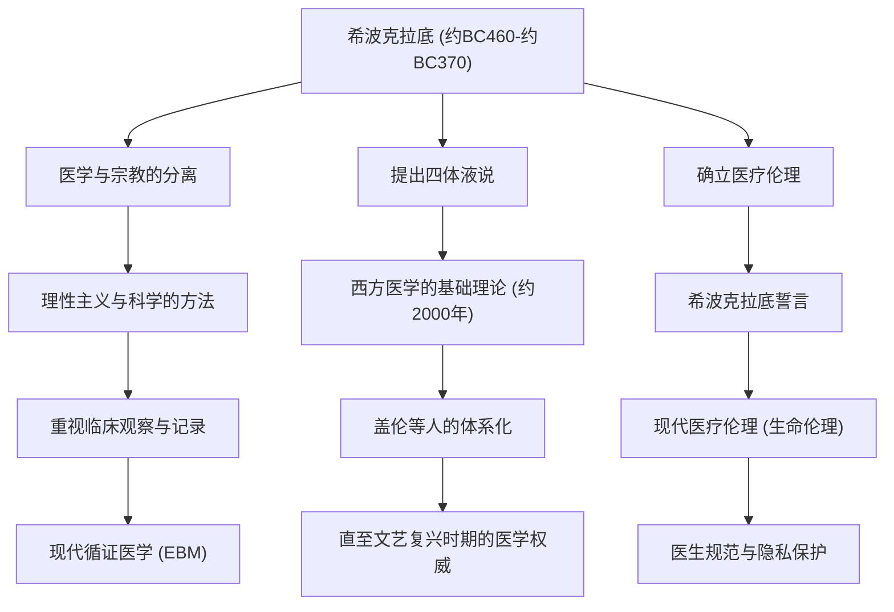

在古希腊，医学长期以来与向神明祈祷、迷信和魔法紧密相连。在那个认为疾病是“神的惩罚”或“恶灵作祟”的时代，有一个人从根本上颠覆了这一常识，将医学升华为科学且合理的学问。他就是被尊称为“医学之父”的希波克拉底（Hippocrates）。在本文中，我们将深入探讨他的生平、具有划时代意义的医学哲学，以及他至今仍在构成医疗伦理根基的巨大影响力。

## 在科斯岛的诞生与游历的一生

希波克拉底大约在公元前460年出生于爱琴海的科斯岛。他的家族属于自称是阿斯克勒庇俄斯（医神）后裔的医师行会，从小就在接触医术的环境中长大。据传，他也从父亲赫拉克利德斯那里学习了医学的基础。

然而，希波克拉底并没有仅仅停留在故乡继承医业。他的足迹遍布整个希腊，甚至远至埃及和小亚细亚（现土耳其），在各地行医的同时收集了庞大的临床数据。在那个交通方式受限的时代，正是这种广泛的游历，培养了他客观观察气候、风土和饮食习惯对人类健康会产生何种影响的眼光。在他被认为是其著作集的《希波克拉底文集》中，包含了一篇堪称环境医学先驱的论文——《论空气、水和环境》，其中浓墨重彩地反映了这一时期实地考察的成果。

## 摆脱“神的惩罚”：理性主义的方法

希波克拉底最大的功绩，在于将疾病的原因从“超自然的力量”转移到了“自然界的规律和人体内部的平衡”上。

当时，癫痫被称为“神圣病”，人们因为它是被神明附体而引起的不可思议的疾病而感到恐惧。然而，希波克拉底毫不退缩地主张癫痫并不是一种特殊的疾病，而是由大脑异常引起的自然疾病。这是一次历史性的范式转变，它将医学从宗教和迷信中剥离出来，使其确立为一门独立的自然科学。

构成他医学体系根基的是“四体液说（Humorism）”。该理论认为，人体由“血液”、“黏液”、“黄胆汁”和“黑胆汁”四种体液组成，当这些体液的平衡被打破时，就会发生疾病。从现代解剖学和生理学的角度来看，虽然这并不准确，但“疾病源于身体内部的物理和化学不平衡”这一思想，在随后的约2000年里一直作为西方医学的基础理论占据着统治地位。他重视通过饮食疗法、运动和休息来提高自然治愈力的方法，实践了避免过度用药和手术的“以患者为中心”的治疗。

## 医疗伦理的金字塔：希波克拉底誓言

希波克拉底的名字，在现代也作为“希波克拉底誓言（Hippocratic Oath）”在医疗工作者中代代相传。这份誓言明文规定了医生对患者应遵守的伦理义务。

诸如“不伤害患者”、“保护隐私”、“知晓自身能力的极限并委托给专家”等条款，与现代医疗伦理（生命伦理学）的精神惊人地一致。特别是“首先，不造成伤害”的原则，作为源自他教诲的医疗中最重要的戒律，至今仍是全世界医学生穿上白大褂时铭记在心的话语。他的哲学之深邃，就在于不仅要求知识和技术，还强烈要求医生具备“人格”和“道德观”。

## 功绩与对后世的影响

下图总结了希波克拉底对医学做出的贡献，以及它是如何与后世的医疗联系在一起的。

## 结语：现存于世的希波克拉底精神

希波克拉底大约在公元前370年于色萨利地区的拉里萨结束了他的一生。他死后，他的教诲由弟子和后世的医生继承，成为了西方医学绝对的基石。

在现代社会，诸如AI诊断和基因治疗等医疗技术，已经进化到了希波克拉底无法想象的维度。然而，将患者视为一个“整体”并试图最大限度地激发自然治愈力的整体论（全人）视角，以及在技术之前先问“作为人该如何面对患者”的医疗伦理精神，却丝毫没有褪色。

倒不如说，正是在高度专业化、细分化的现代医疗中，希波克拉底所提倡的“以患者为中心的医疗”和“作为医生的伦理观”，绽放出了更加耀眼的光芒。“医学之父”播下的种子，跨越了2400年的时光，如今依然深深地扎根于支撑我们生命的医疗的根基之中。
