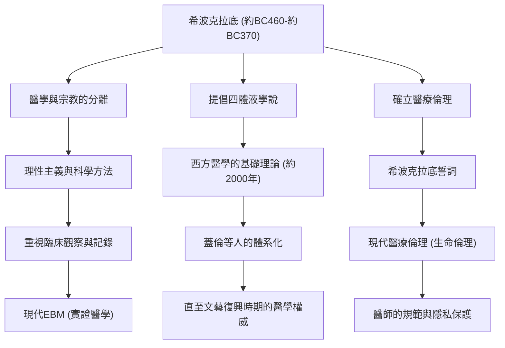

在古希臘，醫學長期以來與向神明祈禱、迷信和巫術有著深厚的連結。在那個將疾病視為「神明的懲罰」或「惡靈作祟」的時代，有一個人從根本上顛覆了這個常識，將醫學昇華為一門科學且合理的學問。他就是被尊稱為「醫學之父」的希波克拉底（Hippocrates）。本文將深入探討他的生平、劃時代的醫療哲學，以及至今仍作為醫療倫理核心並持續發揮的巨大影響力。

## 科斯島的誕生與雲遊四海的生平

希波克拉底約在西元前460年出生於愛琴海上的科斯島。他的家族屬於自稱是阿斯克勒庇俄斯（醫神）後裔的醫師公會，從小就在接觸醫術的環境中長大。據說他也從父親赫拉克利德斯那裡學習了醫學的基礎。

然而，希波克拉底並沒有僅僅停留在故鄉繼承醫業。他的足跡遍布全希臘，甚至遠赴埃及和小亞細亞（現在的土耳其），一邊在各地行醫，一邊收集了龐大的臨床數據。當時雖然交通工具非常有限，但正是這種廣泛的遊歷，培養了他客觀觀察氣候、風土和飲食習慣如何影響人類健康的眼光。在被認為是他的著作群《希波克拉底文集》中，包含了一篇可說是環境醫學先驅的論文《論氣候、水與地域》，其中濃烈地反映了這個時期的田野調查成果。

## 擺脫「神明的懲罰」：理性主義的方法

希波克拉底最大的功績在於，將疾病的原因從「超自然的力量」轉移到了「自然界的法則與人體內部的平衡」。

當時，癲癇被稱為「神聖病」，人們恐懼地認為那是神明附身所引起的不可思議的疾病。但希波克拉底卻正面主張，癲癇並不是什麼特殊的疾病，而是由大腦異常所引起的自然疾病。這是一個歷史性的典範轉移，將醫學從宗教和迷信中抽離出來，確立為一門獨立的自然科學。

構成他醫學體系核心的是「四體液學說（Humorism）」。該理論認為人體是由「血液」、「黏液」、「黃膽汁」和「黑膽汁」這四種體液所構成，當這些體液的平衡被破壞時，就會發生疾病。從現代解剖學和生理學的角度來看，這並不準確，但「疾病源於身體內部物理、化學上的不平衡」這種觀念，在此後約兩千年的時間裡，一直統治著西方醫學的基礎理論。他重視透過飲食療法、運動和休息來提高自然治癒力的方法，實踐了避免過度投藥和手術的「以患者為中心」的治療。

## 醫療倫理的金字塔：希波克拉底誓詞

即便在現代，希波克拉底的名字也以「希波克拉底誓詞（Hippocratic Oath）」的形式在醫療從業人員之間代代相傳。這個誓詞明文規定了醫師對患者應當遵守的倫理義務。

「不對患者造成傷害」、「保護隱私」、「了解自身能力的極限並委託給專家」等項目，與現代醫療倫理（生物倫理）的精神有著驚人的契合。尤其是「首先，不造成傷害」這個原則，作為源自他教誨的醫療最重要戒律，至今仍是全世界醫學生穿上白袍時銘記在心的話語。不僅要求知識和技術，更強烈要求作為醫師的「人格」與「道德觀」，這正是他哲學深奧之處。

## 功績與對後世的影響

希波克拉底對醫學的貢獻，以及它如何與後世的醫療產生連結，總結在以下圖表中。

## 結語：在現代生生不息的希波克拉底精神

約在西元前370年，希波克拉底於色薩利地區的拉里薩結束了他的一生。在他死後，他的教誨也被弟子和後世的醫師們繼承，成為了西方醫學不可動搖的基石。

在現代社會，AI診斷和基因治療等醫療技術，已進化到希波克拉底無法想像的次元。然而，將患者視為一個「整體」，試圖最大限度地激發自然治癒力的全人（Holistic）觀點，以及在技術之前叩問「作為一個人該如何面對患者」的醫療倫理精神，卻絲毫未曾褪色。

倒不如說，正是在高度專業化、細分化的現代醫療中，希波克拉底所提倡的「以患者為中心的醫療」和「作為醫師的倫理觀」，才散發出更加耀眼的光芒。「醫學之父」所播下的種子，跨越了2400年的時光，如今依然深深地紮根在支撐著我們生命的醫療根基之中。
