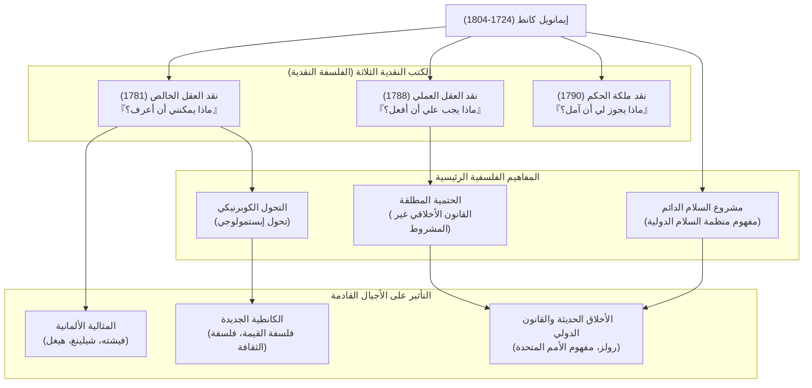

## مقدمة: تحول نموذجي هائل في الفلسفة وُلد من حياة دقيقة كالساعة

نجم عملاق لا يمكن تجاهله أبدًا عند الحديث عن الفلسفة الحديثة. إنه **إيمانويل كانط (Immanuel Kant, 1724–1804)**. وُلد في كونيغسبرغ في مملكة بروسيا (كالينينغراد في الاتحاد الروسي حاليًا)، وعاش هناك طوال حياته دون أن يغادرها، مقضيًا أيامًا هادئة ومنتظمة. وتعد الحكاية القائلة بأن وقت نزهته كان بمثابة ساعة يومية للناس مشهورة جدًا.

ولكن، على عكس تلك الحياة الهادئة، كان عقله يمتلك قوة تفجيرية كافية لقلب تاريخ الفكر البشري من جذوره. فقد قامت فلسفة كانط بدمج الفلسفتين الرئيسيتين المتعارضتين في ذلك الوقت، "العقلانية القارية" و"التجريبية البريطانية"، وأحدثت **"تحولًا كوبرنيكيًا"** في الفلسفة.

في هذا المقال، سنستكشف كيف أرسى هذا المفكر المنعزل أسس الفلسفة الحديثة، وما هو التأثير الذي تركه على الأجيال اللاحقة، من خلال كشف خيوط حياته وجوهر أفكاره.

## حكيم كونيغسبرغ: حياة كانط

وُلد كانط عام 1724 كابن رابع لصانع سروج، ونشأ متأثرًا بشدة بالحركة التقوية. درس الفلسفة والرياضيات والعلوم الطبيعية في جامعة كونيغسبرغ، وبعد تخرجه واصل أبحاثه بينما كان يكسب عيشه كمدرس خاص.

ما يستحق الذكر بشكل خاص هو "ازدهاره المتأخر" و"قدرته المذهلة على الاستمرار". فقد تم تعيينه كأستاذ متفرغ (للمنطق والميتافيزيقا) في الجامعة عام 1770، عندما كان يبلغ من العمر 46 عامًا. وكتابه الأبرز الذي يتألق في تاريخ الفلسفة، "نقد العقل الخالص"، نُشر عندما كان في السابعة والخمسين من عمره (1781). وبعد ذلك واصل الكتابة بنشاط، وأكمل "نقد العقل العملي" و"نقد ملكة الحكم" في الستينيات من عمره.

بقي عازبًا طوال حياته وعاش حياة منتظمة. كان يستيقظ في الخامسة صباحًا كل يوم، ولم يكسر روتينه المتمثل في المحاضرات والكتابة ثم النزهة بدءًا من الساعة الثالثة والنصف عصرًا. هذا الانضباط الصارم كان هو الأساس الذي بُني عليه نظامه الفلسفي الدقيق والضخم.

## جوهر فلسفة كانط: الكتب النقدية الثلاثة و"التحول الكوبرنيكي"

تتمثل أعظم إنجازات كانط في فحصه الدقيق (نقده) لـ "قدرة المعرفة" البشرية نفسها. الهيكل الأساسي لفكره يتكون من "الكتب النقدية الثلاثة" التالية:

### 1. ثورة في نظرية المعرفة "نقد العقل الخالص" (ماذا يمكنني أن أعرف؟)
كانت الفلسفة قبل كانط تعتقد أن "المعرفة البشرية تتبع الموضوع" (فكرة أن عقولنا تستنسخ الأشياء كما هي في العالم الخارجي). لكن كانط قلب هذا الرأي قائلاً إن "الموضوع يتبع المعرفة البشرية". فقد جادل بأننا نستطيع إدراك الأشياء فقط لأننا نبني العالم من خلال "أشكال الحس" كزمان ومكان الموجودة لدينا، و"مقولات الفهم" مثل قانون السببية. وبمقارنة ذلك بالتحول من مركزية الأرض إلى مركزية الشمس، أطلق على هذا اسم **"التحول الكوبرنيكي"**. وبناءً على ذلك، استنتج أن الإنسان يمكنه فقط إدراك "الظواهر"، ولا يمكنه إدراك "الشيء في ذاته (الجوهر الحقيقي)".

### 2. تأسيس الفلسفة الأخلاقية "نقد العقل العملي" (ماذا يجب علي أن أفعل؟)
رغم أن الإنسان لا يستطيع إدراك "الشيء في ذاته"، إلا أنه في عالم الأخلاق، يمكننا نحن أنفسنا وضع قوانين بشكل مستقل. اقترح كانط **"الحتمية المطلقة"**، وهي قانون أخلاقي غير مشروط ("افعل كذا") بدلاً من الأوامر المشروطة ("إذا كنت تريد كذا، فافعل كذا"). ومقولته: "تصرف فقط وفقًا للمبدأ الذي يجعلك تستطيع أن تريد في نفس الوقت أن يصبح قانونًا عالميًا"، لا تزال تشكل الأساس الأكثر أهمية في الأخلاق المعاصرة.

### 3. فلسفة الجمال والغاية "نقد ملكة الحكم" (ماذا يجوز لي أن آمل؟)
تم وضع هذا العمل ليكون جسرًا بين عالمين مختلفين: القوانين الآلية للطبيعة (العقل الخالص) والإرادة الأخلاقية الحرة للإنسان (العقل العملي). استكشف الأحكام الجمالية مثل "الجمال" و"الجلال"، والأحكام الغائية التي تجد غاية في العالم الطبيعي.

## مخطط العلاقات ومسار الإنجازات

يوضح الشكل التالي نظام فلسفة كانط وتدفق تأثيره.

## التأثير الهائل على الأجيال اللاحقة: تجاوز كانط، ومع كانط

كان النظام الفلسفي الذي أسسه كانط ضخمًا للغاية. فالفلاسفة الذين جاءوا بعده، سواء اتفقوا معه أو عارضوه، واجهوا دائمًا تحدي "كيف يمكن تجاوز كانط".

نشأت **المثالية الألمانية**، التي امتدت لتشمل فيشته وشيلينغ وهيغل، من محاولة التغلب على مجال "الشيء في ذاته" الذي اعتبره كانط غير قابل للوصول. وفي النصف الثاني من القرن التاسع عشر، ظهرت **الكانطية الجديدة** تحت شعار "العودة إلى كانط"، وأرست أسس فلسفة العلوم وفلسفة الثقافة الحديثة.

علاوة على ذلك، فإن فكرة "اتحاد الدول الحرة" التي اقترحها في كتابه المتأخر "مشروع السلام الدائم"، قدمت إلهامًا مباشرًا لتأسيس عصبة الأمم والأمم المتحدة لاحقًا. كما أن رؤيته الأخلاقية التي تعامل كرامة الإنسان كغاية في حد ذاتها، لا تزال تنبض بالحياة في الفلسفة السياسية المعاصرة والفكر الحقوقي، مثل نظرية العدالة لجون رولز.

## خاتمة

إيمانويل كانط. رغم أن حياته اقتصرت جغرافيًا على نطاق ضيق للغاية، إلا أن مدى تفكيره امتد من حقائق الكون إلى أعماق الأخلاق البشرية، وصولاً إلى السلام العالمي للبشرية جمعاء.
"السماء المرصعة بالنجوم فوقي، والقانون الأخلاقي في داخلي". هذه العبارة من "نقد العقل العملي" والمنقوشة على شاهد قبره، ترمز إلى روح الفلسفة الكانطية نفسها، التي استمرت في التأكيد بقوة على حرية الإنسان وكرامته، مع التقييم الهادئ لحدود المعرفة البشرية. في هذا العصر الحديث المعقد وغير المؤكد، يجب أن يكون المسار الفكري الدقيق الذي تركه لنا بمثابة بوصلة موثوقة بالنسبة لنا.
