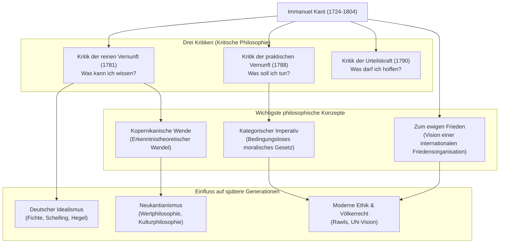

## Einleitung: Ein Leben pünktlich wie ein Uhrwerk und der größte Paradigmenwechsel der Philosophie

Ein gigantischer Stern, an dem man nicht vorbeikommt, wenn man über die moderne Philosophie spricht. Das ist **Immanuel Kant (1724–1804)**. Geboren in Königsberg, im Königreich Preußen (heute Kaliningrad, Russische Föderation), führte er ein friedliches und geregeltes Leben, ohne jemals seine Heimatstadt zu verlassen. Die Anekdote, dass die Einheimischen ihre Uhren nach seinen täglichen Spaziergängen stellten, ist nur zu berühmt.

Im Gegensatz zu seinem ruhigen Leben besaß sein Verstand jedoch eine explosive Kraft, die ausreichte, um die Geschichte des menschlichen Denkens umzukehren. Kants Philosophie integrierte die beiden großen, miteinander im Konflikt stehenden philosophischen Strömungen seiner Zeit, den „kontinentalen Rationalismus“ und den „britischen Empirismus“, und brachte eine **„Kopernikanische Wende“** in die Philosophie.

In diesem Artikel werden wir untersuchen, wie dieser einsame Denker den Grundstein für die moderne Philosophie legte und welchen Einfluss er auf künftige Generationen hatte, indem wir sein Leben und den Kern seines Denkens entschlüsseln.

## Der Weise von Königsberg: Kants Leben

Kant wurde 1724 als vierter Sohn eines Sattlers geboren und wuchs unter starkem Einfluss des Pietismus auf. Er studierte Philosophie, Mathematik und Naturwissenschaften an der Universität Königsberg und setzte nach seinem Abschluss seine Forschungen fort, während er seinen Lebensunterhalt als Hauslehrer verdiente.

Bemerkenswert sind sein „spätes Aufblühen“ und seine „erstaunliche Ausdauer“. Erst 1770, im Alter von 46 Jahren, wurde er zum ordentlichen Professor (für Logik und Metaphysik) an der Universität ernannt. Sein Meisterwerk, die *Kritik der reinen Vernunft*, das hell in der Philosophiegeschichte leuchtet, wurde veröffentlicht, als er bereits 57 Jahre alt war (1781). Auch danach schrieb er eifrig weiter und vollendete die *Kritik der praktischen Vernunft* sowie die *Kritik der Urteilskraft* in seinen 60ern.

Er blieb sein Leben lang unverheiratet und führte ein streng diszipliniertes Leben. Er wachte jeden Tag um 5 Uhr morgens auf und brach nie aus seiner Routine von Vorlesungen, Schreiben und einem Spaziergang ab 15:30 Uhr aus. Diese strenge Disziplin bildete das Fundament, auf dem er sein akribisches und grandioses philosophisches System aufbaute.

## Der Kern der Kantischen Philosophie: Die drei Kritiken und die „Kopernikanische Wende“

Kants größte Leistung liegt in der gründlichen Untersuchung (Kritik) des menschlichen „Erkenntnisvermögens“ selbst. Das Gerüst seines Denkens wird durch die folgenden „Drei Kritiken“ gebildet.

### 1. Die Revolution der Erkenntnistheorie, „Kritik der reinen Vernunft“ (Was kann ich wissen?)
Die Philosophie vor Kant glaubte, dass sich „die menschliche Erkenntnis nach den Gegenständen richtet“ (die Vorstellung, dass unser Geist die Dinge der Außenwelt so widerspiegelt, wie sie sind). Kant kehrte dies jedoch um und erklärte, dass sich „die Gegenstände nach unserer Erkenntnis richten“. Er argumentierte, dass wir die Dinge nur erkennen können, weil wir die Welt durch die „Formen der Sinnlichkeit“ (Zeit und Raum) und die „Kategorien des Verstandes“ (wie Kausalität), die in uns liegen, konstruieren. In Anlehnung an den Übergang vom geozentrischen zum heliozentrischen Weltbild wird dies die **„Kopernikanische Wende“** genannt. Damit schlussfolgerte er, dass der Mensch nur die „Erscheinungen“ und nicht das „Ding an sich“ (die wahre Natur) erkennen kann.

### 2. Die Begründung der Moralphilosophie, „Kritik der praktischen Vernunft“ (Was soll ich tun?)
Obwohl der Mensch das „Ding an sich“ nicht erkennen kann, können wir in der moralischen Welt autonom Gesetze aufstellen. Kant schlug den **„Kategorischen Imperativ“** vor, ein bedingungsloses moralisches Gesetz („Tu dies“), im Gegensatz zu bedingten Befehlen („Wenn du etwas willst, tu dies“). Seine Worte: „Handle nur nach derjenigen Maxime, durch die du zugleich wollen kannst, dass sie ein allgemeines Gesetz werde“, bleiben bis heute eines der wichtigsten Fundamente der modernen Ethik.

### 3. Die Philosophie von Schönheit und Zweck, „Kritik der Urteilskraft“ (Was darf ich hoffen?)
Dieses Werk wurde konzipiert, um zwei verschiedene Welten miteinander zu verbinden: die mechanistischen Gesetze der Natur (reine Vernunft) und den freien moralischen Willen des Menschen (praktische Vernunft). Es untersucht ästhetische Urteile wie das „Schöne“ und „Erhabene“ sowie teleologische Urteile, die einen Zweck in der natürlichen Welt finden.

## Korrelationsdiagramm und Fluss der Errungenschaften

Das folgende Diagramm zeigt das philosophische System Kants und den Fluss seines Einflusses.

## Enormer Einfluss auf spätere Generationen: Über Kant hinaus, mit Kant zusammen

Das von Kant begründete philosophische System war wahrhaft kolossal. Nachfolgende Philosophen, ob sie ihm nun zustimmten oder sich gegen ihn auflehnten, standen ständig vor der Herausforderung, „wie man Kant überwinden kann“.

Der **Deutsche Idealismus**, der sich über Fichte, Schelling und Hegel erstreckt, entstand aus dem Versuch, den Bereich des „Dings an sich“, den Kant als unerreichbar ansah, zu überwinden. Im späten 19. Jahrhundert entstand unter dem Motto „Zurück zu Kant!“ die Bewegung des **Neukantianismus**, die die Grundlagen der modernen Wissenschaftsphilosophie und Kulturphilosophie legte.

Darüber hinaus inspirierte seine Vision eines „Völkerbundes“, die in seinem Spätwerk *Zum ewigen Frieden* vorgeschlagen wurde, direkt die Gründung des Völkerbundes und der Vereinten Nationen. Seine Ethik, die die menschliche Würde als Zweck an sich selbst betrachtet, lebt in der heutigen politischen Philosophie und im Menschenrechtsdenken, wie etwa in John Rawls' Theorie der Gerechtigkeit, kraftvoll weiter.

## Schlusswort

Immanuel Kant. Obwohl sein Leben auf ein extrem enges geografisches Gebiet beschränkt blieb, reichte die Tragweite seines Denkens von den Wahrheiten des Universums über die moralischen Abgründe des Menschen bis hin zum universellen Frieden der Menschheit.
„Der bestirnte Himmel über mir und das moralische Gesetz in mir.“ Diese Passage aus der *Kritik der praktischen Vernunft*, die auf seinem Grabstein eingraviert ist, symbolisiert den Geist der Kantischen Philosophie selbst: die menschliche Freiheit und Würde stark zu bejahen und gleichzeitig ruhig die Grenzen der menschlichen Erkenntnis zu erkennen. In unserer komplexen und unsicheren Zeit wird der Weg des strengen Denkens, den er hinterlassen hat, sicherlich als zuverlässiger Kompass für uns dienen.
