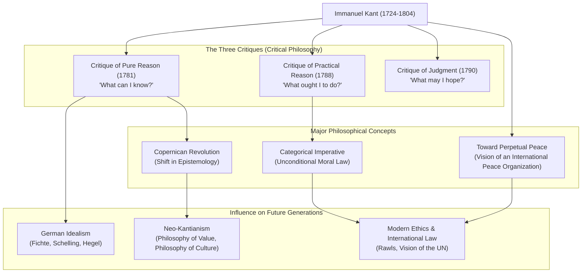

## Introduction: A Massive Paradigm Shift in Philosophy Born from a Clockwork Life

When discussing modern philosophy, there is one giant who can never be ignored. That is **Immanuel Kant (1724–1804)**. Born in Königsberg in the Kingdom of Prussia (now Kaliningrad, Russian Federation), he spent his entire life in that city, living a regular and peaceful existence. The anecdote that his daily walks served as a clock for his neighbors is incredibly famous.

However, contrary to his quiet life, his mind possessed enough explosive power to fundamentally overturn the history of human thought. Kant's philosophy integrated the two major conflicting philosophies of his time, "Continental Rationalism" and "British Empiricism," bringing about a **"Copernican Revolution"** in philosophy.

In this article, we will unravel how this solitary thinker built the foundations of modern philosophy and the impact he had on future generations, starting from the core of his life and thought.

## The Sage of Königsberg: Kant's Life

Born in 1724 as the fourth son of a harness maker, Kant was strongly influenced by Pietism growing up. He studied philosophy, mathematics, and natural sciences at the University of Königsberg, and after graduating, he continued his research while earning a living as a private tutor.

What is particularly noteworthy is his "late blooming" and "astonishing perseverance." He was appointed as a full professor (of logic and metaphysics) at the university in 1770, at the age of 46. And it was incredibly at the age of 57 (in 1781) that his masterpiece, the *Critique of Pure Reason*, which shines brilliantly in the history of philosophy, was published. He continued to write energetically after that, completing the *Critique of Practical Reason* and the *Critique of Judgment* in his 60s.

He remained a bachelor his entire life and lived a highly disciplined life. He woke up at 5:00 AM every morning and never broke his routine of giving lectures, writing, and taking a walk from 3:30 PM. This strict discipline was the very foundation for building his meticulous and grand philosophical system.

## The Core of Kant's Philosophy: The Three Critiques and the "Copernican Revolution"

Kant's greatest achievement lies in thoroughly examining (critiquing) human "cognitive faculties" themselves. The framework of his thought consists of the following "Three Critiques":

### 1. The Revolution of Epistemology: *Critique of Pure Reason* (What can I know?)
Philosophy before Kant believed that "human cognition conforms to objects" (the idea that our minds simply copy things in the external world as they are). However, Kant reversed this, arguing that "objects conform to human cognition." He asserted that we can recognize things only because we construct the world through the "forms of intuition" (time and space) and the "categories of understanding" (such as causality) that exist on our side. Likening this to the shift from the Ptolemaic to the Copernican system, this is called the **"Copernican Revolution."** As a result, he concluded that humans can only know "phenomena" and cannot know "things-in-themselves" (the true nature of things).

### 2. The Establishment of Moral Philosophy: *Critique of Practical Reason* (What ought I to do?)
Although humans cannot know "things-in-themselves," in the moral world, we can autonomously establish laws for ourselves. Kant proposed the **"Categorical Imperative,"** which is an unconditional moral law ("Do X"), rather than a conditional command ("If you want Y, do X"). His words, "Act only according to that maxim whereby you can, at the same time, will that it should become a universal law," remain the most important foundation in modern ethics.

### 3. The Philosophy of Beauty and Purpose: *Critique of Judgment* (What may I hope?)
This work was conceived to bridge the two different worlds of nature's mechanistic laws (pure reason) and human's free moral will (practical reason). He explored aesthetic judgments such as "beauty" and the "sublime," as well as teleological judgments that find purpose in the natural world.

## Correlation Diagram and Flow of Achievements

The diagram below illustrates the flow of Kant's philosophical system and its influence.

## Immense Influence on Future Generations: Beyond Kant, with Kant

The philosophical system established by Kant was overwhelmingly massive. Subsequent philosophers, whether they agreed with or rebelled against him, always faced the challenge of "how to overcome Kant."

**German Idealism**, continuing through Fichte, Schelling, and Hegel, was born from attempts to overcome the realm of "things-in-themselves," which Kant had deemed unreachable. In the late 19th century, **Neo-Kantianism** emerged with the slogan "Back to Kant," laying the foundations for modern philosophy of science and philosophy of culture.

Furthermore, the vision of a "federation of free states" proposed in his late work *Toward Perpetual Peace* provided direct inspiration for the establishment of the League of Nations and the United Nations. Additionally, his ethical view of treating human dignity as an end in itself continues to live on in modern political philosophy and human rights thought, such as John Rawls's theory of justice.

## Conclusion

Immanuel Kant. Although his life was geographically confined to an extremely narrow area, the range of his thought extended from the truths of the universe to the moral depths of humanity, and to universal peace for all humankind.
"The starry heavens above me and the moral law within me." This passage from the *Critique of Practical Reason* engraved on his tombstone symbolizes the very spirit of Kantian philosophy, which calmly assessed the limits of human cognition while powerfully affirming human freedom and dignity. Especially in our complex and uncertain modern era, the path of meticulous thought he left behind will surely serve as a reliable compass for us.
