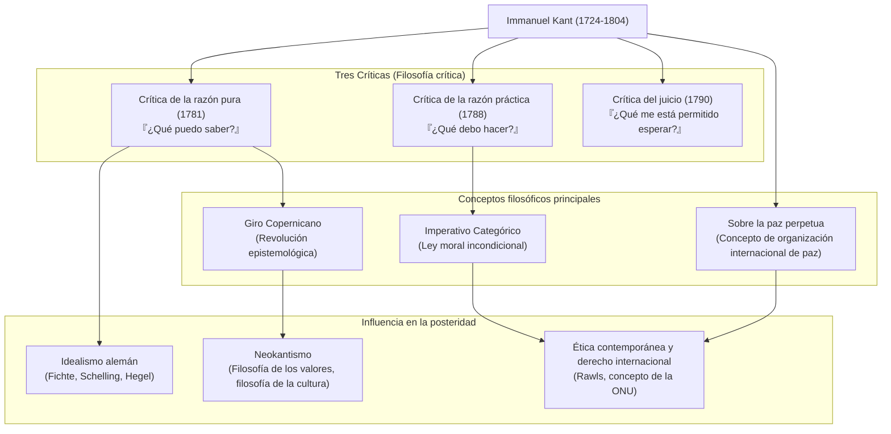

## Introducción: Un enorme cambio de paradigma filosófico nacido de una vida precisa como un reloj

Una estrella gigante que es imposible ignorar al hablar de la filosofía moderna. Ese es **Immanuel Kant (1724–1804)**. Nacido en Königsberg, en el Reino de Prusia (actualmente Kaliningrado, Federación Rusa), pasó toda su vida sin salir de esa ciudad, llevando una vida ordenada y tranquila. La anécdota de que la hora de sus paseos servía de reloj diario para los habitantes es muy famosa.

Sin embargo, en contraste con su vida silenciosa, su mente poseía un poder explosivo capaz de revolucionar fundamentalmente la historia del pensamiento humano. La filosofía de Kant unificó las dos grandes corrientes opuestas de la época, el "racionalismo continental" y el "empirismo inglés", trayendo a la filosofía un **"Giro Copernicano"**.

En este artículo, desentrañaremos desde el núcleo de su vida y pensamiento cómo este pensador solitario construyó los cimientos de la filosofía moderna y la influencia que dejó para la posteridad.

## El Sabio de Königsberg: La vida de Kant

Nacido en 1724 como el cuarto hijo de un fabricante de arneses, Kant creció fuertemente influenciado por el pietismo. Estudió filosofía, matemáticas y ciencias naturales en la Universidad de Königsberg, y tras graduarse continuó sus investigaciones mientras se ganaba la vida como tutor privado.

Lo que destaca es su "florecimiento tardío" y su "asombrosa perseverancia". Fue nombrado profesor titular (Lógica y Metafísica) en la universidad en 1770, a la edad de 46 años. Y su obra maestra que brilla con esplendor en la historia de la filosofía, la *Crítica de la razón pura*, se publicó asombrosamente cuando tenía 57 años (1781). Posteriormente, continuó escribiendo con energía, completando la *Crítica de la razón práctica* y la *Crítica del juicio* en sus sesentas.

Se mantuvo soltero toda su vida y llevó una vida muy disciplinada. Se despertaba a las 5 de la mañana todos los días, y nunca rompía su rutina de clases, escritura y su paseo a partir de las 3:30 de la tarde. Esta disciplina rigurosa fue exactamente la base sobre la que construyó su minucioso y grandioso sistema filosófico.

## El núcleo de la filosofía de Kant: Las tres Críticas y el "Giro Copernicano"

El mayor logro de Kant reside en su examen (crítica) exhaustivo de la "capacidad cognitiva" humana misma. El esqueleto de su pensamiento está formado por las siguientes "Tres Críticas".

### 1. La revolución epistemológica: *Crítica de la razón pura* (¿Qué puedo saber?)
La filosofía anterior a Kant pensaba que "el conocimiento humano se adapta al objeto" (la idea de que nuestra mente copia las cosas del mundo exterior tal como son). Sin embargo, Kant lo invirtió afirmando que "el objeto se adapta al conocimiento humano". Argumentó que podemos conocer las cosas porque construimos el mundo a través de "formas de la sensibilidad" como el tiempo y el espacio, y "categorías del entendimiento" como la causalidad, que se encuentran de nuestro propio lado. Comparándolo con la transición de la teoría geocéntrica a la heliocéntrica, llamó a esto el **"Giro Copernicano"**. Con esto, concluyó que los humanos solo pueden conocer los "fenómenos" y no las "cosas en sí" (su verdadera naturaleza).

### 2. El establecimiento de la filosofía moral: *Crítica de la razón práctica* (¿Qué debo hacer?)
Aunque los humanos no pueden conocer la "cosa en sí", en el mundo de la moral podemos establecer nuestras propias leyes de forma autónoma. Kant propuso el **"Imperativo Categórico"**, que no es un mandato condicional ("si quieres..., haz..."), sino una ley moral incondicional ("haz..."). Su frase "Obra de tal modo que la máxima de tu voluntad pueda valer siempre al mismo tiempo como principio de una legislación universal" sigue siendo el fundamento más importante de la ética contemporánea.

### 3. La filosofía de la belleza y el propósito: *Crítica del juicio* (¿Qué me está permitido esperar?)
Esta obra fue concebida para servir de puente entre dos mundos diferentes: las leyes mecanicistas de la naturaleza (razón pura) y la libre voluntad moral humana (razón práctica). Exploró los juicios estéticos, como la "belleza" y lo "sublime", y los juicios teleológicos que encuentran un propósito en el mundo natural.

## Diagrama de correlación y flujo de logros

El siguiente diagrama muestra el sistema filosófico de Kant y el flujo de su influencia.

## Enorme influencia en la posteridad: Más allá de Kant, junto a Kant

El sistema filosófico que Kant construyó fue verdaderamente inmenso. Los filósofos posteriores, ya sea apoyando u oponiéndose a Kant, se enfrentaron constantemente al desafío de "cómo superar a Kant".

El **Idealismo alemán**, que conecta a Fichte, Schelling y Hegel, nació del intento de superar el ámbito de la "cosa en sí" que Kant consideró inalcanzable. A finales del siglo XIX, bajo el lema "Volver a Kant", surgió el **Neokantismo**, sentando las bases de la filosofía de la ciencia y la filosofía de la cultura contemporáneas.

Además, el concepto de una "federación de estados libres" propuesto en su obra tardía *Sobre la paz perpetua* dio inspiración directa para el establecimiento de la Sociedad de las Naciones y las Naciones Unidas. Su visión ética, que trata la dignidad humana como un fin en sí mismo, sigue viva en la filosofía política moderna y en el pensamiento de los derechos humanos, como la teoría de la justicia de John Rawls.

## Conclusión

Immanuel Kant. Aunque su vida permaneció geográficamente en un rango extremadamente estrecho, el alcance de su pensamiento se extendió desde la verdad del universo hasta las profundidades morales del ser humano y la paz universal de la humanidad.
"El cielo estrellado sobre mí y la ley moral en mí". Este pasaje de la *Crítica de la razón práctica*, grabado en su lápida, simboliza el espíritu mismo de la filosofía de Kant: discerniendo con calma los límites del conocimiento humano mientras afirmaba vigorosamente la libertad y la dignidad humanas. Especialmente en esta era contemporánea, compleja e incierta, el camino de su pensamiento minucioso que nos dejó debe servirnos como una brújula segura.
