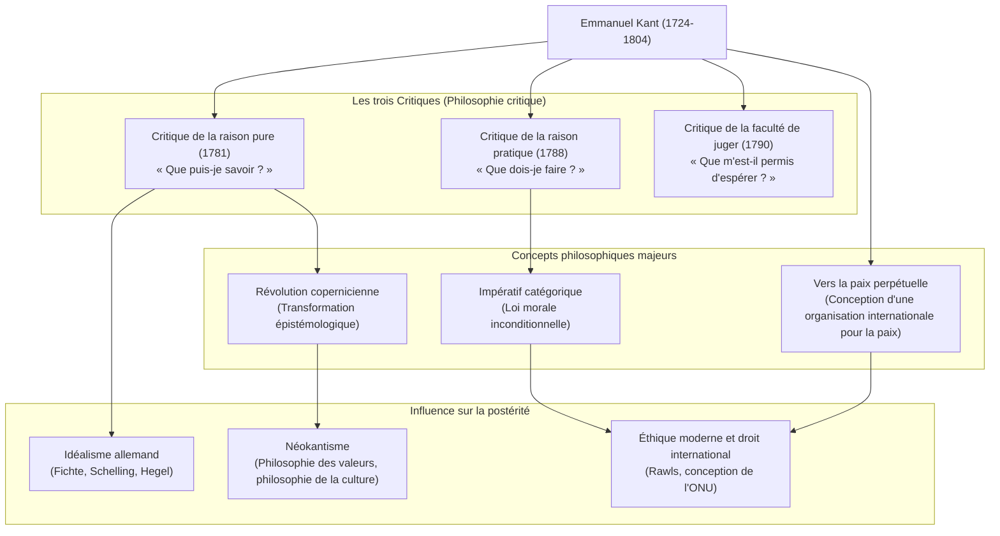

## Introduction : Un gigantesque changement de paradigme philosophique né d'une vie réglée comme une horloge

Une étoile géante incontournable lorsqu'on parle de la philosophie moderne. C'est **Emmanuel Kant (Immanuel Kant, 1724-1804)**. Né à Königsberg dans le royaume de Prusse (actuelle Kaliningrad, en Fédération de Russie), il y a mené une vie paisible et régulière sans jamais quitter cette ville. L'anecdote selon laquelle l'heure de sa promenade quotidienne servait d'horloge aux habitants est célèbre.

Cependant, contrairement à sa vie tranquille, son esprit avait une puissance explosive capable de renverser fondamentalement l'histoire de la pensée humaine. La philosophie de Kant a unifié le « rationalisme continental » et l'« empirisme britannique », deux grands courants philosophiques alors opposés, et a apporté une **« révolution copernicienne »** à la philosophie.

Dans cet article, nous allons découvrir comment ce penseur solitaire a posé les bases de la philosophie moderne et quelle influence il a eue sur la postérité, en explorant sa vie et le cœur de sa pensée.

## Le sage de Königsberg : La vie de Kant

Né en 1724, quatrième fils d'un artisan sellier, Kant a grandi sous une forte influence piétiste. Il a étudié la philosophie, les mathématiques et les sciences naturelles à l'Université de Königsberg. Après l'obtention de son diplôme, il a continué ses recherches tout en gagnant sa vie comme précepteur.

Ce qui est remarquable, c'est son éclosion tardive et son endurance exceptionnelle. Il n'est devenu professeur titulaire (logique et métaphysique) à l'université qu'en 1770, à l'âge de 46 ans. Son chef-d'œuvre, la *Critique de la raison pure*, qui brille de mille feux dans l'histoire de la philosophie, a été publié alors qu'il avait 57 ans (1781). Il a continué à écrire avec énergie par la suite, achevant la *Critique de la raison pratique* et la *Critique de la faculté de juger* dans la soixantaine.

Resté célibataire toute sa vie, il a mené une existence très réglée. Se levant chaque matin à 5 heures, il ne dérogeait jamais à sa routine : cours, écriture, puis promenade à partir de 15h30. Cette discipline rigoureuse a été le fondement sur lequel il a bâti son système philosophique vaste et minutieux.

## Le cœur de la philosophie kantienne : Les trois Critiques et la « révolution copernicienne »

La plus grande contribution de Kant réside dans son examen (critique) minutieux de la « faculté de connaître » humaine. L'ossature de sa pensée est formée par les « trois Critiques » suivantes :

### 1. La révolution épistémologique : *Critique de la raison pure* (Que puis-je savoir ?)
Avant Kant, la philosophie considérait que « la connaissance humaine se conforme aux objets » (l'idée que notre esprit copie les choses du monde extérieur telles qu'elles sont). Mais Kant a inversé cette idée : « les objets se conforment à la connaissance humaine ». Il a affirmé que si nous pouvons percevoir les choses, c'est parce que nous construisons le monde à travers les « formes de la sensibilité » que sont le temps et l'espace, et les « catégories de l'entendement » telles que la causalité, qui se trouvent en nous. Comparant cela au passage du géocentrisme à l'héliocentrisme, on l'appelle la **« révolution copernicienne »**. Ainsi, il a conclu que l'homme ne peut connaître que les « phénomènes », et non la « chose en soi » (la réalité véritable).

### 2. L'établissement de la philosophie morale : *Critique de la raison pratique* (Que dois-je faire ?)
Bien que l'homme ne puisse pas connaître la « chose en soi », dans le monde moral, nous pouvons établir de manière autonome nos propres lois. Kant a proposé l'**« impératif catégorique »**, qui n'est pas un ordre conditionnel (« si tu veux ceci, fais cela »), mais une loi morale inconditionnelle (« fais cela »). Sa formule : « Agis uniquement d'après la maxime qui fait que tu peux vouloir en même temps qu'elle devienne une loi universelle » reste l'un des fondements les plus importants de l'éthique moderne.

### 3. La philosophie du beau et de la finalité : *Critique de la faculté de juger* (Que m'est-il permis d'espérer ?)
Cette œuvre a été conçue pour jeter un pont entre deux mondes différents : les lois mécanistes de la nature (raison pure) et la libre volonté morale de l'homme (raison pratique). Il y explore les jugements esthétiques comme le « beau » et le « sublime », ainsi que le jugement téléologique qui trouve une finalité dans le monde naturel.

## Diagramme des relations et accomplissements

Le diagramme ci-dessous illustre le système philosophique de Kant et le flux de son influence.

## Une influence immense sur la postérité : Au-delà de Kant, avec Kant

Le système philosophique érigé par Kant était gigantesque. Les philosophes ultérieurs, qu'ils soient d'accord avec lui ou s'y opposent, ont toujours été confrontés au défi de « comment dépasser Kant ».

L'**idéalisme allemand**, qui s'étend de Fichte à Schelling et Hegel, est né de la tentative de surmonter le domaine de la « chose en soi » que Kant jugeait inaccessible. À la fin du XIXe siècle, sous le mot d'ordre « Retour à Kant », le **néokantisme** a émergé, jetant les bases de la philosophie des sciences et de la culture contemporaines.

De plus, son idée d'une « fédération d'États libres », proposée dans son œuvre de la vieillesse *Vers la paix perpétuelle*, a été une source d'inspiration directe pour la création de la Société des Nations et de l'Organisation des Nations Unies. Par ailleurs, sa vision éthique qui traite la dignité humaine comme une fin en soi continue de vivre dans la philosophie politique et la pensée des droits de l'homme d'aujourd'hui, notamment dans la théorie de la justice de John Rawls.

## Conclusion

Emmanuel Kant. Sa vie est restée géographiquement confinée à un espace très restreint, mais la portée de sa pensée s'est étendue des vérités de l'univers aux profondeurs morales de l'homme, jusqu'à la paix universelle de l'humanité.
« Le ciel étoilé au-dessus de moi, et la loi morale en moi. » Ce passage de la *Critique de la raison pratique*, gravé sur sa pierre tombale, symbolise l'esprit même de la philosophie kantienne : reconnaître lucidement les limites de la connaissance humaine tout en affirmant vigoureusement la liberté et la dignité de l'homme. C'est précisément dans notre époque complexe et incertaine que le cheminement de sa pensée rigoureuse devrait nous servir de boussole fiable.
