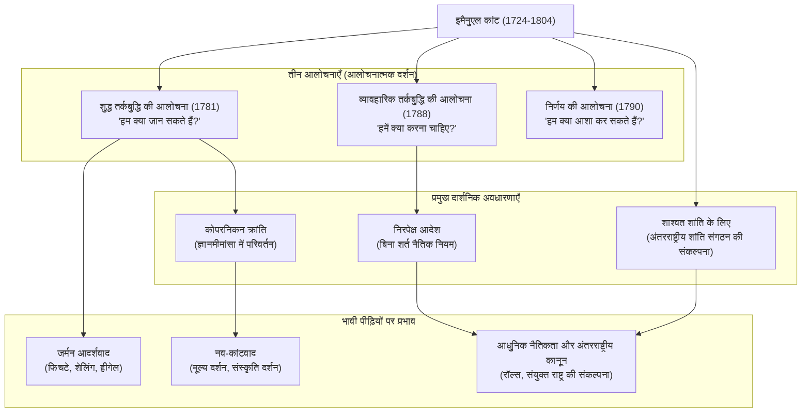

## परिचय: घड़ी की तरह सटीक जीवन से उत्पन्न दर्शनशास्त्र का एक विशाल प्रतिमान बदलाव

आधुनिक दर्शन की बात करते समय, एक महान व्यक्ति जिसे हम कभी नजरअंदाज नहीं कर सकते। वह हैं **इमैनुएल कांट (Immanuel Kant, 1724–1804)**। उनका जन्म प्रशिया (अब रूसी संघ में कलिनिनग्राद) के कोनिग्सबर्ग में हुआ था और उन्होंने अपना पूरा जीवन वहीं बिताया, एक शांतिपूर्ण और नियमित जीवन जीते हुए। यह किस्सा बहुत मशहूर है कि उनके चलने का समय लोगों के लिए रोज़ाना घड़ी का काम करता था।

हालांकि, उनके शांत जीवन के विपरीत, उनके मस्तिष्क में मानव विचारों के इतिहास को जड़ से पलटने की विस्फोटक शक्ति थी। कांट के दर्शन ने "महाद्वीपीय बुद्धिवाद" और "ब्रिटिश अनुभववाद" को एकीकृत किया - दो प्रमुख दर्शन जो उस समय एक-दूसरे के विरोधी थे - और दर्शनशास्त्र में एक **"कोपरनिकन क्रांति"** ला दी।

इस लेख में, हम इस एकाकी विचारक के जीवन और उनके विचारों के मूल से इस बात का खुलासा करेंगे कि उन्होंने आधुनिक दर्शन की नींव कैसे रखी और भावी पीढ़ियों को कैसे प्रभावित किया।

## कोनिग्सबर्ग के ज्ञानी: कांट का जीवन

1724 में एक काठी बनाने वाले के चौथे बेटे के रूप में जन्मे कांट, पीयटिज़्म से गहरे प्रभावित होकर बड़े हुए। उन्होंने कोनिग्सबर्ग विश्वविद्यालय में दर्शनशास्त्र, गणित और प्राकृतिक विज्ञान का अध्ययन किया और स्नातक होने के बाद, एक निजी ट्यूटर के रूप में अपनी आजीविका कमाते हुए अपना शोध जारी रखा।

उनका "देर से खिलना" और "अद्भुत दृढ़ता" विशेष रूप से उल्लेखनीय है। वे 1770 में, 46 वर्ष की आयु में विश्वविद्यालय में पूर्ण प्रोफेसर (तर्कशास्त्र और तत्वमीमांसा) बने। और उनका महान कार्य, 'शुद्ध तर्कबुद्धि की आलोचना', जो दर्शन के इतिहास में शानदार ढंग से चमकता है, तब प्रकाशित हुआ था जब वे 57 वर्ष (1781) के थे। उन्होंने इसके बाद भी पूरी ऊर्जा के साथ लिखना जारी रखा, और अपने 60 के दशक में 'व्यावहारिक तर्कबुद्धि की आलोचना' और 'निर्णय की आलोचना' को पूरा किया।

वे जीवन भर अविवाहित रहे और उन्होंने एक अनुशासित जीवन व्यतीत किया। वे हर सुबह 5 बजे उठते थे और उनके व्याख्यान देने, लिखने और दोपहर 3:30 बजे टहलने जाने की दिनचर्या कभी नहीं टूटी। यह कठोर अनुशासन ही वह आधार था जिस पर उन्होंने अपनी विस्तृत और भव्य दार्शनिक प्रणाली का निर्माण किया।

## कांट के दर्शन का मूल: तीन आलोचनाएँ और "कोपरनिकन क्रांति"

कांट की सबसे बड़ी उपलब्धि मनुष्य की "ज्ञान-क्षमता" की ही गहन जांच (आलोचना) करना था। उनके विचारों की रूपरेखा निम्नलिखित "तीन आलोचनाओं" से बनती है।

### 1. ज्ञानमीमांसा में क्रांति 'शुद्ध तर्कबुद्धि की आलोचना' (हम क्या जान सकते हैं?)
कांट से पहले का दर्शन यह मानता था कि "मानव ज्ञान वस्तु का अनुसरण करता है" (यह विचार कि हमारा मन बाहरी दुनिया की चीजों को वैसा ही प्रतिबिंबित करता है जैसी वे हैं)। हालाँकि, कांट ने इसे उलट कर कहा कि "वस्तु मानव ज्ञान का अनुसरण करती है"। उन्होंने तर्क दिया कि हम चीजों को केवल इसलिए समझ सकते हैं क्योंकि हम अपनी ओर मौजूद समय और स्थान के "संवेदनशीलता के रूपों" और कारण-प्रभाव जैसे "समझ की श्रेणियों" के माध्यम से दुनिया का निर्माण करते हैं। भू-केंद्रीय सिद्धांत से सूर्य-केंद्रीय सिद्धांत में बदलाव की तुलना करते हुए, इसे **"कोपरनिकन क्रांति"** कहा जाता है। इसके आधार पर, उन्होंने निष्कर्ष निकाला कि मनुष्य केवल "घटनाओं" को जान सकता है, और "वस्तु अपने आप में" (सच्ची प्रकृति) को नहीं जान सकता।

### 2. नैतिक दर्शन की स्थापना 'व्यावहारिक तर्कबुद्धि की आलोचना' (हमें क्या करना चाहिए?)
यद्यपि मनुष्य "वस्तु अपने आप में" को नहीं जान सकते, लेकिन नैतिकता की दुनिया में, हम स्वायत्त रूप से अपने लिए नियम स्थापित कर सकते हैं। कांट ने सशर्त आदेशों ("यदि आप ~ करना चाहते हैं, तो ~ करें") के बजाय एक बिना शर्त नैतिक नियम ("~ करें") का प्रस्ताव रखा, जिसे **"निरपेक्ष आदेश"** कहा जाता है। उनका यह कथन कि, "केवल उस सिद्धांत के अनुसार कार्य करो जिसके द्वारा तुम एक ही समय में यह इच्छा भी कर सको कि वह एक सार्वभौमिक नियम बन जाए," आधुनिक नैतिकता में भी सबसे महत्वपूर्ण नींव में से एक बना हुआ है।

### 3. सौंदर्य और उद्देश्य का दर्शन 'निर्णय की आलोचना' (हम क्या आशा कर सकते हैं?)
यह कार्य प्रकृति के यांत्रिक नियमों (शुद्ध तर्कबुद्धि) और मनुष्य की स्वतंत्र नैतिक इच्छा (व्यावहारिक तर्कबुद्धि) की दो अलग-अलग दुनियाओं के बीच एक पुल बनाने के लिए संकल्पित किया गया था। इसमें उन्होंने "सुंदरता" और "उदात्त" जैसे सौंदर्यपरक निर्णयों और प्रकृति में उद्देश्य खोजने वाले उद्देश्यमूलक निर्णयों का अन्वेषण किया।

## सहसंबंध आरेख और उपलब्धियों का प्रवाह

नीचे दिया गया आरेख कांट की दार्शनिक प्रणाली और उसके प्रभाव के प्रवाह को दर्शाता है।

## भावी पीढ़ियों पर अत्यधिक प्रभाव: कांट से परे, कांट के साथ

कांट द्वारा स्थापित दार्शनिक व्यवस्था अत्यंत विशाल थी। बाद के दार्शनिकों को, चाहे वे कांट से सहमत हों या असहमत, हमेशा इस चुनौती का सामना करना पड़ा कि "कांट को कैसे पार किया जाए।"

फिचटे, शेलिंग और हीगेल का **जर्मन आदर्शवाद** "वस्तु अपने आप में" के क्षेत्र को दूर करने के प्रयास से उत्पन्न हुआ, जिसे कांट ने अप्राप्य माना था। 19वीं सदी के उत्तरार्ध में, "कांट की ओर लौटें" के नारे के तहत **नव-कांटवाद** उभरा, जिसने आधुनिक विज्ञान के दर्शन और संस्कृति के दर्शन की नींव रखी।

इसके अलावा, उनके बाद के कार्यों 'शाश्वत शांति के लिए' में प्रस्तावित "स्वतंत्र राज्यों के संघ" की अवधारणा ने बाद में राष्ट्र संघ और संयुक्त राष्ट्र की स्थापना को सीधे प्रेरित किया। साथ ही, मानव गरिमा को ही अपने आप में एक साध्य के रूप में मानने वाली उनकी नैतिकता जॉन रॉल्स के न्याय के सिद्धांत जैसे आधुनिक राजनीतिक दर्शन और मानवाधिकार विचारों में आज भी जीवित है।

## निष्कर्ष

इमैनुएल कांट। उनका जीवन भौगोलिक दृष्टि से एक बहुत ही सीमित क्षेत्र में रहा, लेकिन उनके विचारों का दायरा ब्रह्मांड की सच्चाई से लेकर मानव नैतिकता की गहराइयों और मानवता की सार्वभौमिक शांति तक फैला हुआ था।
"मेरे ऊपर तारों भरा आकाश और मेरे भीतर नैतिक नियम।" उनकी कब्र पर उकेरा गया 'व्यावहारिक तर्कबुद्धि की आलोचना' का यह अंश, कांट के दर्शन की उस भावना का प्रतीक है जो शांति से मानवीय ज्ञान की सीमाओं का आकलन करते हुए, मानव स्वतंत्रता और गरिमा की दृढ़ता से पुष्टि करता है। आज के इस जटिल और अनिश्चित युग में, उनके द्वारा छोड़े गए विचार-विमर्श का विस्तृत मार्ग निश्चित रूप से हमारे लिए एक विश्वसनीय कंपास के रूप में काम करेगा।
