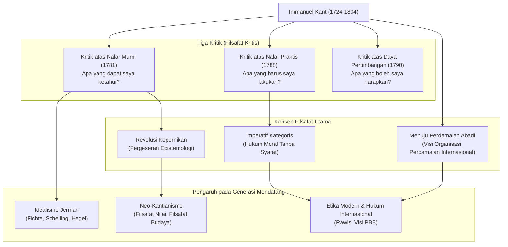

## Pengantar: Kehidupan yang Akurat seperti Jam dan Perubahan Paradigma Terbesar dalam Filsafat

Bintang raksasa yang tidak mungkin diabaikan saat membahas filsafat modern. Ia adalah **Immanuel Kant (1724–1804)**. Lahir di Königsberg, Kerajaan Prusia (kini Kaliningrad, Federasi Rusia), ia menjalani kehidupan yang damai dan teratur tanpa pernah meninggalkan kampung halamannya. Anekdot bahwa penduduk setempat mengatur jam tangan mereka berdasarkan jalan-jalan hariannya sangatlah terkenal.

Namun, berbeda dengan kehidupannya yang tenang, pikirannya memiliki kekuatan ledakan yang cukup untuk membalikkan sejarah pemikiran manusia. Filsafat Kant mengintegrasikan dua aliran filsafat besar yang saling bertentangan pada saat itu, yaitu "Rasionalisme Kontinental" dan "Empirisme Inggris", serta membawa **"Revolusi Kopernikan"** ke dalam filsafat.

Dalam artikel ini, kita akan mengeksplorasi bagaimana pemikir penyendiri ini meletakkan dasar bagi filsafat modern dan pengaruh yang ia berikan kepada generasi mendatang, melalui penelusuran kehidupan dan inti pemikirannya.

## Orang Bijak dari Königsberg: Kehidupan Kant

Lahir pada tahun 1724 sebagai putra keempat dari pembuat tali kekang kuda, Kant tumbuh di bawah pengaruh kuat Pietisme. Ia belajar filsafat, matematika, dan ilmu alam di Universitas Königsberg, dan melanjutkan penelitiannya sembari mencari nafkah sebagai guru privat setelah lulus.

Yang patut dicatat adalah "perkembangan lambat" dan "daya tahannya yang menakjubkan". Ia diangkat sebagai profesor penuh (Logika dan Metafisika) di universitas tersebut pada tahun 1770, saat ia berusia 46 tahun. Mahakaryanya, *Kritik atas Nalar Murni*, yang bersinar terang dalam sejarah filsafat, diterbitkan saat ia berusia 57 tahun (1781). Bahkan setelah itu, ia terus menulis dengan penuh semangat, menyelesaikan *Kritik atas Nalar Praktis* dan *Kritik atas Daya Pertimbangan* pada usia 60-an.

Ia tetap melajang seumur hidup dan menjalani kehidupan yang sangat disiplin. Ia bangun jam 5 pagi setiap hari, dan tidak pernah merusak rutinitasnya dalam memberi kuliah, menulis, dan berjalan-jalan dari jam 15:30. Disiplin yang ketat inilah yang menjadi dasar ia membangun sistem filsafatnya yang teliti dan agung.

## Inti dari Filsafat Kant: Tiga Kritik dan "Revolusi Kopernikan"

Pencapaian terbesar Kant terletak pada pemeriksaan yang cermat (kritik) terhadap "kemampuan kognitif" manusia itu sendiri. Struktur pemikirannya dibentuk oleh "Tiga Kritik" berikut.

### 1. Revolusi Epistemologi, "Kritik atas Nalar Murni" (Apa yang dapat saya ketahui?)
Filsafat sebelum Kant percaya bahwa "pengetahuan manusia menyesuaikan dengan objek" (gagasan bahwa pikiran kita mencerminkan hal-hal di dunia luar sebagaimana adanya). Namun, Kant membalikkan ini dengan menyatakan bahwa "objek menyesuaikan dengan pengetahuan manusia". Ia berpendapat bahwa kita hanya dapat mengenali hal-hal karena kita membangun dunia melalui "bentuk kepekaan" (waktu dan ruang) dan "kategori pemahaman" (seperti kausalitas) yang ada di dalam diri kita. Menyamakannya dengan transisi dari teori geosentris ke heliosentris, hal ini disebut **"Revolusi Kopernikan"**. Dengan ini, ia menyimpulkan bahwa manusia hanya dapat mengenali "fenomena" dan bukan "benda pada dirinya sendiri" (sifat sebenarnya).

### 2. Pembentukan Filsafat Moral, "Kritik atas Nalar Praktis" (Apa yang harus saya lakukan?)
Meskipun manusia tidak dapat mengenali "benda pada dirinya sendiri", di dunia moral kita dapat menetapkan hukum secara mandiri. Kant mengusulkan **"Imperatif Kategoris"**, yang merupakan hukum moral tanpa syarat ("lakukan ini"), berbeda dengan perintah bersyarat ("jika kamu menginginkan sesuatu, lakukan ini"). Kata-katanya, "Bertindaklah hanya menurut maksim sedemikian rupa sehingga kamu sekaligus dapat menghendakinya menjadi hukum universal", tetap menjadi salah satu dasar paling penting dalam etika kontemporer.

### 3. Filsafat Keindahan dan Tujuan, "Kritik atas Daya Pertimbangan" (Apa yang boleh saya harapkan?)
Karya ini dikonseptualisasikan untuk menjembatani dua dunia yang berbeda: hukum mekanistik alam (nalar murni) dan kehendak moral manusia yang bebas (nalar praktis). Buku ini mengeksplorasi penilaian estetika, seperti yang "indah" dan "agung", dan penilaian teleologis, yang menemukan tujuan di alam.

## Diagram Korelasi dan Aliran Pencapaian

Diagram berikut menunjukkan sistem filsafat Kant dan aliran pengaruhnya.

## Pengaruh Luar Biasa pada Generasi Mendatang: Melampaui Kant, Bersama Kant

Sistem filsafat yang didirikan oleh Kant benar-benar luar biasa. Filsuf-filsuf berikutnya, entah mereka setuju atau memberontak, selalu dihadapkan pada tantangan "bagaimana mengatasi Kant".

**Idealisme Jerman**, yang berlanjut hingga Fichte, Schelling, dan Hegel, lahir dari upaya untuk mengatasi ranah "benda pada dirinya sendiri", yang dianggap Kant tidak dapat dicapai. Pada akhir abad ke-19, gerakan **Neo-Kantianisme** muncul di bawah slogan "Kembali ke Kant!", meletakkan dasar-dasar filsafat sains dan filsafat budaya modern.

Lebih lanjut, visinya tentang "federasi negara-negara bebas", yang diusulkan dalam karya akhirnya *Menuju Perdamaian Abadi*, secara langsung menginspirasi pembentukan Liga Bangsa-Bangsa dan Perserikatan Bangsa-Bangsa. Etikanya, yang memperlakukan martabat manusia sebagai tujuan pada dirinya sendiri, terus hidup kuat dalam filsafat politik dan pemikiran hak asasi manusia saat ini, seperti dalam teori keadilan John Rawls.

## Penutup

Immanuel Kant. Meskipun hidupnya terbatas pada wilayah geografis yang sangat sempit, jangkauan pemikirannya membentang dari kebenaran alam semesta hingga jurang moral manusia yang dalam, dan menuju perdamaian universal umat manusia.
"Langit berbintang di atasku dan hukum moral di dalam diriku." Kutipan dari *Kritik atas Nalar Praktis* ini, yang terukir di batu nisannya, melambangkan semangat filsafat Kant: secara kuat menegaskan kebebasan dan martabat manusia sambil dengan tenang membedakan batas-batas kognisi manusia. Di zaman yang kompleks dan tidak pasti saat ini, jalur pemikiran yang ketat yang ditinggalkannya pasti akan menjadi kompas yang dapat diandalkan bagi kita.
